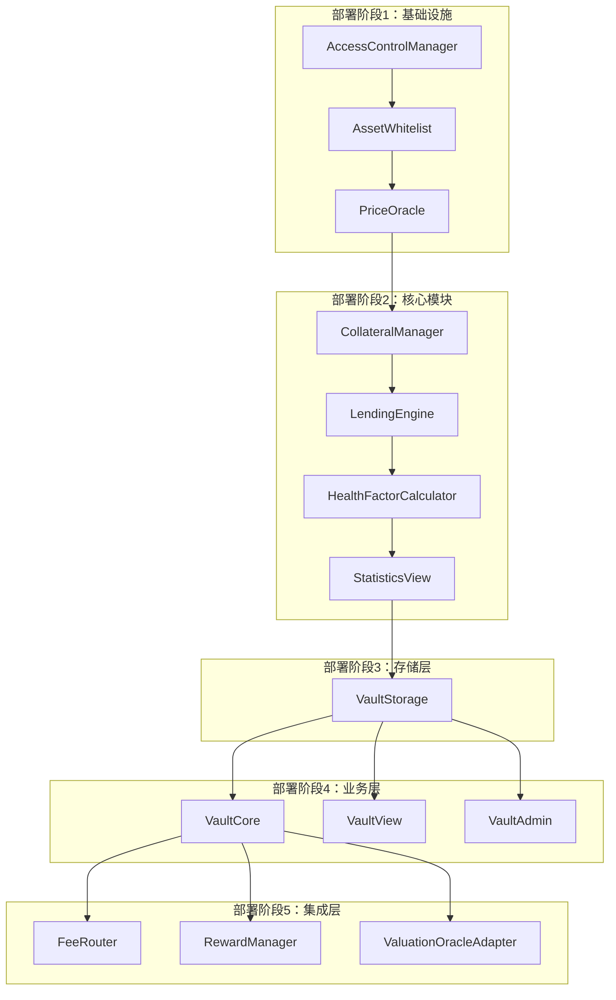

# RWA 借贷平台部署指南

> **基于Vault模块化架构的完整部署方案**  
> 最后更新：2025年1月  
> 目标：安全、有序、高效的部署流程

---

## 📋 目录

1. [部署概述](#1-部署概述)
2. [部署前准备](#2-部署前准备)
3. [部署顺序](#3-部署顺序)
4. [初始化配置](#4-初始化配置)
5. [验证测试](#5-验证测试)
6. [生产上线](#6-生产上线)
7. [监控维护](#7-监控维护)

---

## 1. 部署概述

### 1.1 架构概览



### 1.2 部署原则

- **安全性优先**：每个阶段都要进行安全验证
- **依赖关系**：严格按照依赖关系部署
- **可回滚**：每个阶段都要支持回滚
- **测试验证**：每个阶段都要进行功能测试
- **文档记录**：详细记录部署过程和配置

---

## 2. 部署前准备

### 2.1 环境准备

#### 🔧 **开发环境**
```bash
# 安装依赖
npm install

# 编译合约
npx hardhat compile

# 运行测试
npx hardhat test

# 生成类型文件
npx hardhat typechain
```

#### 🔧 **网络配置**
```javascript
// hardhat.config.ts
module.exports = {
  networks: {
    // 测试网配置
    testnet: {
      url: process.env.TESTNET_RPC_URL,
      accounts: [process.env.PRIVATE_KEY],
      chainId: 42161, // Arbitrum Testnet
    },
    // 主网配置
    mainnet: {
      url: process.env.MAINNET_RPC_URL,
      accounts: [process.env.PRIVATE_KEY],
      chainId: 42161, // Arbitrum One
    }
  }
};
```

### 2.2 账户准备

#### 👤 **治理账户**
```bash
# 生成治理账户
npx hardhat run scripts/generate-governance.js

# 验证账户余额
npx hardhat run scripts/check-balance.js --network testnet
```

#### 👤 **部署账户**
```bash
# 设置环境变量
export PRIVATE_KEY="your_private_key"
export GOVERNANCE_ADDRESS="governance_address"
export MULTISIG_ADDRESS="multisig_address"
```

### 2.3 合约准备

#### 📦 **合约验证**
```bash
# 验证所有合约编译成功
npx hardhat verify-contracts

# 检查合约大小
npx hardhat size-contracts

# 运行安全分析
npx hardhat slither
```

---

## 3. 部署顺序

### 🎯 **第一阶段：基础设施部署**

#### 3.1 AccessControlManager
```bash
# 部署访问控制管理器
npx hardhat run scripts/deploy/AccessControlManager.js --network testnet

# 验证部署
npx hardhat run scripts/verify/AccessControlManager.js --network testnet
```

**配置参数**：
- 治理地址：`GOVERNANCE_ADDRESS`
- 初始角色：`DEFAULT_ADMIN_ROLE`

#### 3.2 AssetWhitelist
```bash
# 部署资产白名单
npx hardhat run scripts/deploy/AssetWhitelist.js --network testnet

# 验证部署
npx hardhat run scripts/verify/AssetWhitelist.js --network testnet
```

**配置参数**：
- 访问控制地址：`ACCESS_CONTROL_ADDRESS`
- 初始资产：`INITIAL_ASSETS`

#### 3.3 PriceOracle
```bash
# 部署价格预言机
npx hardhat run scripts/deploy/PriceOracle.js --network testnet

# 验证部署
npx hardhat run scripts/verify/PriceOracle.js --network testnet
```

**配置参数**：
- 访问控制地址：`ACCESS_CONTROL_ADDRESS`
- 价格更新者：`PRICE_UPDATER_ADDRESS`

### 🎯 **第二阶段：核心模块部署**

#### 3.4 CollateralManager
```bash
# 部署抵押物管理器
npx hardhat run scripts/deploy/CollateralManager.js --network testnet

# 验证部署
npx hardhat run scripts/verify/CollateralManager.js --network testnet
```

**配置参数**：
- 访问控制地址：`ACCESS_CONTROL_ADDRESS`
- 资产白名单地址：`ASSET_WHITELIST_ADDRESS`

#### 3.5 LendingEngine
```bash
# 部署借贷引擎
npx hardhat run scripts/deploy/LendingEngine.js --network testnet

# 验证部署
npx hardhat run scripts/verify/LendingEngine.js --network testnet
```

**配置参数**：
- 访问控制地址：`ACCESS_CONTROL_ADDRESS`
- 价格预言机地址：`PRICE_ORACLE_ADDRESS`

#### 3.6 HealthFactorCalculator
```bash
# 部署健康因子计算器
npx hardhat run scripts/deploy/HealthFactorCalculator.js --network testnet

# 验证部署
npx hardhat run scripts/verify/HealthFactorCalculator.js --network testnet
```

**配置参数**：
- 访问控制地址：`ACCESS_CONTROL_ADDRESS`
- 清算阈值：`LIQUIDATION_THRESHOLD`
- 最小健康因子：`MIN_HEALTH_FACTOR`

#### 3.7 StatisticsView（替代 VaultStatistics）
```bash
# 部署统计视图模块
npx hardhat run scripts/deploy/StatisticsView.js --network testnet

# 验证部署
npx hardhat run scripts/verify/StatisticsView.js --network testnet
```

**配置参数**：
- 访问控制地址：`ACCESS_CONTROL_ADDRESS`

### 🎯 **第三阶段：存储层部署**

#### 3.8 VaultStorage
```bash
# 部署金库存储
npx hardhat run scripts/deploy/VaultStorage.js --network testnet

# 验证部署
npx hardhat run scripts/verify/VaultStorage.js --network testnet
```

**配置参数**：
- 治理地址：`GOVERNANCE_ADDRESS`
- 结算代币地址：`SETTLEMENT_TOKEN_ADDRESS`
- RWA代币地址：`RWA_TOKEN_ADDRESS`

### 🎯 **第四阶段：业务层部署**

#### 3.9 VaultCore
```bash
# 部署金库核心
npx hardhat run scripts/deploy/VaultCore.js --network testnet

# 验证部署
npx hardhat run scripts/verify/VaultCore.js --network testnet
```

**配置参数**：
- 治理地址：`GOVERNANCE_ADDRESS`
- 金库存储地址：`VAULT_STORAGE_ADDRESS`

#### 3.10 VaultView
```bash
# 部署金库视图
npx hardhat run scripts/deploy/VaultView.js --network testnet

# 验证部署
npx hardhat run scripts/verify/VaultView.js --network testnet
```

**配置参数**：
- 治理地址：`GOVERNANCE_ADDRESS`
- 金库存储地址：`VAULT_STORAGE_ADDRESS`

#### 3.11 VaultAdmin
```bash
# 部署金库管理
npx hardhat run scripts/deploy/VaultAdmin.js --network testnet

# 验证部署
npx hardhat run scripts/verify/VaultAdmin.js --network testnet
```

**配置参数**：
- 治理地址：`GOVERNANCE_ADDRESS`
- 金库存储地址：`VAULT_STORAGE_ADDRESS`

### 🎯 **第五阶段：集成层部署**

#### 3.12 FeeRouter
```bash
# 部署费用路由器
npx hardhat run scripts/deploy/FeeRouter.js --network testnet

# 验证部署
npx hardhat run scripts/verify/FeeRouter.js --network testnet
```

**配置参数**：
- 访问控制地址：`ACCESS_CONTROL_ADDRESS`
- 平台费用地址：`PLATFORM_FEE_ADDRESS`

#### 3.13 RewardManager
```bash
# 部署奖励管理器
npx hardhat run scripts/deploy/RewardManager.js --network testnet

# 验证部署
npx hardhat run scripts/verify/RewardManager.js --network testnet
```

**配置参数**：
- 访问控制地址：`ACCESS_CONTROL_ADDRESS`
- 奖励代币地址：`REWARD_TOKEN_ADDRESS`

#### 3.14 ValuationOracleAdapter
```bash
# 部署估值预言机适配器
npx hardhat run scripts/deploy/ValuationOracleAdapter.js --network testnet

# 验证部署
npx hardhat run scripts/verify/ValuationOracleAdapter.js --network testnet
```

**配置参数**：
- 访问控制地址：`ACCESS_CONTROL_ADDRESS`
- 价格预言机地址：`PRICE_ORACLE_ADDRESS`

---

## 4. 初始化配置

### 4.1 模块注册

#### 📝 **注册核心模块**
```javascript
// scripts/initialize/register-modules.js
async function registerModules() {
    const vaultStorage = await ethers.getContract("VaultStorage");
    
    // 注册核心模块
    await vaultStorage.registerModule("collateralManager", COLLATERAL_MANAGER_ADDRESS);
    await vaultStorage.registerModule("lendingEngine", LENDING_ENGINE_ADDRESS);
    await vaultStorage.registerModule("healthFactorCalculator", HEALTH_FACTOR_CALCULATOR_ADDRESS);
    await vaultStorage.registerModule("vaultStatistics", VAULT_STATISTICS_ADDRESS);
    await vaultStorage.registerModule("feeRouter", FEE_ROUTER_ADDRESS);
    await vaultStorage.registerModule("rewardManager", REWARD_MANAGER_ADDRESS);
    await vaultStorage.registerModule("assetWhitelist", ASSET_WHITELIST_ADDRESS);
    await vaultStorage.registerModule("valuationOracleAdapter", VALUATION_ORACLE_ADAPTER_ADDRESS);
    
    console.log("✅ 所有模块注册完成");
}
```

#### 📝 **配置系统参数**
```javascript
// scripts/initialize/configure-system.js
async function configureSystem() {
    const vaultStorage = await ethers.getContract("VaultStorage");
    const vaultAdmin = await ethers.getContract("VaultAdmin");
    
    // 设置金库容量（参数写入由 VaultStorage 承担）
    await vaultStorage.setVaultCap(ethers.parseUnits("1000000", 18)); // 100万代币
    
    // 设置最小健康因子（参数下发由 VaultAdmin 转发至 LiquidationRiskManager）
    await vaultAdmin.setMinHealthFactor(11000); // 110%（bps）
    
    console.log("✅ 系统参数配置完成");
}
```

### 4.2 权限配置

#### 🔐 **设置角色权限**
```javascript
// scripts/initialize/setup-permissions.js
async function setupPermissions() {
    const accessControl = await ethers.getContract("AccessControlManager");
    
    // 设置治理角色
    await accessControl.grantRole(GOVERNANCE_ROLE, GOVERNANCE_ADDRESS);
    
    // 设置操作角色
    await accessControl.grantRole(OPERATOR_ROLE, VAULT_CORE_ADDRESS);
    await accessControl.grantRole(OPERATOR_ROLE, VAULT_ADMIN_ADDRESS);
    
    // 设置价格更新角色
    await accessControl.grantRole(PRICE_UPDATER_ROLE, PRICE_UPDATER_ADDRESS);
    
    console.log("✅ 权限配置完成");
}
```

### 4.3 资产配置

#### 💰 **添加支持资产**
```javascript
// scripts/initialize/add-assets.js
async function addAssets() {
    const assetWhitelist = await ethers.getContract("AssetWhitelist");
    
    // 添加支持的资产
    const supportedAssets = [
        "0xA0b86a33E6441b8C4C8C8C8C8C8C8C8C8C8C8C8", // USDC
        "0xB0b86a33E6441b8C4C8C8C8C8C8C8C8C8C8C8C8C8", // USDT
        "0xC0b86a33E6441b8C4C8C8C8C8C8C8C8C8C8C8C8C8C8" // RWA Token
    ];
    
    await assetWhitelist.batchAddAllowedAssets(supportedAssets);
    
    console.log("✅ 支持资产配置完成");
}
```

---

## 5. 验证测试

### 5.1 功能测试

#### 🧪 **基础功能测试**
```bash
# 运行基础功能测试
npx hardhat test test/VaultCore.test.ts
npx hardhat test test/VaultView.test.ts
npx hardhat test test/VaultStorage.test.ts
```

#### 🧪 **集成测试**
```bash
# 运行集成测试
npx hardhat test test/integration/VaultIntegration.test.ts
npx hardhat test test/integration/UserFlow.test.ts
```

#### 🧪 **安全测试**
```bash
# 运行安全测试
npx hardhat test test/security/Reentrancy.test.ts
npx hardhat test test/security/Permissions.test.ts
npx hardhat test test/security/EdgeCases.test.ts
```

### 5.2 性能测试

#### ⚡ **Gas消耗测试**
```bash
# 测试Gas消耗
npx hardhat test test/performance/GasConsumption.test.ts
```

#### ⚡ **压力测试**
```bash
# 运行压力测试
npx hardhat test test/performance/StressTest.test.ts
```

### 5.3 网络测试

#### 🌐 **测试网验证**
```bash
# 在测试网上验证所有功能
npx hardhat run scripts/test/verify-testnet.js --network testnet
```

---

## 6. 生产上线

### 6.1 主网部署

#### 🚀 **主网部署脚本**
```bash
# 部署到主网
npx hardhat run scripts/deploy/mainnet-deploy.js --network mainnet

# 验证主网部署
npx hardhat run scripts/verify/mainnet-verify.js --network mainnet
```

#### 🚀 **主网初始化**
```bash
# 初始化主网配置
npx hardhat run scripts/initialize/mainnet-setup.js --network mainnet

# 验证主网功能
npx hardhat run scripts/test/mainnet-verify.js --network mainnet
```

### 6.2 监控设置

#### 📊 **监控配置**
```javascript
// scripts/monitoring/setup-monitoring.js
async function setupMonitoring() {
    // 设置事件监听
    const vaultCore = await ethers.getContract("VaultCore");
    
    // 监听关键事件
    vaultCore.on("Deposit", (user, asset, amount, timestamp) => {
        console.log(`Deposit: ${user} deposited ${amount} of ${asset}`);
    });
    
    vaultCore.on("Borrow", (user, asset, amount, timestamp) => {
        console.log(`Borrow: ${user} borrowed ${amount} of ${asset}`);
    });
    
    vaultCore.on("Withdraw", (user, asset, amount, timestamp) => {
        console.log(`Withdraw: ${user} withdrew ${amount} of ${asset}`);
    });
    
    vaultCore.on("Repay", (user, asset, amount, timestamp) => {
        console.log(`Repay: ${user} repaid ${amount} of ${asset}`);
    });
    
    console.log("✅ 监控配置完成");
}
```

### 6.3 紧急预案

#### 🚨 **紧急暂停**
```javascript
// scripts/emergency/emergency-pause.js
async function emergencyPause() {
    const accessControl = await ethers.getContract("AccessControlManager");
    
    // 紧急暂停（全局标志位）
    await accessControl.emergencyPause("emergency");
    
    console.log("🚨 系统已紧急暂停");
}
```

#### 🚨 **紧急恢复**
```javascript
// scripts/emergency/emergency-resume.js
async function emergencyResume() {
    const accessControl = await ethers.getContract("AccessControlManager");
    
    // 恢复系统（全局标志位）
    await accessControl.emergencyUnpause();
    
    console.log("✅ 系统已恢复");
}
```

---

## 7. 监控维护

### 7.1 日常监控

#### 📈 **关键指标监控**
```javascript
// scripts/monitoring/monitor-metrics.js
async function monitorMetrics() {
    const vaultView = await ethers.getContract("VaultView");
    
    // 监控总抵押量
    const totalCollateral = await vaultView.getTotalCollateral();
    console.log(`Total Collateral: ${totalCollateral}`);
    
    // 监控总债务
    const totalDebt = await vaultView.getTotalDebt();
    console.log(`Total Debt: ${totalDebt}`);
    
    // 监控健康因子
    const avgHealthFactor = await vaultView.getAverageHealthFactor();
    console.log(`Average Health Factor: ${avgHealthFactor}`);
    
    // 监控活跃用户
    const activeUsers = await vaultView.getActiveUsersCount();
    console.log(`Active Users: ${activeUsers}`);
}
```

#### 📈 **异常检测**
```javascript
// scripts/monitoring/detect-anomalies.js
async function detectAnomalies() {
    const vaultView = await ethers.getContract("VaultView");
    
    // 检测异常健康因子
    const lowHealthUsers = await vaultView.getUsersWithLowHealthFactor();
    if (lowHealthUsers.length > 0) {
        console.log(`⚠️ 发现 ${lowHealthUsers.length} 个低健康因子用户`);
    }
    
    // 检测异常交易
    const suspiciousTransactions = await vaultView.getSuspiciousTransactions();
    if (suspiciousTransactions.length > 0) {
        console.log(`🚨 发现 ${suspiciousTransactions.length} 个可疑交易`);
    }
}
```

### 7.2 定期维护

#### 🔧 **每周维护**
```bash
# 运行每周维护脚本
npx hardhat run scripts/maintenance/weekly-maintenance.js --network mainnet
```

#### 🔧 **每月维护**
```bash
# 运行每月维护脚本
npx hardhat run scripts/maintenance/monthly-maintenance.js --network mainnet
```

#### 🔧 **季度审计**
```bash
# 运行季度审计脚本
npx hardhat run scripts/audit/quarterly-audit.js --network mainnet
```

### 7.3 升级管理

#### 🔄 **模块升级**
```javascript
// scripts/upgrade/upgrade-module.js
async function upgradeModule(moduleName, newImplementation) {
    const vaultAdmin = await ethers.getContract("VaultAdmin");
    
    // 升级模块
    await vaultAdmin.updateModule(moduleName, newImplementation);
    
    console.log(`✅ 模块 ${moduleName} 升级完成`);
}
```

#### 🔄 **合约升级**
```javascript
// scripts/upgrade/upgrade-contract.js
async function upgradeContract(contractName, newImplementation) {
    const contract = await ethers.getContract(contractName);
    
    // 升级合约
    await contract.upgradeTo(newImplementation);
    
    console.log(`✅ 合约 ${contractName} 升级完成`);
}
```

---

## 📊 部署检查清单

### ✅ **部署前检查**
- [ ] 所有合约编译成功
- [ ] 所有测试通过
- [ ] 安全审计完成
- [ ] 网络配置正确
- [ ] 账户余额充足
- [ ] 环境变量设置

### ✅ **部署中检查**
- [ ] 按顺序部署所有合约
- [ ] 验证每个合约部署成功
- [ ] 记录所有合约地址
- [ ] 配置所有模块关系
- [ ] 设置所有权限
- [ ] 初始化所有参数

### ✅ **部署后检查**
- [ ] 运行所有功能测试
- [ ] 验证所有集成测试
- [ ] 检查所有安全测试
- [ ] 设置监控系统
- [ ] 配置告警机制
- [ ] 准备紧急预案

---

## 🔖 总结

### 🎯 **部署成功标准**
- **功能完整性**：所有功能正常工作
- **安全性**：通过所有安全测试
- **性能**：满足性能要求
- **稳定性**：系统稳定运行
- **可维护性**：便于后续维护

### 🚀 **最佳实践**
- **分阶段部署**：按依赖关系分阶段部署
- **充分测试**：每个阶段都要充分测试
- **文档记录**：详细记录部署过程
- **监控告警**：建立完善的监控体系
- **应急预案**：准备完善的应急预案

### 📈 **持续改进**
- **定期审计**：定期进行安全审计
- **性能优化**：持续优化性能
- **功能扩展**：根据需求扩展功能
- **社区反馈**：积极响应用户反馈

---

**文档版本**: v1.0  
**最后更新**: 2025年1月  
**维护者**: AI Assistant 