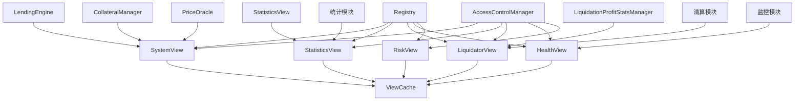

# View 系统部署指南

## 📋 概述

本文档提供了 RwaLendingPlatform 项目中 View 系统的完整部署指南，包括 SystemView、StatisticsView、LiquidatorView 等模块的部署策略和最佳实践。

## 🏗️ View 系统架构

### 核心组件
```
View 系统/
├── SystemView.sol              # 系统视图 - 核心状态查询
├── StatisticsView.sol          # 统计视图 - 数据统计查询
├── LiquidatorView.sol          # 清算视图 - 清算相关查询
├── HealthView.sol              # 健康视图 - 系统健康监控
├── RiskView.sol                # 风险视图 - 风险分析查询
├── GracefulDegradationMonitor.sol  # 优雅降级监控
└── ViewCache.sol               # 视图缓存 - 性能优化
```

### 依赖关系


## 🚀 部署策略

### 方案1：分阶段部署（推荐）

#### 阶段1：基础设施部署
```bash
# 1. 部署 Registry
npx hardhat run scripts/deploy/deploy-registry.ts --network localhost

# 2. 部署核心模块
npx hardhat run scripts/deploy/deploy-core-modules.ts --network localhost

# 3. 部署 ViewCache
npx hardhat run scripts/deploy/deploy-view-cache.ts --network localhost
```

#### 阶段2：View 模块部署
```bash
# 4. 部署 SystemView
npx hardhat run scripts/deploy/deploy-system-view.ts --network localhost

# 5. 部署 StatisticsView
npx hardhat run scripts/deploy/deploy-statistics-view.ts --network localhost

# 6. 部署 LiquidatorView
npx hardhat run scripts/deploy/deploy-liquidator-view.ts --network localhost

# 7. 部署 HealthView
npx hardhat run scripts/deploy/deploy-health-view.ts --network localhost

# 8. 部署 RiskView
npx hardhat run scripts/deploy/deploy-risk-view.ts --network localhost
```

#### 阶段3：业务模块部署（在View模块之后）
```bash
# 9. 部署清算相关模块（包含监控功能）
npx hardhat run scripts/deploy/deploy-liquidation-modules.ts --network localhost

# 10. 部署统计相关模块
npx hardhat run scripts/deploy/deploy-statistics-modules.ts --network localhost

# 11. 部署配置模块
npx hardhat run scripts/deploy/deploy-config-modules.ts --network localhost
```

#### 阶段4：功能完善
```bash
# 12. 升级 View 模块实现（连接清算模块监控）
npx hardhat run scripts/deploy/upgrade-view-modules.ts --network localhost

# 13. 运行完整测试
npx hardhat test test/Vault/view/
```

### 方案2：一次性完整部署

```bash
# 一次性部署所有 View 系统
npx hardhat run scripts/deploy/deploy-view-system-complete.ts --network localhost
```

## 📦 详细部署脚本

### 1. SystemView 部署脚本

```typescript
/**
 * SystemView 部署脚本
 * 
 * 部署目标:
 * - 部署 SystemView 合约
 * - 初始化合约参数
 * - 注册到 Registry 系统
 * - 验证部署结果
 * - 运行基本功能测试
 */

import { ethers } from 'hardhat';
import { expect } from 'chai';
import type { SignerWithAddress } from '@nomicfoundation/hardhat-ethers/signers';
import type { ContractFactory } from 'ethers';
import { loadFixture } from '@nomicfoundation/hardhat-network-helpers';

// 导入合约类型
import type { SystemView } from '../../../types/contracts/Vault/view/modules/SystemView';
import type { Registry } from '../../../types/contracts/registry/Registry';
import type { ViewCache } from '../../../types/contracts/Vault/view/modules/ViewCache';

// 导入常量
import { ModuleKeys } from '../../../frontend-config/moduleKeys';

async function main() {
    console.log('🚀 开始部署 SystemView...');
    
    const [deployer] = await ethers.getSigners();
    console.log('部署账户:', deployer.address);
    
    // 加载现有部署
    const deployments = await loadDeployments();
    
    // 阶段1：检查依赖
    console.log('🔍 检查依赖模块...');
    
    if (!deployments.Registry) {
        throw new Error('Registry 未部署，请先部署 Registry');
    }
    
    const registry = await ethers.getContractAt('Registry', deployments.Registry);
    console.log('✅ Registry 地址:', deployments.Registry);
    
    // 检查核心模块
    const requiredModules = [
        'KEY_ACCESS_CONTROL',
        'KEY_LE',
        'KEY_CM',
        'KEY_PRICE_ORACLE'
    ];
    
    for (const moduleKey of requiredModules) {
        const moduleAddr = await registry.getModule(ethers.keccak256(ethers.toUtf8Bytes(moduleKey)));
        if (moduleAddr === ethers.ZeroAddress) {
            console.log(`⚠️  模块 ${moduleKey} 未注册，某些功能可能受限`);
        } else {
            console.log(`✅ 模块 ${moduleKey}: ${moduleAddr}`);
        }
    }
    
    // 阶段2：部署 ViewCache（如果未部署）
    let viewCacheAddr = deployments.ViewCache;
    if (!viewCacheAddr) {
        console.log('📦 部署 ViewCache...');
        const ViewCacheFactory = await ethers.getContractFactory('ViewCache');
        const viewCache = await ViewCacheFactory.deploy();
        await viewCache.waitForDeployment();
        viewCacheAddr = await viewCache.getAddress();
        console.log('✅ ViewCache 部署完成:', viewCacheAddr);
        
        // 保存部署信息
        deployments.ViewCache = viewCacheAddr;
        await saveDeployments(deployments);
    } else {
        console.log('✅ ViewCache 已存在:', viewCacheAddr);
    }
    
    // 阶段3：部署 SystemView
    console.log('📦 部署 SystemView...');
    const SystemViewFactory = await ethers.getContractFactory('SystemView');
    const systemView = await SystemViewFactory.deploy();
    await systemView.waitForDeployment();
    
    const systemViewAddr = await systemView.getAddress();
    console.log('✅ SystemView 部署完成:', systemViewAddr);
    
    // 阶段4：初始化 SystemView
    console.log('🔧 初始化 SystemView...');
    await systemView.initialize(deployments.Registry, viewCacheAddr);
    console.log('✅ SystemView 初始化完成');
    
    // 阶段5：注册到 Registry
    console.log('📝 注册 SystemView 到 Registry...');
    const moduleKey = ethers.keccak256(ethers.toUtf8Bytes('SYSTEM_VIEW'));
    await registry.setModule(moduleKey, systemViewAddr, true);
    console.log('✅ SystemView 注册完成');
    
    // 阶段6：验证部署
    console.log('🔍 验证部署...');
    const registeredAddr = await registry.getModule(moduleKey);
    if (registeredAddr === systemViewAddr) {
        console.log('✅ SystemView 注册验证成功');
    } else {
        throw new Error('SystemView 注册验证失败');
    }
    
    // 阶段7：测试基本功能
    console.log('🧪 测试基本功能...');
    try {
        const registryAddr = await systemView.getRegistry();
        expect(registryAddr).to.equal(deployments.Registry);
        console.log('✅ getRegistry() 测试通过');
        
        // 测试模块获取
        const cmAddr = await systemView.getModule(ethers.keccak256(ethers.toUtf8Bytes('KEY_CM')));
        console.log('✅ getModule() 测试通过:', cmAddr);
        
    } catch (error) {
        console.log('❌ 基本功能测试失败:', error);
        throw error;
    }
    
    // 保存部署信息
    deployments.SystemView = systemViewAddr;
    await saveDeployments(deployments);
    
    console.log('🎉 SystemView 部署完成！');
    console.log('📋 部署信息:');
    console.log('  - SystemView:', systemViewAddr);
    console.log('  - Registry:', deployments.Registry);
    console.log('  - ViewCache:', viewCacheAddr);
    console.log('  - 模块键:', moduleKey);
    
    // 阶段8：后续升级建议
    console.log('\n📝 后续升级建议:');
    console.log('1. 部署清算相关模块后，升级 getLiquidatorTempDebt() 实现');
    console.log('2. 部署配置模块后，升级 getSettlementToken() 实现');
    console.log('3. 部署收益管理模块后，升级 getLiquidatorProfitRate() 实现');
    console.log('4. 运行完整测试套件验证所有功能');
}

// 辅助函数 (loadDeployments, saveDeployments - implementation omitted for brevity)

main()
    .then(() => process.exit(0))
    .catch((error) => {
        console.error('❌ 部署失败:', error);
        process.exit(1);
    });
```

### 2. StatisticsView 部署脚本

```typescript
/**
 * StatisticsView 部署脚本
 * 
 * 部署目标:
 * - 部署 StatisticsView 合约
 * - 初始化合约参数
 * - 注册到 Registry 系统
 * - 验证部署结果
 * - 运行基本功能测试
 */

import { ethers } from 'hardhat';
import { expect } from 'chai';
import type { SignerWithAddress } from '@nomicfoundation/hardhat-ethers/signers';
import type { ContractFactory } from 'ethers';
import { loadFixture } from '@nomicfoundation/hardhat-network-helpers';

// 导入合约类型
import type { StatisticsView } from '../../../types/contracts/Vault/view/modules/StatisticsView';
import type { Registry } from '../../../types/contracts/registry/Registry';
import type { ViewCache } from '../../../types/contracts/Vault/view/modules/ViewCache';

// 导入常量
import { ModuleKeys } from '../../../frontend-config/moduleKeys';

async function main() {
    console.log('🚀 开始部署 StatisticsView...');
    
    const [deployer] = await ethers.getSigners();
    console.log('部署账户:', deployer.address);
    
    // 加载现有部署
    const deployments = await loadDeployments();
    
    // 阶段1：检查依赖
    console.log('🔍 检查依赖模块...');
    
    if (!deployments.Registry) {
        throw new Error('Registry 未部署，请先部署 Registry');
    }
    
    const registry = await ethers.getContractAt('Registry', deployments.Registry);
    console.log('✅ Registry 地址:', deployments.Registry);
    
    // 检查核心模块
    const requiredModules = [
        'KEY_ACCESS_CONTROL',
        'KEY_LE',
        'KEY_CM',
        'KEY_PRICE_ORACLE'
    ];
    
    for (const moduleKey of requiredModules) {
        const moduleAddr = await registry.getModule(ethers.keccak256(ethers.toUtf8Bytes(moduleKey)));
        if (moduleAddr === ethers.ZeroAddress) {
            console.log(`⚠️  模块 ${moduleKey} 未注册，某些功能可能受限`);
        } else {
            console.log(`✅ 模块 ${moduleKey}: ${moduleAddr}`);
        }
    }
    
    // 阶段2：部署 ViewCache（如果未部署）
    let viewCacheAddr = deployments.ViewCache;
    if (!viewCacheAddr) {
        console.log('📦 部署 ViewCache...');
        const ViewCacheFactory = await ethers.getContractFactory('ViewCache');
        const viewCache = await ViewCacheFactory.deploy();
        await viewCache.waitForDeployment();
        viewCacheAddr = await viewCache.getAddress();
        console.log('✅ ViewCache 部署完成:', viewCacheAddr);
        
        // 保存部署信息
        deployments.ViewCache = viewCacheAddr;
        await saveDeployments(deployments);
    } else {
        console.log('✅ ViewCache 已存在:', viewCacheAddr);
    }
    
    // 阶段3：部署 StatisticsView
    console.log('📦 部署 StatisticsView...');
    const StatisticsViewFactory = await ethers.getContractFactory('StatisticsView');
    const statisticsView = await StatisticsViewFactory.deploy();
    await statisticsView.waitForDeployment();
    
    const statisticsViewAddr = await statisticsView.getAddress();
    console.log('✅ StatisticsView 部署完成:', statisticsViewAddr);
    
    // 阶段4：初始化 StatisticsView
    console.log('🔧 初始化 StatisticsView...');
    await statisticsView.initialize(deployments.Registry, viewCacheAddr);
    console.log('✅ StatisticsView 初始化完成');
    
    // 阶段5：注册到 Registry
    console.log('📝 注册 StatisticsView 到 Registry...');
    const moduleKey = ethers.keccak256(ethers.toUtf8Bytes('STATISTICS_VIEW'));
    await registry.setModule(moduleKey, statisticsViewAddr, true);
    console.log('✅ StatisticsView 注册完成');
    
    // 阶段6：验证部署
    console.log('🔍 验证部署...');
    const registeredAddr = await registry.getModule(moduleKey);
    if (registeredAddr === statisticsViewAddr) {
        console.log('✅ StatisticsView 注册验证成功');
    } else {
        throw new Error('StatisticsView 注册验证失败');
    }
    
    // 阶段7：测试基本功能
    console.log('🧪 测试基本功能...');
    try {
        const registryAddr = await statisticsView.getRegistry();
        expect(registryAddr).to.equal(deployments.Registry);
        console.log('✅ getRegistry() 测试通过');
        
        // 测试模块获取
        const cmAddr = await statisticsView.getModule(ethers.keccak256(ethers.toUtf8Bytes('KEY_CM')));
        console.log('✅ getModule() 测试通过:', cmAddr);
        
    } catch (error) {
        console.log('❌ 基本功能测试失败:', error);
        throw error;
    }
    
    // 保存部署信息
    deployments.StatisticsView = statisticsViewAddr;
    await saveDeployments(deployments);
    
    console.log('🎉 StatisticsView 部署完成！');
    console.log('📋 部署信息:');
    console.log('  - StatisticsView:', statisticsViewAddr);
    console.log('  - Registry:', deployments.Registry);
    console.log('  - ViewCache:', viewCacheAddr);
    console.log('  - 模块键:', moduleKey);
    
    // 阶段8：后续升级建议
    console.log('\n📝 后续升级建议:');
    console.log('1. 部署统计相关模块后，升级统计功能实现');
    console.log('2. 部署数据源模块后，升级数据查询功能');
    console.log('3. 运行完整测试套件验证所有功能');
}

// 辅助函数 (loadDeployments, saveDeployments - implementation omitted for brevity)

main()
    .then(() => process.exit(0))
    .catch((error) => {
        console.error('❌ 部署失败:', error);
        process.exit(1);
    });
```

### 3. LiquidatorView 部署脚本

```typescript
/**
 * LiquidatorView 部署脚本
 * 
 * 部署目标:
 * - 部署 LiquidatorView 合约
 * - 初始化合约参数
 * - 注册到 Registry 系统
 * - 验证部署结果
 * - 运行基本功能测试
 */

import { ethers } from 'hardhat';
import { expect } from 'chai';
import type { SignerWithAddress } from '@nomicfoundation/hardhat-ethers/signers';
import type { ContractFactory } from 'ethers';
import { loadFixture } from '@nomicfoundation/hardhat-network-helpers';

// 导入合约类型
import type { LiquidatorView } from '../../../types/contracts/Vault/view/modules/LiquidatorView';
import type { Registry } from '../../../types/contracts/registry/Registry';
import type { ViewCache } from '../../../types/contracts/Vault/view/modules/ViewCache';

// 导入常量
import { ModuleKeys } from '../../../frontend-config/moduleKeys';

async function main() {
    console.log('🚀 开始部署 LiquidatorView...');
    
    const [deployer] = await ethers.getSigners();
    console.log('部署账户:', deployer.address);
    
    // 加载现有部署
    const deployments = await loadDeployments();
    
    // 阶段1：检查依赖
    console.log('🔍 检查依赖模块...');
    
    if (!deployments.Registry) {
        throw new Error('Registry 未部署，请先部署 Registry');
    }
    
    const registry = await ethers.getContractAt('Registry', deployments.Registry);
    console.log('✅ Registry 地址:', deployments.Registry);
    
    // 检查核心模块
    const requiredModules = [
        'KEY_ACCESS_CONTROL',
        'KEY_LE',
        'KEY_CM',
        'KEY_PRICE_ORACLE'
    ];
    
    for (const moduleKey of requiredModules) {
        const moduleAddr = await registry.getModule(ethers.keccak256(ethers.toUtf8Bytes(moduleKey)));
        if (moduleAddr === ethers.ZeroAddress) {
            console.log(`⚠️  模块 ${moduleKey} 未注册，某些功能可能受限`);
        } else {
            console.log(`✅ 模块 ${moduleKey}: ${moduleAddr}`);
        }
    }
    
    // 阶段2：部署 ViewCache（如果未部署）
    let viewCacheAddr = deployments.ViewCache;
    if (!viewCacheAddr) {
        console.log('📦 部署 ViewCache...');
        const ViewCacheFactory = await ethers.getContractFactory('ViewCache');
        const viewCache = await ViewCacheFactory.deploy();
        await viewCache.waitForDeployment();
        viewCacheAddr = await viewCache.getAddress();
        console.log('✅ ViewCache 部署完成:', viewCacheAddr);
        
        // 保存部署信息
        deployments.ViewCache = viewCacheAddr;
        await saveDeployments(deployments);
    } else {
        console.log('✅ ViewCache 已存在:', viewCacheAddr);
    }
    
    // 阶段3：部署 LiquidatorView
    console.log('📦 部署 LiquidatorView...');
    const LiquidatorViewFactory = await ethers.getContractFactory('LiquidatorView');
    const liquidatorView = await LiquidatorViewFactory.deploy();
    await liquidatorView.waitForDeployment();
    
    const liquidatorViewAddr = await liquidatorView.getAddress();
    console.log('✅ LiquidatorView 部署完成:', liquidatorViewAddr);
    
    // 阶段4：初始化 LiquidatorView
    console.log('🔧 初始化 LiquidatorView...');
    await liquidatorView.initialize(deployments.Registry, viewCacheAddr);
    console.log('✅ LiquidatorView 初始化完成');
    
    // 阶段5：注册到 Registry
    console.log('📝 注册 LiquidatorView 到 Registry...');
    const moduleKey = ethers.keccak256(ethers.toUtf8Bytes('LIQUIDATOR_VIEW'));
    await registry.setModule(moduleKey, liquidatorViewAddr, true);
    console.log('✅ LiquidatorView 注册完成');
    
    // 阶段6：验证部署
    console.log('🔍 验证部署...');
    const registeredAddr = await registry.getModule(moduleKey);
    if (registeredAddr === liquidatorViewAddr) {
        console.log('✅ LiquidatorView 注册验证成功');
    } else {
        throw new Error('LiquidatorView 注册验证失败');
    }
    
    // 阶段7：测试基本功能
    console.log('🧪 测试基本功能...');
    try {
        const registryAddr = await liquidatorView.getRegistry();
        expect(registryAddr).to.equal(deployments.Registry);
        console.log('✅ getRegistry() 测试通过');
        
        // 测试模块获取
        const cmAddr = await liquidatorView.getModule(ethers.keccak256(ethers.toUtf8Bytes('KEY_CM')));
        console.log('✅ getModule() 测试通过:', cmAddr);
        
    } catch (error) {
        console.log('❌ 基本功能测试失败:', error);
        throw error;
    }
    
    // 保存部署信息
    deployments.LiquidatorView = liquidatorViewAddr;
    await saveDeployments(deployments);
    
    console.log('🎉 LiquidatorView 部署完成！');
    console.log('📋 部署信息:');
    console.log('  - LiquidatorView:', liquidatorViewAddr);
    console.log('  - Registry:', deployments.Registry);
    console.log('  - ViewCache:', viewCacheAddr);
    console.log('  - 模块键:', moduleKey);
    
    // 阶段8：后续升级建议
    console.log('\n📝 后续升级建议:');
    console.log('1. 部署清算相关模块后，升级清算监控功能实现');
    console.log('2. 部署收益管理模块后，升级收益统计功能');
    console.log('3. 运行完整测试套件验证所有功能');
}

// 辅助函数 (loadDeployments, saveDeployments - implementation omitted for brevity)

main()
    .then(() => process.exit(0))
    .catch((error) => {
        console.error('❌ 部署失败:', error);
        process.exit(1);
    });
```

## 🧪 测试验证

### 基本功能测试

```typescript
/**
 * View 系统基本功能测试
 */

import { ethers } from 'hardhat';
import { expect } from 'chai';
import { loadFixture } from '@nomicfoundation/hardhat-network-helpers';

describe('View System Basic Tests', () => {
    async function deployFixture() {
        const [deployer] = await ethers.getSigners();
        
        // 加载部署信息
        const deployments = await loadDeployments();
        
        const registry = await ethers.getContractAt('Registry', deployments.Registry);
        const systemView = await ethers.getContractAt('SystemView', deployments.SystemView);
        const statisticsView = await ethers.getContractAt('StatisticsView', deployments.StatisticsView);
        const liquidatorView = await ethers.getContractAt('LiquidatorView', deployments.LiquidatorView);
        
        return { deployer, registry, systemView, statisticsView, liquidatorView, deployments };
    }
    
    it('should have correct registry addresses', async () => {
        const { systemView, statisticsView, liquidatorView, deployments } = await loadFixture(deployFixture);
        
        expect(await systemView.getRegistry()).to.equal(deployments.Registry);
        expect(await statisticsView.getRegistry()).to.equal(deployments.Registry);
        expect(await liquidatorView.getRegistry()).to.equal(deployments.Registry);
    });
    
    it('should be able to get module addresses', async () => {
        const { systemView } = await loadFixture(deployFixture);
        
        const cmAddr = await systemView.getModule(ethers.keccak256(ethers.toUtf8Bytes('KEY_CM')));
        expect(cmAddr).to.not.equal(ethers.ZeroAddress);
    });
    
    it('should handle missing modules gracefully', async () => {
        const { systemView } = await loadFixture(deployFixture);
        
        const nonExistentModule = await systemView.getModule(ethers.keccak256(ethers.toUtf8Bytes('NON_EXISTENT')));
        expect(nonExistentModule).to.equal(ethers.ZeroAddress);
    });
});
```

## ⚙️ 配置管理

### 环境变量配置

```bash
# .env 文件配置
NETWORK=localhost
REGISTRY_ADDRESS=0x...
VIEW_CACHE_ADDRESS=0x...
SYSTEM_VIEW_ADDRESS=0x...
STATISTICS_VIEW_ADDRESS=0x...
LIQUIDATOR_VIEW_ADDRESS=0x...
```

### 部署配置

```typescript
// scripts/deploy/config.ts
export const DEPLOYMENT_CONFIG = {
    NETWORK: process.env.NETWORK || 'localhost',
    REGISTRY_ADDRESS: process.env.REGISTRY_ADDRESS,
    VIEW_CACHE_ADDRESS: process.env.VIEW_CACHE_ADDRESS,
    SYSTEM_VIEW_ADDRESS: process.env.SYSTEM_VIEW_ADDRESS,
    STATISTICS_VIEW_ADDRESS: process.env.STATISTICS_VIEW_ADDRESS,
    LIQUIDATOR_VIEW_ADDRESS: process.env.LIQUIDATOR_VIEW_ADDRESS,
    
    // 模块键配置
    MODULE_KEYS: {
        SYSTEM_VIEW: 'SYSTEM_VIEW',
        STATISTICS_VIEW: 'STATISTICS_VIEW',
        LIQUIDATOR_VIEW: 'LIQUIDATOR_VIEW',
        HEALTH_VIEW: 'HEALTH_VIEW',
        RISK_VIEW: 'RISK_VIEW'
    }
};
```

## 📊 监控和日志

### 部署状态监控

```typescript
/**
 * 部署状态监控脚本
 */

import { ethers } from 'hardhat';

async function checkDeploymentStatus() {
    console.log('🔍 检查部署状态...');
    
    const deployments = await loadDeployments();
    const registry = await ethers.getContractAt('Registry', deployments.Registry);
    
    const viewModules = [
        'SYSTEM_VIEW',
        'STATISTICS_VIEW',
        'LIQUIDATOR_VIEW',
        'HEALTH_VIEW',
        'RISK_VIEW'
    ];
    
    for (const moduleKey of viewModules) {
        const moduleAddr = await registry.getModule(ethers.keccak256(ethers.toUtf8Bytes(moduleKey)));
        if (moduleAddr === ethers.ZeroAddress) {
            console.log(`❌ ${moduleKey}: 未部署`);
        } else {
            console.log(`✅ ${moduleKey}: ${moduleAddr}`);
        }
    }
}

checkDeploymentStatus()
    .then(() => process.exit(0))
    .catch((error) => {
        console.error('❌ 检查失败:', error);
        process.exit(1);
    });
```

### 日志配置

```typescript
// scripts/deploy/logger.ts
export class DeploymentLogger {
    private static instance: DeploymentLogger;
    private logs: string[] = [];
    
    static getInstance(): DeploymentLogger {
        if (!DeploymentLogger.instance) {
            DeploymentLogger.instance = new DeploymentLogger();
        }
        return DeploymentLogger.instance;
    }
    
    log(message: string) {
        const timestamp = new Date().toISOString();
        const logEntry = `[${timestamp}] ${message}`;
        console.log(logEntry);
        this.logs.push(logEntry);
    }
    
    error(message: string, error?: Error) {
        const timestamp = new Date().toISOString();
        const logEntry = `[${timestamp}] ERROR: ${message}`;
        console.error(logEntry);
        if (error) {
            console.error(error);
        }
        this.logs.push(logEntry);
    }
    
    getLogs(): string[] {
        return this.logs;
    }
    
    saveLogs(filename: string) {
        const fs = require('fs');
        fs.writeFileSync(filename, this.logs.join('\n'));
    }
}
```

## 🔧 故障排除

### 常见问题

1. **Registry 未部署**
   ```bash
   # 解决方案：先部署 Registry
   npx hardhat run scripts/deploy/deploy-registry.ts --network localhost
   ```

2. **模块注册失败**
   ```bash
   # 检查权限
   npx hardhat run scripts/deploy/check-permissions.ts --network localhost
   ```

3. **ViewCache 初始化失败**
   ```bash
   # 重新部署 ViewCache
   npx hardhat run scripts/deploy/deploy-view-cache.ts --network localhost
   ```

4. **合约升级失败**
   ```bash
   # 检查升级权限
   npx hardhat run scripts/deploy/check-upgrade-permissions.ts --network localhost
   ```

### 调试命令

```bash
# 检查合约状态
npx hardhat run scripts/deploy/check-contract-status.ts --network localhost

# 验证模块注册
npx hardhat run scripts/deploy/verify-module-registration.ts --network localhost

# 测试 View 功能
npx hardhat run scripts/deploy/test-view-functions.ts --network localhost
```

## 📋 部署检查清单

### 部署前检查
- [ ] Registry 已部署并正确配置
- [ ] 核心模块（AccessControl, LendingEngine, CollateralManager, PriceOracle）已部署
- [ ] 网络配置正确
- [ ] 部署账户有足够权限
- [ ] 环境变量配置正确

### 部署过程检查
- [ ] ViewCache 部署成功
- [ ] SystemView 部署成功
- [ ] StatisticsView 部署成功
- [ ] LiquidatorView 部署成功
- [ ] 所有 View 模块正确注册到 Registry
- [ ] 初始化参数正确

### 部署后验证
- [ ] 基本功能测试通过
- [ ] 模块地址查询正常
- [ ] 权限验证正常
- [ ] 错误处理正常
- [ ] 日志记录完整

### 后续步骤
- [ ] 部署清算相关模块（包含监控功能）
- [ ] 部署统计相关模块
- [ ] 部署配置模块
- [ ] 升级 View 模块实现
- [ ] 运行完整测试套件
- [ ] 配置监控和日志系统

## 📚 参考资料

- [Registry 模块化迁移指南](../Registry-Modularization-Migration-Guide.md)
- [测试文件标准](../test-file-standards.md)
- [合约部署最佳实践](../deployment-best-practices.md)
- [View 系统架构设计](../view-system-architecture.md)

---

**注意**: 本文档遵循项目的 TypeScript 和测试文件标准，确保所有代码示例都符合项目规范。 