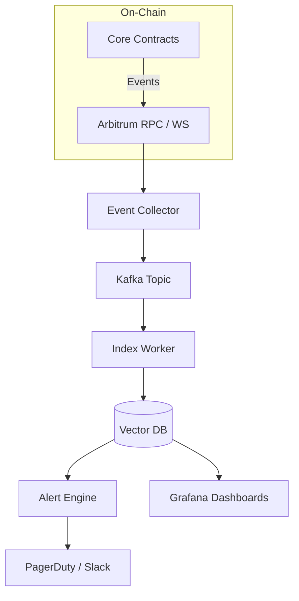

# RWA Lending Platform – Monitoring Guide

> Version: 0.1  |  Last-updated: 2025-08-12

---

## 1. 目标与范围

本指南描述 **链下监控服务** 的整体设计与最佳实践，覆盖：

1. 事件与日志订阅
2. 数据索引 / Vector DB  存储方案
3. 异常检测与告警
4. Prometheus / Grafana  仪表盘
5. 性能与安全基线

**适用读者**：后端工程师、DevOps  及安全运营人员。

---

## 2. 合约层监控接口

| Category | Module / Contract | Function / Event | Purpose |
|----------|-------------------|------------------|---------|
| Degradation | `DegradationMonitor` | `DegradationDetected`, `DegradationStatsUpdated` | 降级检测与统计 |
| Health | `ModuleHealthMonitor` | `ModuleHealthStatusChanged` | 模块健康状态更新 |
| Fee | `FeeRouterView` | `UserDataPushed`, `SystemDataPushed` | 费用分发统计 |
| Vault | `VaultCore` | `ActionExecuted` | 核心业务操作流 |

> 事件统一字段：`indexed bytes32 actionKey`, `string actionKeyString`, `address executor`, `uint256 timestamp`。

---

## 3. 链下服务架构

### 3.1 Event Collector
* 基于 **ethers.js v6** WebSocketProvider。
* 自动重连 / 回溯缺失区块。
* 批量写入 Kafka 以削峰填谷。

### 3.2 Index Worker
* 解析 ABI → JSON → Embedding (OpenAI ada-002)。
* Upsert 到 **Weaviate** / **Pinecone**。Vector size = 1536。
* Metadata: `txHash`, `blockNumber`, `chainId`, `contractAddr`。

### 3.3 Alert Engine
* 自定义规则 + 时间窗口 (e.g. 连续 3 次降级 within 10 min)。
* 支持阈值、趋势、分位数等运算。

---

## 4. 指标与告警示例

| Metric | Source | Formula | Alert Rule |
|--------|--------|---------|-----------|
| Degradation Rate | DegradationMonitor | `totalDegradations / 1h` | > 5 触发 P1 |
| Module Downtime | ModuleHealthMonitor | `consecutiveFailures * 1h` | > 3h 触发 P2 |
| Fee Mismatch | FeeRouterView | `abs(Σ user fees – systemTotal) / systemTotal` | >1% 触发 P3 |

---

## 5. 实现清单

- [x] `BatchView.getDegradationHistory()` 提供批量读取。
- [ ] REST API  `/api/monitoring/events?type=degradation` 
- [ ] Terraform  模块部署 Weaviate + Grafana

---

## 6. 后续计划

1. 接入 **OpenTelemetry** traces。
2. 支持 **DataPush Interface v1** (参见 `contracts/interfaces/IDataPush.sol`).
3. 自动化回滚 (Circuit Breaker) – 调用 `Registry.pauseSystem()` on critical alerts.
---

## 7. 参考

* [docs/Architecture-Guide.md](../Architecture-Guide.md)
* Arbitrum node best-practice – Offchain Labs
* Weaviate  performance tuning – v1.24
