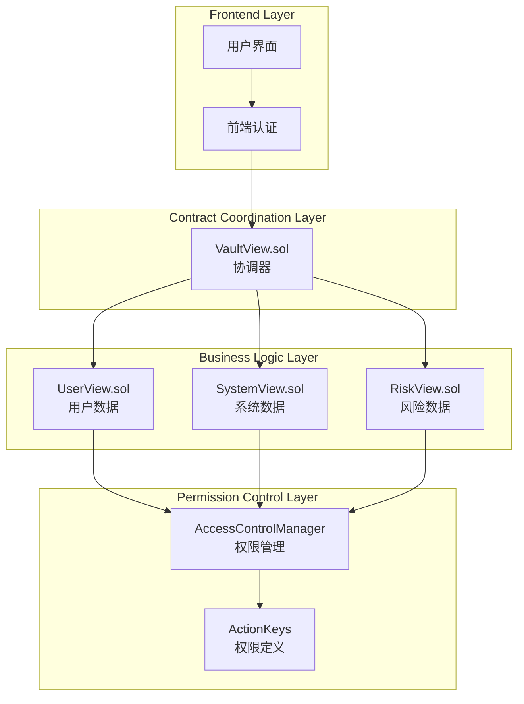

# 🎯 合约层面用户权限隔离分析

## 📋 概述

用户权限隔离应该在**多个层面**实现，形成完整的安全防护体系。让我详细分析每个合约文件应该承担的责任。

## 🏗️ 分层权限隔离架构



## 🔍 各合约文件职责分析

### **1. VaultView.sol - 协调器层面**

**职责**：作为主要入口点，负责：
- ✅ **权限验证**：验证调用者是否有相应权限
- ✅ **用户上下文传递**：确保用户只能访问自己的数据
- ✅ **数据聚合**：将多个模块的数据整合
- ✅ **批量操作控制**：管理批量查询的权限

**需要添加的代码**：

```solidity
// contracts/Vault/view/VaultView.sol

contract VaultView is Initializable, UUPSUpgradeable, IVaultView {
    // ... 现有代码 ...

    /// @notice 用户上下文验证修饰符
    modifier onlyUserData(address user) {
        // 验证调用者是否有权限查看用户数据
        acm.requireRole(ActionKeys.ACTION_VIEW_USER_DATA, msg.sender);
        
        // 如果是查看特定用户数据，验证调用者身份
        if (user != address(0)) {
            // 这里可以添加更严格的用户身份验证
            // 例如：只有用户自己或管理员可以查看
            require(
                msg.sender == user || 
                acm.hasRole(ActionKeys.ACTION_ADMIN, msg.sender),
                "VaultView: unauthorized user data access"
            );
        }
        _;
    }

    /// @notice 用户数据隔离查询
    /// @param user 用户地址
    /// @param asset 资产地址
    /// @return collateral 抵押数量
    /// @return debt 债务数量
    function getUserPosition(address user, address asset) 
        external 
        view 
        onlyUserData(user)
        returns (uint256 collateral, uint256 debt) 
    {
        return userView.getUserPosition(user, asset);
    }

    /// @notice 批量获取用户数据（需要用户隔离）
    /// @param users 用户地址数组
    /// @param assets 资产地址数组
    /// @return positions 用户位置数组
    /// @return healthFactors 健康因子数组
    /// @return riskLevels 风险级别数组
    function batchGetUserCompleteStatus(
        address[] calldata users,
        address[] calldata assets
    ) external view returns (
        uint256[] memory positions,
        uint256[] memory healthFactors,
        uint256[] memory riskLevels
    ) {
        acm.requireRole(ActionKeys.ACTION_VIEW_USER_DATA, msg.sender);
        require(users.length > 0, "VaultView: empty users array");
        require(users.length <= MAX_BATCH_SIZE, "VaultView: too many users");
        require(users.length == assets.length, "VaultView: array length mismatch");
        
        // 验证用户数据访问权限
        for (uint256 i = 0; i < users.length;) {
            require(
                msg.sender == users[i] || 
                acm.hasRole(ActionKeys.ACTION_ADMIN, msg.sender),
                "VaultView: unauthorized batch access"
            );
            unchecked { ++i; }
        }
        
        uint256 length = users.length;
        positions = new uint256[](length * 2);
        healthFactors = new uint256[](length);
        riskLevels = new uint256[](length);
        
        for (uint256 i = 0; i < length;) {
            (uint256 collateral, uint256 debt) = userView.getUserPosition(users[i], assets[i]);
            positions[i * 2] = collateral;
            positions[i * 2 + 1] = debt;
            healthFactors[i] = userView.getHealthFactor(users[i]);
            riskLevels[i] = uint256(riskView.getUserWarningLevel(users[i]));
            unchecked { ++i; }
        }
    }
}
```

### **2. UserView.sol - 用户数据层面**

**职责**：专门处理用户相关数据，负责：
- ✅ **用户数据验证**：确保数据属于指定用户
- ✅ **用户状态计算**：计算用户的健康因子、LTV等
- ✅ **用户权限检查**：验证用户是否有权限访问特定数据

**需要添加的代码**：

```solidity
// contracts/Vault/view/modules/UserView.sol

contract UserView is Initializable, UUPSUpgradeable {
    // ... 现有代码 ...

    /// @notice 用户数据访问验证修饰符
    modifier onlyUserOrAdmin(address user) {
        require(
            msg.sender == user || 
            acm.hasRole(ActionKeys.ACTION_ADMIN, msg.sender) ||
            acm.hasRole(ActionKeys.ACTION_VIEW_USER_DATA, msg.sender),
            "UserView: unauthorized access"
        );
        _;
    }

    /// @notice 查询指定用户指定资产的抵押和借款余额
    /// @param user 用户地址
    /// @param asset 资产地址
    /// @return collateral 抵押数量
    /// @return debt 债务数量
    function getUserPosition(address user, address asset) 
        external 
        view 
        onlyUserOrAdmin(user)
        returns (uint256 collateral, uint256 debt) 
    {
        address collateralManager = _getCollateralManager();
        address lendingEngine = _getLendingEngine();
        
        collateral = ICollateralManager(collateralManager).getCollateral(user, asset);
        debt = ILendingEngineBasic(lendingEngine).getDebt(user, asset);
    }

    /// @notice 获取用户健康因子（需要用户隔离）
    /// @param user 用户地址
    /// @return healthFactor 健康因子
    function getHealthFactor(address user) 
        external 
        view 
        onlyUserOrAdmin(user)
        returns (uint256 healthFactor) 
    {
        address healthFactorCalculator = _getHealthFactorCalculator();
        healthFactor = IHealthFactorCalculator(healthFactorCalculator).getHealthFactor(user);
    }

    /// @notice 获取用户统计信息（需要用户隔离）
    /// @param user 用户地址
    /// @param asset 资产地址
    /// @return stats 用户统计信息
    function getUserStats(address user, address asset) 
        external 
        view 
        onlyUserOrAdmin(user)
        returns (UserStats memory stats) 
    {
        // 计算用户统计信息
        (uint256 collateral, uint256 debt) = this.getUserPosition(user, asset);
        uint256 healthFactor = this.getHealthFactor(user);
        
        // 计算 LTV
        uint256 ltv = _calculateLTV(collateral, debt, asset);
        
        stats = UserStats({
            collateral: collateral,
            debt: debt,
            ltv: ltv,
            hf: healthFactor
        });
    }

    /// @notice 批量获取用户健康因子（需要用户隔离）
    /// @param users 用户地址数组
    /// @return healthFactors 健康因子数组
    function batchGetUserHealthFactors(address[] calldata users) 
        external 
        view 
        returns (uint256[] memory healthFactors) 
    {
        require(users.length > 0, "UserView: empty users array");
        require(users.length <= 100, "UserView: too many users");
        
        // 验证所有用户都有访问权限
        for (uint256 i = 0; i < users.length;) {
            require(
                msg.sender == users[i] || 
                acm.hasRole(ActionKeys.ACTION_ADMIN, msg.sender),
                "UserView: unauthorized batch access"
            );
            unchecked { ++i; }
        }
        
        healthFactors = new uint256[](users.length);
        address healthFactorCalculator = _getHealthFactorCalculator();
        
        for (uint256 i = 0; i < users.length;) {
            healthFactors[i] = IHealthFactorCalculator(healthFactorCalculator).getHealthFactor(users[i]);
            unchecked { ++i; }
        }
    }
}
```

### **3. SystemView.sol - 系统数据层面**

**职责**：处理系统级别的数据，负责：
- ✅ **系统权限验证**：验证是否有权限查看系统数据
- ✅ **系统数据聚合**：聚合所有用户的数据
- ✅ **系统状态监控**：监控系统整体健康状况

**需要添加的代码**：

```solidity
// contracts/Vault/view/modules/SystemView.sol

contract SystemView is Initializable, UUPSUpgradeable {
    // ... 现有代码 ...

    /// @notice 系统数据访问验证修饰符
    modifier onlySystemViewer() {
        acm.requireRole(ActionKeys.ACTION_VIEW_SYSTEM_DATA, msg.sender);
        _;
    }

    /// @notice 获取全局统计信息（需要系统权限）
    /// @return globalStats 全局统计信息
    function getGlobalStatisticsView() 
        external 
        view 
        onlySystemViewer
        returns (GlobalStatisticsView memory globalStats) 
    {
        // 计算全局统计信息
        globalStats = _calculateGlobalStatistics();
    }

    /// @notice 获取系统健康度视图（需要系统权限）
    /// @return healthView 系统健康度视图
    function getSystemHealthView() 
        external 
        view 
        onlySystemViewer
        returns (SystemHealthView memory healthView) 
    {
        // 计算系统健康度
        healthView = _calculateSystemHealth();
    }

    /// @notice 获取资产价格（公开数据，无需特殊权限）
    /// @param asset 资产地址
    /// @return price 资产价格
    function getAssetPrice(address asset) 
        external 
        view 
        returns (uint256 price) 
    {
        // 价格数据是公开的，所有用户都可以查看
        address priceOracle = _getPriceOracle();
        price = IPriceOracle(priceOracle).getPrice(asset);
    }

    /// @notice 获取总抵押量（需要系统权限）
    /// @param asset 资产地址
    /// @return totalCollateral 总抵押量
    function getTotalCollateral(address asset) 
        external 
        view 
        onlySystemViewer
        returns (uint256 totalCollateral) 
    {
        address collateralManager = _getCollateralManager();
        totalCollateral = ICollateralManager(collateralManager).getTotalCollateral(asset);
    }

    /// @notice 获取总债务（需要系统权限）
    /// @param asset 资产地址
    /// @return totalDebt 总债务
    function getTotalDebt(address asset) 
        external 
        view 
        onlySystemViewer
        returns (uint256 totalDebt) 
    {
        address lendingEngine = _getLendingEngine();
        totalDebt = ILendingEngineBasic(lendingEngine).getTotalDebt(asset);
    }
}
```

## 🎯 权限隔离实现策略

### **1. 分层权限控制**

| 层级 | 合约文件 | 权限类型 | 实现方式 |
|------|----------|----------|----------|
| **协调层** | VaultView.sol | 用户数据访问 | `onlyUserData` 修饰符 |
| **业务层** | UserView.sol | 用户数据隔离 | `onlyUserOrAdmin` 修饰符 |
| **系统层** | SystemView.sol | 系统数据访问 | `onlySystemViewer` 修饰符 |
| **权限层** | ACM | 角色管理 | ActionKeys 权限定义 |

### **2. 权限验证流程**

```solidity
// 权限验证流程图
用户请求 → VaultView.sol → 验证用户权限 → 调用具体模块 → 模块内再次验证 → 返回数据
```

### **3. 关键权限定义**

```solidity
// contracts/constants/ActionKeys.sol

library ActionKeys {
    // 用户数据权限
    bytes32 public constant ACTION_VIEW_USER_DATA = keccak256("ACTION_VIEW_USER_DATA");
    bytes32 public constant ACTION_MODIFY_USER_DATA = keccak256("ACTION_MODIFY_USER_DATA");
    
    // 系统数据权限
    bytes32 public constant ACTION_VIEW_SYSTEM_DATA = keccak256("ACTION_VIEW_SYSTEM_DATA");
    bytes32 public constant ACTION_VIEW_SYSTEM_STATUS = keccak256("ACTION_VIEW_SYSTEM_STATUS");
    
    // 管理员权限
    bytes32 public constant ACTION_ADMIN = keccak256("ACTION_ADMIN");
    bytes32 public constant ACTION_UPGRADE_MODULE = keccak256("ACTION_UPGRADE_MODULE");
}
```

## 🔒 安全最佳实践

### **1. 多重验证机制**

```solidity
// 在 VaultView.sol 中实现多重验证
function getUserCompleteStatus(address user, address asset) 
    external 
    view 
    returns (UserStats memory stats) 
{
    // 第一层：权限验证
    acm.requireRole(ActionKeys.ACTION_VIEW_USER_DATA, msg.sender);
    
    // 第二层：用户身份验证
    require(
        msg.sender == user || 
        acm.hasRole(ActionKeys.ACTION_ADMIN, msg.sender),
        "VaultView: unauthorized access"
    );
    
    // 第三层：调用具体模块
    stats = userView.getUserStats(user, asset);
}
```

### **2. 批量操作安全**

```solidity
// 批量操作中的用户隔离
function batchGetUserCompleteStatus(
    address[] calldata users,
    address[] calldata assets
) external view returns (/* ... */) {
    // 验证数组长度
    require(users.length > 0, "Empty users array");
    require(users.length <= MAX_BATCH_SIZE, "Too many users");
    
    // 验证每个用户的访问权限
    for (uint256 i = 0; i < users.length;) {
        require(
            msg.sender == users[i] || 
            acm.hasRole(ActionKeys.ACTION_ADMIN, msg.sender),
            "Unauthorized batch access"
        );
        unchecked { ++i; }
    }
    
    // 执行批量查询
    // ...
}
```

### **3. 错误处理**

```solidity
// 自定义错误定义
error UnauthorizedUserAccess(address user, address caller);
error UnauthorizedBatchAccess(address[] users, address caller);
error InvalidUserContext(address user, address expectedUser);

// 在合约中使用
function getUserPosition(address user, address asset) external view returns (uint256, uint256) {
    if (msg.sender != user && !acm.hasRole(ActionKeys.ACTION_ADMIN, msg.sender)) {
        revert UnauthorizedUserAccess(user, msg.sender);
    }
    
    // 执行查询...
}
```

## 📊 实现优先级

### **高优先级（必须实现）**
1. **VaultView.sol**：添加用户上下文验证
2. **UserView.sol**：添加用户数据隔离
3. **ActionKeys.sol**：定义用户权限常量

### **中优先级（建议实现）**
1. **SystemView.sol**：完善系统权限控制
2. **批量操作**：添加批量查询的用户隔离
3. **错误处理**：完善错误信息

### **低优先级（可选实现）**
1. **缓存优化**：用户数据缓存隔离
2. **事件记录**：记录用户数据访问日志
3. **监控告警**：异常访问监控

## 🎯 总结

**用户权限隔离需要在所有三个合约文件中实现**：

1. **VaultView.sol**：作为协调器，负责权限验证和用户上下文传递
2. **UserView.sol**：作为用户数据模块，负责用户数据隔离和验证
3. **SystemView.sol**：作为系统数据模块，负责系统权限控制

这样的分层设计确保了：
- ✅ **多层防护**：每个层面都有权限验证
- ✅ **职责清晰**：每个合约承担明确的权限责任
- ✅ **安全可靠**：多重验证机制防止越权访问
- ✅ **易于维护**：模块化设计便于后续维护和升级

你觉得这个分析如何？需要我详细说明某个特定层面的实现吗？🚀 