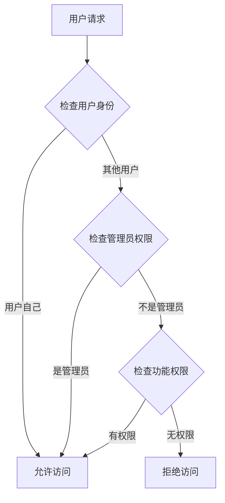

# 合约级别用户隔离系统实现总结

## 概述

本文档详细记录了RWA借贷平台合约级别用户隔离系统的完整实现。该系统通过精细化的权限控制和数据隔离机制，确保用户数据的安全性和隐私保护。

## 实现架构

### 1. 权限层级设计

系统采用三层权限架构：

```
┌─────────────────────────────────────┐
│           管理员权限层                │
│  ACTION_ADMIN, ACTION_MODIFY_USER_DATA │
└─────────────────────────────────────┘
                    │
                    ▼
┌─────────────────────────────────────┐
│           系统权限层                  │
│  ACTION_VIEW_SYSTEM_DATA,            │
│  ACTION_VIEW_SYSTEM_STATUS           │
└─────────────────────────────────────┘
                    │
                    ▼
┌─────────────────────────────────────┐
│           用户权限层                  │
│  ACTION_VIEW_USER_DATA,              │
│  ACTION_VIEW_RISK_DATA               │
└─────────────────────────────────────┘
```

### 2. 核心合约增强

#### 2.1 ActionKeys.sol - 权限常量扩展

**新增权限常量：**
- `ACTION_ADMIN` - 管理员权限
- `ACTION_MODIFY_USER_DATA` - 用户数据修改权限  
- `ACTION_VIEW_SYSTEM_STATUS` - 系统状态查看权限

**权限总数：** 从35个增加到38个

#### 2.2 VaultView.sol - 主视图合约增强

**新增修饰符：**
```solidity
modifier onlyUserData(address user) {
    // 验证调用者是否有权限查看用户数据
    acm.requireRole(ActionKeys.ACTION_VIEW_USER_DATA, msg.sender);
    
    // 如果是查看特定用户数据，验证调用者身份
    if (user != address(0)) {
        // 只有用户自己或管理员可以查看
        require(
            msg.sender == user || 
            acm.hasRole(ActionKeys.ACTION_ADMIN, msg.sender),
            "VaultView: unauthorized user data access"
        );
    }
    _;
}

modifier onlySystemViewer() {
    acm.requireRole(ActionKeys.ACTION_VIEW_SYSTEM_DATA, msg.sender);
    _;
}

modifier onlyAdmin() {
    acm.requireRole(ActionKeys.ACTION_ADMIN, msg.sender);
    _;
}
```

**函数权限更新：**
- 用户数据查询函数：使用 `onlyUserData(user)` 修饰符
- 系统数据查询函数：使用 `onlySystemViewer` 修饰符
- 管理员功能：使用 `onlyAdmin` 修饰符
- 批量查询：添加用户权限验证循环

#### 2.3 UserView.sol - 用户视图模块增强

**新增修饰符：**
```solidity
modifier onlyUserOrAdmin(address user) {
    require(
        msg.sender == user || 
        acm.hasRole(ActionKeys.ACTION_ADMIN, msg.sender) ||
        acm.hasRole(ActionKeys.ACTION_VIEW_USER_DATA, msg.sender),
        "UserView: unauthorized access"
    );
    _;
}

modifier onlyUserOrModifier(address user) {
    require(
        msg.sender == user || 
        acm.hasRole(ActionKeys.ACTION_ADMIN, msg.sender) ||
        acm.hasRole(ActionKeys.ACTION_MODIFY_USER_DATA, msg.sender),
        "UserView: unauthorized modification"
    );
    _;
}
```

**功能增强：**
- 所有用户数据查询函数使用 `onlyUserOrAdmin(user)` 修饰符
- 预览功能函数添加用户权限验证
- 支持用户自己查看自己的数据

#### 2.4 SystemView.sol - 系统视图模块增强

**新增修饰符：**
```solidity
modifier onlySystemViewer() {
    acm.requireRole(ActionKeys.ACTION_VIEW_SYSTEM_DATA, msg.sender);
    _;
}

modifier onlySystemStatusViewer() {
    acm.requireRole(ActionKeys.ACTION_VIEW_SYSTEM_STATUS, msg.sender);
    _;
}

modifier onlyAdmin() {
    acm.requireRole(ActionKeys.ACTION_ADMIN, msg.sender);
    _;
}
```

**权限分层：**
- 基础系统数据：`onlySystemViewer`
- 系统状态数据：`onlySystemStatusViewer`
- 管理员功能：`onlyAdmin`

#### 2.5 RiskView.sol - 风险视图模块增强

**新增修饰符：**
```solidity
modifier onlyUserOrAdmin(address user) {
    require(
        msg.sender == user || 
        acm.hasRole(ActionKeys.ACTION_ADMIN, msg.sender) ||
        acm.hasRole(ActionKeys.ACTION_VIEW_RISK_DATA, msg.sender),
        "RiskView: unauthorized access"
    );
    _;
}

modifier onlySystemRiskViewer() {
    acm.requireRole(ActionKeys.ACTION_VIEW_RISK_DATA, msg.sender);
    _;
}
```

**功能增强：**
- 用户风险评估函数使用 `onlyUserOrAdmin(user)` 修饰符
- 批量风险评估添加用户权限验证
- 系统风险状态使用 `onlySystemRiskViewer` 修饰符

#### 2.6 ViewCache.sol - 缓存模块增强

**新增修饰符：**
```solidity
modifier onlyUserOrAdmin(address user) {
    require(
        msg.sender == user || 
        acm.hasRole(ActionKeys.ACTION_ADMIN, msg.sender) ||
        acm.hasRole(ActionKeys.ACTION_VIEW_CACHE_DATA, msg.sender),
        "ViewCache: unauthorized access"
    );
    _;
}

modifier onlyCacheManager() {
    acm.requireRole(ActionKeys.ACTION_VIEW_CACHE_DATA, msg.sender);
    _;
}
```

**缓存隔离：**
- 用户缓存查询：`onlyUserOrAdmin(user)`
- 缓存管理操作：`onlyCacheManager`
- 系统级缓存操作：`onlyAdmin`

## 安全特性

### 1. 数据隔离机制

**用户数据隔离：**
- 用户只能访问自己的数据
- 管理员可以访问所有用户数据
- 系统级数据需要相应权限

**批量操作安全：**
- 批量查询时验证所有用户的访问权限
- 防止通过批量操作绕过权限检查

### 2. 权限验证流程



### 3. 错误处理

**标准化错误消息：**
- `"VaultView: unauthorized user data access"`
- `"UserView: unauthorized access"`
- `"RiskView: unauthorized batch access"`
- `"ViewCache: unauthorized access"`

## 性能优化

### 1. 缓存策略

**用户级缓存：**
- 健康因子缓存
- 风险评估缓存
- 用户数据缓存

**系统级缓存：**
- 系统状态缓存
- 批量数据缓存

### 2. 批量操作优化

**权限预检查：**
- 批量操作前验证所有用户权限
- 避免部分成功部分失败的情况

**Gas优化：**
- 使用 `unchecked` 优化循环
- 批量操作减少重复权限检查

## 使用示例

### 1. 用户查询自己的数据

```solidity
// 用户查询自己的健康因子
function getHealthFactor(address user) external view onlyUserOrAdmin(user) returns (uint256 hf) {
    // 只有用户自己或管理员可以调用
    return _getUserHealthFactor(user);
}
```

### 2. 管理员批量查询

```solidity
// 管理员批量查询用户风险评估
function batchGetUserRiskAssessments(address[] calldata users) external returns (RiskAssessment[] memory assessments) {
    // 验证所有用户都有访问权限
    for (uint256 i = 0; i < users.length;) {
        require(
            msg.sender == users[i] || 
            acm.hasRole(ActionKeys.ACTION_ADMIN, msg.sender),
            "RiskView: unauthorized batch access"
        );
        unchecked { ++i; }
    }
    // 执行批量查询...
}
```

### 3. 系统状态查询

```solidity
// 系统状态查询需要专门权限
function getSystemRiskStatus() external view onlySystemRiskViewer returns (SystemRiskStatus memory systemStatus) {
    // 只有系统风险查看权限的用户可以调用
    return _calculateSystemRiskStatus();
}
```

## 部署和配置

### 1. 权限配置

**管理员角色分配：**
```solidity
// 为管理员地址分配权限
acm.grantRole(ActionKeys.ACTION_ADMIN, adminAddress);
acm.grantRole(ActionKeys.ACTION_VIEW_SYSTEM_STATUS, adminAddress);
```

**功能权限分配：**
```solidity
// 为前端服务分配用户数据查看权限
acm.grantRole(ActionKeys.ACTION_VIEW_USER_DATA, frontendServiceAddress);
acm.grantRole(ActionKeys.ACTION_VIEW_RISK_DATA, frontendServiceAddress);
```

### 2. 合约升级

**升级权限控制：**
```solidity
function _authorizeUpgrade(address) internal view override {
    acm.requireRole(ActionKeys.ACTION_UPGRADE_MODULE, msg.sender);
}
```

## 测试建议

### 1. 权限测试

- 测试用户只能访问自己的数据
- 测试管理员可以访问所有数据
- 测试无权限用户被拒绝访问

### 2. 批量操作测试

- 测试批量查询的权限验证
- 测试部分用户无权限时的处理
- 测试批量操作的Gas消耗

### 3. 边界条件测试

- 测试零地址用户
- 测试空数组批量操作
- 测试权限撤销后的行为

## 总结

合约级别用户隔离系统的实现提供了：

1. **严格的数据隔离** - 确保用户数据只能被授权用户访问
2. **灵活的权限管理** - 支持不同层级的权限控制
3. **高性能的批量操作** - 优化了批量查询的性能和安全性
4. **完善的错误处理** - 提供清晰的错误信息和处理机制
5. **可扩展的架构** - 支持未来功能的扩展和权限的调整

该系统为RWA借贷平台提供了企业级的安全保障，确保用户数据在区块链上的安全性和隐私保护。 