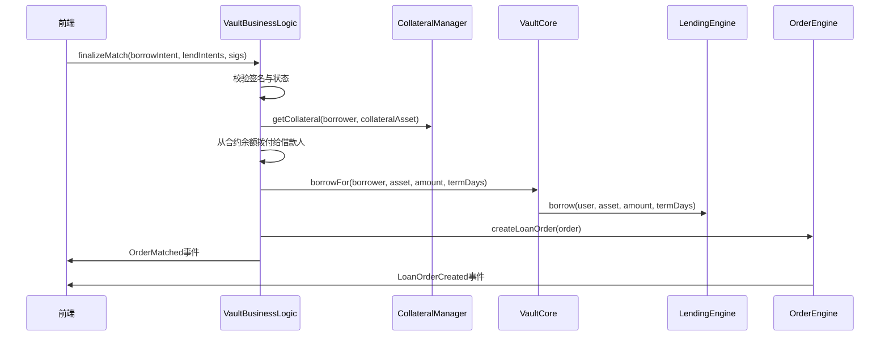
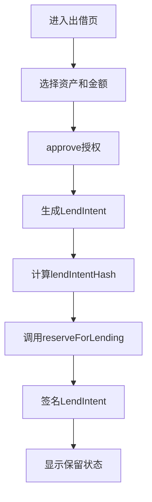
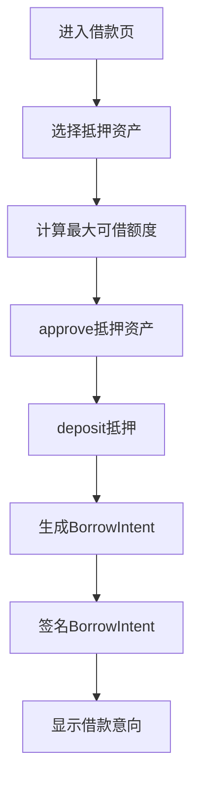
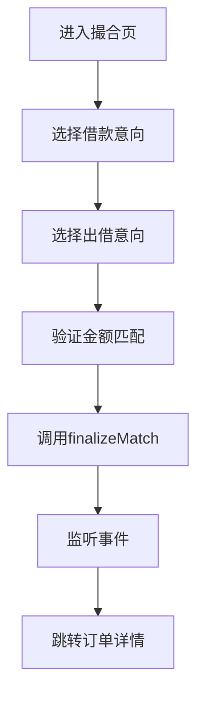

# 前端对接：资金池撮合落地（EIP-712 v4）

本指南面向前端工程师，说明"资金池 + 撮合 + 原子落地"完整链路的页面流程、签名规范、合约调用与事件订阅。

## 📋 目录
- [架构概述](#架构概述)
- [核心流程](#核心流程)
- [前置准备](#前置准备)
- [页面流程](#页面流程)
- [EIP-712 签名规范](#eip-712-签名规范)
- [合约调用示例](#合约调用示例)
- [事件订阅](#事件订阅)
- [错误处理](#错误处理)
- [快速集成清单](#快速集成清单)

## 🏗️ 架构概述

### 核心组件关系图
```
┌─────────────────┐    ┌─────────────────┐    ┌─────────────────┐
│   前端应用      │    │   VaultBusiness │    │   订单引擎      │
│                 │    │   Logic (VBL)   │    │                 │
│ ┌─────────────┐ │    │                 │    │ ┌─────────────┐ │
│ │ 出借页面    │◄┼────┤ 资金池管理      │    │ │ LoanNFT     │ │
│ └─────────────┘ │    │ 撮合入口        │    │ │ 积分奖励    │ │
│ ┌─────────────┐ │    │ 原子落地        │    │ └─────────────┘ │
│ │ 借款页面    │◄┼────┤                 │    │                 │
│ └─────────────┘ │    └─────────────────┘    └─────────────────┘
│ ┌─────────────┐ │              │
│ │ 撮合页面    │◄┼──────────────┘
│ └─────────────┘ │
└─────────────────┘
```

### 数据流向
```
1. 资金入池 → 2. 保留账本 → 3. 撮合匹配 → 4. 原子落地
     ↓              ↓              ↓              ↓
   VBL合约      账本引擎        订单引擎        统一推送
```

### 关键约束
- **账本与订单分离**：账本引擎记录债务，订单引擎处理NFT和奖励
- **原子落地顺序**：校验 → 拨付 → 记账 → 订单 → 事件
- **金额一致性**：`reserveForLending` 金额必须与 `LendIntent.amount` 完全一致

## 🔄 核心流程

### 撮合原子落地流程


## ⚙️ 前置准备

### 必需模块地址
前端需要从 Registry 获取以下模块地址：

| 模块键值 | 合约名称 | 用途 |
|---------|---------|------|
| `KEY_VAULT_CORE` | VaultCore | 统一账本入口 |
| `KEY_VAULT_BUSINESS_LOGIC` | VaultBusinessLogic | 撮合入口 |
| `KEY_ACCESS_CONTROL` | AccessControlManager | 权限控制 |
| `KEY_CM` | CollateralManager | 抵押管理 |
| `KEY_LE` | VaultLendingEngine | 账本引擎 |
| `KEY_ORDER_ENGINE` | LendingEngine | 订单引擎 |
| `KEY_LOAN_NFT` | LoanNFT | NFT铸造 |
| `KEY_FR` | FeeRouter | 费用路由 |
| `KEY_RM` | RewardManager | 奖励管理 |

### 地址获取方式
```typescript
// 推荐：从配置文件读取
import { VBL_ADDRESS, VAULT_CORE_ADDRESS } from './frontend-config';

// 备选：运行时从Registry获取
const registry = new Contract(REGISTRY_ADDRESS, Registry__factory.abi, signer);
const vblAddress = await registry.getModuleOrRevert(ModuleKeys.KEY_VAULT_BUSINESS_LOGIC);
```

### 期限与等级约束
- **允许期限**：5、10、15、30、60、90、180、360天
- **等级要求**：期限≥90天时，借款人等级必须≥4

## 📱 页面流程

### 1. 出借页面（贷方）


**核心代码**：
```typescript
// 1. 授权
await erc20.approve(VBL_ADDRESS, amount);

// 2. 生成意向
const lendIntent = {
  lender: await signer.getAddress(),
  asset: USDT_ADDRESS,
  amount: ethers.parseUnits('5000', 6),
  minTermDays: 30,
  maxTermDays: 90,
  minRateBps: 500, // 5%
  expireAt: Math.floor(Date.now() / 1000) + 3600, // 1小时后过期
  salt: ethers.randomBytes(32)
};

// 3. 计算哈希
const lendIntentHash = hashLendIntent(lendIntent);

// 4. 保留资金
await vbl.reserveForLending(lender, asset, amount, lendIntentHash);

// 5. 签名
const lenderSig = await signer._signTypedData(domain, { LendIntent: LendIntentTypes }, lendIntent);
```

### 2. 借款页面（借方）


**核心代码**：
```typescript
// 1. 授权并存入抵押
await collateralToken.approve(VBL_ADDRESS, collateralAmount);
await vbl.deposit(collateralAsset, collateralAmount);

// 2. 生成借款意向
const borrowIntent = {
  borrower: await signer.getAddress(),
  collateralAsset: RWA_TOKEN_ADDRESS,
  collateralAmount: ethers.parseUnits('10000', 18),
  borrowAsset: USDT_ADDRESS,
  amount: ethers.parseUnits('5000', 6),
  termDays: 60,
  rateBps: 800, // 8%
  expireAt: Math.floor(Date.now() / 1000) + 3600,
  salt: ethers.randomBytes(32)
};

// 3. 签名
const borrowerSig = await signer._signTypedData(domain, { BorrowIntent: BorrowIntentTypes }, borrowIntent);
```

### 3. 撮合详情页


**核心代码**：
```typescript
// 撮合调用
await vbl.finalizeMatch(
  borrowIntent,
  [lendIntent1, lendIntent2], // 可多个出借意向
  borrowerSig,
  [lenderSig1, lenderSig2]
);

// 事件监听
vbl.on('OrderMatched', (orderId, borrower, lender, asset, amount, termDays, rateBps) => {
  console.log('撮合成功:', { orderId: orderId.toString() });
  // 跳转到订单详情页
  router.push(`/orders/${orderId}`);
});
```

## ✍️ EIP-712 签名规范

### Domain 配置
```typescript
const domain = {
  name: 'RwaLending',
  version: '1',
  chainId: (await provider.getNetwork()).chainId,
  verifyingContract: VBL_ADDRESS,
} as const;
```

### 类型定义
```typescript
const BorrowIntentTypes = [
  { name: 'borrower', type: 'address' },
  { name: 'collateralAsset', type: 'address' },
  { name: 'collateralAmount', type: 'uint256' },
  { name: 'borrowAsset', type: 'address' },
  { name: 'amount', type: 'uint256' },
  { name: 'termDays', type: 'uint16' },
  { name: 'rateBps', type: 'uint256' },
  { name: 'expireAt', type: 'uint256' },
  { name: 'salt', type: 'bytes32' },
] as const;

const LendIntentTypes = [
  { name: 'lender', type: 'address' },
  { name: 'asset', type: 'address' },
  { name: 'amount', type: 'uint256' },
  { name: 'minTermDays', type: 'uint16' },
  { name: 'maxTermDays', type: 'uint16' },
  { name: 'minRateBps', type: 'uint256' },
  { name: 'expireAt', type: 'uint256' },
  { name: 'salt', type: 'bytes32' },
] as const;
```

### 哈希计算函数
```typescript
import { keccak256, AbiCoder, toUtf8Bytes } from 'ethers';

function hashLendIntent(lendIntent: any): string {
  const typeHash = keccak256(toUtf8Bytes(
    'LendIntent(address lender,address asset,uint256 amount,uint16 minTermDays,uint16 maxTermDays,uint256 minRateBps,uint256 expireAt,bytes32 salt)'
  ));
  
  const coder = AbiCoder.defaultAbiCoder();
  const encoded = coder.encode(
    ['bytes32','address','address','uint256','uint16','uint16','uint256','uint256','bytes32'],
    [typeHash, lendIntent.lender, lendIntent.asset, lendIntent.amount, 
     lendIntent.minTermDays, lendIntent.maxTermDays, lendIntent.minRateBps, 
     lendIntent.expireAt, lendIntent.salt]
  );
  
  return keccak256(encoded);
}
```

## 📞 合约调用示例

### 完整集成示例
```typescript
import { ethers } from 'ethers';
import { VaultBusinessLogic__factory } from './types';

class LendingPlatform {
  private vbl: any;
  private signer: any;
  
  constructor(vblAddress: string, signer: any) {
    this.vbl = VaultBusinessLogic__factory.connect(vblAddress, signer);
    this.signer = signer;
  }
  
  // 出借流程
  async lend(asset: string, amount: bigint, minTermDays: number, maxTermDays: number, minRateBps: bigint) {
    // 1. 授权
    const erc20 = new ethers.Contract(asset, ['function approve(address,uint256)'], this.signer);
    await erc20.approve(this.vbl.target, amount);
    
    // 2. 生成意向
    const lendIntent = {
      lender: await this.signer.getAddress(),
      asset,
      amount,
      minTermDays,
      maxTermDays,
      minRateBps,
      expireAt: BigInt(Math.floor(Date.now() / 1000) + 3600),
      salt: ethers.randomBytes(32)
    };
    
    // 3. 计算哈希并保留
    const lendIntentHash = hashLendIntent(lendIntent);
    await this.vbl.reserveForLending(lendIntent.lender, asset, amount, lendIntentHash);
    
    // 4. 签名
    const domain = {
      name: 'RwaLending',
      version: '1',
      chainId: (await this.signer.provider.getNetwork()).chainId,
      verifyingContract: this.vbl.target,
    };
    
    const signature = await this.signer._signTypedData(
      domain, 
      { LendIntent: LendIntentTypes }, 
      lendIntent
    );
    
    return { lendIntent, signature };
  }
  
  // 撮合流程
  async match(borrowIntent: any, lendIntents: any[], borrowerSig: string, lenderSigs: string[]) {
    const tx = await this.vbl.finalizeMatch(
      borrowIntent,
      lendIntents,
      borrowerSig,
      lenderSigs
    );
    
    const receipt = await tx.wait();
    return receipt;
  }
}
```

## 📡 事件订阅

### 主要事件
```typescript
// 撮合完成事件
interface OrderMatched {
  orderId: bigint;
  borrower: string;
  lender: string;
  asset: string;
  amount: bigint;
  termDays: number;
  rateBps: bigint;
}

// 订单创建事件
interface LoanOrderCreated {
  orderId: bigint;
  borrower: string;
  lender: string;
  principal: bigint;
}
```

### 事件监听示例
```typescript
// 监听撮合成功
vbl.on('OrderMatched', (orderId, borrower, lender, asset, amount, termDays, rateBps, event) => {
  console.log('撮合成功:', {
    orderId: orderId.toString(),
    borrower,
    lender,
    asset,
    amount: ethers.formatUnits(amount, 6),
    termDays: termDays.toString(),
    rateBps: rateBps.toString()
  });
  
  // 更新UI状态
  updateOrderStatus(orderId.toString(), 'matched');
  
  // 跳转到订单详情
  router.push(`/orders/${orderId}`);
});

// 监听订单创建
orderEngine.on('LoanOrderCreated', (orderId, borrower, lender, principal, event) => {
  console.log('订单创建:', {
    orderId: orderId.toString(),
    borrower,
    lender,
    principal: ethers.formatUnits(principal, 6)
  });
});
```

## ⚠️ 错误处理

### 常见错误码
| 错误类型 | 错误信息 | 解决方案 |
|---------|---------|---------|
| `Settlement__InvalidSignature` | 签名无效 | 检查EIP-712格式和钱包支持 |
| `insufficient reserved sum` | 保留金额不足 | 确保lendIntent金额与reserve一致 |
| `insufficient collateral` | 抵押不足 | 检查借款人抵押资产余额 |
| `LendingEngine__InvalidTerm` | 期限无效 | 使用允许的期限值 |
| `LendingEngine__LevelTooLow` | 等级不足 | 借款人等级需≥4（期限≥90天） |
| 权限不足 | `ACTION_ORDER_CREATE` | 检查VBL合约权限配置 |

### 错误处理示例
```typescript
try {
  await vbl.finalizeMatch(borrowIntent, lendIntents, borrowerSig, lenderSigs);
} catch (error: any) {
  if (error.message.includes('Settlement__InvalidSignature')) {
    showError('签名验证失败，请检查钱包连接');
  } else if (error.message.includes('insufficient reserved sum')) {
    showError('出借意向金额不足，请检查保留状态');
  } else if (error.message.includes('insufficient collateral')) {
    showError('抵押资产不足，请补充抵押');
  } else if (error.message.includes('LendingEngine__LevelTooLow')) {
    showError('借款人等级不足，无法进行长期借款');
  } else {
    showError('撮合失败，请稍后重试');
    console.error('撮合错误:', error);
  }
}
```

## 🔐 签名兼容性与钱包支持（重要）

### 支持的 RPC 方法（建议按优先级使用）
- **eth_signTypedData_v4**（首选）：大多数 EOA 钱包与 WalletConnect 已实现
- **eth_signTypedData_v3**（兼容）：本项目的意向结构体不含数组/嵌套复杂类型，v3 与 v4 产出的 digest 一致
- **eth_signTypedData**（旧版）：不建议使用，易出现实现差异

### ethers v6 签名接口
```typescript
// ethers v6 默认使用 v4 格式，推荐统一使用该接口
const signature = await signer._signTypedData(domain, types, value);
```

### 合约验签说明
- 合约验签对前端使用 v3/v4 无感（digest 相同前提下）
- 核心在于前端"严格匹配本文件的 domain 与 types 编码"

### 不支持的方法
- **personal_sign / EIP‑191**：非 EIP‑712 结构化签名
- **SIWE / EIP‑4361**：登录类签名，非本业务范围

### 合约钱包（ERC‑1271）支持
- 我们已在合约侧支持 `isValidSignature(digest, signature)`
- 前端仍使用 EIP‑712 结构化签名接口（例如 Safe Apps SDK / AA SDK）
- 无需降级到 personal_sign
- 部分 AA 钱包/聚合器在"账号未部署"场景可能包装 EIP‑6492 签名
- 当前未启用该扩展，建议使用已部署账户或在后端路由层统一处理
## 签名兼容性与钱包支持（重要）
- 支持的 RPC 方法（建议按优先级使用）：
  - eth_signTypedData_v4（首选；大多数 EOA 钱包与 WalletConnect 已实现）
  - eth_signTypedData_v3（兼容；本项目的意向结构体不含数组/嵌套复杂类型，v3 与 v4 产出的 
digest 一致）
  - eth_signTypedData（旧版；不建议使用，易出现实现差异）
- ethers v6：`signer._signTypedData(domain, types, value)` 默认使用 v4 格式；推荐统一
走该接口。
- 合约验签对前端使用 v3/v4 无感（digest 相同前提下），核心在于前端“严格匹配本文件的 domain 与 
types 编码”。
- 不支持（按当前设计）：
  - personal_sign / EIP‑191（非 EIP‑712 结构化签名）
  - SIWE / EIP‑4361（登录类签名，非本业务范围）
- 合约钱包（ERC‑1271）：
  - 我们已在合约侧支持 `isValidSignature(digest, signature)`；前端仍使用 EIP‑712 结构化
签名接口（例如 Safe Apps SDK / AA SDK），无需降级到 personal_sign。
  - 部分 AA 钱包/聚合器在“账号未部署”场景可能包装 EIP‑6492 签名；当前未启用该扩展，建议使用已
部署账户或在后端路由层统一处理。
- 兼容性细节与踩坑：
  - domain.chainId 需为十进制 number（部分钱包对 hex 字符串不兼容）。
  - verifyingContract 必须为 `VaultBusinessLogic` 实际地址，确保与链上验签合约一致。
  - types 字段顺序与大小写需与本文件完全一致；在 TS 中建议显式给出 types 数组（见示例）。
  - 移动端 WalletConnect：请确保 SDK/Provider 支持 v4；若仅支持 v3，本项目结构体同样可用。
### 兼容性细节与踩坑
| 问题 | 解决方案 |
|------|---------|
| **domain.chainId** | 需为十进制 number（部分钱包对 hex 字符串不兼容） |
| **verifyingContract** | 必须为 `VaultBusinessLogic` 实际地址，确保与链上验签合约一致 |
| **types 字段顺序** | 需与本文件完全一致；在 TS 中建议显式给出 types 数组 |
| **移动端 WalletConnect** | 请确保 SDK/Provider 支持 v4；若仅支持 v3，本项目结构体同样可用 |

### 钱包连接示例
```typescript
// MetaMask / 浏览器钱包
const provider = new BrowserProvider(window.ethereum);
const signer = await provider.getSigner();

// WalletConnect v2
import { WalletConnectModal } from '@walletconnect/modal';
const modal = new WalletConnectModal({
  projectId: 'YOUR_PROJECT_ID',
  chains: [421614], // Arbitrum Sepolia
  enableExplorer: true,
});

// 检查钱包支持
async function checkWalletSupport() {
  try {
    const domain = {
      name: 'RwaLending',
      version: '1',
      chainId: (await provider.getNetwork()).chainId,
      verifyingContract: VBL_ADDRESS,
    };
    
    // 测试签名
    const testData = { test: 'data' };
    const signature = await signer._signTypedData(domain, { Test: [{ name: 'test', type: 'string' }] }, testData);
    console.log('钱包支持 EIP-712 v4');
    return true;
  } catch (error) {
    console.error('钱包不支持 EIP-712 v4:', error);
    return false;
  }
}
```

### 常见钱包兼容性
| 钱包类型 | EIP-712 v4 支持 | 备注 |
|---------|----------------|------|
| MetaMask | ✅ 完全支持 | 推荐使用 |
| WalletConnect | ✅ 完全支持 | 移动端首选 |
| Coinbase Wallet | ✅ 完全支持 | 浏览器扩展 |
| Trust Wallet | ✅ 完全支持 | 移动端 |
| Safe Wallet | ✅ 完全支持 | 通过 ERC-1271 |
| Rainbow | ✅ 完全支持 | 移动端 |
| Argent | ✅ 完全支持 | 通过 ERC-1271 |

## 🚀 前端集成清单（TL;DR）

### 地址配置与实例化
- **从后端或 `frontend-config` 读取模块地址**：
  - `KEY_VAULT_BUSINESS_LOGIC`、`KEY_VAULT_CORE`、`KEY_ORDER_ENGINE` 等
- **使用 ethers v6 实例化合约**：
  ```typescript
  const vbl = new Contract(VBL_ADDRESS, VaultBusinessLogic__factory.abi, signer);
  ```

### 出借页面（贷方）流程
```typescript
// 完整流程：approve → 生成lendIntent → 计算lendIntentHash → reserveForLending → EIP-712签名
await erc20.connect(signer).approve(VBL_ADDRESS, amount);
const lendIntent = { /* 按文档结构体构造 */ };
const lendIntentHash = hashLendIntent(lendIntent);
await vbl.reserveForLending(await signer.getAddress(), asset, amount, lendIntentHash);
const lenderSig = await signer._signTypedData(domain, { LendIntent: LendIntentTypes }, lendIntent);
```

### 借款页面（借方）流程
```typescript
// 完整流程：approve → deposit → 生成borrowIntent → EIP-712签名
await collateralToken.approve(VBL_ADDRESS, collateralAmount);
await vbl.deposit(collateralAsset, collateralAmount);
const borrowIntent = { /* 按文档结构体构造 */ };
const borrowerSig = await signer._signTypedData(domain, { BorrowIntent: BorrowIntentTypes }, borrowIntent);
```

### 撮合页面流程
```typescript
// 组装borrowIntent与一个或多个lendIntent，确保每笔reserve金额与其lendIntent.amount一致
await vbl.finalizeMatch(borrowIntent, [lendIntent], borrowerSig, [lenderSig]);
```

### 事件订阅
```typescript
// 监听VBL.OrderMatched与订单引擎的LoanOrderCreated，成功后更新UI并跳转到订单详情
vbl.on('OrderMatched', (orderId, borrower, lender, asset, amount, termDays, rateBps) => {
  console.log('撮合成功:', { orderId: orderId.toString() });
  // 更新UI状态
  updateOrderStatus(orderId.toString(), 'matched');
  // 跳转到订单详情
  router.push(`/orders/${orderId}`);
});
```

### 错误处理
**常见错误及解决方案**：
- `Settlement__InvalidSignature` - 签名无效，检查EIP-712格式和钱包支持
- `insufficient reserved sum` - 保留金额不足，确保lendIntent金额与reserve一致
- `insufficient collateral` - 抵押不足，检查借款人抵押资产余额
- `LendingEngine__InvalidTerm` - 期限无效，使用允许的期限值
- `LendingEngine__LevelTooLow` - 等级不足，借款人等级需≥4（期限≥90天）
- 权限不足（`ACTION_ORDER_CREATE`） - 检查VBL合约权限配置

### 最小代码骨架（完整示例）
```typescript
// 1) 实例化
const provider = new BrowserProvider(window.ethereum);
const signer = await provider.getSigner();
const vbl = new Contract(VBL_ADDRESS, VaultBusinessLogic__factory.abi, signer);

// 2) 出借保留（示例）
await erc20.connect(signer).approve(VBL_ADDRESS, amount);
const lendIntent = { /* 按文档结构体构造 */ };
const lendIntentHash = hashLendIntent(lendIntent);
await vbl.reserveForLending(await signer.getAddress(), asset, amount, lendIntentHash);
const lenderSig = await signer._signTypedData(domain, { LendIntent: LendIntentTypes }, lendIntent);

// 3) 撮合（示例）
const borrowerSig = /* 借款人签名 BorrowIntent */;
await vbl.finalizeMatch(borrowIntent, [lendIntent], borrowerSig, [lenderSig]);

// 4) 事件订阅（示例）
vbl.on('OrderMatched', (orderId) => redirectTo(`/orders/${orderId}`));
```

### 快速检查清单
- [ ] 配置模块地址（VBL、VaultCore、OrderEngine等）
- [ ] 设置EIP-712 Domain参数
- [ ] 准备TypeScript类型定义
- [ ] 实现出借页面：授权 → 保留 → 签名
- [ ] 实现借款页面：抵押 → 签名
- [ ] 实现撮合页面：匹配 → 调用 → 监听
- [ ] 添加事件订阅：OrderMatched、LoanOrderCreated
- [ ] 处理常见错误：签名、金额、抵押、权限等
- [ ] 测试签名格式验证
- [ ] 测试金额精度处理（6位/18位）
- [ ] 测试错误处理覆盖
- [ ] 测试事件监听功能

## 📚 相关文档
- [架构指南](./Architecture-Guide.md) - 系统整体架构
- [权限管理指南](./permission-management-guide.md) - 权限配置
- [价格预言机指南](./PriceOracle-Usage-Guide.md) - 价格获取

---

**注意**：当前版本要求保留金额与意向金额1:1一致，不支持部分消费。如需拆单，请拆分为多个独立意向。
