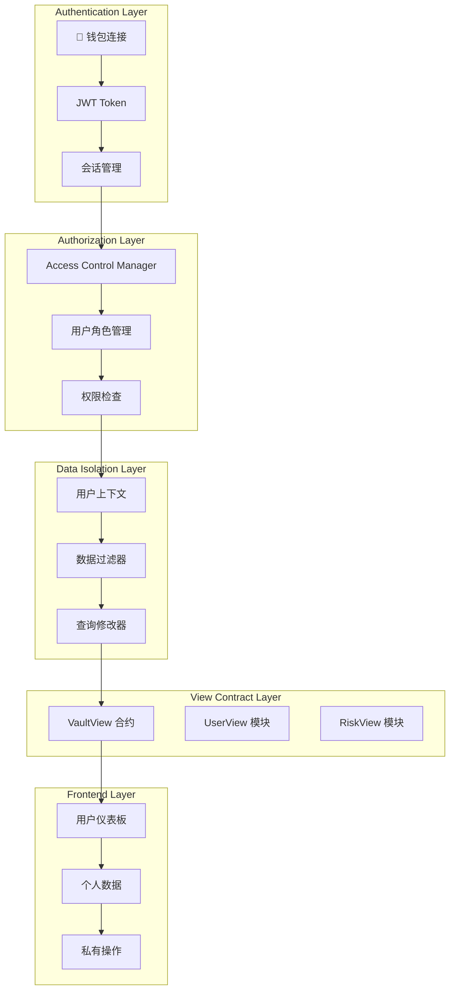

# 🔐 用户账号隔离系统设计指南

## 📋 概述

本指南详细说明如何实现用户账号隔离系统，确保每个用户只能访问和操作自己的数据，提供安全、私密的用户体验。

## 🏗️ 系统架构设计



## 🔐 用户认证系统

### 1. 钱包连接认证

```typescript
// src/services/auth/WalletAuthService.ts
import { ethers } from 'ethers';
import { jwtDecode } from 'jwt-decode';

export interface UserSession {
  address: string;
  nonce: string;
  signature: string;
  token: string;
  expiresAt: number;
}

export class WalletAuthService {
  private provider: ethers.Provider;
  private signer?: ethers.Signer;

  constructor(provider: ethers.Provider) {
    this.provider = provider;
  }

  async connectWallet(): Promise<UserSession> {
    try {
      // 1. 请求钱包连接
      await window.ethereum.request({ method: 'eth_requestAccounts' });
      
      // 2. 获取用户地址
      const accounts = await window.ethereum.request({ method: 'eth_accounts' });
      const address = accounts[0];

      if (!address) {
        throw new Error('未检测到钱包连接');
      }

      // 3. 生成随机 nonce
      const nonce = this.generateNonce();
      
      // 4. 请求用户签名
      const message = this.createSignMessage(address, nonce);
      const signature = await this.requestSignature(message);

      // 5. 验证签名并生成 JWT
      const token = await this.verifySignatureAndGenerateToken(address, nonce, signature);

      const session: UserSession = {
        address,
        nonce,
        signature,
        token,
        expiresAt: Date.now() + 24 * 60 * 60 * 1000 // 24小时过期
      };

      // 6. 存储会话
      this.storeSession(session);

      return session;
    } catch (error) {
      console.error('钱包连接失败:', error);
      throw error;
    }
  }

  private generateNonce(): string {
    return Math.random().toString(36).substring(2, 15) + 
           Math.random().toString(36).substring(2, 15);
  }

  private createSignMessage(address: string, nonce: string): string {
    return `欢迎使用 RWA 借贷平台！

请签名以验证您的身份：
地址: ${address}
随机数: ${nonce}
时间戳: ${Date.now()}

签名此消息即表示您同意我们的服务条款和隐私政策。`;
  }

  private async requestSignature(message: string): Promise<string> {
    const accounts = await window.ethereum.request({ method: 'eth_accounts' });
    const address = accounts[0];

    return await window.ethereum.request({
      method: 'personal_sign',
      params: [message, address]
    });
  }

  private async verifySignatureAndGenerateToken(
    address: string, 
    nonce: string, 
    signature: string
  ): Promise<string> {
    // 这里应该调用后端 API 验证签名并生成 JWT
    const response = await fetch('/api/auth/verify-signature', {
      method: 'POST',
      headers: {
        'Content-Type': 'application/json',
      },
      body: JSON.stringify({
        address,
        nonce,
        signature,
        message: this.createSignMessage(address, nonce)
      })
    });

    if (!response.ok) {
      throw new Error('签名验证失败');
    }

    const { token } = await response.json();
    return token;
  }

  private storeSession(session: UserSession): void {
    localStorage.setItem('user_session', JSON.stringify(session));
  }

  getCurrentSession(): UserSession | null {
    const sessionData = localStorage.getItem('user_session');
    if (!sessionData) return null;

    const session: UserSession = JSON.parse(sessionData);
    
    // 检查是否过期
    if (Date.now() > session.expiresAt) {
      this.clearSession();
      return null;
    }

    return session;
  }

  clearSession(): void {
    localStorage.removeItem('user_session');
  }

  isAuthenticated(): boolean {
    return this.getCurrentSession() !== null;
  }

  getCurrentAddress(): string | null {
    const session = this.getCurrentSession();
    return session?.address || null;
  }
}
```

### 2. JWT Token 管理

```typescript
// src/services/auth/JWTService.ts
import jwtDecode from 'jwt-decode';

export interface JWTPayload {
  address: string;
  nonce: string;
  iat: number;
  exp: number;
  permissions: string[];
  role: string;
}

export class JWTService {
  private static readonly TOKEN_KEY = 'auth_token';

  static setToken(token: string): void {
    localStorage.setItem(this.TOKEN_KEY, token);
  }

  static getToken(): string | null {
    return localStorage.getItem(this.TOKEN_KEY);
  }

  static removeToken(): void {
    localStorage.removeItem(this.TOKEN_KEY);
  }

  static decodeToken(token: string): JWTPayload {
    try {
      return jwtDecode<JWTPayload>(token);
    } catch (error) {
      throw new Error('无效的 JWT Token');
    }
  }

  static isTokenValid(token: string): boolean {
    try {
      const payload = this.decodeToken(token);
      return Date.now() < payload.exp * 1000;
    } catch {
      return false;
    }
  }

  static getTokenPayload(): JWTPayload | null {
    const token = this.getToken();
    if (!token) return null;

    try {
      return this.decodeToken(token);
    } catch {
      return null;
    }
  }

  static hasPermission(permission: string): boolean {
    const payload = this.getTokenPayload();
    return payload?.permissions.includes(permission) || false;
  }

  static getUserRole(): string | null {
    const payload = this.getTokenPayload();
    return payload?.role || null;
  }
}
```

## 🛡️ 权限控制系统

### 1. 前端权限管理

```typescript
// src/services/auth/PermissionService.ts
import { JWTService } from './JWTService';

export enum Permission {
  VIEW_OWN_DATA = 'view_own_data',
  MODIFY_OWN_DATA = 'modify_own_data',
  VIEW_OWN_INVESTMENTS = 'view_own_investments',
  MODIFY_OWN_INVESTMENTS = 'modify_own_investments',
  VIEW_OWN_RISK = 'view_own_risk',
  VIEW_SYSTEM_STATUS = 'view_system_status',
  ADMIN_ACCESS = 'admin_access'
}

export class PermissionService {
  static hasPermission(permission: Permission): boolean {
    return JWTService.hasPermission(permission);
  }

  static hasAnyPermission(permissions: Permission[]): boolean {
    return permissions.some(permission => this.hasPermission(permission));
  }

  static hasAllPermissions(permissions: Permission[]): boolean {
    return permissions.every(permission => this.hasPermission(permission));
  }

  static getUserPermissions(): Permission[] {
    const payload = JWTService.getTokenPayload();
    return payload?.permissions.map(p => p as Permission) || [];
  }

  static canViewOwnData(): boolean {
    return this.hasPermission(Permission.VIEW_OWN_DATA);
  }

  static canModifyOwnData(): boolean {
    return this.hasPermission(Permission.MODIFY_OWN_DATA);
  }

  static canViewOwnInvestments(): boolean {
    return this.hasPermission(Permission.VIEW_OWN_INVESTMENTS);
  }

  static canViewSystemStatus(): boolean {
    return this.hasPermission(Permission.VIEW_SYSTEM_STATUS);
  }

  static isAdmin(): boolean {
    return this.hasPermission(Permission.ADMIN_ACCESS);
  }
}
```

### 2. 数据访问控制

```typescript
// src/services/auth/DataAccessControl.ts
import { PermissionService, Permission } from './PermissionService';
import { JWTService } from './JWTService';

export class DataAccessControl {
  static validateUserAccess(userAddress: string): boolean {
    const currentAddress = JWTService.getTokenPayload()?.address;
    
    if (!currentAddress) {
      throw new Error('用户未认证');
    }

    if (currentAddress.toLowerCase() !== userAddress.toLowerCase()) {
      throw new Error('无权访问其他用户数据');
    }

    return true;
  }

  static validateDataAccess(data: any, requiredPermissions: Permission[]): boolean {
    // 检查权限
    if (!PermissionService.hasAllPermissions(requiredPermissions)) {
      throw new Error('权限不足');
    }

    // 检查数据所有权
    if (data.userAddress) {
      this.validateUserAccess(data.userAddress);
    }

    return true;
  }

  static filterUserData(data: any[], userAddress: string): any[] {
    const currentAddress = JWTService.getTokenPayload()?.address;
    
    if (!currentAddress) {
      return [];
    }

    // 只返回当前用户的数据
    return data.filter(item => 
      item.userAddress?.toLowerCase() === currentAddress.toLowerCase()
    );
  }

  static sanitizeDataForUser(data: any, userAddress: string): any {
    const currentAddress = JWTService.getTokenPayload()?.address;
    
    if (!currentAddress) {
      return null;
    }

    // 如果数据不属于当前用户，返回 null
    if (data.userAddress && 
        data.userAddress.toLowerCase() !== currentAddress.toLowerCase()) {
      return null;
    }

    // 移除敏感信息
    const sanitized = { ...data };
    delete sanitized.internalNotes;
    delete sanitized.adminData;
    delete sanitized.sensitiveInfo;

    return sanitized;
  }
}
```

## 🎯 View 合约用户隔离

### 1. 用户隔离的 View 合约服务

```typescript
// src/services/contracts/UserIsolatedVaultViewService.ts
import { VaultViewService } from './VaultViewService';
import { DataAccessControl } from '../auth/DataAccessControl';
import { PermissionService, Permission } from '../auth/PermissionService';
import { JWTService } from '../auth/JWTService';

export class UserIsolatedVaultViewService extends VaultViewService {
  constructor(contractAddress: string, provider: any, signer?: any) {
    super(contractAddress, provider, signer);
  }

  // 重写用户状态查询，确保只能查询自己的数据
  async getUserCompleteStatus(userAddress?: string, assetAddress?: string) {
    const currentAddress = JWTService.getTokenPayload()?.address;
    
    if (!currentAddress) {
      throw new Error('用户未认证');
    }

    // 如果没有提供用户地址，使用当前用户地址
    const targetAddress = userAddress || currentAddress;

    // 验证用户只能查询自己的数据
    DataAccessControl.validateUserAccess(targetAddress);

    // 检查权限
    if (!PermissionService.canViewOwnData()) {
      throw new Error('无权查看用户数据');
    }

    try {
      const result = await super.getUserCompleteStatus(targetAddress, assetAddress);
      
      // 清理敏感数据
      return DataAccessControl.sanitizeDataForUser(result, targetAddress);
    } catch (error) {
      console.error('获取用户状态失败:', error);
      throw error;
    }
  }

  // 批量查询用户数据（只能查询自己的）
  async batchGetUserCompleteStatus(users: string[], assets: string[]) {
    const currentAddress = JWTService.getTokenPayload()?.address;
    
    if (!currentAddress) {
      throw new Error('用户未认证');
    }

    // 验证所有用户地址都是当前用户
    users.forEach(userAddress => {
      DataAccessControl.validateUserAccess(userAddress);
    });

    // 检查权限
    if (!PermissionService.canViewOwnInvestments()) {
      throw new Error('无权查看投资数据');
    }

    try {
      const result = await super.batchGetUserCompleteStatus(users, assets);
      
      // 过滤和清理数据
      return {
        positions: result.positions,
        healthFactors: result.healthFactors,
        riskLevels: result.riskLevels,
        timestamp: result.timestamp,
        userAddress: currentAddress // 明确标识数据所有者
      };
    } catch (error) {
      console.error('批量查询失败:', error);
      throw error;
    }
  }

  // 获取用户风险评估（只能查询自己的）
  async getUserRiskAssessment(userAddress?: string) {
    const currentAddress = JWTService.getTokenPayload()?.address;
    
    if (!currentAddress) {
      throw new Error('用户未认证');
    }

    const targetAddress = userAddress || currentAddress;
    DataAccessControl.validateUserAccess(targetAddress);

    if (!PermissionService.canViewOwnRisk()) {
      throw new Error('无权查看风险数据');
    }

    try {
      const result = await super.getUserRiskAssessment(targetAddress);
      return DataAccessControl.sanitizeDataForUser(result, targetAddress);
    } catch (error) {
      console.error('获取风险评估失败:', error);
      throw error;
    }
  }

  // 获取系统状态（需要特殊权限）
  async getSystemStatus() {
    if (!PermissionService.canViewSystemStatus()) {
      throw new Error('无权查看系统状态');
    }

    try {
      const result = await super.getSystemStatus();
      
      // 系统状态数据不包含用户特定信息，可以安全返回
      return result;
    } catch (error) {
      console.error('获取系统状态失败:', error);
      throw error;
    }
  }

  // 预览操作（只能预览自己的操作）
  async previewOperations(operations: any[]) {
    const currentAddress = JWTService.getTokenPayload()?.address;
    
    if (!currentAddress) {
      throw new Error('用户未认证');
    }

    // 验证所有操作都是当前用户的
    operations.forEach(operation => {
      if (operation.user && operation.user.toLowerCase() !== currentAddress.toLowerCase()) {
        throw new Error('只能预览自己的操作');
      }
    });

    if (!PermissionService.canModifyOwnData()) {
      throw new Error('无权执行操作预览');
    }

    try {
      const results = await super.previewOperations(operations);
      
      return results.map((result: any, index: number) => ({
        ...result,
        userAddress: currentAddress,
        operation: operations[index]
      }));
    } catch (error) {
      console.error('操作预览失败:', error);
      throw error;
    }
  }
}
```

### 2. AI Agent 用户隔离

```typescript
// src/services/agents/UserIsolatedSmartQueryAgent.ts
import { SmartQueryAgent } from './smart-query-agent';
import { DataAccessControl } from '../auth/DataAccessControl';
import { PermissionService, Permission } from '../auth/PermissionService';
import { JWTService } from '../auth/JWTService';

export class UserIsolatedSmartQueryAgent extends SmartQueryAgent {
  async processQuery(userQuery: string, userAddress?: string) {
    const currentAddress = JWTService.getTokenPayload()?.address;
    
    if (!currentAddress) {
      throw new Error('用户未认证');
    }

    // 如果没有提供用户地址，使用当前用户地址
    const targetAddress = userAddress || currentAddress;

    // 验证用户只能查询自己的数据
    DataAccessControl.validateUserAccess(targetAddress);

    try {
      // 调用父类方法，但确保数据隔离
      const result = await super.processQuery(userQuery, targetAddress);
      
      // 清理敏感数据
      const sanitizedData = DataAccessControl.sanitizeDataForUser(result.data, targetAddress);
      
      return {
        ...result,
        data: sanitizedData,
        userAddress: targetAddress,
        queryScope: 'personal' // 标识这是个人查询
      };
    } catch (error) {
      console.error('智能查询失败:', error);
      throw error;
    }
  }

  private async parseQueryIntent(userQuery: string) {
    const prompt = `
    分析以下用户查询，识别查询意图和所需数据：
    
    查询：${userQuery}
    
    注意：用户只能查询自己的数据，不能查询其他用户的信息。
    
    请返回 JSON 格式的意图分析：
    {
      "intent": "user_status|risk_analysis|investment_advice|operation_preview",
      "entities": {
        "user_address": "当前用户地址（自动填充）",
        "asset_address": "资产地址（如果有）",
        "operation_type": "操作类型（deposit|borrow|repay|withdraw）",
        "amount": "金额（如果有）"
      },
      "scope": "personal",
      "requires_own_data": true,
      "permissions_required": ["view_own_data"]
    }
    `;

    const response = await this.deepseek.generateResponse(prompt, undefined, {
      temperature: 0.1,
      maxTokens: 500
    });

    const intent = JSON.parse(response.content || '{}');
    
    // 确保查询范围是个人数据
    intent.scope = 'personal';
    intent.requires_own_data = true;
    
    return intent;
  }

  private selectQueryMethod(intent: any) {
    // 根据权限选择查询方法
    const methodMap = {
      user_status: PermissionService.canViewOwnData() ? 'getUserCompleteStatus' : null,
      risk_analysis: PermissionService.canViewOwnRisk() ? 'getUserRiskAssessment' : null,
      investment_advice: PermissionService.canViewOwnInvestments() ? 'batchGetUserCompleteStatus' : null,
      operation_preview: PermissionService.canModifyOwnData() ? 'previewOperations' : null
    };

    const method = methodMap[intent.intent];
    
    if (!method) {
      throw new Error(`权限不足，无法执行 ${intent.intent} 查询`);
    }

    return method;
  }
}
```

## 🎨 前端用户界面隔离

### 1. 用户仪表板组件

```typescript
// src/components/dashboard/UserDashboard.tsx
import React, { useState, useEffect } from 'react';
import { useUserIsolatedVaultView } from '@/hooks/useUserIsolatedVaultView';
import { useAuth } from '@/hooks/useAuth';
import { PermissionService, Permission } from '@/services/auth/PermissionService';

export const UserDashboard: React.FC = () => {
  const [userData, setUserData] = useState<any>(null);
  const [loading, setLoading] = useState(true);
  const [error, setError] = useState<string | null>(null);

  const { isAuthenticated, currentUser } = useAuth();
  const { getUserCompleteStatus, getUserRiskAssessment } = useUserIsolatedVaultView();

  useEffect(() => {
    if (!isAuthenticated) {
      setError('请先连接钱包');
      setLoading(false);
      return;
    }

    loadUserData();
  }, [isAuthenticated, currentUser]);

  const loadUserData = async () => {
    try {
      setLoading(true);
      setError(null);

      const [userStatus, riskAssessment] = await Promise.all([
        getUserCompleteStatus(),
        getUserRiskAssessment()
      ]);

      setUserData({
        userStatus,
        riskAssessment,
        timestamp: Date.now()
      });
    } catch (err) {
      setError(err instanceof Error ? err.message : '加载数据失败');
    } finally {
      setLoading(false);
    }
  };

  if (!isAuthenticated) {
    return (
      <div className="text-center py-8">
        <h2 className="text-xl font-semibold mb-4">请先连接钱包</h2>
        <p className="text-gray-600">连接钱包后即可查看您的个人数据</p>
      </div>
    );
  }

  if (loading) {
    return <div className="text-center py-8">加载中...</div>;
  }

  if (error) {
    return (
      <div className="text-center py-8">
        <p className="text-red-600 mb-4">{error}</p>
        <button 
          onClick={loadUserData}
          className="px-4 py-2 bg-blue-500 text-white rounded hover:bg-blue-600"
        >
          重试
        </button>
      </div>
    );
  }

  return (
    <div className="max-w-6xl mx-auto p-6">
      <div className="mb-6">
        <h1 className="text-2xl font-bold">个人仪表板</h1>
        <p className="text-gray-600">
          欢迎回来，{currentUser?.address?.slice(0, 6)}...{currentUser?.address?.slice(-4)}
        </p>
      </div>

      <div className="grid grid-cols-1 md:grid-cols-2 lg:grid-cols-3 gap-6">
        {/* 用户状态卡片 */}
        {PermissionService.canViewOwnData() && (
          <div className="bg-white rounded-lg shadow p-6">
            <h3 className="text-lg font-semibold mb-4">📊 我的状态</h3>
            <div className="space-y-2">
              <p>抵押: {userData?.userStatus?.position?.collateral || 'N/A'}</p>
              <p>债务: {userData?.userStatus?.position?.debt || 'N/A'}</p>
              <p>健康因子: {userData?.userStatus?.healthFactor || 'N/A'}</p>
            </div>
          </div>
        )}

        {/* 风险评估卡片 */}
        {PermissionService.canViewOwnRisk() && (
          <div className="bg-white rounded-lg shadow p-6">
            <h3 className="text-lg font-semibold mb-4">⚠️ 风险评估</h3>
            <div className="space-y-2">
              <p>风险等级: {userData?.riskAssessment?.riskLevel || 'N/A'}</p>
              <p>警告级别: {userData?.riskAssessment?.warningLevel || 'N/A'}</p>
            </div>
          </div>
        )}

        {/* 投资建议卡片 */}
        {PermissionService.canViewOwnInvestments() && (
          <div className="bg-white rounded-lg shadow p-6">
            <h3 className="text-lg font-semibold mb-4">💡 投资建议</h3>
            <p className="text-gray-600">基于您的投资状况生成个性化建议</p>
            <button className="mt-2 px-4 py-2 bg-green-500 text-white rounded hover:bg-green-600">
              获取建议
            </button>
          </div>
        )}

        {/* 操作历史卡片 */}
        <div className="bg-white rounded-lg shadow p-6">
          <h3 className="text-lg font-semibold mb-4">📝 操作历史</h3>
          <p className="text-gray-600">查看您的历史操作记录</p>
          <button className="mt-2 px-4 py-2 bg-blue-500 text-white rounded hover:bg-blue-600">
            查看历史
          </button>
        </div>

        {/* 设置卡片 */}
        <div className="bg-white rounded-lg shadow p-6">
          <h3 className="text-lg font-semibold mb-4">⚙️ 账户设置</h3>
          <p className="text-gray-600">管理您的账户设置和偏好</p>
          <button className="mt-2 px-4 py-2 bg-gray-500 text-white rounded hover:bg-gray-600">
            设置
          </button>
        </div>
      </div>

      {/* 数据更新时间 */}
      <div className="mt-6 text-center text-sm text-gray-500">
        最后更新: {new Date(userData?.timestamp).toLocaleString()}
      </div>
    </div>
  );
};
```

### 2. 权限保护的路由组件

```typescript
// src/components/auth/ProtectedRoute.tsx
import React from 'react';
import { useAuth } from '@/hooks/useAuth';
import { PermissionService, Permission } from '@/services/auth/PermissionService';

interface ProtectedRouteProps {
  children: React.ReactNode;
  requiredPermissions?: Permission[];
  fallback?: React.ReactNode;
}

export const ProtectedRoute: React.FC<ProtectedRouteProps> = ({
  children,
  requiredPermissions = [],
  fallback = <div>权限不足</div>
}) => {
  const { isAuthenticated } = useAuth();

  if (!isAuthenticated) {
    return (
      <div className="text-center py-8">
        <h2 className="text-xl font-semibold mb-4">请先登录</h2>
        <p className="text-gray-600">您需要连接钱包才能访问此页面</p>
      </div>
    );
  }

  if (requiredPermissions.length > 0 && 
      !PermissionService.hasAllPermissions(requiredPermissions)) {
    return <>{fallback}</>;
  }

  return <>{children}</>;
};
```

### 3. 用户数据 Hook

```typescript
// src/hooks/useUserIsolatedVaultView.ts
import { useState, useCallback } from 'react';
import { useAuth } from './useAuth';
import { UserIsolatedVaultViewService } from '@/services/contracts/UserIsolatedVaultViewService';
import { PermissionService, Permission } from '@/services/auth/PermissionService';

export function useUserIsolatedVaultView() {
  const [loading, setLoading] = useState(false);
  const [error, setError] = useState<string | null>(null);
  const { isAuthenticated, currentUser } = useAuth();

  const vaultViewService = new UserIsolatedVaultViewService(
    process.env.NEXT_PUBLIC_VAULT_VIEW_ADDRESS!,
    window.ethereum
  );

  const getUserCompleteStatus = useCallback(async (assetAddress?: string) => {
    if (!isAuthenticated) {
      throw new Error('用户未认证');
    }

    if (!PermissionService.canViewOwnData()) {
      throw new Error('无权查看用户数据');
    }

    setLoading(true);
    setError(null);

    try {
      const result = await vaultViewService.getUserCompleteStatus(
        currentUser?.address,
        assetAddress
      );
      return result;
    } catch (err) {
      const errorMessage = err instanceof Error ? err.message : '查询失败';
      setError(errorMessage);
      throw err;
    } finally {
      setLoading(false);
    }
  }, [isAuthenticated, currentUser]);

  const getUserRiskAssessment = useCallback(async () => {
    if (!isAuthenticated) {
      throw new Error('用户未认证');
    }

    if (!PermissionService.canViewOwnRisk()) {
      throw new Error('无权查看风险数据');
    }

    setLoading(true);
    setError(null);

    try {
      const result = await vaultViewService.getUserRiskAssessment(currentUser?.address);
      return result;
    } catch (err) {
      const errorMessage = err instanceof Error ? err.message : '查询失败';
      setError(errorMessage);
      throw err;
    } finally {
      setLoading(false);
    }
  }, [isAuthenticated, currentUser]);

  const previewOperations = useCallback(async (operations: any[]) => {
    if (!isAuthenticated) {
      throw new Error('用户未认证');
    }

    if (!PermissionService.canModifyOwnData()) {
      throw new Error('无权执行操作预览');
    }

    setLoading(true);
    setError(null);

    try {
      // 确保所有操作都是当前用户的
      const userOperations = operations.map(op => ({
        ...op,
        user: currentUser?.address
      }));

      const result = await vaultViewService.previewOperations(userOperations);
      return result;
    } catch (err) {
      const errorMessage = err instanceof Error ? err.message : '预览失败';
      setError(errorMessage);
      throw err;
    } finally {
      setLoading(false);
    }
  }, [isAuthenticated, currentUser]);

  return {
    getUserCompleteStatus,
    getUserRiskAssessment,
    previewOperations,
    loading,
    error,
    clearError: () => setError(null)
  };
}
```

## 🔒 安全最佳实践

### 1. 数据加密和传输安全

```typescript
// src/services/security/DataEncryption.ts
import CryptoJS from 'crypto-js';

export class DataEncryption {
  private static readonly ENCRYPTION_KEY = process.env.NEXT_PUBLIC_ENCRYPTION_KEY || 'default-key';

  static encrypt(data: any): string {
    const jsonString = JSON.stringify(data);
    return CryptoJS.AES.encrypt(jsonString, this.ENCRYPTION_KEY).toString();
  }

  static decrypt(encryptedData: string): any {
    const bytes = CryptoJS.AES.decrypt(encryptedData, this.ENCRYPTION_KEY);
    const decryptedString = bytes.toString(CryptoJS.enc.Utf8);
    return JSON.parse(decryptedString);
  }

  static hashData(data: string): string {
    return CryptoJS.SHA256(data).toString();
  }

  static generateSecureToken(): string {
    return CryptoJS.lib.WordArray.random(32).toString();
  }
}
```

### 2. 会话管理和超时处理

```typescript
// src/services/auth/SessionManager.ts
export class SessionManager {
  private static readonly SESSION_TIMEOUT = 30 * 60 * 1000; // 30分钟
  private static readonly REFRESH_THRESHOLD = 5 * 60 * 1000; // 5分钟

  static startSession(): void {
    const sessionData = {
      startTime: Date.now(),
      lastActivity: Date.now(),
      token: JWTService.getToken()
    };

    localStorage.setItem('session_data', JSON.stringify(sessionData));
  }

  static updateActivity(): void {
    const sessionData = this.getSessionData();
    if (sessionData) {
      sessionData.lastActivity = Date.now();
      localStorage.setItem('session_data', JSON.stringify(sessionData));
    }
  }

  static isSessionValid(): boolean {
    const sessionData = this.getSessionData();
    if (!sessionData) return false;

    const now = Date.now();
    const timeSinceLastActivity = now - sessionData.lastActivity;

    return timeSinceLastActivity < this.SESSION_TIMEOUT;
  }

  static shouldRefreshToken(): boolean {
    const sessionData = this.getSessionData();
    if (!sessionData) return false;

    const now = Date.now();
    const timeSinceLastActivity = now - sessionData.lastActivity;

    return timeSinceLastActivity > this.REFRESH_THRESHOLD;
  }

  static clearSession(): void {
    localStorage.removeItem('session_data');
    JWTService.removeToken();
  }

  private static getSessionData(): any {
    const data = localStorage.getItem('session_data');
    return data ? JSON.parse(data) : null;
  }
}
```

## 🚀 部署和配置

### 1. 环境变量配置

```bash
# .env.local
# 认证配置
NEXT_PUBLIC_AUTH_ENABLED=true
NEXT_PUBLIC_SESSION_TIMEOUT=1800000
NEXT_PUBLIC_REFRESH_THRESHOLD=300000

# 加密配置
NEXT_PUBLIC_ENCRYPTION_KEY=your-secure-encryption-key

# 合约配置
NEXT_PUBLIC_VAULT_VIEW_ADDRESS=0x...
NEXT_PUBLIC_ACCESS_CONTROL_ADDRESS=0x...

# API 配置
NEXT_PUBLIC_API_BASE_URL=http://localhost:3001
NEXT_PUBLIC_JWT_SECRET=your-jwt-secret
```

### 2. 路由配置

```typescript
// src/app/dashboard/page.tsx
import { ProtectedRoute } from '@/components/auth/ProtectedRoute';
import { UserDashboard } from '@/components/dashboard/UserDashboard';
import { Permission } from '@/services/auth/PermissionService';

export default function DashboardPage() {
  return (
    <ProtectedRoute requiredPermissions={[Permission.VIEW_OWN_DATA]}>
      <UserDashboard />
    </ProtectedRoute>
  );
}
```

## 🎯 总结

通过这个完整的用户账号隔离系统，我们实现了：

### ✅ **核心功能**
1. **🔐 钱包认证**：安全的钱包连接和签名验证
2. **🛡️ 权限控制**：细粒度的权限管理
3. **📊 数据隔离**：用户只能访问自己的数据
4. **🔒 安全传输**：数据加密和会话管理
5. **🎨 用户界面**：个性化的用户仪表板

### 🚀 **技术优势**
- **去中心化认证**：基于钱包的无需密码认证
- **实时权限检查**：每次操作都验证权限
- **数据隐私保护**：严格的用户数据隔离
- **安全会话管理**：自动超时和刷新机制
- **友好的用户体验**：直观的界面和错误提示

### 📊 **安全特性**
- **JWT Token 认证**：安全的身份验证
- **数据加密**：敏感数据加密存储
- **权限验证**：每次查询都验证用户权限
- **会话超时**：自动清理过期会话
- **错误处理**：完善的错误提示和处理

这样，你的平台用户就有了完全隔离的个人账号系统，每个用户只能访问和操作自己的数据，确保了数据的安全性和隐私性！🎉 