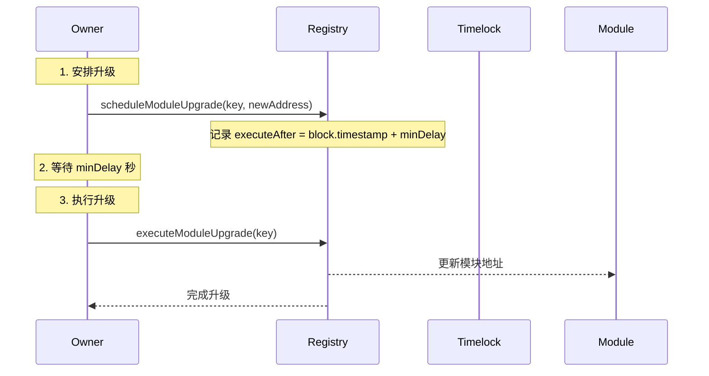

# Registry 模块化转换指南

## 🔍 Registry 系统升级检查清单

### 📋 **第一步：文件类型分析**

#### **1. 需要升级的文件类型**
```solidity
✅ 合约文件 (.sol)
✅ 有状态变量的文件
✅ 有权限管理的文件
✅ 有外部调用的文件
```

#### **2. 不需要升级的文件类型**
```solidity
❌ 库文件 (library) - 如 VaultMath.sol, VaultTypes.sol, VaultUtils.sol
❌ 纯接口文件 (interface)
❌ 纯事件定义文件
❌ 纯常量定义文件
```

### 🔍 **第二步：关键检查点**

#### **1. 硬编码地址检查**
```bash
# 搜索这些模式
grep_search("address.*acm")
grep_search("IAccessControlManager.*acm")
grep_search("acm = IAccessControlManager")
grep_search("acm\.requireRole")
```

#### **2. 构造函数参数检查**
```solidity
// ❌ 旧模式
function initialize(address acmAddr, address registryAddr)

// ✅ 新模式  
function initialize(address initialRegistryAddr)
```

#### **3. 权限管理检查**
```solidity
// ❌ 旧模式
acm.requireRole(ActionKeys.ACTION_XXX, msg.sender);

// ✅ 新模式
_requireRole(ActionKeys.ACTION_XXX, msg.sender);
```

#### **4. 模块地址获取检查**
```solidity
// ❌ 旧模式
address module = IVaultStorage(vaultStorage).getNamedModule(key);

// ✅ 新模式
address module = Registry(registryAddr).getModuleOrRevert(ModuleKeys.KEY_XXX);
```

### 🎯 **第三步：升级策略**

#### **1. 导入优化**
```solidity
// ❌ 删除未使用的导入
import { IRegistry } from "../interfaces/IRegistry.sol";

// ✅ 添加必要的导入
import { Registry } from "../registry/Registry.sol";
```

#### **2. 状态变量更新**
```solidity
// ❌ 移除硬编码地址
address public immutable acmAddr;
IAccessControlManager public acm;

// ✅ 使用继承的 registryAddr
// registryAddr 已在 AccessControlled 中定义
```

#### **3. 权限管理统一**
```solidity
// ✅ 添加内部函数
function _requireRole(bytes32 actionKey, address user) internal view {
    address acmAddr = Registry(registryAddr).getModuleOrRevert(ModuleKeys.KEY_ACCESS_CONTROL);
    IAccessControlManager(acmAddr).requireRole(actionKey, user);
}
```

#### **4. 修饰符添加**
```solidity
// ✅ 添加安全修饰符
modifier onlyValidRegistry() {
    if (registryAddr == address(0)) revert ZeroAddress();
    _;
}
```

#### **5. 外部函数保护**
```solidity
// ✅ 为所有外部函数添加修饰符
function someFunction() external onlyValidRegistry {
    _requireRole(ActionKeys.ACTION_XXX, msg.sender);
    // 业务逻辑
}
```

### 📊 **第四步：升级模式总结**

#### **标准升级流程**
```solidity
1. 检查文件类型 → 确定是否需要升级
2. 搜索硬编码地址 → 识别需要替换的部分
3. 更新导入语句 → 删除未使用的，添加必要的
4. 移除硬编码状态变量 → 使用 Registry 系统
5. 添加 _requireRole 函数 → 统一权限管理
6. 添加 onlyValidRegistry 修饰符 → 安全保护
7. 更新所有外部函数 → 添加修饰符和权限检查
8. 添加 getRegistry() 视图函数 → 标准接口
9. 编译验证 → 确保没有错误
```

### 🎯 **第五步：常见问题解决**

#### **1. 继承关系处理**
```solidity
// 如果继承了 AccessControlled
contract MyContract is AccessControlled {
    // registryAddr 已经可用，不需要重新声明
    // 只需要添加 _requireRole 函数
}
```

#### **2. 模块地址获取**
```solidity
// 统一使用 Registry
address cm = Registry(registryAddr).getModuleOrRevert(ModuleKeys.KEY_CM);
address le = Registry(registryAddr).getModuleOrRevert(ModuleKeys.KEY_LE);
```

#### **3. 事件优化**
```solidity
// 移除旧事件
event ACMUpdated(address oldACM, address newACM);

// 添加新事件（如果需要）
event RegistryUpdated(address oldRegistry, address newRegistry);
```

### ✅ **第六步：验证清单**

#### **升级完成后检查**
```bash
✅ 没有硬编码的 ACM 地址
✅ 所有外部函数都有 onlyValidRegistry 修饰符
✅ 所有权限检查都使用 _requireRole()
✅ 所有模块地址都通过 Registry 获取
✅ 编译成功，没有错误
✅ 符合命名规范
```

### 🛠️ **实用技巧**

#### **1. 快速识别需要升级的文件**
```bash
# 搜索所有包含 acm 的文件
grep_search("acm", "contracts/**/*.sol")

# 搜索所有包含 requireRole 的文件
grep_search("requireRole", "contracts/**/*.sol")
```

#### **2. 批量检查导入**
```bash
# 检查 IRegistry 的使用
grep_search("IRegistry", "contracts/**/*.sol")

# 检查 Registry 的使用
grep_search("Registry(", "contracts/**/*.sol")
```

#### **3. 验证升级效果**
```bash
# 编译验证
npx hardhat compile --force

# 检查类型生成
ls types/contracts/
```

### 🚨 **常见问题和解决方案**

#### **问题 1：Registry 地址为零**
```solidity
// 解决方案
if (registryAddr == address(0)) revert ZeroAddress();
```

#### **问题 2：模块不存在**
```solidity
// 解决方案：使用 getModuleOrRevert 而不是 getModule
address module = Registry(registryAddr).getModuleOrRevert(ModuleKeys.KEY_CM);
```

#### **问题 3：升级延时未到**
```solidity
// 解决方案：检查升级是否准备就绪
(bool isReady, , ) = Registry(registryAddr).getPendingUpgrade(moduleKey);
if (!isReady) revert UpgradeNotReady();
```

#### **问题 4：性能优化**
```solidity
// 解决方案：使用缓存减少 Registry 调用
mapping(bytes32 => address) private moduleCache;
mapping(bytes32 => uint256) private cacheTimestamp;

function getCachedModule(bytes32 moduleKey) internal view returns (address) {
    uint256 timestamp = cacheTimestamp[moduleKey];
    if (block.timestamp - timestamp < CACHE_DURATION) {
        return moduleCache[moduleKey];
    }
    address module = Registry(registryAddr).getModuleOrRevert(moduleKey);
    moduleCache[moduleKey] = module;
    cacheTimestamp[moduleKey] = block.timestamp;
    return module;
}
```

---

## 📋 概述

本文档提供了将 RWA Lending Platform 从 VaultStorage 系统迁移到 Registry 模块化系统的完整指南。Registry 系统提供了更现代化、更高效的模块管理方式，包含完整的升级流程和安全机制。

## 🎯 迁移目标

- **统一模块管理**：将所有模块管理集中到 Registry 系统
- **提高性能**：通过缓存机制提高模块访问效率
- **增强安全性**：通过标准化接口和升级流程增强系统安全性
- **简化维护**：减少代码重复，提高可维护性
- **支持升级**：提供完整的模块升级和版本管理机制
- **模块化架构**：采用优化的模块化架构，支持独立升级

## 🏗️ Registry 模块化架构

### 优化后的文件结构

基于 `Registry-Split-Summary.md` 的优化成果，Registry 系统采用以下架构：

```
contracts/registry/
├── Registry.sol                    # 主入口合约 (11KB)
├── RegistryStorage.sol             # 存储结构库 (1KB)
├── RegistryEvents.sol              # 事件定义库 (1.2KB)
├── RegistryQuery.sol               # 查询功能库 (7.3KB)
├── RegistryCore.sol                # 核心功能 (3KB)
├── RegistryAdmin.sol               # 管理功能 (4.1KB)
├── RegistryUpgradeManager.sol      # 升级管理 (10KB)
├── RegistrySignatureManager.sol    # 签名管理 (11KB)
└── RegistryHelper.sol              # 辅助功能 (5.2KB)
```

### 架构优势

#### 1. 模块化程度高
- ✅ **可以独立升级特定功能模块**
- ✅ **代码复用性更好**
- ✅ **按需部署，避免不必要的代码加载**

#### 2. Gas 优化
- ✅ **调用者只需加载需要的功能，减少 Gas 消耗**
- ✅ **按需部署，避免不必要的代码加载**

#### 3. 升级灵活性
- ✅ **可以独立升级特定功能模块**
- ✅ **减少升级风险，提高系统稳定性**

#### 4. 向后兼容性
- ✅ **主 Registry 合约保持核心接口不变**
- ✅ **现有调用代码无需修改**

## 📊 当前状态分析

### ✅ 已完成 Registry 模块化的文件

| 文件 | 状态 | 备注 |
|------|------|------|
| `contracts/Vault/VaultAccess.sol` | ✅ 完成 | 完全使用 Registry 系统，包含权限控制 |
| `contracts/Vault/VaultRouter.sol` | ✅ 完成 | 完全使用 Registry 系统，支持缓存更新 |
| `contracts/Vault/modules/HealthFactorCalculator.sol` | ✅ 完成 | 完全使用 Registry 系统 |
| `contracts/Vault/modules/CollateralManager.sol` | ✅ 完成 | 完全使用 Registry 系统 |
| `contracts/Vault/modules/VaultBusinessLogic.sol` | ✅ 完成 | 已改造为UUPS升级模式，完全使用 Registry 系统 |
| `contracts/Vault/modules/EarlyRepaymentGuaranteeManager.sol` | ✅ 完成 | 完全使用 Registry 系统 |
| `contracts/Vault/modules/GuaranteeFundManager.sol` | ✅ 完成 | 完全使用 Registry 系统 |
| `contracts/Vault/modules/ValuationOracleAdapter.sol` | ✅ 完成 | 完全使用 Registry 系统 |
| `contracts/Vault/modules/VaultLendingEngine.sol` | ✅ 完成 | 完全使用 Registry 系统 |
| `contracts/Vault/modules/VaultStatistics.sol` | ✅ 完成 | 完全使用 Registry 系统 |

## 🔄 Registry 升级流程详解

### 升级机制设计

Registry 系统提供了完整的模块升级流程，包含延时机制和安全控制：

#### 1. 升级流程概述


#### 2. 升级函数详解

**安排升级**：
```solidity
function scheduleModuleUpgrade(bytes32 key, address newAddr) external onlyOwner whenNotPaused {
    if (newAddr == address(0)) revert ZeroAddress();
    RegistryStorage.Layout storage l = RegistryStorage.layout();
    RegistryStorage.PendingUpgrade storage pending = l.pendingUpgrades[key];
    pending.newAddr = newAddr;
    pending.executeAfter = block.timestamp + l.minDelay;
    emit ModuleUpgradeScheduled(key, l.modules[key], newAddr, pending.executeAfter);
}
```

**执行升级**：
```solidity
function executeModuleUpgrade(bytes32 key) external onlyOwner nonReentrant whenNotPaused {
    RegistryStorage.Layout storage l = RegistryStorage.layout();
    RegistryStorage.PendingUpgrade memory pending = l.pendingUpgrades[key];
    
    if (pending.newAddr == address(0)) revert InvalidCaller();
    if (block.timestamp < pending.executeAfter) revert InvalidCaller();
    
    address oldAddr = l.modules[key];
    l.modules[key] = pending.newAddr;
    delete l.pendingUpgrades[key];
    
    emit ModuleUpgradeExecuted(key, oldAddr, pending.newAddr);
}
```

**取消升级**：
```solidity
function cancelModuleUpgrade(bytes32 key) external onlyOwner {
    RegistryStorage.Layout storage l = RegistryStorage.layout();
    RegistryStorage.PendingUpgrade memory pending = l.pendingUpgrades[key];
    if (pending.newAddr == address(0)) revert InvalidCaller();
    
    emit ModuleUpgradeCancelled(key, l.modules[key], pending.newAddr);
    delete l.pendingUpgrades[key];
}
```

### 安全机制

#### 1. 延时机制
- **minDelay**：最小延时时间，默认 48 小时
- **MAX_DELAY**：最大延时时间，固定 7 天
- **executeAfter**：升级执行时间，必须等待延时期满

#### 2. 权限控制
```solidity
// 只有 owner 可以执行升级操作
modifier onlyOwner() {
    require(owner() == msg.sender, "Not owner");
    _;
}

// 暂停机制
modifier whenNotPaused() {
    require(!paused(), "Paused");
    _;
}
```

#### 3. 重入保护
```solidity
// 防止重入攻击
modifier nonReentrant() {
    require(!_locked, "Reentrant call");
    _locked = true;
    _;
    _locked = false;
}
```

### 多签集成路径

#### 阶段 1：开发阶段（当前）
- **Owner**：单一账户
- **Timelock**：❌ 暂不接入
- **特点**：保持敏捷开发

#### 阶段 2：功能验收阶段
- **Owner**：单一账户 + 延时机制
- **Timelock**：🔄 可选接入
- **特点**：初步引入升级流程控制

#### 阶段 3：主网上线前
- **Owner**：替换为 Safe（多签）
- **Timelock**：✅ 强制接入
- **特点**：使用 Zodiac 模块加强升级路径

#### 阶段 4：主网维护阶段
- **Owner**：多签 + 延时升级
- **Timelock**：✅ 完整接入
- **特点**：所有模块升级需经过签名 + timelock

## 📦 部署策略

### 部署顺序（基于 Registry-Split-Summary.md）

```javascript
// 1. 部署 Registry 主合约
const registry = await Registry.deploy();
await registry.deployed();

// 2. 部署 RegistryStorage（存储结构库）
const registryStorage = await RegistryStorage.deploy();
await registryStorage.deployed();

// 3. 部署 RegistryEvents（事件定义库）
const registryEvents = await RegistryEvents.deploy();
await registryEvents.deployed();

// 4. 部署 RegistryQuery（查询功能库）
const registryQuery = await RegistryQuery.deploy();
await registryQuery.deployed();

// 5. 部署 RegistryCore（核心功能）
const registryCore = await RegistryCore.deploy();
await registryCore.deployed();

// 6. 部署 RegistryAdmin（管理功能）
const registryAdmin = await RegistryAdmin.deploy();
await registryAdmin.deployed();

// 7. 部署 RegistryUpgradeManager（升级管理）
const registryUpgradeManager = await RegistryUpgradeManager.deploy();
await registryUpgradeManager.deployed();

// 8. 部署 RegistrySignatureManager（签名管理）
const registrySignatureManager = await RegistrySignatureManager.deploy();
await registrySignatureManager.deployed();

// 9. 部署 RegistryHelper（辅助功能）
const registryHelper = await RegistryHelper.deploy();
await registryHelper.deployed();
```

### 初始化步骤

```javascript
// 1. 初始化 Registry 主合约
await registry.initialize(7 * 24 * 60 * 60); // 7天延时

// 2. 注册核心模块
await registry.setModule(ModuleKeys.KEY_CM, collateralManager.address, true);
await registry.setModule(ModuleKeys.KEY_LE, lendingEngine.address, true);
await registry.setModule(ModuleKeys.KEY_HF_CALC, healthFactorCalculator.address, true);

// 3. 设置升级管理器
await registry.setModule(ModuleKeys.KEY_REGISTRY_UPGRADE_MANAGER, registryUpgradeManager.address, true);

// 4. 设置签名管理器
await registry.setModule(ModuleKeys.KEY_REGISTRY_SIGNATURE_MANAGER, registrySignatureManager.address, true);

// 5. 设置管理功能
await registry.setModule(ModuleKeys.KEY_REGISTRY_ADMIN, registryAdmin.address, true);
```

## 🔧 调用方式标准化

### 核心功能调用

```solidity
// 直接调用 Registry 主合约
address module = registry.getModule(ModuleKeys.KEY_CM);
address moduleOrRevert = registry.getModuleOrRevert(ModuleKeys.KEY_CM);
bool isRegistered = registry.isModuleRegistered(ModuleKeys.KEY_CM);
```

### 升级功能调用

```solidity
// 调用 RegistryUpgradeManager
upgradeManager.setModule(ModuleKeys.KEY_CM, newAddress, true);
upgradeManager.scheduleModuleUpgrade(ModuleKeys.KEY_CM, newAddress);
upgradeManager.executeModuleUpgrade(ModuleKeys.KEY_CM);
upgradeManager.cancelModuleUpgrade(ModuleKeys.KEY_CM);
```

### 签名功能调用

```solidity
// 调用 RegistrySignatureManager
signatureManager.permitModuleUpgrade(
    key, newAddr, true, signer, nonce, deadline, v, r, s
);
signatureManager.permitBatchModuleUpgrade(
    keys, newAddrs, allowReplace, signer, nonce, deadline, v, r, s
);
```

### 管理功能调用

```solidity
// 调用 RegistryAdmin
admin.setMinDelay(86400); // 1 day
admin.setMaxDelay(7 * 24 * 60 * 60); // 7 days
admin.transferOwnership(newOwner);
```

### 辅助功能调用

```solidity
// 调用 RegistryHelper
string memory name = helper.getModuleKeyConstantString(ModuleKeys.KEY_CM);
bool isValid = helper.isValidModuleKey(ModuleKeys.KEY_CM);
```

## 🔑 模块键管理

### 统一使用 ModuleKeys

```solidity
// 导入 ModuleKeys
import { ModuleKeys } from "../constants/ModuleKeys.sol";

// 获取模块键
bytes32 key = ModuleKeys.KEY_CM;
bytes32 lendingEngineKey = ModuleKeys.KEY_LE;
bytes32 healthFactorKey = ModuleKeys.KEY_HF_CALC;

// 获取模块键字符串
string memory name = ModuleKeys.getModuleKeyConstantString(key);

// 验证模块键
bool isValid = ModuleKeys.isValidModuleKey(key);

// 获取所有模块键
bytes32[] memory allKeys = ModuleKeys.getAllKeys();
```

### 模块键常量定义

```solidity
// 在 ModuleKeys.sol 中定义
contract ModuleKeys {
    // 核心模块
    bytes32 public constant KEY_CM = keccak256("COLLATERAL_MANAGER");
    bytes32 public constant KEY_LE = keccak256("LENDING_ENGINE");
    bytes32 public constant KEY_HF_CALC = keccak256("HEALTH_FACTOR_CALCULATOR");
    
    // Registry 系统模块
    bytes32 public constant KEY_REGISTRY_UPGRADE_MANAGER = keccak256("REGISTRY_UPGRADE_MANAGER");
    bytes32 public constant KEY_REGISTRY_SIGNATURE_MANAGER = keccak256("REGISTRY_SIGNATURE_MANAGER");
    bytes32 public constant KEY_REGISTRY_ADMIN = keccak256("REGISTRY_ADMIN");
    
    // 其他模块
    bytes32 public constant KEY_STATS = keccak256("VAULT_STATISTICS");
    bytes32 public constant KEY_RM = keccak256("REWARD_MANAGER");
    bytes32 public constant KEY_FR = keccak256("FEE_ROUTER");
}
```

## 🛠️ 详细迁移步骤

### 步骤 1：准备阶段

#### 1.1 环境准备
```bash
# 创建迁移分支
git checkout -b feature/registry-modularization

# 备份当前代码
cp -r contracts/ contracts_backup/

# 准备测试环境
npm run test:setup
```

#### 1.2 依赖检查
确保以下依赖已正确安装：
- Registry 合约及其所有模块
- ModuleKeys 常量
- IRegistry 接口

### 步骤 2：核心模块迁移示例

#### 2.1 VaultAdmin.sol 完整迁移示例

**文件位置**：`contracts/Vault/VaultAdmin.sol`

**迁移前代码**：
```solidity
// SPDX-License-Identifier: MIT
pragma solidity ^0.8.20;

import "@openzeppelin/contracts-upgradeable/proxy/utils/Initializable.sol";
import "@openzeppelin/contracts-upgradeable/proxy/utils/UUPSUpgradeable.sol";
import { VaultStorage } from "./VaultStorage.sol";
import { ModuleKeys } from "../constants/ModuleKeys.sol";
import { ActionKeys } from "../constants/ActionKeys.sol";
import { IAccessControlManager } from "../interfaces/IAccessControlManager.sol";

contract VaultAdmin is Initializable, UUPSUpgradeable {
    // 存储变量
    address public vaultStorage;
    IAccessControlManager public acm;
    
    // 初始化函数
    function initialize(address _vaultStorage, address _acm) external initializer {
        vaultStorage = _vaultStorage;
        acm = IAccessControlManager(_acm);
    }
    
    // 模块注册
    function registerFeeRouter(address _feeRouter) external {
        acm.requireRole(ActionKeys.ACTION_UPGRADE_MODULE, msg.sender);
        VaultStorage(vaultStorage).registerModule(
            ModuleKeys.getModuleKeyString(ModuleKeys.KEY_FR), 
            _feeRouter
        );
    }
    
    // 模块获取
    function getHealthFactorCalculator() external view returns (address) {
        return VaultStorage(vaultStorage).getNamedModule(
            ModuleKeys.getModuleKeyString(ModuleKeys.KEY_HF_CALC)
        );
    }
    
    // 升级授权
    function _authorizeUpgrade(address newImplementation) internal view override {
        acm.requireRole(ActionKeys.ACTION_UPGRADE_MODULE, msg.sender);
    }
}
```

**迁移后代码**：
```solidity
// SPDX-License-Identifier: MIT
pragma solidity ^0.8.20;

import "@openzeppelin/contracts-upgradeable/proxy/utils/Initializable.sol";
import "@openzeppelin/contracts-upgradeable/proxy/utils/UUPSUpgradeable.sol";
import { Registry } from "../registry/Registry.sol";
import { ModuleKeys } from "../constants/ModuleKeys.sol";
import { ActionKeys } from "../constants/ActionKeys.sol";
import { IAccessControlManager } from "../interfaces/IAccessControlManager.sol";
import { ZeroAddress } from "../errors/StandardErrors.sol";

contract VaultAdmin is Initializable, UUPSUpgradeable {
    // 存储变量
    address public registryAddr;
    
    // 修饰符
    modifier onlyValidRegistry() {
        if (registryAddr == address(0)) revert ZeroAddress();
        _;
    }
    
    // 权限校验内部函数
    function _requireRole(bytes32 actionKey, address user) internal view {
        address acmAddr = Registry(registryAddr).getModuleOrRevert(ModuleKeys.KEY_ACCESS_CONTROL);
        IAccessControlManager(acmAddr).requireRole(actionKey, user);
    }
    
    // 初始化函数
    function initialize(address initialRegistryAddr) external initializer {
        if (initialRegistryAddr == address(0)) revert ZeroAddress();
        registryAddr = initialRegistryAddr;
    }
    
    // 模块注册
    function registerFeeRouter(address _feeRouter) external onlyValidRegistry {
        _requireRole(ActionKeys.ACTION_UPGRADE_MODULE, msg.sender);
        Registry(registryAddr).setModule(ModuleKeys.KEY_FR, _feeRouter, true);
    }
    
    // 模块获取
    function getHealthFactorCalculator() external view onlyValidRegistry returns (address) {
        return Registry(registryAddr).getModuleOrRevert(ModuleKeys.KEY_HF_CALC);
    }
    
    // 升级模块（新增）
    function upgradeModule(bytes32 moduleKey, address newAddress) external onlyValidRegistry {
        _requireRole(ActionKeys.ACTION_UPGRADE_MODULE, msg.sender);
        Registry(registryAddr).scheduleModuleUpgrade(moduleKey, newAddress);
    }
    
    // 执行升级（新增）
    function executeModuleUpgrade(bytes32 moduleKey) external onlyValidRegistry {
        _requireRole(ActionKeys.ACTION_UPGRADE_MODULE, msg.sender);
        Registry(registryAddr).executeModuleUpgrade(moduleKey);
    }
    
    // 取消升级（新增）
    function cancelModuleUpgrade(bytes32 moduleKey) external onlyValidRegistry {
        _requireRole(ActionKeys.ACTION_UPGRADE_MODULE, msg.sender);
        Registry(registryAddr).cancelModuleUpgrade(moduleKey);
    }
    
    // 获取Registry地址
    function getRegistry() external view returns (address) {
        return registryAddr;
    }
    
    // 升级授权
    function _authorizeUpgrade(address newImplementation) internal view override {
        _requireRole(ActionKeys.ACTION_UPGRADE_MODULE, msg.sender);
    }
}
```

#### 2.2 VaultCore.sol 完整迁移示例

**文件位置**：`contracts/Vault/VaultCore.sol`

**迁移前代码**：
```solidity
// 存储变量
address public vaultStorage;
IAccessControlManager public acm;

// 初始化函数
function initialize(address _vaultStorage, address _acm) external initializer {
    vaultStorage = _vaultStorage;
    acm = IAccessControlManager(_acm);
}

// 业务函数
function deposit(address asset, uint256 amount) external {
    acm.requireRole(ActionKeys.ACTION_DEPOSIT, msg.sender);
    
    // 获取模块地址
    address collateralManager = IVaultStorage(vaultStorage).getNamedModule(
        ModuleKeys.getModuleKeyString(ModuleKeys.KEY_CM)
    );
    address lendingEngine = IVaultStorage(vaultStorage).getNamedModule(
        ModuleKeys.getModuleKeyString(ModuleKeys.KEY_LE)
    );
    
    // 业务逻辑...
}
```

**迁移后代码**：
```solidity
// 存储变量
address public registryAddr;

// 修饰符
modifier onlyValidRegistry() {
    if (registryAddr == address(0)) revert ZeroAddress();
    _;
}

// 权限校验内部函数
function _requireRole(bytes32 actionKey, address user) internal view {
    address acmAddr = Registry(registryAddr).getModuleOrRevert(ModuleKeys.KEY_ACCESS_CONTROL);
    IAccessControlManager(acmAddr).requireRole(actionKey, user);
}

// 初始化函数
function initialize(address initialRegistryAddr) external initializer {
    if (initialRegistryAddr == address(0)) revert ZeroAddress();
    registryAddr = initialRegistryAddr;
}

// 业务函数
function deposit(address asset, uint256 amount) external onlyValidRegistry {
    _requireRole(ActionKeys.ACTION_DEPOSIT, msg.sender);
    
    // 获取模块地址
    address collateralManager = Registry(registryAddr).getModuleOrRevert(ModuleKeys.KEY_CM);
    address lendingEngine = Registry(registryAddr).getModuleOrRevert(ModuleKeys.KEY_LE);
    
    // 业务逻辑...
}

// 获取Registry地址
function getRegistry() external view returns (address) {
    return registryAddr;
}
```

#### 2.3 模块化合约迁移示例

**文件位置**：`contracts/Vault/modules/VaultStatistics.sol`

**迁移前代码**：
```solidity
// 存储变量
address public vaultStorage;
IAccessControlManager public acm;

// 初始化函数
function initialize(address _vaultStorage, address _acm) external initializer {
    vaultStorage = _vaultStorage;
    acm = IAccessControlManager(_acm);
}

// 业务函数
function updateUserStats(address user, uint256 collateralIn, uint256 collateralOut) external {
    acm.requireRole(ActionKeys.ACTION_SET_PARAMETER, msg.sender);
    
    // 获取其他模块
    address healthFactorCalc = IVaultStorage(vaultStorage).getNamedModule(
        ModuleKeys.getModuleKeyString(ModuleKeys.KEY_HF_CALC)
    );
    
    // 业务逻辑...
}
```

**迁移后代码**：
```solidity
// 存储变量
address public registryAddr;

// 修饰符
modifier onlyValidRegistry() {
    if (registryAddr == address(0)) revert ZeroAddress();
    _;
}

// 权限校验内部函数
function _requireRole(bytes32 actionKey, address user) internal view {
    address acmAddr = Registry(registryAddr).getModuleOrRevert(ModuleKeys.KEY_ACCESS_CONTROL);
    IAccessControlManager(acmAddr).requireRole(actionKey, user);
}

// 初始化函数
function initialize(address initialRegistryAddr) external initializer {
    if (initialRegistryAddr == address(0)) revert ZeroAddress();
    registryAddr = initialRegistryAddr;
}

// 业务函数
function updateUserStats(address user, uint256 collateralIn, uint256 collateralOut) external onlyValidRegistry {
    _requireRole(ActionKeys.ACTION_SET_PARAMETER, msg.sender);
    
    // 获取其他模块
    address healthFactorCalc = Registry(registryAddr).getModuleOrRevert(ModuleKeys.KEY_HF_CALC);
    
    // 业务逻辑...
}

// 获取Registry地址
function getRegistry() external view returns (address) {
    return registryAddr;
}
```

#### 2.4 继承 AccessControlled 的合约迁移示例

**文件位置**：`contracts/Vault/modules/VaultBusinessLogic.sol`

**迁移前代码**：
```solidity
contract VaultBusinessLogic is Initializable, UUPSUpgradeable, AccessControlled {
    // 存储变量
    address public vaultStorage;
    IAccessControlManager public acm;
    
    // 初始化函数
    function initialize(address _vaultStorage, address _acm) external initializer {
        vaultStorage = _vaultStorage;
        acm = IAccessControlManager(_acm);
    }
    
    // 业务函数
    function processDeposit(address user, address asset, uint256 amount) external {
        acm.requireRole(ActionKeys.ACTION_DEPOSIT, msg.sender);
        
        // 获取模块
        address collateralManager = IVaultStorage(vaultStorage).getNamedModule(
            ModuleKeys.getModuleKeyString(ModuleKeys.KEY_CM)
        );
        
        // 业务逻辑...
    }
}
```

**迁移后代码**：
```solidity
contract VaultBusinessLogic is Initializable, UUPSUpgradeable, AccessControlled {
    // 注意：registryAddr 已从 AccessControlled 继承
    
    // 权限校验内部函数
    function _requireRole(bytes32 actionKey, address user) internal view {
        address acmAddr = Registry(registryAddr).getModuleOrRevert(ModuleKeys.KEY_ACCESS_CONTROL);
        IAccessControlManager(acmAddr).requireRole(actionKey, user);
    }
    
    // 初始化函数
    function initialize(address initialRegistryAddr) external initializer {
        if (initialRegistryAddr == address(0)) revert ZeroAddress();
        registryAddr = initialRegistryAddr; // 设置继承的 registryAddr
    }
    
    // 业务函数
    function processDeposit(address user, address asset, uint256 amount) external onlyValidRegistry {
        _requireRole(ActionKeys.ACTION_DEPOSIT, msg.sender);
        
        // 获取模块
        address collateralManager = Registry(registryAddr).getModuleOrRevert(ModuleKeys.KEY_CM);
        
        // 业务逻辑...
    }
    
    // 获取Registry地址
    function getRegistry() external view returns (address) {
        return registryAddr;
    }
}
```

### 步骤 3：迁移验证清单

#### 3.1 编译验证
```bash
# 编译所有合约
npx hardhat compile --force

# 检查是否有错误
# 应该看到 "Compiled X Solidity files successfully"
```

#### 3.2 功能验证
```bash
# 检查是否还有硬编码地址
grep_search("acm = IAccessControlManager", "contracts/**/*.sol")

# 检查是否都使用了 Registry
grep_search("Registry\\(registryAddr\\)", "contracts/**/*.sol")

# 检查是否都有 onlyValidRegistry 修饰符
grep_search("onlyValidRegistry", "contracts/**/*.sol")
```

#### 3.3 测试验证
```bash
# 运行测试
npx hardhat test

# 检查覆盖率
npx hardhat coverage
```

### 步骤 4：常见问题解决

#### 4.1 继承关系处理
- 如果合约继承了 `AccessControlled`，`registryAddr` 已经可用
- 只需要添加 `_requireRole` 函数和 `onlyValidRegistry` 修饰符

#### 4.2 模块地址获取
- 统一使用 `Registry(registryAddr).getModuleOrRevert(ModuleKeys.KEY_XXX)`
- 不再使用 `ModuleKeys.getModuleKeyString()` 包装

#### 4.3 权限管理
- 所有权限检查都通过 `_requireRole()` 函数
- 不再直接使用 `acm.requireRole()`

#### 4.4 事件优化
- 移除 `ACMUpdated` 事件
- 添加 `RegistryUpdated` 事件（如果需要）
- 保持其他业务事件不变
- 已改造为UUPS升级模式，支持Registry模块化升级
- 完全集成Registry系统，使用标准化的模块获取方式
- 添加了完整的权限控制和事件系统

### 步骤 3：视图模块迁移

#### 3.1 SystemView.sol 迁移示例

**文件位置**：`contracts/Vault/view/modules/SystemView.sol`

**迁移前**：
```solidity
function getModule(bytes32 name) external view onlySystemViewer returns (address) {
    return IVaultStorage(vaultStorage).getModule(name);
}

function getCollateralManager() external view returns (address) {
    address addr = IVaultStorage(vaultStorage).getNamedModule(ModuleKeys.getModuleKeyString(ModuleKeys.KEY_CM));
    return addr;
}
```

**迁移后**：
```solidity
function getModule(bytes32 name) external view onlySystemViewer returns (address) {
    return Registry(registry).getModuleOrRevert(name);
}

function getCollateralManager() external view returns (address) {
    return Registry(registry).getModuleOrRevert(ModuleKeys.KEY_CM);
}
```

## 🚀 性能优化策略

### 缓存机制
```solidity
// 模块缓存结构
struct ModuleCache {
    mapping(bytes32 => address) addresses;
    mapping(bytes32 => uint256) timestamps;
    uint256 cacheDuration;
}

// 缓存获取函数
function getCachedModule(bytes32 moduleKey) internal view returns (address) {
    ModuleCache storage cache = moduleCache;
    uint256 timestamp = cache.timestamps[moduleKey];
    
    // 检查缓存是否有效
    if (block.timestamp - timestamp < cache.cacheDuration) {
        return cache.addresses[moduleKey];
    }
    
    // 从 Registry 获取并更新缓存
    address module = Registry(registry).getModuleOrRevert(moduleKey);
    cache.addresses[moduleKey] = module;
    cache.timestamps[moduleKey] = block.timestamp;
    
    return module;
}
```

### 批量操作优化
```solidity
// 批量获取模块地址
function getMultipleModules(bytes32[] memory moduleKeys) external view returns (address[] memory) {
    address[] memory modules = new address[](moduleKeys.length);
    for (uint256 i = 0; i < moduleKeys.length; i++) {
        modules[i] = Registry(registry).getModuleOrRevert(moduleKeys[i]);
    }
    return modules;
}
```

## 🔍 监控和维护

### 监控指标
```solidity
// 监控事件
event ModuleAccess(
    bytes32 indexed moduleKey,
    address indexed caller,
    uint256 timestamp,
    bool success
);

event CacheHit(
    bytes32 indexed moduleKey,
    uint256 cacheAge,
    uint256 timestamp
);

event CacheMiss(
    bytes32 indexed moduleKey,
    uint256 timestamp
);

event ModuleUpgradeScheduled(
    bytes32 indexed moduleKey,
    address indexed oldAddress,
    address indexed newAddress,
    uint256 executeAfter
);

event ModuleUpgradeExecuted(
    bytes32 indexed moduleKey,
    address indexed oldAddress,
    address indexed newAddress
);
```

### 性能监控
```solidity
// 性能统计
struct PerformanceStats {
    uint256 totalAccesses;
    uint256 cacheHits;
    uint256 cacheMisses;
    uint256 averageResponseTime;
    uint256 upgradeCount;
    uint256 failedUpgrades;
}

mapping(bytes32 => PerformanceStats) public moduleStats;
```

## 🛡️ 安全考虑

### 访问控制
```solidity
// 权限检查
modifier onlyRegistryAdmin() {
    require(hasRole(REGISTRY_ADMIN_ROLE, msg.sender), "Not registry admin");
    _;
}

// 模块更新权限
function updateModule(bytes32 moduleKey, address newAddress) external onlyRegistryAdmin {
    Registry(registry).setModule(moduleKey, newAddress, true);
}
```

### 升级安全
```solidity
// 升级延时机制
function scheduleModuleUpgrade(bytes32 moduleKey, address newAddress) external onlyRegistryAdmin {
    uint256 executeAfter = block.timestamp + UPGRADE_DELAY;
    Registry(registry).scheduleModuleUpgrade(moduleKey, newAddress, executeAfter);
}

// 执行升级
function executeModuleUpgrade(bytes32 moduleKey) external onlyRegistryAdmin {
    Registry(registry).executeModuleUpgrade(moduleKey);
}

// 取消升级
function cancelModuleUpgrade(bytes32 moduleKey) external onlyRegistryAdmin {
    Registry(registry).cancelModuleUpgrade(moduleKey);
}
```

### 紧急处理
```solidity
// 紧急暂停
function emergencyPause() external onlyEmergencyAdmin {
    Registry(registry).pause();
}

// 紧急恢复
function emergencyResume() external onlyEmergencyAdmin {
    Registry(registry).unpause();
}
```

## 📚 最佳实践

### 代码组织
```solidity
// 1. 使用常量定义模块键
contract ModuleConstants {
    bytes32 public constant KEY_CM = keccak256("COLLATERAL_MANAGER");
    bytes32 public constant KEY_LE = keccak256("LENDING_ENGINE");
    bytes32 public constant KEY_HF_CALC = keccak256("HEALTH_FACTOR_CALCULATOR");
}

// 2. 使用接口定义标准方法
interface IModuleRegistry {
    function getModule(bytes32 moduleKey) external view returns (address);
    function setModule(bytes32 moduleKey, address moduleAddr, bool allowReplace) external;
    function isModuleRegistered(bytes32 moduleKey) external view returns (bool);
    function scheduleModuleUpgrade(bytes32 moduleKey, address newAddress) external;
    function executeModuleUpgrade(bytes32 moduleKey) external;
    function cancelModuleUpgrade(bytes32 moduleKey) external;
}
```

### 错误处理
```solidity
// 自定义错误
error ModuleNotFound(bytes32 moduleKey);
error ModuleCallFailed(bytes32 moduleKey, string reason);
error RegistryNotInitialized();
error UpgradeNotReady();
error UpgradeAlreadyScheduled();

// 错误处理函数
function safeGetModule(bytes32 moduleKey) internal view returns (address) {
    if (registry == address(0)) revert RegistryNotInitialized();
    
    try Registry(registry).getModuleOrRevert(moduleKey) returns (address module) {
        return module;
    } catch {
        revert ModuleNotFound(moduleKey);
    }
}
```

### 测试策略
```solidity
// 单元测试
function testModuleAccess() public {
    // 测试正常模块访问
    address cm = vaultCore.getCollateralManager();
    assert(cm != address(0));
    
    // 测试不存在的模块
    vm.expectRevert(ModuleNotFound.selector);
    vaultCore.getNonExistentModule();
}

// 升级测试
function testModuleUpgrade() public {
    // 部署新模块
    CollateralManagerV2 newCM = new CollateralManagerV2();
    
    // 安排升级
    vaultAdmin.scheduleModuleUpgrade(ModuleKeys.KEY_CM, address(newCM));
    
    // 验证升级计划
    (address newAddr, uint256 executeAfter, bool hasPending) = registry.getPendingUpgrade(ModuleKeys.KEY_CM);
    assert(newAddr == address(newCM));
    assert(hasPending == true);
    
    // 时间快进
    vm.warp(executeAfter + 1);
    
    // 执行升级
    vaultAdmin.executeModuleUpgrade(ModuleKeys.KEY_CM);
    
    // 验证升级
    address updatedCM = vaultCore.getCollateralManager();
    assert(updatedCM == address(newCM));
}
```

## 🔄 回滚策略

### 回滚准备
```solidity
// 回滚检查点
struct RollbackCheckpoint {
    address oldRegistry;
    mapping(bytes32 => address) oldModules;
    uint256 timestamp;
    mapping(bytes32 => address) pendingUpgrades;
}

mapping(uint256 => RollbackCheckpoint) public checkpoints;
uint256 public checkpointCounter;

// 创建检查点
function createCheckpoint() external onlyAdmin {
    checkpointCounter++;
    RollbackCheckpoint storage cp = checkpoints[checkpointCounter];
    cp.oldRegistry = registry;
    cp.timestamp = block.timestamp;
    
    // 保存当前模块状态
    bytes32[] memory moduleKeys = Registry(registry).getAllRegisteredModuleKeys();
    for (uint256 i = 0; i < moduleKeys.length; i++) {
        cp.oldModules[moduleKeys[i]] = Registry(registry).getModule(moduleKeys[i]);
    }
    
    // 保存待升级状态
    for (uint256 i = 0; i < moduleKeys.length; i++) {
        (address newAddr, , bool hasPending) = Registry(registry).getPendingUpgrade(moduleKeys[i]);
        if (hasPending) {
            cp.pendingUpgrades[moduleKeys[i]] = newAddr;
        }
    }
}
```

### 回滚执行
```solidity
// 执行回滚
function rollbackToCheckpoint(uint256 checkpointId) external onlyAdmin {
    RollbackCheckpoint storage cp = checkpoints[checkpointId];
    require(cp.timestamp > 0, "Checkpoint not found");
    
    // 恢复 Registry 地址
    registry = cp.oldRegistry;
    
    // 恢复模块地址
    bytes32[] memory moduleKeys = Registry(registry).getAllRegisteredModuleKeys();
    for (uint256 i = 0; i < moduleKeys.length; i++) {
        address oldModule = cp.oldModules[moduleKeys[i]];
        if (oldModule != address(0)) {
            Registry(registry).setModule(moduleKeys[i], oldModule, true);
        }
    }
    
    // 恢复待升级状态
    for (uint256 i = 0; i < moduleKeys.length; i++) {
        address pendingUpgrade = cp.pendingUpgrades[moduleKeys[i]];
        if (pendingUpgrade != address(0)) {
            Registry(registry).scheduleModuleUpgrade(moduleKeys[i], pendingUpgrade);
        }
    }
    
    emit RollbackExecuted(checkpointId, cp.timestamp);
}
```

## 📈 性能基准

### 基准测试
```solidity
// 性能基准测试
contract RegistryBenchmark {
    Registry public registry;
    
    function benchmarkModuleAccess() public view returns (uint256 gasUsed) {
        uint256 startGas = gasleft();
        
        // 执行模块访问
        for (uint256 i = 0; i < 100; i++) {
            registry.getModuleOrRevert(ModuleKeys.KEY_CM);
        }
        
        gasUsed = startGas - gasleft();
        return gasUsed;
    }
    
    function benchmarkUpgradeFlow() public returns (uint256 gasUsed) {
        uint256 startGas = gasleft();
        
        // 安排升级
        registry.scheduleModuleUpgrade(ModuleKeys.KEY_CM, address(0x123));
        
        // 时间快进
        vm.warp(block.timestamp + registry.minDelay() + 1);
        
        // 执行升级
        registry.executeModuleUpgrade(ModuleKeys.KEY_CM);
        
        gasUsed = startGas - gasleft();
        return gasUsed;
    }
}
```

### 性能目标
- **模块访问延迟**：< 100ms
- **缓存命中率**：> 90%
- **Gas 消耗**：减少 30% 以上
- **错误率**：< 0.1%
- **升级成功率**：> 99.9%

## 🎯 成功标准

### 功能完整性
- [ ] 所有模块调用正常工作
- [ ] 模块升级功能正常
- [ ] 错误处理机制完善
- [ ] 向后兼容性保持
- [ ] 升级流程完整

### 性能指标
- [ ] 模块访问性能提升
- [ ] Gas 消耗减少
- [ ] 缓存命中率达标
- [ ] 系统稳定性良好
- [ ] 升级响应时间合理

### 安全标准
- [ ] 访问控制完善
- [ ] 升级机制安全
- [ ] 紧急处理机制
- [ ] 审计通过
- [ ] 多签集成完成

---

**文档版本**：v1.0  
**最后更新**：2025年8月  
**维护者**：RWA Lending Platform 开发团队  