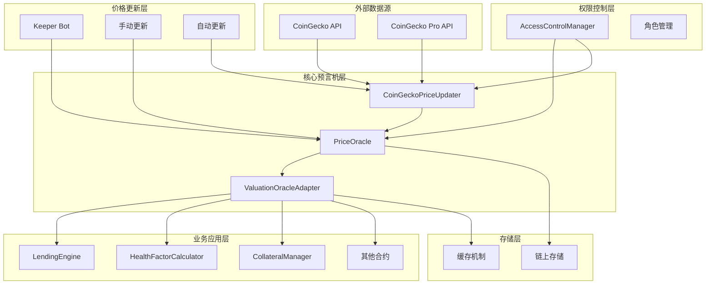
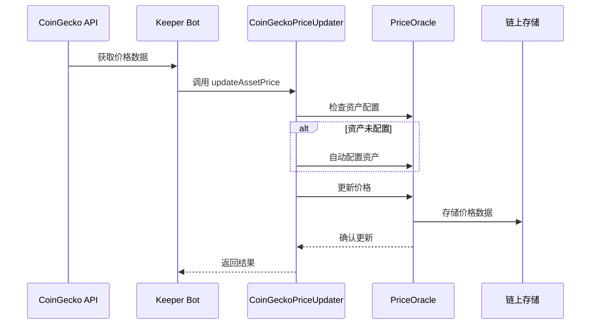
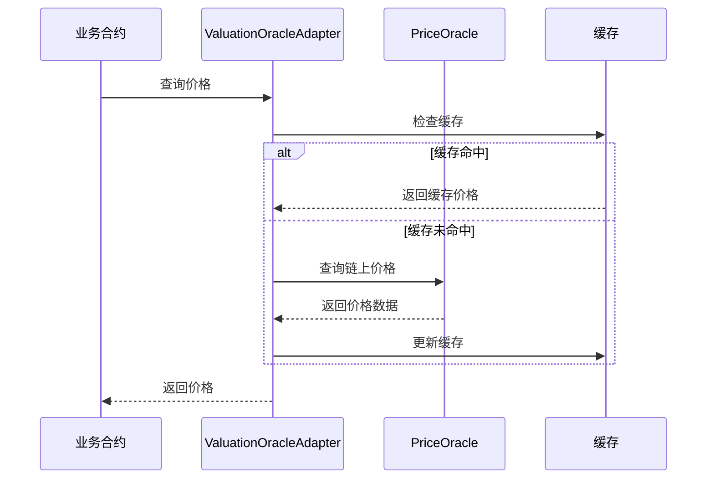

# PriceOracle 价格预言机完整使用指南

> 本文档提供 PriceOracle 价格预言机系统的完整使用指南，包括快速开始、详细集成、最佳实践和故障排除。

## 📋 目录

1. [快速开始](#快速开始)
2. [系统概述](#系统概述)
3. [系统架构](#系统架构)
4. [基础集成](#基础集成)
5. [资产配置](#资产配置)
6. [价格查询](#价格查询)
7. [价格更新](#价格更新)
8. [CoinGecko 集成](#coingecko-集成)
9. [错误处理](#错误处理)
10. [实际应用示例](#实际应用示例)
11. [监控和维护](#监控和维护)
12. [最佳实践](#最佳实践)
13. [故障排除](#故障排除)

---

## 🚀 快速开始

### 5分钟快速上手

#### 1. 基础设置

```typescript
import { ethers } from 'ethers';
import { IPriceOracle__factory } from '../types/contracts/core';

// 合约地址（部署后替换）
const PRICE_ORACLE_ADDRESS = "0x...";
const signer = await ethers.getSigner();

// 创建合约实例
const priceOracle = IPriceOracle__factory.connect(PRICE_ORACLE_ADDRESS, signer);
```

#### 2. 配置资产（一次性操作）

```typescript
// 配置 USDC
await priceOracle.configureAsset(
    "0xA0b86a33E6441b8c4C8C8C8C8C8C8C8C8C8C8C8", // USDC 地址
    "usd-coin",                                    // CoinGecko ID
    6,                                             // 精度
    3600                                           // 1小时过期
);
```

#### 3. 查询价格

```typescript
// 获取价格
const [price, timestamp, decimals] = await priceOracle.getPrice(assetAddress);
const priceUSD = ethers.formatUnits(price, decimals);
console.log(`价格: $${priceUSD}`);
```

#### 4. 更新价格

```typescript
// 更新价格（需要 UPDATE_PRICE 权限）
const price = ethers.parseUnits("1.00", 8); // $1.00
const timestamp = Math.floor(Date.now() / 1000);
await priceOracle.updatePrice(assetAddress, price, timestamp);
```

---

## 系统概述

### 什么是 PriceOracle？

PriceOracle 是一个基于 CoinGecko API 的多资产价格预言机系统，为 RWA 借贷平台提供：

- ✅ **实时价格数据**：支持多资产价格查询
- ✅ **价格验证**：自动检查价格有效性和时效性
- ✅ **批量操作**：支持批量查询和更新
- ✅ **权限控制**：基于 AccessControlManager 的细粒度权限管理
- ✅ **可升级性**：使用 UUPS 代理模式，支持合约升级

### 核心特性

| 特性 | 说明 |
|------|------|
| **多资产支持** | 支持配置和管理多个资产的价格 |
| **价格精度** | 统一使用 8 位小数精度 |
| **时效性验证** | 自动检查价格是否过期 |
| **批量操作** | 支持批量查询和更新价格 |
| **权限控制** | 基于 ActionKeys 的权限管理 |
| **Registry 集成** | 通过 Registry 系统统一管理 |

---

## 系统架构

### 架构概览

PriceOracle 是一个基于 CoinGecko API 的多资产价格预言机系统，采用模块化设计，提供高可用性和可扩展性的价格数据服务。

### 系统架构图



### 核心组件详解

#### 1. PriceOracle（主预言机合约）

**职责**：核心价格数据存储和管理

**核心功能**：
- 价格数据存储和验证
- 资产配置管理
- 价格更新权限控制
- 价格有效性检查

**关键接口**：
```solidity
interface IPriceOracle {
    function getPrice(address asset) external view returns (uint256 price, uint256 timestamp, uint256 decimals);
    function getPrices(address[] calldata assets) external view returns (uint256[] memory prices, uint256[] memory timestamps, uint256[] memory decimalsArray);
    function updatePrice(address asset, uint256 price, uint256 timestamp) external;
    function configureAsset(address asset, string calldata coingeckoId, uint256 decimals, uint256 maxPriceAge) external;
    function isPriceValid(address asset) external view returns (bool);
}
```

#### 2. CoinGeckoPriceUpdater（价格更新器）

**职责**：自动化价格更新和 CoinGecko 集成

**核心功能**：
- 自动配置新资产
- 价格验证和过滤
- 批量价格更新
- 错误处理和重试

**关键接口**：
```solidity
interface ICoinGeckoPriceUpdater {
    function updateAssetPrice(address asset, uint256 price, uint256 timestamp) external;
    function updateAssetPrices(address[] calldata assets, uint256[] calldata prices, uint256[] calldata timestamps) external;
    function configureAsset(address asset, string calldata coingeckoId) external;
}
```

#### 3. ValuationOracleAdapter（估值适配器）

**职责**：为业务合约提供统一的价格查询接口

**核心功能**：
- 价格缓存机制
- 多预言机支持
- 价格聚合
- 降级处理

**关键接口**：
```solidity
interface IValuationOracleAdapter {
    function getAssetPrice(address asset) external view returns (uint256 price, uint256 timestamp);
    function getAssetPrices(address[] calldata assets) external view returns (uint256[] memory prices, uint256[] memory timestamps);
    function isPriceValid(address asset) external view returns (bool);
}
```

### 权限控制架构

#### 角色定义

```solidity
// 核心角色
bytes32 constant ROLE_GOVERNANCE = keccak256("GOVERNANCE_ROLE");
bytes32 constant ROLE_KEEPER = keccak256("KEEPER_ROLE");
bytes32 constant ROLE_UPDATER = keccak256("UPDATER_ROLE");

// 动作权限
bytes32 constant ACTION_UPDATE_PRICE = keccak256("UPDATE_PRICE");
bytes32 constant ACTION_SET_PARAMETER = keccak256("SET_PARAMETER");
bytes32 constant ACTION_ADD_WHITELIST = keccak256("ADD_WHITELIST");
bytes32 constant ACTION_REMOVE_WHITELIST = keccak256("REMOVE_WHITELIST");
bytes32 constant ACTION_UPGRADE_MODULE = keccak256("UPGRADE_MODULE");
```

#### 权限矩阵

| 角色 | 更新价格 | 配置资产 | 添加资产 | 移除资产 | 升级合约 |
|------|----------|----------|----------|----------|----------|
| Governance | ❌ | ✅ | ✅ | ✅ | ✅ |
| Keeper | ✅ | ❌ | ❌ | ❌ | ❌ |
| Updater | ✅ | ❌ | ❌ | ❌ | ❌ |

### 数据流架构

#### 价格更新流程



#### 价格查询流程



### 升级机制

PriceOracle 采用 UUPS（Universal Upgradeable Proxy Standard）升级模式，支持合约逻辑升级而不改变存储地址。

**升级授权**：
```solidity
contract PriceOracle is Initializable, UUPSUpgradeable {
    function _authorizeUpgrade(address newImplementation) internal override {
        acm.requireRole(ActionKeys.ACTION_UPGRADE_MODULE, msg.sender);
        if (newImplementation == address(0)) revert ZeroAddress();
    }
}
```

**升级流程**：
1. **提案阶段**：治理合约创建升级提案
2. **投票阶段**：治理代币持有者投票
3. **执行阶段**：满足条件后执行升级
4. **验证阶段**：验证升级后的合约功能

### 安全机制

#### 1. 价格验证

系统对价格数据进行多重验证：

```solidity
function _validatePrice(uint256 price, uint256 timestamp) internal view {
    if (price == 0) revert PriceOracle__InvalidPrice();
    if (timestamp > block.timestamp) revert PriceOracle__InvalidTimestamp();
    if (block.timestamp - timestamp > maxPriceAge) revert PriceOracle__StalePrice();
}
```

**验证规则**：
- 价格不能为零
- 时间戳不能是未来时间
- 价格年龄不能超过 `maxPriceAge`

#### 2. 权限验证

所有关键操作都通过 AccessControlManager 进行权限验证。

#### 3. 重入攻击防护

使用 OpenZeppelin 的 `ReentrancyGuard` 防止重入攻击。

### 性能优化

#### Gas 优化策略

- **批量操作**：支持批量价格更新和查询，减少交易次数
- **存储优化**：使用紧凑的数据结构（packed storage）
- **缓存机制**：减少重复查询，降低 Gas 消耗

批量查询通过单次调用获取多个资产价格，显著降低 Gas 成本。

### 多链支持

**支持的区块链**：
- Ethereum Mainnet
- Arbitrum One
- Polygon
- Optimism
- Base
- 其他 EVM 兼容链

系统支持跨链价格验证，确保多链部署时价格一致性。

---

## 基础集成

### 合约地址

部署完成后，记录以下合约地址：

```typescript
// 主要合约地址
const PRICE_ORACLE_ADDRESS = "0x...";           // PriceOracle 主合约
const COINGECKO_UPDATER_ADDRESS = "0x...";      // CoinGecko 价格更新器
const REGISTRY_ADDRESS = "0x...";               // Registry 合约
const ACM_ADDRESS = "0x...";                    // 访问控制管理器
```

### 导入接口

```typescript
// TypeScript/JavaScript
import { IPriceOracle__factory } from '../types/contracts/core';
import { ICoinGeckoPriceUpdater__factory } from '../types/contracts/core';

// Solidity
import { IPriceOracle } from "../interfaces/IPriceOracle.sol";
import { ICoinGeckoPriceUpdater } from "../interfaces/ICoinGeckoPriceUpdater.sol";
```

### 合约实例化

```typescript
// 使用 ethers.js
const priceOracle = IPriceOracle__factory.connect(PRICE_ORACLE_ADDRESS, signer);
const coinGeckoUpdater = ICoinGeckoPriceUpdater__factory.connect(COINGECKO_UPDATER_ADDRESS, signer);
```

### Solidity 集成

```solidity
// SPDX-License-Identifier: MIT
pragma solidity ^0.8.20;

import { IPriceOracle } from "../interfaces/IPriceOracle.sol";
import { Registry } from "../registry/Registry.sol";
import { ModuleKeys } from "../constants/ModuleKeys.sol";

contract MyContract {
    Registry public registry;
    
    function getPriceOracle() internal view returns (IPriceOracle) {
        address oracleAddr = registry.getModule(ModuleKeys.KEY_PRICE_ORACLE);
        return IPriceOracle(oracleAddr);
    }
    
    function getAssetPrice(address asset) external view returns (uint256) {
        IPriceOracle oracle = getPriceOracle();
        (uint256 price, , ) = oracle.getPrice(asset);
        return price;
    }
}
```

---

## 资产配置

### 配置新资产

**权限要求**：需要 `ACTION_SET_PARAMETER` 权限

```typescript
/**
 * 配置新资产到预言机系统
 * @param asset 资产合约地址
 * @param coingeckoId CoinGecko API 中的资产ID
 * @param decimals 资产精度
 * @param maxPriceAge 最大价格年龄（秒）
 */
async function configureAsset(
    asset: string,
    coingeckoId: string,
    decimals: number,
    maxPriceAge: number = 3600
) {
    const tx = await priceOracle.configureAsset(
        asset,
        coingeckoId,
        decimals,
        maxPriceAge
    );
    await tx.wait();
    
    console.log(`资产 ${asset} 配置成功`);
}
```

### 配置示例

```typescript
// 配置 USDC
await configureAsset(
    "0xA0b86a33E6441b8c4C8C8C8C8C8C8C8C8C8C8C8C8", // USDC 地址
    "usd-coin",
    6,
    3600 // 1小时过期
);

// 配置 WETH
await configureAsset(
    "0xC02aaA39b223FE8D0A0e5C4F27eAD9083C756Cc2", // WETH 地址
    "weth",
    18,
    3600
);

// 配置 WBTC
await configureAsset(
    "0x2260FAC5E5542a773Aa44fBCfeDf7C193bc2C599", // WBTC 地址
    "wrapped-bitcoin",
    8,
    3600
);
```

### 激活/停用资产

```typescript
// 激活资产
await priceOracle.setAssetActive(assetAddress, true);

// 停用资产
await priceOracle.setAssetActive(assetAddress, false);
```

### 从配置文件加载资产

部署脚本支持从配置文件自动加载资产：

```typescript
import { loadAssetsConfig, configureAssets } from '../utils/configure-assets';

// 从配置文件加载
const assets = loadAssetsConfig('arbitrum-sepolia', 421614);

// 批量配置
await configureAssets(ethers, priceOracleAddress, assets);
```

**配置文件格式** (`scripts/config/assets.arbitrum-sepolia.json`)：

```json
{
  "network": "arbitrum-sepolia",
  "chainId": 421614,
  "assets": [
    {
      "address": "0x75faf114eafb1BDbe2F0316DF893fd58CE46AA4d",
      "coingeckoId": "usd-coin",
      "decimals": 6,
      "maxPriceAge": 3600,
      "active": true
    }
  ]
}
```

---

## 价格查询

### 单个资产价格查询

```typescript
/**
 * 获取单个资产价格
 * @param asset 资产地址
 * @returns {price, timestamp, decimals, priceUSD}
 */
async function getAssetPrice(asset: string) {
    try {
        const [price, timestamp, decimals] = await priceOracle.getPrice(asset);
        
        return {
            price: price.toString(),
            timestamp: timestamp.toString(),
            decimals: decimals.toString(),
            priceUSD: ethers.formatUnits(price, decimals)
        };
    } catch (error) {
        console.error(`获取资产 ${asset} 价格失败:`, error);
        throw error;
    }
}

// 使用示例
const priceData = await getAssetPrice(usdcAddress);
console.log(`USDC 价格: $${priceData.priceUSD}`);
console.log(`更新时间: ${new Date(Number(priceData.timestamp) * 1000).toLocaleString()}`);
```

### 批量价格查询

```typescript
/**
 * 批量获取多个资产价格
 * @param assets 资产地址数组
 * @returns 价格数据数组
 */
async function getAssetPrices(assets: string[]) {
    try {
        const [prices, timestamps, decimals] = await priceOracle.getPrices(assets);
        
        return assets.map((asset, index) => ({
            asset,
            price: prices[index].toString(),
            timestamp: timestamps[index].toString(),
            decimals: decimals[index].toString(),
            priceUSD: ethers.formatUnits(prices[index], decimals[index])
        }));
    } catch (error) {
        console.error("批量获取价格失败:", error);
        throw error;
    }
}

// 使用示例
const assets = [usdcAddress, wethAddress, wbtcAddress];
const prices = await getAssetPrices(assets);
prices.forEach(({ asset, priceUSD }) => {
    console.log(`${asset}: $${priceUSD}`);
});
```

### 价格有效性检查

```typescript
/**
 * 检查价格是否有效
 * @param asset 资产地址
 * @returns 价格是否有效
 */
async function isPriceValid(asset: string): Promise<boolean> {
    try {
        return await priceOracle.isPriceValid(asset);
    } catch (error) {
        console.error(`检查资产 ${asset} 价格有效性失败:`, error);
        return false;
    }
}
```

### 获取完整价格数据

```typescript
/**
 * 获取完整价格数据（包括有效性标志）
 * @param asset 资产地址
 * @returns 完整价格数据
 */
async function getPriceData(asset: string) {
    try {
        const priceData = await priceOracle.getPriceData(asset);
        return {
            price: priceData.price.toString(),
            timestamp: priceData.timestamp.toString(),
            decimals: priceData.decimals.toString(),
            isValid: priceData.isValid,
            priceUSD: ethers.formatUnits(priceData.price, priceData.decimals)
        };
    } catch (error) {
        console.error(`获取资产 ${asset} 价格数据失败:`, error);
        throw error;
    }
}
```

### 获取资产配置

```typescript
/**
 * 获取资产配置信息
 * @param asset 资产地址
 * @returns 资产配置
 */
async function getAssetConfig(asset: string) {
    try {
        const config = await priceOracle.getAssetConfig(asset);
        return {
            coingeckoId: config.coingeckoId,
            decimals: config.decimals.toString(),
            isActive: config.isActive,
            maxPriceAge: config.maxPriceAge.toString()
        };
    } catch (error) {
        console.error(`获取资产 ${asset} 配置失败:`, error);
        throw error;
    }
}
```

### 查询支持的资产

```typescript
/**
 * 获取所有支持的资产列表
 * @returns 资产地址数组
 */
async function getSupportedAssets(): Promise<string[]> {
    try {
        return await priceOracle.getSupportedAssets();
    } catch (error) {
        console.error("获取支持的资产列表失败:", error);
        throw error;
    }
}
```

---

## 价格更新

### 手动更新价格

**权限要求**：需要 `ACTION_UPDATE_PRICE` 权限

```typescript
/**
 * 手动更新资产价格
 * @param asset 资产地址
 * @param price 新价格（8位精度）
 * @param timestamp 价格时间戳
 */
async function updateAssetPrice(
    asset: string,
    price: bigint,
    timestamp: number
) {
    const tx = await priceOracle.updatePrice(asset, price, timestamp);
    await tx.wait();
    
    console.log(`资产 ${asset} 价格更新成功`);
}

// 使用示例
const price = ethers.parseUnits("1.00", 8); // $1.00 (8位精度)
const timestamp = Math.floor(Date.now() / 1000);
await updateAssetPrice(usdcAddress, price, timestamp);
```

### 批量更新价格

```typescript
/**
 * 批量更新多个资产价格
 * @param assets 资产地址数组
 * @param prices 价格数组（8位精度）
 * @param timestamps 时间戳数组
 */
async function updateAssetPrices(
    assets: string[],
    prices: bigint[],
    timestamps: number[]
) {
    if (assets.length !== prices.length || assets.length !== timestamps.length) {
        throw new Error("数组长度不匹配");
    }
    
    const tx = await priceOracle.updatePrices(assets, prices, timestamps);
    await tx.wait();
    
    console.log("批量价格更新成功");
}

// 使用示例
const assets = [usdcAddress, wethAddress];
const prices = [
    ethers.parseUnits("1.00", 8),  // USDC: $1.00
    ethers.parseUnits("2000.00", 8) // WETH: $2000.00
];
const timestamps = [
    Math.floor(Date.now() / 1000),
    Math.floor(Date.now() / 1000)
];
await updateAssetPrices(assets, prices, timestamps);
```

---

## CoinGecko 集成

### 使用 CoinGeckoPriceUpdater

CoinGeckoPriceUpdater 提供了从 CoinGecko API 自动获取和更新价格的功能。

#### 更新单个资产价格

```typescript
/**
 * 通过 CoinGecko 更新器更新价格
 * @param asset 资产地址
 * @param price 新价格
 * @param timestamp 时间戳
 */
async function updateViaCoinGecko(
    asset: string,
    price: bigint,
    timestamp: number
) {
    const tx = await coinGeckoUpdater.updateAssetPrice(asset, price, timestamp);
    await tx.wait();
    
    console.log(`通过 CoinGecko 更新器更新 ${asset} 价格成功`);
}
```

#### 批量更新价格

```typescript
/**
 * 批量更新多个资产价格（通过 CoinGecko）
 * @param assets 资产地址数组
 * @param prices 价格数组
 * @param timestamps 时间戳数组
 */
async function batchUpdateViaCoinGecko(
    assets: string[],
    prices: bigint[],
    timestamps: number[]
) {
    const tx = await coinGeckoUpdater.updateAssetPrices(
        assets,
        prices,
        timestamps
    );
    await tx.wait();
    
    console.log("批量价格更新成功");
}
```

### 权限配置

确保 CoinGeckoPriceUpdater 具有更新价格的权限：

```typescript
import { ActionKeys } from '../constants/ActionKeys.sol';

// 授予更新价格权限
await acm.grantRole(ActionKeys.ACTION_UPDATE_PRICE, coinGeckoUpdaterAddress);
```

---

## 错误处理

### 常见错误类型

```typescript
// 错误类型定义
enum PriceOracleErrors {
    ASSET_NOT_SUPPORTED = "PriceOracle__AssetNotSupported",
    STALE_PRICE = "PriceOracle__StalePrice",
    INVALID_PRICE = "PriceOracle__InvalidPrice",
    ZERO_ADDRESS = "ZeroAddress",
    UNAUTHORIZED = "PriceOracle__Unauthorized",
    ASSET_ALREADY_SUPPORTED = "PriceOracle__AssetAlreadySupported"
}
```

### 错误处理函数

```typescript
/**
 * 处理价格预言机错误
 * @param error 错误对象
 * @param asset 资产地址
 */
async function handlePriceOracleError(error: any, asset: string) {
    if (error.message.includes(PriceOracleErrors.ASSET_NOT_SUPPORTED)) {
        console.error(`资产 ${asset} 未在预言机中配置`);
        // 可以尝试自动配置资产
        await tryConfigureAsset(asset);
    } else if (error.message.includes(PriceOracleErrors.STALE_PRICE)) {
        console.error(`资产 ${asset} 价格已过期`);
        // 可以尝试更新价格
        await tryUpdatePrice(asset);
    } else if (error.message.includes(PriceOracleErrors.INVALID_PRICE)) {
        console.error(`资产 ${asset} 价格无效`);
    } else if (error.message.includes(PriceOracleErrors.UNAUTHORIZED)) {
        console.error("权限不足，需要相应角色");
    } else {
        console.error("未知错误:", error);
    }
}
```

### 安全的价格查询函数

```typescript
/**
 * 安全的价格查询（带错误处理）
 * @param asset 资产地址
 * @returns 价格数据或 null
 */
async function safeGetPrice(asset: string) {
    try {
        return await getAssetPrice(asset);
    } catch (error) {
        await handlePriceOracleError(error, asset);
        return null;
    }
}
```

### 重试机制

```typescript
/**
 * 带重试的价格查询
 * @param asset 资产地址
 * @param maxRetries 最大重试次数
 * @returns 价格数据
 */
async function getPriceWithRetry(asset: string, maxRetries: number = 3) {
    for (let i = 0; i < maxRetries; i++) {
        try {
            return await getAssetPrice(asset);
        } catch (error) {
            console.warn(`第 ${i + 1} 次尝试失败:`, error);
            
            if (i === maxRetries - 1) {
                throw error;
            }
            
            // 等待后重试（指数退避）
            await new Promise(resolve => setTimeout(resolve, 1000 * (i + 1)));
        }
    }
}
```

---

## 实际应用示例

### 借贷合约集成

```solidity
// SPDX-License-Identifier: MIT
pragma solidity ^0.8.20;

import { IPriceOracle } from "../interfaces/IPriceOracle.sol";
import { Registry } from "../registry/Registry.sol";
import { ModuleKeys } from "../constants/ModuleKeys.sol";

contract LendingContract {
    Registry public registry;
    
    constructor(address _registry) {
        registry = Registry(_registry);
    }
    
    /**
     * 计算抵押品价值
     * @param asset 资产地址
     * @param amount 资产数量
     * @return 价值（USD，8位精度）
     */
    function calculateCollateralValue(address asset, uint256 amount) 
        external 
        view 
        returns (uint256) 
    {
        IPriceOracle oracle = IPriceOracle(
            registry.getModule(ModuleKeys.KEY_PRICE_ORACLE)
        );
        
        (uint256 price, , uint256 decimals) = oracle.getPrice(asset);
        
        // 计算价值：amount * price / 10^decimals
        return (amount * price) / (10 ** decimals);
    }
    
    /**
     * 检查清算条件
     * @param collateralAsset 抵押品资产
     * @param collateralAmount 抵押品数量
     * @param debtAmount 债务金额
     * @return 是否需要清算
     */
    function shouldLiquidate(
        address collateralAsset,
        uint256 collateralAmount,
        uint256 debtAmount
    ) external view returns (bool) {
        uint256 collateralValue = this.calculateCollateralValue(
            collateralAsset, 
            collateralAmount
        );
        
        // 假设清算阈值为 150%
        uint256 liquidationThreshold = (debtAmount * 150) / 100;
        
        return collateralValue < liquidationThreshold;
    }
}
```

### 前端集成示例

#### React Hook

```typescript
import { useState, useEffect } from 'react';
import { ethers } from 'ethers';

export function usePriceOracle(assetAddress: string) {
    const [price, setPrice] = useState<string>('0');
    const [loading, setLoading] = useState<boolean>(true);
    const [error, setError] = useState<string>('');

    useEffect(() => {
        let mounted = true;

        async function fetchPrice() {
            try {
                setLoading(true);
                setError('');

                const priceData = await getAssetPrice(assetAddress);
                
                if (mounted) {
                    setPrice(priceData.priceUSD);
                }
            } catch (err: any) {
                if (mounted) {
                    setError(err.message);
                }
            } finally {
                if (mounted) {
                    setLoading(false);
                }
            }
        }

        fetchPrice();

        // 每30秒更新一次价格
        const interval = setInterval(fetchPrice, 30000);

        return () => {
            mounted = false;
            clearInterval(interval);
        };
    }, [assetAddress]);

    return { price, loading, error };
}

// 使用示例
function AssetPriceDisplay({ assetAddress }: { assetAddress: string }) {
    const { price, loading, error } = usePriceOracle(assetAddress);

    if (loading) return <div>加载中...</div>;
    if (error) return <div>错误: {error}</div>;

    return <div>价格: ${price}</div>;
}
```

#### 价格监控组件

```typescript
/**
 * 价格监控组件
 */
function PriceMonitor({ assets }: { assets: string[] }) {
    const [prices, setPrices] = useState<Record<string, string>>({});

    useEffect(() => {
        async function updatePrices() {
            const priceData = await getAssetPrices(assets);
            const priceMap: Record<string, string> = {};
            
            priceData.forEach(({ asset, priceUSD }) => {
                priceMap[asset] = priceUSD;
            });
            
            setPrices(priceMap);
        }

        updatePrices();
        const interval = setInterval(updatePrices, 30000);

        return () => clearInterval(interval);
    }, [assets]);

    return (
        <div>
            {assets.map(asset => (
                <div key={asset}>
                    {asset}: ${prices[asset] || '加载中...'}
                </div>
            ))}
        </div>
    );
}
```

---

## 监控和维护

### 价格监控

```typescript
/**
 * 监控价格变化
 * @param assets 要监控的资产列表
 * @param callback 价格变化回调
 * @returns 停止监控的函数
 */
function monitorPrices(
    assets: string[], 
    callback: (asset: string, price: string) => void
) {
    const interval = setInterval(async () => {
        for (const asset of assets) {
            try {
                const priceData = await getAssetPrice(asset);
                callback(asset, priceData.priceUSD);
            } catch (error) {
                console.error(`监控资产 ${asset} 失败:`, error);
            }
        }
    }, 30000); // 每30秒检查一次

    return () => clearInterval(interval);
}

// 使用示例
const stopMonitoring = monitorPrices(
    [usdcAddress, wethAddress],
    (asset, price) => {
        console.log(`${asset}: $${price}`);
        // 发送通知或更新UI
    }
);

// 停止监控
// stopMonitoring();
```

### 健康检查

```typescript
/**
 * 检查预言机系统健康状态
 * @returns 健康状态报告
 */
async function checkOracleHealth() {
    const report = {
        timestamp: Date.now(),
        status: 'healthy',
        issues: [] as string[],
        assets: {} as Record<string, any>
    };

    try {
        // 获取支持的资产列表
        const supportedAssets = await priceOracle.getSupportedAssets();
        
        for (const asset of supportedAssets) {
            try {
                const isValid = await priceOracle.isPriceValid(asset);
                const [price, timestamp] = await priceOracle.getPrice(asset);
                const config = await priceOracle.getAssetConfig(asset);
                
                const priceAge = Date.now() / 1000 - Number(timestamp);
                
                report.assets[asset] = {
                    isValid,
                    price: price.toString(),
                    timestamp: timestamp.toString(),
                    age: priceAge,
                    maxAge: config.maxPriceAge.toString(),
                    isActive: config.isActive
                };

                if (!isValid) {
                    report.issues.push(`资产 ${asset} 价格无效`);
                    report.status = 'warning';
                }
                
                if (priceAge > Number(config.maxPriceAge)) {
                    report.issues.push(`资产 ${asset} 价格已过期 (${priceAge}秒)`);
                    report.status = 'warning';
                }
            } catch (error: any) {
                report.issues.push(`资产 ${asset} 查询失败: ${error.message}`);
                report.status = 'error';
            }
        }
    } catch (error: any) {
        report.issues.push(`系统检查失败: ${error.message}`);
        report.status = 'error';
    }

    return report;
}

// 使用示例
const healthReport = await checkOracleHealth();
console.log('健康状态:', healthReport.status);
console.log('问题列表:', healthReport.issues);
```

---

## 最佳实践

### 1. 性能优化

#### 缓存价格数据

```typescript
// 简单的内存缓存
const priceCache = new Map<string, { price: string; timestamp: number; expiry: number }>();

async function getCachedPrice(asset: string, maxAge: number = 60) {
    const cached = priceCache.get(asset);
    const now = Date.now() / 1000;
    
    if (cached && (now - cached.timestamp) < maxAge) {
        return cached.price;
    }
    
    const priceData = await getAssetPrice(asset);
    priceCache.set(asset, {
        price: priceData.priceUSD,
        timestamp: Number(priceData.timestamp),
        expiry: now + maxAge
    });
    
    return priceData.priceUSD;
}
```

#### 批量操作

```typescript
// ✅ 正确：使用批量查询
const prices = await getAssetPrices([asset1, asset2, asset3]);

// ❌ 错误：逐个查询
const price1 = await getAssetPrice(asset1);
const price2 = await getAssetPrice(asset2);
const price3 = await getAssetPrice(asset3);
```

### 2. 安全考虑

#### 权限验证

```typescript
// 确保只有授权用户才能更新价格
import { ActionKeys } from '../constants/ActionKeys.sol';

// 检查权限
const hasPermission = await acm.hasRole(
    ActionKeys.ACTION_UPDATE_PRICE, 
    updaterAddress
);

if (!hasPermission) {
    throw new Error("无权限更新价格");
}
```

#### 价格验证

```typescript
/**
 * 验证价格是否在合理范围内
 * @param asset 资产地址
 * @param newPrice 新价格
 * @param maxDeviation 最大偏差（百分比，基点）
 */
async function validatePrice(
    asset: string,
    newPrice: bigint,
    maxDeviation: number = 1000 // 10%
): Promise<boolean> {
    try {
        const [currentPrice] = await priceOracle.getPrice(asset);
        
        // 计算偏差
        const deviation = Number(newPrice - currentPrice) / Number(currentPrice) * 10000;
        
        if (Math.abs(deviation) > maxDeviation) {
            console.warn(`价格偏差过大: ${deviation / 100}%`);
            return false;
        }
        
        return true;
    } catch (error) {
        console.error("价格验证失败:", error);
        return false;
    }
}
```

### 3. 错误处理

#### 优雅降级

```typescript
/**
 * 带降级的价格查询
 * @param asset 资产地址
 * @param fallbackPrice 备用价格
 */
async function getPriceWithFallback(asset: string, fallbackPrice: string) {
    try {
        const priceData = await getAssetPrice(asset);
        return priceData.priceUSD;
    } catch (error) {
        console.warn("价格查询失败，使用备用价格:", error);
        return fallbackPrice;
    }
}
```

### 4. 监控建议

#### 价格偏差监控

```typescript
/**
 * 监控价格变化幅度
 * @param asset 资产地址
 * @param threshold 阈值（百分比）
 */
async function monitorPriceDeviation(asset: string, threshold: number = 5) {
    let lastPrice: string | null = null;
    
    return setInterval(async () => {
        try {
            const priceData = await getAssetPrice(asset);
            const currentPrice = priceData.priceUSD;
            
            if (lastPrice) {
                const deviation = Math.abs(
                    (Number(currentPrice) - Number(lastPrice)) / Number(lastPrice) * 100
                );
                
                if (deviation > threshold) {
                    console.warn(`价格大幅波动: ${deviation.toFixed(2)}%`);
                    // 发送告警
                }
            }
            
            lastPrice = currentPrice;
        } catch (error) {
            console.error("价格监控失败:", error);
        }
    }, 60000); // 每分钟检查一次
}
```

---

## 故障排除

### 常见问题

#### Q1: 价格查询返回 "AssetNotSupported" 错误

**症状**：调用 `getPrice` 时返回资产不支持错误

**原因**：
- 资产未在预言机中配置
- 资产已被停用

**解决方案**：
```typescript
// 1. 检查资产是否支持
const isSupported = await priceOracle.isAssetSupported(assetAddress);
console.log("资产是否支持:", isSupported);

// 2. 检查资产配置
const config = await priceOracle.getAssetConfig(assetAddress);
console.log("资产配置:", config);

// 3. 如果未配置，配置资产
if (!isSupported) {
    await configureAsset(assetAddress, "usd-coin", 6, 3600);
}

// 4. 如果已停用，激活资产
if (!config.isActive) {
    await priceOracle.setAssetActive(assetAddress, true);
}
```

#### Q2: 价格查询返回 "StalePrice" 错误

**症状**：价格已过期

**原因**：
- 价格更新时间超过 `maxPriceAge`
- 价格长时间未更新

**解决方案**：
```typescript
// 1. 检查价格年龄
const [price, timestamp] = await priceOracle.getPrice(assetAddress);
const config = await priceOracle.getAssetConfig(assetAddress);
const priceAge = Date.now() / 1000 - Number(timestamp);

console.log(`价格年龄: ${priceAge}秒，最大年龄: ${config.maxPriceAge}秒`);

// 2. 更新价格
const newPrice = ethers.parseUnits("1.00", 8);
await priceOracle.updatePrice(assetAddress, newPrice, Math.floor(Date.now() / 1000));

// 3. 或调整 maxPriceAge（如果需要）
await priceOracle.configureAsset(
    assetAddress,
    config.coingeckoId,
    config.decimals,
    7200 // 增加到2小时
);
```

#### Q3: 权限不足错误

**症状**：调用更新或配置函数时返回权限错误

**原因**：调用者没有相应的权限

**解决方案**：
```typescript
import { ActionKeys } from '../constants/ActionKeys.sol';

// 1. 检查权限
const hasUpdatePermission = await acm.hasRole(
    ActionKeys.ACTION_UPDATE_PRICE,
    updaterAddress
);

const hasConfigPermission = await acm.hasRole(
    ActionKeys.ACTION_SET_PARAMETER,
    configAddress
);

// 2. 授予权限（需要 Owner）
if (!hasUpdatePermission) {
    await acm.grantRole(ActionKeys.ACTION_UPDATE_PRICE, updaterAddress);
}

if (!hasConfigPermission) {
    await acm.grantRole(ActionKeys.ACTION_SET_PARAMETER, configAddress);
}
```

#### Q4: 价格更新失败

**症状**：调用 `updatePrice` 失败

**排查步骤**：
1. 检查权限
2. 检查价格格式（必须是8位精度）
3. 检查时间戳（不能是未来时间）
4. 检查资产是否已配置

**解决方案**：
```typescript
async function safeUpdatePrice(
    asset: string,
    priceUSD: string
) {
    try {
        // 1. 检查权限
        const hasPermission = await acm.hasRole(
            ActionKeys.ACTION_UPDATE_PRICE,
            signer.address
        );
        
        if (!hasPermission) {
            throw new Error("无权限更新价格");
        }
        
        // 2. 检查资产是否支持
        const isSupported = await priceOracle.isAssetSupported(asset);
        if (!isSupported) {
            throw new Error("资产未配置");
        }
        
        // 3. 格式化价格（8位精度）
        const price = ethers.parseUnits(priceUSD, 8);
        const timestamp = Math.floor(Date.now() / 1000);
        
        // 4. 更新价格
        const tx = await priceOracle.updatePrice(asset, price, timestamp);
        await tx.wait();
        
        console.log("价格更新成功");
    } catch (error) {
        console.error("价格更新失败:", error);
        throw error;
    }
}
```

### 调试技巧

```typescript
// 启用详细日志
const DEBUG = true;

function log(...args: any[]) {
    if (DEBUG) {
        console.log('[PriceOracle]', ...args);
    }
}

// 在价格查询函数中添加日志
async function getAssetPriceWithLog(asset: string) {
    log(`查询资产 ${asset} 价格`);
    
    try {
        // 检查资产配置
        const config = await priceOracle.getAssetConfig(asset);
        log("资产配置:", config);
        
        // 查询价格
        const result = await getAssetPrice(asset);
        log("查询成功:", result);
        
        return result;
    } catch (error: any) {
        log("查询失败:", error.message);
        log("错误堆栈:", error.stack);
        throw error;
    }
}
```

---

## 权限配置

### 部署后权限设置

部署完成后，需要配置以下权限：

```typescript
import { ActionKeys } from '../constants/ActionKeys.sol';

// 1. 为 CoinGeckoPriceUpdater 授予更新价格权限
const UPDATE_PRICE_ROLE = ActionKeys.ACTION_UPDATE_PRICE;
await acm.grantRole(UPDATE_PRICE_ROLE, coinGeckoUpdaterAddress);

// 2. 为管理员授予配置权限
const SET_PARAMETER_ROLE = ActionKeys.ACTION_SET_PARAMETER;
await acm.grantRole(SET_PARAMETER_ROLE, adminAddress);

// 3. 为白名单管理器授予权限
const ADD_WHITELIST_ROLE = ActionKeys.ACTION_ADD_WHITELIST;
await acm.grantRole(ADD_WHITELIST_ROLE, whitelistManagerAddress);
```

---

## 相关文档

- [PriceOracle 合约源码](../src/core/PriceOracle.sol)
- [CoinGeckoPriceUpdater 合约源码](../src/core/CoinGeckoPriceUpdater.sol)
- [IPriceOracle 接口](../src/interfaces/IPriceOracle.sol)
- [权限管理指南](./permission-management-guide.md)
- [Registry 系统文档](../docs/registry-deployment.md)
- [测试文件](../test/core/PriceOracle.test.ts)

---

## 总结

通过本指南，您可以：

1. ✅ 快速集成 PriceOracle 到您的应用
2. ✅ 正确配置和管理支持的资产
3. ✅ 查询和更新价格数据
4. ✅ 处理各种错误情况
5. ✅ 监控和维护系统健康
6. ✅ 遵循最佳实践和安全建议

---

**版本**: 2.0.0  
**最后更新**: 2025年1月  
**维护者**: RWA Lending Platform Team

