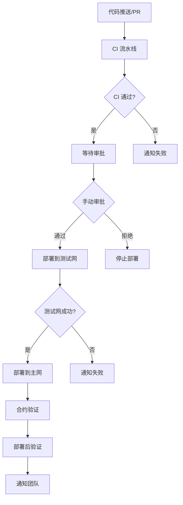

# CI/CD 流水线文档

## 概述

本项目采用分离式的 CI/CD 架构，将代码质量检查和部署流程分开管理，提供更好的安全性、灵活性和可维护性。

## 架构设计

### 1. CI 流水线 (`ci.yml`)
专注于代码质量、测试和安全检查，为开发者提供快速反馈。

### 2. 部署流水线 (`deploy.yml`)
专注于部署和通知，只在 CI 成功后触发，避免资源浪费。

## 工作流程



## CI 流水线详情

### 触发条件
- 推送到 `main`、`develop`、`feature/*` 分支
- 创建 Pull Request 到 `main`、`develop` 分支

### 执行任务

#### 1. 测试矩阵 (test-matrix)
- **并行测试**: Node.js 16.x, 18.x, 20.x
- **操作系统**: Ubuntu Latest
- **任务**: 编译、测试、上传结果

#### 2. 代码质量检查 (code-quality)
- **依赖**: test-matrix 成功
- **任务**: 
  - Solidity 格式化检查
  - JavaScript 格式化检查
  - Solhint 静态分析
  - ESLint 代码检查

#### 3. 安全审计 (security-audit)
- **依赖**: test-matrix 成功
- **任务**:
  - Slither 安全分析
  - Mythril 符号执行分析
  - 上传安全报告

#### 4. 测试覆盖率 (coverage)
- **依赖**: test-matrix 成功
- **任务**:
  - 运行覆盖率测试
  - 上传到 Codecov
  - 保存覆盖率报告

#### 5. Gas 报告 (gas-report)
- **触发**: 仅主分支推送
- **任务**: 生成 Gas 使用报告

#### 6. 依赖安全扫描 (dependency-scan)
- **任务**:
  - npm audit 检查
  - Snyk 安全扫描

#### 7. CI 总结 (ci-summary)
- **依赖**: 所有任务完成
- **任务**: 生成总结报告，PR 评论

## 部署流水线详情

### 触发条件
- CI 流水线成功完成
- 手动触发 (workflow_dispatch)

### 环境配置

#### 测试网环境 (testnet)
- **审批要求**: 1 个审核者
- **状态检查**: CI 流水线必须通过
- **变量**: 
  - 以太坊测试网: SEPOLIA_URL, HOLESKY_URL
  - 二层网络测试网: ARBITRUM_SEPOLIA_URL, OPTIMISM_SEPOLIA_URL, POLYGON_ZKEVM_TESTNET_URL, BASE_SEPOLIA_URL, LINEA_SEPOLIA_URL, SCROLL_SEPOLIA_URL, ZKSYNC_ERA_SEPOLIA_URL, MANTLE_SEPOLIA_URL, MANTA_SEPOLIA_URL
  - 通用: PRIVATE_KEY, ETHERSCAN_API_KEY

#### 生产环境 (production)
- **审批要求**: 2 个审核者 + 代码所有者
- **状态检查**: CI + 部署流水线必须通过
- **变量**:
  - 以太坊主网: MAINNET_URL
  - 二层网络主网: ARBITRUM_URL, OPTIMISM_URL, POLYGON_ZKEVM_URL, BASE_URL, LINEA_URL, SCROLL_URL, ZKSYNC_ERA_URL, MANTLE_URL, MANTA_URL
  - 通用: MAINNET_PRIVATE_KEY, ETHERSCAN_API_KEY

### 支持的网络

#### 以太坊网络 (L1)
- **主网**: Ethereum Mainnet (Chain ID: 1)
- **测试网**: Sepolia (Chain ID: 11155111), Holesky (Chain ID: 17000)

#### 二层网络 (L2)
- **Arbitrum**: 主网 (Chain ID: 42161), Sepolia (Chain ID: 421614)
- **Optimism**: 主网 (Chain ID: 10), Sepolia (Chain ID: 11155420)
- **Polygon zkEVM**: 主网 (Chain ID: 1101), 测试网 (Chain ID: 1442)
- **Base**: 主网 (Chain ID: 8453), Sepolia (Chain ID: 84532)
- **Linea**: 主网 (Chain ID: 59144), Sepolia (Chain ID: 59141)
- **Scroll**: 主网 (Chain ID: 534352), Sepolia (Chain ID: 534351)
- **zkSync Era**: 主网 (Chain ID: 324), Sepolia (Chain ID: 300)
- **Mantle**: 主网 (Chain ID: 5000), Sepolia (Chain ID: 5003)
- **Manta**: 主网 (Chain ID: 169), Sepolia (Chain ID: 3441005)

### 执行任务

#### 1. 环境审批 (approve-deployment)
- **条件**: CI 成功或手动要求审批
- **任务**: 等待手动审批

#### 2. 测试网部署 (deploy-testnet)
- **依赖**: 审批通过
- **任务**:
  - 部署到 Sepolia
  - Etherscan 验证
  - 上传部署产物

#### 3. 主网部署 (deploy-mainnet)
- **依赖**: 审批通过 + 测试网成功
- **条件**: 手动选择主网部署
- **任务**:
  - 部署到以太坊主网
  - Etherscan 验证
  - 上传部署产物

#### 4. 部署后验证 (post-deployment-verification)
- **依赖**: 部署任务完成
- **任务**: 验证部署的合约功能

#### 5. 通知团队 (notify-team)
- **依赖**: 所有部署任务
- **任务**:
  - 生成部署报告
  - Slack 通知
  - 创建部署 Issue

#### 6. 失败处理 (handle-deployment-failure)
- **触发**: 部署失败
- **任务**:
  - 创建警报 Issue
  - Slack 紧急通知

## 安全特性

### 1. 权限分离
- CI 流水线: 无需部署密钥
- 部署流水线: 需要高权限密钥

### 2. 环境保护
- 测试网: 基础保护规则
- 主网: 严格保护规则

### 3. 审批机制
- 手动审批步骤
- 多审核者要求
- 代码所有者审查

### 4. 密钥管理
- 使用 GitHub Secrets
- 环境隔离
- 最小权限原则

## 配置要求

### GitHub Secrets
```bash
# 以太坊网络
SEPOLIA_URL=https://sepolia.infura.io/v3/YOUR_PROJECT_ID
MAINNET_URL=https://mainnet.infura.io/v3/YOUR_PROJECT_ID
HOLESKY_URL=https://holesky.infura.io/v3/YOUR_PROJECT_ID

# Arbitrum 网络
ARBITRUM_URL=https://arbitrum-mainnet.infura.io/v3/YOUR_PROJECT_ID
ARBITRUM_SEPOLIA_URL=https://arbitrum-sepolia.infura.io/v3/YOUR_PROJECT_ID

# Optimism 网络
OPTIMISM_URL=https://optimism-mainnet.infura.io/v3/YOUR_PROJECT_ID
OPTIMISM_SEPOLIA_URL=https://optimism-sepolia.infura.io/v3/YOUR_PROJECT_ID

# Polygon zkEVM 网络
POLYGON_ZKEVM_URL=https://polygon-zkevm-mainnet.infura.io/v3/YOUR_PROJECT_ID
POLYGON_ZKEVM_TESTNET_URL=https://polygon-zkevm-testnet.infura.io/v3/YOUR_PROJECT_ID

# Base 网络
BASE_URL=https://base-mainnet.infura.io/v3/YOUR_PROJECT_ID
BASE_SEPOLIA_URL=https://base-sepolia.infura.io/v3/YOUR_PROJECT_ID

# Linea 网络
LINEA_URL=https://linea-mainnet.infura.io/v3/YOUR_PROJECT_ID
LINEA_SEPOLIA_URL=https://linea-sepolia.infura.io/v3/YOUR_PROJECT_ID

# Scroll 网络
SCROLL_URL=https://scroll-mainnet.infura.io/v3/YOUR_PROJECT_ID
SCROLL_SEPOLIA_URL=https://scroll-sepolia.infura.io/v3/YOUR_PROJECT_ID

# zkSync Era 网络
ZKSYNC_ERA_URL=https://mainnet.era.zksync.io
ZKSYNC_ERA_SEPOLIA_URL=https://sepolia.era.zksync.io

# Mantle 网络
MANTLE_URL=https://rpc.mantle.xyz
MANTLE_SEPOLIA_URL=https://rpc.sepolia.mantle.xyz

# Manta 网络
MANTA_URL=https://pacific-rpc.manta.network
MANTA_SEPOLIA_URL=https://pacific-rpc.sepolia.manta.network

# 私钥 (永远不要提交真实的私钥!)
PRIVATE_KEY=your_testnet_private_key
MAINNET_PRIVATE_KEY=your_mainnet_private_key

# API 密钥
ETHERSCAN_API_KEY=your_etherscan_api_key

# 通知
SLACK_WEBHOOK=your_slack_webhook_url

# 审批
APPROVAL_SECRET=your_approval_secret
APPROVERS=username1,username2

# 安全扫描
SNYK_TOKEN=your_snyk_token
```

### 环境配置
- 在 GitHub 仓库设置中配置环境
- 设置保护规则
- 配置环境变量

## 使用指南

### 开发流程
1. 创建功能分支
2. 推送代码触发 CI
3. 创建 PR 到主分支
4. CI 自动运行并评论结果
5. 代码审查通过后合并

### 部署流程
1. 代码合并到主分支
2. CI 流水线自动运行
3. CI 成功后触发部署审批
4. 审核者审批通过
5. 自动部署到测试网
6. 手动选择是否部署到主网

### 手动部署
1. 在 Actions 页面选择 "Deploy - Production & Testnet"
2. 选择部署环境 (testnet/mainnet)
3. 选择是否需要手动审批
4. 点击 "Run workflow"

## 监控和故障排除

### 监控指标
- CI 成功率
- 部署成功率
- 测试覆盖率
- 安全扫描结果
- Gas 使用情况

### 常见问题
1. **CI 失败**: 检查测试、格式、安全扫描结果
2. **部署失败**: 检查网络配置、密钥、Gas 费用
3. **审批卡住**: 联系审核者或检查权限设置
4. **验证失败**: 检查合约代码和网络配置

### 日志查看
- GitHub Actions 页面查看详细日志
- 下载构建产物进行分析
- 查看部署报告和通知

## 最佳实践

### 开发阶段
- 本地运行测试和格式化检查
- 使用 `npm run ci:*` 脚本验证
- 关注 CI 反馈及时修复问题

### 部署阶段
- 先在测试网验证功能
- 确认测试网稳定后再部署主网
- 监控部署后的合约状态

### 安全考虑
- 定期更新依赖
- 关注安全扫描结果
- 及时修复安全漏洞
- 备份重要密钥

## 扩展和定制

### 添加新的检查
1. 在 `ci.yml` 中添加新的 job
2. 更新依赖关系
3. 修改总结报告

### 添加新的部署环境
1. 创建环境配置文件
2. 在 `deploy.yml` 中添加部署 job
3. 配置相应的密钥和变量

### 自定义通知
1. 修改通知脚本
2. 添加新的通知渠道
3. 自定义通知内容格式 

## 本地静态分析流程

为确保提交前即可发现常见安全隐患，建议开发者在本地或 CI 运行以下两种分析工具：

### 1. Hardhat + Remix-Analyzer（轻量，开发期）

```bash
# 安装依赖（仅一次）
npm i -D hardhat-remix-analyzer @dteam/st2 @remix-project/remix-analyzer fast-levenshtein

# hardhat.config.js 顶部添加
require("hardhat-remix-analyzer");

# 执行分析
npx hardhat analyze
```

> 该插件复用 Remix IDE 的 20+ 规则，输出 JSON / 控制台报告，可快速发现 `tx.origin`、重入、block.timestamp 等问题。

### 2. Slither（深度，CI / 安审阶段）

```bash
# Mac / Linux 安装
pip3 install slither-analyzer          # 或 brew install slither

# 运行（项目根目录）
slither .                              # 生成详细 Markdown 报告
```

Slither 提供 80+ 规则，包括可升级存储冲突、整数截断、重入、ERC20 误用等。

#### CI 集成示例（GitHub Actions）
```yaml
  security-slither:
    runs-on: ubuntu-latest
    steps:
      - uses: actions/checkout@v4
      - name: Set up Python
        uses: actions/setup-python@v4
        with:
          python-version: "3.11"
      - name: Install Slither
        run: pip3 install slither-analyzer
      - name: Run Slither
        run: slither . --exclude-dependencies --json slither-report.json
      - name: Upload report artifact
        uses: actions/upload-artifact@v4
        with:
          name: slither-report
          path: slither-report.json
```

> 如需将 Slither 结果转为 Markdown 并 PR 注释，可使用 `crytic/actions/slither-run` Action。

---

以上流程已在本仓库代码与 CI 模板中预留接口，可按需开启。 