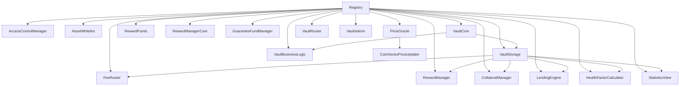

# 前端与智能合约连接完整指南

## 🎯 概述

本指南详细说明如何将前端应用与 RWA Lending Platform 智能合约进行连接，包括测试网部署、合约调用和前端集成。

## 📋 目录

1. [环境准备](#环境准备)
2. [智能合约部署流程](#智能合约部署流程)
3. [合约地址管理](#合约地址管理)
4. [前端集成方案](#前端集成方案)
5. [合约调用示例](#合约调用示例)
6. [测试和验证](#测试和验证)
7. [生产环境部署](#生产环境部署)
8. [模块键解码与前端配合](#模块键解码与前端配合)
9. [错误处理和调试](#错误处理和调试)
10. [CollateralManager（抵押账本）前端配合要点（2026-01）](#collateralmanager抵押账本前端配合要点2026-01)
11. [接口变更与迁移指南（2025-09）](#接口变更与迁移指南2025-09)
12. [缓存推送失败重试（CacheUpdateFailed）前端配合](#缓存推送失败重试cacheupdatefailed前端配合)
13. [资金链（Funds Flow / SSOT）前端配合（2026-01）](#资金链funds-flow--ssot前端配合2026-01)

## 🔧 环境准备

### 1. 环境变量配置

首先确保你的 `.env` 文件包含必要的配置：

```bash
# 网络配置
ARBITRUM_SEPOLIA_RPC_URL=https://sepolia-rollup.arbitrum.io/rpc
ARBITRUM_RPC_URL=https://arb1.arbitrum.io/rpc

# 部署账户
PRIVATE_KEY=your_private_key_here

# API Keys
ARBISCAN_API_KEY=your_arbiscan_api_key
ETHERSCAN_API_KEY=your_etherscan_api_key

# Gas 报告
REPORT_GAS=true
```

### 2. 检查环境配置

使用我们的脚本检查环境配置：

```bash
# 检查环境变量
npm run script checks env

# 检查合约一致性
npm run script checks contract-consistency

# 运行所有检查
npm run script checks all
```

### 3. 安全配置与钱包管理

#### 3.1. 环境变量安全配置

**创建环境变量文件**：
```bash
# 复制环境变量模板
cp env.example .env

# 编辑 .env 文件，填写真实值
# 注意：不要将 .env 文件提交到 Git 仓库
```

**环境变量模板**：
项目提供 `.env.template` 文件作为格式说明，包含：
- 网络 RPC URL 配置
- API 密钥配置
- 私钥配置（仅用于测试）
- Gas 报告配置
- 安全配置检查清单

#### 3.2. 钱包资产备份

**部署前备份钱包资产**：
```bash
# 备份指定网络的钱包资产
npm run script utils backup-wallet-assets --action backup --network arbitrum-sepolia

# 查看所有备份文件
npm run script utils backup-wallet-assets --action list
```

**备份功能特性**：
- ✅ 自动备份 ETH 余额
- ✅ 自动备份常见代币余额（USDC、WETH、ARB 等）
- ✅ 生成时间戳备份文件
- ✅ 支持多网络备份
- ✅ 防止意外转空钱包

**备份文件位置**：
```
scripts/secrets/backups/
├── wallet-backup-arbitrum-sepolia-2024-01-15T10-30-00-000Z.json
├── wallet-backup-arbitrum-sepolia-2024-01-15T11-45-00-000Z.json
└── ...
```

#### 3.3. 安全最佳实践

**私钥管理**：
- 🔒 使用测试钱包进行开发测试
- 🔒 主网私钥单独安全存储
- 🔒 定期更换私钥
- 🔒 使用硬件钱包存储大额资产

**环境隔离**：
- 🌐 测试网和主网使用不同钱包
- 🌐 开发环境和生产环境分离
- 🌐 定期清理测试环境

**备份策略**：
- 📁 定期备份钱包资产信息
- 📁 备份环境配置文件
- 📁 备份部署记录和合约地址
- 📁 使用加密存储敏感信息

**部署前检查清单**：
```bash
# 1. 检查环境配置
npm run script checks env

# 2. 备份钱包资产
npm run script utils backup-wallet-assets --action backup --network arbitrum-sepolia

# 3. 验证网络连接
npm run script utils network-config

# 4. 运行完整检查
npm run script checks all

# 5. 确认钱包余额充足
# 检查备份文件中的余额信息
```

## 🚀 智能合约部署流程

### 1. 部署顺序总览

由于合约系统高度模块化且存在复杂依赖关系，需要按照以下顺序分批部署：

#### 第一批：基础与注册中心
- **Registry**（全局模块注册表）
- **ModuleKeys**、**ActionKeys**（常量库，通常只需部署一次或直接用库）

#### 第二批：权限与白名单
- **AccessControlManager**（权限管理，建议用代理部署）
- **AssetWhitelist**（资产白名单，建议用代理部署）
- **AuthorityWhitelist**（如有需要）

#### 第三批：预言机与价格系统
- **PriceOracle**（价格预言机）
- **CoinGeckoPriceUpdater**（价格更新器）
- **ValuationOracleAdapter**（如有）

#### 第四批：核心业务与奖励系统
- **FeeRouter**（手续费路由，建议用代理部署）
- **RewardPoints**（积分Token，建议用代理部署）
- **RewardManagerCore**、**RewardManager**（奖励管理，建议用代理部署）
- **RewardConfig** 及其子模块（如 AdvancedAnalyticsConfig 等）

#### 第五批：Vault 相关
- **CollateralManager**、**LendingEngine**、**HealthFactorCalculator**、**StatisticsView（替代 VaultStatistics）**、**GuaranteeFundManager**（均建议用代理部署）
- **VaultStorage**（需要前面所有模块的地址，建议用代理部署）
- **VaultBusinessLogic**（如有）
- **VaultCore**（需要 VaultStorage 和业务逻辑模块地址，建议用代理部署）
- **VaultRouter**、**VaultAdmin**（如有）

#### 第六批：其他模块
- **LoanNFT**、**RWAToken**、**Mock 合约**等

### 2. 详细部署步骤与依赖说明

#### 1. Registry
- 先部署 Registry，后续所有模块地址都注册到这里。

#### 2. 权限与白名单
- AccessControlManager、AssetWhitelist、AuthorityWhitelist（如有）都可以独立部署，但后续需要注册到 Registry。

#### 3. 预言机系统
- 先部署 PriceOracle，再部署 CoinGeckoPriceUpdater，并初始化二者的互相关联。
- ValuationOracleAdapter 依赖 PriceOracle。

#### 4. 奖励系统
- 先部署 RewardPoints（积分Token），再部署 RewardManagerCore、RewardManager。
- RewardManager 需要 Registry、RewardPoints、RewardManagerCore 的地址。
- RewardConfig 及其子模块（如 AdvancedAnalyticsConfig、PriorityServiceConfig 等）可并行部署，最后 RewardConfig 需要设置各子模块地址。

#### 5. Vault 相关
- 先部署 CollateralManager、LendingEngine、HealthFactorCalculator、StatisticsView（替代 VaultStatistics）、GuaranteeFundManager（这些都需要 Registry 地址）。
- 部署 VaultStorage 时，需要传入上述所有模块的地址，以及 RWA Token、结算Token地址。
- 部署 VaultBusinessLogic（如有）。
- 部署 VaultCore 时，需要 VaultStorage 和业务逻辑模块的地址。
- VaultRouter、VaultAdmin 依赖 VaultStorage。

#### 6. 其他
- LoanNFT、RWAToken 等可在主业务部署后部署。

### 3. 自动化部署脚本

#### 选择测试网络

推荐使用 **Arbitrum Sepolia** 测试网：

```bash
# 查看网络配置
npm run script utils network-config

# 验证网络连接
npm run script utils network-utils
```

#### 分批部署命令

```bash
# 1. 部署 Registry（注册表）
npm run script deploy registry

# 2. 部署 Oracle 系统
npm run script deploy oracle-system

# 3. 部署奖励配置模块
npm run script deploy reward-config-modules

# 4. 部署完整的 Vault 系统
npm run script deploy vault-system

# 5. 部署 Vault Router（可选）
npm run script deploy vault-router

# 6. 部署到 Arbitrum（一键部署）
npm run script deploy arbitrum
```

#### 一键部署（推荐）

使用我们的集成部署脚本：

```bash
# 部署到 Arbitrum Sepolia
npm run script deploy arbitrum

# 或者使用完整的 Vault 系统部署
npm run script deploy vault-system
```

### 4. 典型部署依赖关系图



### 5. 部署最佳实践

#### 重要提醒
- 每部署一个合约，务必记录其地址，并及时注册到 Registry
- 部署 VaultStorage 时，务必确保所有依赖模块都已部署并地址可用
- 建议每批部署后，运行一次合约初始化和权限配置脚本
- 前端集成时，使用自动生成的合约地址配置文件

#### 环境检查
部署前请确保环境配置正确：

```bash
# 检查环境变量
npm run script checks check-env

# 检查合约一致性
npm run script checks check-contract-consistency

# 运行所有检查
npm run script checks all
```

## 📍 合约地址管理

### 1. 部署记录文件

部署完成后，合约地址会保存在以下文件中：

```bash
# 查看部署记录
cat scripts/deployments/vault-system.json
```

### 2. 地址格式示例

```json
{
  "Registry": "0x...",
  "AccessControlManager": "0x...",
  "AssetWhitelist": "0x...",
  "VaultStorage": "0x...",
  "VaultCore": "0x...",
  "VaultBusinessLogic": "0x...",
  "VaultAdmin": "0x...",
  "VaultRouter": "0x...",
  "VaultModules": "0x...",
  "StatisticsView": "0x...",
  "VaultAccess": "0x..."
}
```

### 3. 前端地址配置

创建前端配置文件 `src/config/contracts.ts`：

```typescript
export const CONTRACT_ADDRESSES = {
  // 测试网地址
  arbitrumSepolia: {
    Registry: "0x...",
    VaultCore: "0x...",
    VaultStorage: "0x...",
    // ... 其他合约地址
  },
  // 主网地址
  arbitrum: {
    Registry: "0x...",
    VaultCore: "0x...",
    VaultStorage: "0x...",
    // ... 其他合约地址
  }
};

export const NETWORK_CONFIG = {
  arbitrumSepolia: {
    chainId: 421614,
    rpcUrl: "https://sepolia-rollup.arbitrum.io/rpc",
    explorer: "https://sepolia.arbiscan.io"
  },
  arbitrum: {
    chainId: 42161,
    rpcUrl: "https://arb1.arbitrum.io/rpc",
    explorer: "https://arbiscan.io"
  }
};
```

## 🌐 前端集成方案

### 1. 使用 Ethers.js

```typescript
// src/utils/contracts.ts
import { ethers } from 'ethers';
import { CONTRACT_ADDRESSES, NETWORK_CONFIG } from '../config/contracts';

export class ContractManager {
  private provider: ethers.Provider;
  private signer: ethers.Signer;
  private contracts: Record<string, ethers.Contract> = {};

  constructor(network: 'arbitrumSepolia' | 'arbitrum') {
    const config = NETWORK_CONFIG[network];
    this.provider = new ethers.JsonRpcProvider(config.rpcUrl);
  }

  async connectWallet() {
    if (typeof window.ethereum !== 'undefined') {
      await window.ethereum.request({ method: 'eth_requestAccounts' });
      this.signer = await this.provider.getSigner();
    } else {
      throw new Error('MetaMask not found');
    }
  }

  async getContract(contractName: string, address: string, abi: any[]) {
    if (!this.contracts[contractName]) {
      this.contracts[contractName] = new ethers.Contract(
        address,
        abi,
        this.signer || this.provider
      );
    }
    return this.contracts[contractName];
  }

  async getVaultCore() {
    const address = CONTRACT_ADDRESSES.arbitrumSepolia.VaultCore;
    // 这里需要导入 VaultCore 的 ABI
    const abi = []; // 从 typechain-types 导入
    return this.getContract('VaultCore', address, abi);
  }
}
```

### 2. 使用 React Hooks（新增 RewardView 查询示例）

```typescript
// src/hooks/useContracts.ts
import { useState, useEffect } from 'react';
import { ContractManager } from '../utils/contracts';

export function useContracts() {
  const [contractManager, setContractManager] = useState<ContractManager | null>(null);
  const [isConnected, setIsConnected] = useState(false);
  const [loading, setLoading] = useState(true);

  useEffect(() => {
    const initContracts = async () => {
      try {
        const manager = new ContractManager('arbitrumSepolia');
        await manager.connectWallet();
        setContractManager(manager);
        setIsConnected(true);
      } catch (error) {
        console.error('Failed to connect contracts:', error);
      } finally {
        setLoading(false);
      }
    };

    initContracts();
  }, []);

  return { contractManager, isConnected, loading };
}
```

### 3. React 组件示例

```typescript
// src/components/VaultInterface.tsx
import React, { useState, useEffect } from 'react';
import { useContracts } from '../hooks/useContracts';

export function VaultInterface() {
  const { contractManager, isConnected, loading } = useContracts();
  const [vaultData, setVaultData] = useState(null);

  useEffect(() => {
    if (contractManager && isConnected) {
      loadVaultData();
    }
  }, [contractManager, isConnected]);

  const loadVaultData = async () => {
    try {
      const vaultCore = await contractManager!.getVaultCore();
      // 调用合约方法获取数据
      const data = await vaultCore.getVaultInfo();
      setVaultData(data);
    } catch (error) {
      console.error('Failed to load vault data:', error);
    }
  };

  if (loading) return <div>Loading...</div>;
  if (!isConnected) return <div>Please connect your wallet</div>;

  return (
    <div>
      <h2>Vault Interface</h2>
      {/* 显示 Vault 数据 */}
    </div>
  );
}
```

## 📞 合约调用示例

### 1. 读取数据

```typescript
// 获取 Vault 信息
async function getVaultInfo() {
  const vaultCore = await contractManager.getVaultCore();
  const info = await vaultCore.getVaultInfo();
  return info;
}

// 获取用户余额
async function getUserBalance(userAddress: string) {
  const vaultCore = await contractManager.getVaultCore();
  const balance = await vaultCore.getUserBalance(userAddress);
  return balance;
}

// 获取健康因子
async function getHealthFactor(userAddress: string) {
  const vaultCore = await contractManager.getVaultCore();
  const healthFactor = await vaultCore.getHealthFactor(userAddress);
  return healthFactor;
}

// ===== 新增：Reward 只读统一从 RewardView 查询 =====
import { RewardView__factory } from '@/types/factories';

async function getRewardView(provider: ethers.Provider, address: string) {
  return RewardView__factory.connect(address, provider);
}

// 查询积分参数（统一从 RewardView）
async function getRewardParameters(viewAddr: string, provider: ethers.Provider) {
  const rv = await getRewardView(provider, viewAddr);
  return rv.getRewardParametersView();
}

// 查询用户积分缓存
async function getUserRewardCache(viewAddr: string, provider: ethers.Provider, user: string) {
  const rv = await getRewardView(provider, viewAddr);
  return rv.getUserCacheView(user);
}

// 查询动态奖励参数
async function getDynamicRewardParams(viewAddr: string, provider: ethers.Provider) {
  const rv = await getRewardView(provider, viewAddr);
  return rv.getDynamicRewardParametersView();
}
```

### 2. 写入操作

> ⚠️ 抵押类资产的 **approve spender** 通常是 `CollateralManager`（其作为抵押资金池/托管者，会在存款时 `transferFrom(user → CollateralManager)` 拉取代币）。
> 即使你的入口是 `VaultCore/VaultRouter`，也不要把 spender 错配成 `VaultCore/VaultRouter`；否则存款会因 allowance 不足而 revert。

```typescript
// 存款
async function deposit(asset: string, amount: bigint) {
  const vaultCore = await contractManager.getVaultCore();
  const tx = await vaultCore.deposit(asset, amount);
  await tx.wait();
  return tx;
}

// 取款
async function withdraw(asset: string, amount: bigint) {
  const vaultCore = await contractManager.getVaultCore();
  const tx = await vaultCore.withdraw(asset, amount);
  await tx.wait();
  return tx;
}

// 借款（直达账本：LendingEngine，权威入口）
async function borrow(asset: string, amount: bigint) {
  const vaultCore = await contractManager.getVaultCore();
  const tx = await vaultCore.borrow(asset, amount);
  await tx.wait();
  return tx;
}

// 还款/结算（唯一入口：SettlementManager 由 VaultCore 代为转入并调用）
async function repay(orderId: bigint, debtAsset: string, amount: bigint) {
  // 注意：repay 的 approve spender 是 VaultCore（VaultCore 会 transferFrom(user → SettlementManager)）
  // await ERC20(debtAsset).approve(vaultCoreAddr, amount)
  const vaultCore = await contractManager.getVaultCore();
  const tx = await vaultCore.repay(orderId, debtAsset, amount);
  await tx.wait();
  return tx;
}

// 清算/处置（keeper/机器人入口，SSOT）
async function settleOrLiquidate(orderId: bigint) {
  // 1) keeper/机器人调用 SettlementManager.settleOrLiquidate(orderId)（SSOT）
  // 2) 调用者必须具备 ACTION_LIQUIDATE 权限，否则会 revert（常见：MissingRole()）
  //
  // ActionKey（与 src/constants/ActionKeys.sol 对齐）：
  //   bytes32 ACTION_LIQUIDATE = keccak256("LIQUIDATE")
  //
  // 推荐做法：先检查 role，再调用入口，避免链上无意义 revert。
  const provider = contractManager.provider; // 你们的 provider/Signer 管理方式不同的话，请按项目实际改造
  const keeperSigner = contractManager.signer; // keeper 钱包对应的 signer（机器人/多签执行器）

  const ACTION_LIQUIDATE = ethers.keccak256(ethers.toUtf8Bytes("LIQUIDATE"));

  // 通过 Registry 拿 SettlementManager 地址（避免写死地址）
  const registry = await contractManager.getRegistry();
  const settlementManagerAddr: string = await registry.getModule(
    ethers.keccak256(ethers.toUtf8Bytes("SETTLEMENT_MANAGER"))
  );
  if (!settlementManagerAddr || settlementManagerAddr === ethers.ZeroAddress) {
    throw new Error("Registry missing SETTLEMENT_MANAGER");
  }

  const acm = await contractManager.getAccessControlManager();
  const has = await acm.hasRole(ACTION_LIQUIDATE, await keeperSigner.getAddress());
  if (!has) {
    throw new Error(
      `MissingRole(): keeper lacks ACTION_LIQUIDATE (${ACTION_LIQUIDATE}). ` +
        `Ask admin to grant this role to keeper.`
    );
  }

  const settlementManager = new ethers.Contract(
    settlementManagerAddr,
    ["function settleOrLiquidate(uint256 orderId) external"],
    keeperSigner
  );
  const tx = await settlementManager.settleOrLiquidate(orderId);
  await tx.wait();
  return tx;
}
```

> 🧪 本地快速排障（推荐）：见 `docs/Usage-Guide/Funds-Flow-Architecture-Guide.md` 的 “本地一键 Smoke”。
> 它会检查 Registry 注册/连线，并对 `MissingRole()` / `SettlementManager__NotLiquidatable()` 做精准解码与修复提示。

### 3. 事件监听

```typescript
// 监听存款事件
async function listenToDepositEvents() {
  const vaultCore = await contractManager.getVaultCore();
  
  vaultCore.on('Deposit', (user, amount, timestamp) => {
    console.log(`User ${user} deposited ${amount} at ${timestamp}`);
    // 更新 UI
  });
}

// 监听借款事件
async function listenToBorrowEvents() {
  const vaultCore = await contractManager.getVaultCore();
  
  vaultCore.on('Borrow', (user, amount, timestamp) => {
    console.log(`User ${user} borrowed ${amount} at ${timestamp}`);
    // 更新 UI
  });
}
```

## 🧪 测试和验证

### 1. 使用我们的测试脚本

```bash
# 运行集成测试
npm run script test integration

# 测试 Oracle 系统
npm run script test oracle-system

# 运行健康因子统计
npm run script test health-factor-stats
```

### 2. 创建测试账户

```bash
# 创建测试账户
npm run script test create-accounts

# 查看测试账户使用示例
npm run script test test-accounts-usage
```

### 3. 前端测试

```typescript
// src/tests/contracts.test.ts
import { ContractManager } from '../utils/contracts';

describe('Contract Integration Tests', () => {
  let contractManager: ContractManager;

  beforeEach(async () => {
    contractManager = new ContractManager('arbitrumSepolia');
    await contractManager.connectWallet();
  });

  test('should connect to VaultCore contract', async () => {
    const vaultCore = await contractManager.getVaultCore();
    expect(vaultCore).toBeDefined();
  });

  test('should get vault info', async () => {
    const vaultCore = await contractManager.getVaultCore();
    const info = await vaultCore.getVaultInfo();
    expect(info).toBeDefined();
  });
});
```

## 🚀 生产环境部署

### 1. 主网部署

```bash
# 部署到 Arbitrum 主网
npm run script deploy arbitrum

# 验证合约
npm run script utils verification-utils
```

### 2. 前端生产配置

```typescript
// src/config/production.ts
export const PRODUCTION_CONFIG = {
  network: 'arbitrum',
  rpcUrl: process.env.REACT_APP_ARBITRUM_RPC_URL,
  contracts: CONTRACT_ADDRESSES.arbitrum
};
```

### 3. 监控和日志

```bash
# 运行性能监控
npm run script utils performance-monitor

# 运行监控工具
npm run script utils monitoring-utils
```

## 🔍 模块键解码与前端配合

### 1. 背景说明

为了优化 gas 成本，我们的智能合约在事件中直接使用 `bytes32` 格式的模块键，而不是转换为可读字符串。前端需要配合进行解码以提供友好的用户体验。

### 2. 模块键解码器

#### 2.1. 创建解码工具

```typescript
// utils/moduleKeyDecoder.ts
export class ModuleKeyDecoder {
  // 模块键映射表（与合约中的 ModuleKeys.sol 保持一致）
  private static readonly MODULE_KEYS = {
    '0x5641554c545f434f524500000000000000000000000000000000000000000000': 'VAULT_CORE',
    '0x4c49515549444154494f4e5f4d414e4147455200000000000000000000000000': 'LIQUIDATION_MANAGER',
    '0x50524943455f4f5241434c450000000000000000000000000000000000000000': 'PRICE_ORACLE',
    '0x5245574152445f4d414e4147455200000000000000000000000000000000000000': 'REWARD_MANAGER',
    '0x474f5645524e414e43455f4d414e414745520000000000000000000000000000': 'GOVERNANCE_MANAGER',
    // 添加更多模块键...
  };

  /**
   * 将 bytes32 模块键转换为可读字符串
   */
  static decodeModuleKey(key: string): string {
    return this.MODULE_KEYS[key.toLowerCase()] || `UNKNOWN_MODULE_${key.slice(0, 10)}`;
  }

  /**
   * 批量解码模块键
   */
  static decodeModuleKeys(keys: string[]): string[] {
    return keys.map(key => this.decodeModuleKey(key));
  }

  /**
   * 安全解码模块键，处理未知键
   */
  static safeDecodeModuleKey(key: string): { name: string; isKnown: boolean } {
    const name = this.decodeModuleKey(key);
    const isKnown = !name.startsWith('UNKNOWN_MODULE_');
    
    return {
      name: isKnown ? name : `未知模块 (${key.slice(0, 10)}...)`,
      isKnown
    };
  }

  /**
   * 获取所有已知模块键
   */
  static getKnownModuleKeys(): string[] {
    return Object.values(this.MODULE_KEYS);
  }
}
```

### 4. 注册表解析优先策略与注意事项（强烈推荐）

> 前端地址解析应以 Registry 为“单一真实来源（SSoT）”，避免硬编码地址或从零散事件推断地址。以下为实践要点与与其它策略的对比说明。

#### 4.1 注册表解析（推荐方案）

- 核心思路：使用 `Registry.getModule(bytes32 key)`/`getModuleOrRevert` 解析模块地址，模块键使用与链上 `ModuleKeys.sol` 完全一致的 UPPER_SNAKE 字符串的 `keccak256` 值。
- 生成 KEY（前端示例）：

```typescript
import { keccak256, toUtf8Bytes } from 'ethers';

// 通过 UPPER_SNAKE 生成 bytes32 模块键
const KEY_REWARD_MANAGER = keccak256(toUtf8Bytes('REWARD_MANAGER'));
const KEY_VAULT_CORE   = keccak256(toUtf8Bytes('VAULT_CORE'));

// 解析模块地址
const rewardManagerAddr = await registry.getModule(KEY_REWARD_MANAGER);
const vaultCoreAddr     = await registry.getModule(KEY_VAULT_CORE);
```

- 事件订阅：监听 `ModuleAddressUpdated`，发生变更时刷新前端缓存（参考上文 `useRegistryEvents`）。
- 建议在前端建立一个与后端一致的 KEY 生成工具（与后端 `scripts/deploy/moduleKeys.ts` 对齐）。

#### 4.2 与其它策略的对比

| 策略 | 优点 | 缺点 | 适用场景 |
|---|---|---|---|
| 注册表解析（本方案） | 动态、权威、可监听升级；与链上治理一致 | 需要维护 KEY 生成与解码 | 生产环境、长期维护 |
| 本地/构建时地址配置（如 `frontend-config/contracts-*.ts`） | 上手快、无需链上读取 | 易过期；多环境管理成本高 | 开发期兜底、离线/灰度环境 |
| 事件推断地址（非注册表事件） | 可快速试验 | 来源不统一、容易不完整 | 调研阶段，不建议上线 |

结论：前端应“以注册表解析为主”，地址配置文件可作为“冷启动兜底”。应用启动后以 Registry 地址解析结果覆盖本地配置。

#### 4.3 关键实现细节

- 与链上常量对齐：KEY 必须与 `contracts/constants/ModuleKeys.sol` 完全一致（UPPER_SNAKE → `keccak256(toUtf8Bytes(name))`），避免大小写或空格导致解析失败。
- 小写规范：事件监听时建议将 bytes32 转为小写字符串再比对（文档示例的解码器已处理）。
- 视图与只读入口：
  - `REWARD_VIEW`：统一 Reward 只读与 DataPush 入口，查询 0 gas；
  - `VAULT_CORE`：后续如需“由 Core 解析 View 地址”的路径，可通过 `KEY_VAULT_CORE → VaultCore.viewContractAddrVar()`；
  - `VAULT_STATISTICS`：迁移阶段指向 `StatisticsView`（只读聚合）。
- 多环境与热更新：
  - 首屏可读取 `frontend-config/contracts-*.ts` 作为初值，随后立即用 Registry 解析结果更新状态；
  - 监听 `ModuleAddressUpdated` 保持前端地址热更新；
  - 本地开发若未部署 Mock，确保组件对缺失模块地址具备降级处理（例如隐藏相关功能）。

#### 4.4 前后端 KEY 对齐建议

- 后端已提供 `scripts/deploy/moduleKeys.ts`（集中 KEY 常量与 `key/keyOf` 工具），前端可创建等价的 `utils/moduleKeys.ts`：

```typescript
import { keccak256, toUtf8Bytes } from 'ethers';

export const MODULE_KEYS = {
  REWARD_MANAGER: 'REWARD_MANAGER',
  REWARD_VIEW: 'REWARD_VIEW',
  VAULT_CORE: 'VAULT_CORE',
  LENDING_ENGINE: 'LENDING_ENGINE',
  // ... 按需补全，与后端保持一致
} as const;

export type ModuleKeyName = keyof typeof MODULE_KEYS;
export const key = (name: ModuleKeyName) => keccak256(toUtf8Bytes(MODULE_KEYS[name]));
```

这样可以避免多处散落硬编码，确保与链上注册键一致。


#### 2.2. 性能优化版本

```typescript
// utils/moduleKeyDecoder.ts (带缓存)
export class ModuleKeyDecoder {
  private static readonly MODULE_KEYS = {
    // ... 模块键映射
  };
  
  private static cache = new Map<string, string>();

  static decodeModuleKey(key: string): string {
    const normalizedKey = key.toLowerCase();
    
    if (this.cache.has(normalizedKey)) {
      return this.cache.get(normalizedKey)!;
    }

    const result = this.MODULE_KEYS[normalizedKey] || `UNKNOWN_MODULE_${key.slice(0, 10)}`;
    this.cache.set(normalizedKey, result);
    
    return result;
  }

  /**
   * 清除缓存
   */
  static clearCache(): void {
    this.cache.clear();
  }
}
```

### 3. 事件监听和解码

#### 3.1. 创建事件监听器

```typescript
// hooks/useRegistryEvents.ts
import { ethers } from 'ethers';
import { ModuleKeyDecoder } from '../utils/moduleKeyDecoder';

export const useRegistryEvents = (registryContract: ethers.Contract) => {
  
  const listenToModuleUpdates = (callback: (event: any) => void) => {
    registryContract.on('ModuleAddressUpdated', (
      key: string,
      oldAddr: string,
      newAddr: string,
      timestamp: number,
      event: any
    ) => {
      // 解码模块键
      const moduleName = ModuleKeyDecoder.decodeModuleKey(key);
      
      const decodedEvent = {
        moduleKey: key,
        moduleName, // 解码后的可读名称
        oldAddress: oldAddr,
        newAddress: newAddr,
        timestamp: new Date(timestamp * 1000),
        blockNumber: event.blockNumber,
        transactionHash: event.transactionHash
      };
      
      callback(decodedEvent);
    });
  };

  const listenToBatchUpdates = (callback: (events: any[]) => void) => {
    registryContract.on('BatchModuleChanged', (
      keys: string[],
      oldAddresses: string[],
      newAddresses: string[],
      executor: string,
      event: any
    ) => {
      const decodedEvents = keys.map((key, index) => ({
        moduleKey: key,
        moduleName: ModuleKeyDecoder.decodeModuleKey(key),
        oldAddress: oldAddresses[index],
        newAddress: newAddresses[index],
        executor,
        timestamp: new Date(event.blockTimestamp * 1000),
        blockNumber: event.blockNumber,
        transactionHash: event.transactionHash
      }));
      
      callback(decodedEvents);
    });
  };

  return { listenToModuleUpdates, listenToBatchUpdates };
};
```

#### 3.2. React 组件示例

```typescript
// components/ModuleUpdateHistory.tsx
import React, { useState, useEffect } from 'react';
import { useRegistryEvents } from '../hooks/useRegistryEvents';

interface ModuleUpdateEvent {
  moduleKey: string;
  moduleName: string;
  oldAddress: string;
  newAddress: string;
  timestamp: Date;
  blockNumber: number;
  transactionHash: string;
}

export const ModuleUpdateHistory: React.FC = () => {
  const [events, setEvents] = useState<ModuleUpdateEvent[]>([]);
  const { listenToModuleUpdates } = useRegistryEvents(registryContract);

  useEffect(() => {
    const handleModuleUpdate = (event: ModuleUpdateEvent) => {
      setEvents(prev => [event, ...prev]);
    };

    listenToModuleUpdates(handleModuleUpdate);
  }, []);

  return (
    <div>
      <h3>模块更新历史</h3>
      {events.map((event, index) => (
        <div key={index} className="event-card">
          <div className="module-name">
            <strong>{event.moduleName}</strong>
            <span className="module-key">({event.moduleKey.slice(0, 10)}...)</span>
          </div>
          <div className="address-change">
            <span className="old-addr">旧地址: {event.oldAddress}</span>
            <span className="arrow">→</span>
            <span className="new-addr">新地址: {event.newAddress}</span>
          </div>
          <div className="metadata">
            <span>时间: {event.timestamp.toLocaleString()}</span>
            <a href={`https://arbiscan.io/tx/${event.transactionHash}`} target="_blank">
              查看交易
            </a>
          </div>
        </div>
      ))}
    </div>
  );
};
```

### 4. 配置管理

#### 4.1. 模块键配置文件

```typescript
// config/moduleKeys.ts
export const MODULE_KEYS_CONFIG = {
  // 从合约中提取的模块键映射
  VAULT_CORE: '0x5641554c545f434f524500000000000000000000000000000000000000000000',
  LIQUIDATION_MANAGER: '0x4c49515549444154494f4e5f4d414e4147455200000000000000000000000000',
  PRICE_ORACLE: '0x50524943455f4f5241434c450000000000000000000000000000000000000000',
  REWARD_MANAGER: '0x5245574152445f4d414e4147455200000000000000000000000000000000000000',
  GOVERNANCE_MANAGER: '0x474f5645524e414e43455f4d414e414745520000000000000000000000000000',
  // ... 更多模块键
} as const;

// 反向映射
export const MODULE_KEYS_REVERSE = Object.entries(MODULE_KEYS_CONFIG).reduce(
  (acc, [name, key]) => {
    acc[key.toLowerCase()] = name;
    return acc;
  },
  {} as Record<string, string>
);
```

#### 4.2. 工具函数

```typescript
// utils/registryUtils.ts
export const registryUtils = {
  /**
   * 格式化模块地址显示
   */
  formatModuleAddress(address: string): string {
    return `${address.slice(0, 6)}...${address.slice(-4)}`;
  },

  /**
   * 检查地址是否为零地址
   */
  isZeroAddress(address: string): boolean {
    return address === '0x0000000000000000000000000000000000000000';
  },

  /**
   * 获取模块状态描述
   */
  getModuleStatus(oldAddr: string, newAddr: string): string {
    if (this.isZeroAddress(oldAddr)) return '新增模块';
    if (this.isZeroAddress(newAddr)) return '移除模块';
    return '更新模块';
  },

  /**
   * 验证模块键格式
   */
  isValidModuleKey(key: string): boolean {
    return /^0x[a-fA-F0-9]{64}$/.test(key);
  }
};
```

### 5. 错误处理和调试

#### 5.1. 错误处理

```typescript
// utils/moduleKeyDecoder.ts
export class ModuleKeyDecoder {
  // ... 现有代码 ...

  /**
   * 调试模式解码
   */
  static debugDecodeModuleKey(key: string): {
    name: string;
    originalKey: string;
    normalizedKey: string;
    isKnown: boolean;
    cacheHit: boolean;
  } {
    const normalizedKey = key.toLowerCase();
    const cacheHit = this.cache.has(normalizedKey);
    const name = this.decodeModuleKey(key);
    const isKnown = !name.startsWith('UNKNOWN_MODULE_');

    return {
      name,
      originalKey: key,
      normalizedKey,
      isKnown,
      cacheHit
    };
  }
}
```

#### 5.2. 调试工具

```typescript
// utils/debugUtils.ts
export const debugUtils = {
  /**
   * 打印模块键解码信息
   */
  logModuleKeyDecode(key: string): void {
    const debug = ModuleKeyDecoder.debugDecodeModuleKey(key);
    console.log('Module Key Decode Debug:', debug);
  },

  /**
   * 验证模块键映射完整性
   */
  validateModuleKeyMapping(): void {
    const knownKeys = ModuleKeyDecoder.getKnownModuleKeys();
    console.log('Known Module Keys:', knownKeys);
    
    // 检查是否有重复的键
    const keySet = new Set(knownKeys);
    if (keySet.size !== knownKeys.length) {
      console.warn('Duplicate module keys detected!');
    }
  }
};
```

### 6. 最佳实践

#### 6.1. 性能优化

1. **使用缓存**：避免重复解码相同的模块键
2. **批量处理**：对于大量事件，使用批量解码
3. **懒加载**：只在需要时进行解码

#### 6.2. 用户体验

1. **显示原始键**：在界面上同时显示解码后的名称和原始键
2. **未知模块处理**：优雅处理未知的模块键
3. **加载状态**：在解码过程中显示加载状态

#### 6.3. 维护性

1. **同步更新**：当合约中的模块键发生变化时，及时更新前端映射
2. **版本管理**：为模块键映射添加版本控制
3. **自动化测试**：编写测试确保解码器正确工作

## 📝 最佳实践

### 1. 错误处理

```typescript
async function safeContractCall(contractCall: () => Promise<any>) {
  try {
    return await contractCall();
  } catch (error) {
    if (error.code === 'ACTION_REJECTED') {
      throw new Error('Transaction was rejected by user');
    } else if (error.code === 'INSUFFICIENT_FUNDS') {
      throw new Error('Insufficient funds for transaction');
    } else {
      throw new Error(`Contract call failed: ${error.message}`);
    }
  }
}
```

### 2. Gas 优化

```typescript
// 估算 Gas 费用
async function estimateGas(contract: ethers.Contract, method: string, ...args: any[]) {
  try {
    const gasEstimate = await contract[method].estimateGas(...args);
    return gasEstimate;
  } catch (error) {
    console.error('Gas estimation failed:', error);
    throw error;
  }
}
```

### 3. 状态管理

```typescript
// 使用 React Context 管理合约状态
const ContractContext = React.createContext<ContractManager | null>(null);

export function ContractProvider({ children }: { children: React.ReactNode }) {
  const [contractManager, setContractManager] = useState<ContractManager | null>(null);

  useEffect(() => {
    const initContracts = async () => {
      const manager = new ContractManager('arbitrumSepolia');
      await manager.connectWallet();
      setContractManager(manager);
    };

    initContracts();
  }, []);

  return (
    <ContractContext.Provider value={contractManager}>
      {children}
    </ContractContext.Provider>
  );
}
```

## 🔗 相关资源

- [智能合约标准文档](./SmartContractStandard.md)
- [脚本系统升级报告](./SCRIPTS_SYSTEM_UPGRADE.md)
- [Hardhat 配置文档](https://hardhat.org/docs)
- [Ethers.js 文档](https://docs.ethers.org/)
- [Arbitrum 文档](https://developer.arbitrum.io/)

## 🎯 总结

通过以上步骤，你可以：

1. **部署智能合约**到测试网
2. **管理合约地址**和配置
3. **集成前端应用**与合约交互
4. **测试和验证**功能
5. **部署到生产环境**

使用我们的脚本系统可以大大简化部署和测试流程，提高开发效率！

---

**下一步建议**：
1. 先部署到 Arbitrum Sepolia 测试网
2. 使用我们的测试脚本验证功能
3. 开发前端界面并集成合约调用
4. 进行充分测试后部署到主网 

## 🔄 VaultRouter 协调器接口（简化版 2025-08）

> ⚠️ 重要说明：根据 `docs/Architecture-Guide.md` 及视图模块拆分方案，从 2025-08 起 `VaultRouter` 不再承担任何读操作，也不再缓存业务数据。所有查询均由 `UserView`、`SystemView`、`AccessControlView`、`ViewCache` 等子模块提供。前端集成应遵循以下约定：

### 1. 只写不读
- `VaultRouter` 仅对外暴露 **4 个写入/路由函数**，全部为 `non-view` 调用：
  | 函数 | 调用方(合约) | 说明 |
  | --- | --- | --- |
  | `processUserOperation(user, operationType, asset, amount, timestamp)` | 前端 → 业务合约（转发） | 用户发起的 DEPOSIT / BORROW / REPAY / WITHDRAW 操作由前端直接调用业务模块；同时业务模块应调用本函数写链上事件，供离线索引与监听。 |
  | `pushUserPositionUpdate(user, asset, collateral, debt)` | CollateralManager / LendingEngine | 业务模块更新完抵押/债务后推送最新快照；前端 **不会** 直接调用。 |
  | `pushUserHealthFactorUpdate(user, healthFactor)` | HealthFactorCalculator | 健康因子更新；前端不调用。 |
  | `pushAssetStatsUpdate(asset, totalCollateral, totalDebt, price)` | VaultStatistics | 资产聚合数据推送；前端不调用。 |

### 2. 前端应调用的查询接口
- **用户数据**：`UserView` ⇒ `getUserPosition`, `getHealthFactor`, `getUserStats`, `previewBorrow/Deposit/...` 等。
- **系统数据（更新）**：
  - `ValuationOracleView` ⇒ `getAssetPrice/getAssetPrices/isPriceValid`（价格/预言机，返回 [price, ts]）
  - `HealthView` ⇒ `getUserHealthFactor/batchGetHealthFactors`；系统健康/降级读取由 `HealthView` 提供
  - `StatisticsView` ⇒ 全局统计聚合
  - `BatchView` ⇒ `batchGetAssetPrices/batchGetModuleHealth` 等批量查询
  - `RegistryView` ⇒ 模块键枚举/反查/分页
  - `SystemView` ⇒ **系统级只读聚合门面（推荐可选）**：用于“一次性系统总览查询/兼容旧调用”。对性能敏感或需要更细粒度数据时，仍建议直接调用上述专属 View。
- **清算数据（更新）**：`LiquidatorView` ⇒ `getLiquidatorProfitView`, `getGlobalLiquidationView`, `batchGetLiquidatorProfitViews`, `getLiquidatorLeaderboard`, `getLiquidatorTempDebt`, `getLiquidatorProfitRate`。
- **权限数据**：`AccessControlView` ⇒ `getUserPermission`, `getUserPermissionLevel` 等。
- **系统级快照(可选)**：`ViewCache` ⇒ `getSystemStatus` / `batchGetSystemStatus`。
  （用户维度缓存已并入 `UserView`，前端无需单独调用 ViewCache 获取用户缓存。）

### 3. 实现示例（TypeScript / Ethers v6）
```ts
import { ethers } from 'ethers';
import { VaultRouter__factory } from '@/types/factories';

const signer = provider.getSigner();
const vaultRouter = VaultRouter__factory.connect(addresses.VaultRouter, signer);

// 用户存款操作
export async function deposit(asset: string, amount: bigint) {
  const tx = await vaultRouter.processUserOperation(
    await signer.getAddress(),
    utils.id('DEPOSIT'),  // bytes32("DEPOSIT")
    asset,
    amount,
    Math.floor(Date.now() / 1000)
  );
  await tx.wait();
}
```

### 4. 过渡期兼容
- 若后端或脚本仍依赖旧版 `IVaultRouter` 的只读接口，请 **迁移到对应子模块** 并删除旧调用。
- `VaultRouter` 合约已瘦身，但 ABI 变更会导致旧前端编译失败；务必同步更新 `@/types` 代码生成与合约地址配置。

---
以上即为最新 `VaultRouter` 协调器的前端集成规范，后续业务查询请直接面向子视图模块。 

## 🧱 CollateralManager（抵押账本）前端配合要点（2026-01）

> 目标：避免前端“误把业务模块当 View 用”，同时保留必要的账本只读兼容能力（供清算/视图/统计/排障/过渡期使用）。

### 1) 查询入口选择（推荐顺序）
- **正常 UI 查询（推荐）**：优先调用各专属 View（0 gas `view` 查询 + 缓存/聚合能力）
  - 用户仓位/资产维度：`PositionView` / `UserView`
  - 系统统计：`StatisticsView`
  - 价格：`ValuationOracleView` / 批量价格：`BatchView`
- **账本只读兼容（谨慎使用）**：仅在“排障 / 兜底 / 过渡期兼容 / 枚举资产列表”时使用 `CollateralManager` 的 getter：
  - `getCollateral(user, asset)`：返回 **抵押账本数量**（不含估值）
  - `getTotalCollateralByAsset(asset)`：返回 **该资产全局抵押总量**（不含估值）
  - `getUserCollateralAssets(user)`：返回用户抵押过的资产列表（用于枚举；列表随抵押为 0 会移除）
- **明确禁止/已移除**：`CollateralManager` **不提供任何“估值/美元价值/抵押价值”接口**；估值请走 `ValuationOracleView` 或 View 层聚合（遵循 `docs/Architecture-Guide.md`）。

### 2) ERC20 授权（approve）协作约定
- **抵押存入**：前端需要对 **`CollateralManager` 地址**执行 `ERC20(asset).approve(CollateralManager, amount)`（或更高额度）。
- **抵押提取**：通常不需要 approve（提取由 `CollateralManager` 直接 `transfer` 到 receiver）。

### 3) 事件 / DataPush 订阅（前端/监听服务）
- `CollateralManager` 会发出业务事件：`DepositProcessed` / `WithdrawProcessed` / `BatchDepositProcessed` / `BatchWithdrawProcessed`（可用于 UI/索引服务同步）。
- 同时会通过统一入口 `DataPushed(bytes32 dataTypeHash, bytes payload)` 推送同等信息（建议监听服务统一只订阅 `DataPushed`，再按 `dataTypeHash` 解码）。
- View 推送失败告警（不回滚主流程）：`ViewCachePushFailed(address user, address asset, bytes reason)`  
  - 含义：抵押账本写入成功，但 **View 层快照推送失败**；UI 侧应优先以 View 查询为主，如发现缓存陈旧可提示“数据可能延迟”，并配合后端重试/告警闭环（另见本文档 `CacheUpdateFailed` 章节）。

## 💸 资金链（Funds Flow / SSOT）前端配合（2026-01）

> 本节是 `docs/Usage-Guide/Funds-Flow-Architecture-Guide.md` 的前端落地版：只写“前端需要做什么”，不重复合约内部实现细节。

### 1) 抵押物资金链（Collateral Flow）

- **approve（必须）**：`ERC20(collateralAsset).approve(KEY_CM(CollateralManager), amount)`
- **写入口（用户）**：
  - 存入：`VaultCore.deposit(collateralAsset, amount)`
  - 取回：`VaultCore.withdraw(collateralAsset, amount)`
- **UI 查询（推荐）**：`UserView` / `PositionView`（0 gas）
- **排障兜底（谨慎）**：`CollateralManager.getCollateral/getUserCollateralAssets`（只读账本数量，不含估值）

### 2) 出借资金入池（Reserve Flow）

- **approve（必须）**：`ERC20(asset).approve(VaultBusinessLogic, amount)`（spender 是 VBL，不是资金池）
- **写入口**：
  - 入池：`VaultBusinessLogic.reserveForLending(lenderSigner, asset, amount, lendHash)`
  - 撤回：`VaultBusinessLogic.cancelReserve(lendHash)`
- **前端职责**：
  - 负责生成/展示 `lendHash` 与签名信息（幂等键）
  - 对账口径：资金真实托管在 `KEY_LENDER_POOL_VAULT (LenderPoolVault)`

### 3) 撮合放款（Finalize Match / Borrow Disbursement）

- **典型模式**：由撮合服务/keeper 调 `VaultBusinessLogic.finalizeMatch(...)` 完成原子撮合（前端只负责签名与展示状态）。
- **前端需要保证**：
  - borrower 与 lenders 的签名数据可复现（用于追责与排障）
  - UI 上明确展示：`LoanOrder.lender` 口径是 **资金池地址**（`LenderPoolVault`），不是 `lenderSigner`

### 4) 还款/结算（Repay → Settle）

- **approve（必须）**：`ERC20(debtAsset).approve(VaultCore, amount)`  
  - 原因：`VaultCore.repay` 会 `transferFrom(user → SettlementManager)`，再调用 `SettlementManager.repayAndSettle(...)`。
- **写入口（用户）**：`VaultCore.repay(orderId, debtAsset, amount)`
- **UI 提示**：
  - 正常结算（按时/提前）会在同一条链路内完成“减债 + 抵押返还”（抵押可能直接回 borrower，无需二次 withdraw）

### 5) 违约清算（Default → Liquidation）

- **默认入口（keeper 推荐，SSOT）**：`SettlementManager.settleOrLiquidate(orderId)`（需要 `ACTION_LIQUIDATE`）
- **用户侧前端**：
  - 不应提供“直接清算”按钮给普通用户
  - 只读展示与事件订阅以 `LiquidatorView`/`LiquidationRiskManager`/`HealthView` 为准

### 6) 费用与分账（Fee Flow）

- **写入侧 SSOT**：费用类资金统一由 `FeeRouter` 路由与分发（前端通常不直接调用写入口）
- **读侧（推荐）**：`FeeRouterView` + 订阅 `DataPushed`

## 🔁 接口变更与迁移指南（2025-09）

### 1) 清算只读接口统一到 LiquidatorView（SystemView 不作为权威入口）
- 从本版本起，清算相关只读查询的权威入口为 `LiquidatorView`：
  - `getLiquidatorProfitView(liquidator)`
  - `getGlobalLiquidationView()`
  - `batchGetLiquidatorProfitViews(liquidators[])`
  - `getLiquidatorLeaderboard(limit)`
  - `getLiquidatorTempDebt(liquidator, asset)`
  - `getLiquidatorProfitRate()`
- `SystemView` 作为系统级聚合门面，可能会聚合/转发部分清算指标以便兼容旧调用，但**权威入口仍是 `LiquidatorView`**；前端请优先切换到 `LiquidatorView`。

示例（ethers v6）：
```ts
import { LiquidatorView__factory } from '@/types/factories';

export function getLiquidatorView(provider: any, addr: string) {
  return LiquidatorView__factory.connect(addr, provider);
}

export async function fetchLiquidatorStats(provider: any, addr: string, user: string) {
  const lv = getLiquidatorView(provider, addr);
  const profitView = await lv.getLiquidatorProfitView(user);
  const global = await lv.getGlobalLiquidationView();
  return { profitView, global };
}
```

### 2) 批量资产价格查询请使用 BatchView
- 批量资产价格：`BatchView.batchGetAssetPrices(assets[])`。
- 单资产价格：`ValuationOracleView.getAssetPrice(asset)`。

示例：
```ts
import { BatchView__factory } from '@/types/factories';

export async function batchFetchPrices(provider: any, batchViewAddr: string, assets: string[]) {
  const bv = BatchView__factory.connect(batchViewAddr, provider);
  return bv.batchGetAssetPrices(assets); // 返回 { asset, price }[]
}
```

- 为了统一前端调用风格：所有 View 暴露 `registryAddrVar()`（部分合约仍保留 `registryAddr()` 兼容，后续移除）。

迁移建议：
```ts
// 旧（示意）：await systemView.getRegistry()  // 已移除
// 新：
const registryAddr = await systemView.registryAddrVar();
const registryAddr2 = await batchView.registryAddrVar(); // 推荐
```

### 4) UUPS _authorizeUpgrade 与前端
- `_authorizeUpgrade` 为合约内部升级授权逻辑，不面向前端调用，无需在前端做任何适配。

- SystemView 为系统级聚合门面（可选）：可用于统一入口/兼容旧调用；但清算仍以 `LiquidatorView` 为权威入口，健康用 `HealthView`，价格用 `ValuationOracleView`，注册表用 `RegistryView`，统计用 `StatisticsView`，批量用 `BatchView`。
- 本文档示例基于 ethers v6 与自动生成的 TypeChain 工厂类（`@/types/factories`）。

## 📦 监控相关新模块 (2025-08 升级)

| Registry Key | 合约 | 目录 |
|--------------|------|------|
| `KEY_DEGRADATION_CORE` | `DegradationCore` | `contracts/core/monitor/DegradationCore.sol` |
| `KEY_DEGRADATION_MONITOR` | `DegradationMonitor` | `contracts/core/monitor/DegradationMonitor.sol` |

> ⚠️ 旧的 `GracefulDegradation*` 模块已迁移到 `core/monitor/` 路径，名称保持兼容，但前端应尽快切换到上表新 Key。 

### 9. Unified DataPush Integration (v1)

所有前端监听服务应仅订阅 `DataPushed(bytes32 indexed dataTypeHash, bytes payload)`。

```ts
// ethers v6 – example
const iface = new Interface(["event DataPushed(bytes32 indexed dataTypeHash, bytes payload)"]);
provider.on({ topics: [iface.getEvent("DataPushed").topic] }, (log) => {
  const { dataTypeHash, payload } = iface.parseLog(log).args;
  switch (dataTypeHash) {
    case keccak256(toUtf8Bytes("USER_FEE")):
      const [user, feeType, amount] = AbiCoder.defaultAbiCoder().decode(["address","bytes32","uint256"], payload);
      // ... handle
      break;
    // ... other cases
  }
});
```

| dataTypeHash | Producer | Decoding Schema |
|--------------|----------|-----------------|
| `USER_FEE` | `FeeRouterView` | `(address user, bytes32 feeType, uint256 amount, uint256 personalFeeBps)` |
| `GLOBAL_FEE_STATS` | `FeeRouterView` | `(uint256 totalDistributions, uint256 totalAmount)` |
| `DEPOSIT_PROCESSED` | `CollateralManager` | `(address user, address asset, uint256 amount, uint256 timestamp)` |
| `WITHDRAW_PROCESSED` | `CollateralManager` | `(address user, address asset, uint256 amount, uint256 timestamp)` |
| `BATCH_DEPOSIT_PROCESSED` | `CollateralManager` | `(address user, uint256 operationCount, uint256 timestamp)` |
| `BATCH_WITHDRAW_PROCESSED` | `CollateralManager` | `(address user, uint256 operationCount, uint256 timestamp)` |
| `USER_DEGRADATION` | `CollateralManager` / `LendingEngine` / `PriceOracle` | `(address user, address module, address asset, string reason, bool usedFallback, uint256 value, uint256 timestamp)` |
| `MODULE_HEALTH` | `DegradationAdminView` | `(address module, ModuleHealthStatusMirror)` |
| `SYSTEM_STATUS_CACHE` | `ViewCache` | `(address asset, uint256 collateral, uint256 debt, uint256 util, uint256 ts)` |
| `USER_DATA_UPDATE` | `CacheOptimizedView` | `(address user, uint256 healthFactor, uint256 totalCollateral, uint256 totalDebt)` |
| `POSITION_DATA_UPDATE` | `CacheOptimizedView` | `(address user, address asset, uint256 collateral, uint256 debt)` |
| `GLOBAL_STATS_UPDATE` | `CacheOptimizedView` | `(bytes32 dataKey, uint256 value)` |
| `GLOBAL_DEGRADATION` | `DegradationAdminView` | `(GlobalDegradationStatsMirror)` |

> 前端解析逻辑应**避免**硬编码 ABI，统一通过 Hash → Schema map 自动解码。 

### 10. 用户级优雅降级事件订阅（前端）

> 说明：自 2025-08 起，业务合约会在“带降级”路径中直接上报用户级事件，前端可按登录地址过滤展示专属于该用户的降级记录。

```ts
import { Interface, AbiCoder, toUtf8Bytes, keccak256 } from 'ethers';

const iface = new Interface(["event DataPushed(bytes32 indexed dataTypeHash, bytes payload)"]);
const TOPIC = iface.getEvent("DataPushed").topic;
const USER_DEGRADATION = keccak256(toUtf8Bytes("USER_DEGRADATION"));

provider.on({ topics: [TOPIC, USER_DEGRADATION] }, (log) => {
  const parsed = iface.parseLog(log);
  const { dataTypeHash, payload } = parsed.args as { dataTypeHash: string; payload: string };
  if (dataTypeHash !== USER_DEGRADATION) return;
  const [user, module, asset, reason, usedFallback, value, ts] =
    AbiCoder.defaultAbiCoder().decode([
      "address",
      "address",
      "address",
      "string",
      "bool",
      "uint256",
      "uint256",
    ], payload);

  // 仅展示当前登录用户
  if (user.toLowerCase() !== connectedAddress.toLowerCase()) return;
  // 渲染到“我的降级记录”页签
  addUserDegradation({ user, module, asset, reason, usedFallback, value, timestamp: Number(ts) });
});
```

提示：管理员/Owner 可继续通过 `DegradationMonitor` 的只读接口查看系统级统计与历史；普通用户仅依赖该事件进行“只看自己”的前端展示。

### 11. 缓存推送失败重试（CacheUpdateFailed）前端配合

> 说明：推送失败策略是**分层的**（不是“一刀切”）：
> - **PositionView guarded 读取失败**会 emit `CacheUpdateFailed(...)`（主流程不中断，靠链下重试/告警闭环）。
> - **部分 best-effort 推送模块**（如 `LendingEngineCore`/`LiquidationManager`）也会 emit 同 ABI 的 `CacheUpdateFailed(...)`；请用 `contract_address` 区分来源。
> - 其它写路径可能选择“失败即回滚”以维持强一致（以链上实际 revert 原因为准）。
> 前端需针对“有事件可观测”的场景做提示与交互闭环。

#### 11.1 事件监听
- 订阅 `CacheUpdateFailed`（主要来自 PositionView guarded 路径；以及部分 best-effort 推送模块如 `LendingEngineCore`/`LiquidationManager` 的推送失败事件；用 `contract_address` 区分来源）：
  - 过滤当前登录用户：`args.user.toLowerCase() === connectedAddress.toLowerCase()`
  - 记录 `asset` / `viewAddr` / `reason` / `blockNumber` / `logIndex`，作为重试幂等键
- 可选：在同一监听服务中并入 `DataPushed`，便于统一管道

#### 11.2 UI/状态展示
- 当用户/资产存在未清理的失败记录：
  - 在资产卡/仓位页显示 “缓存更新失败，已排队人工处理”
  - 展示最近失败时间、原因摘要（截断 bytes reason）
  - 标记缓存数据“可能陈旧”，提示刷新时间
- 若后端提供重试 API，则提供“请求重试”按钮（前端不直接持有 admin）

#### 11.3 后端协同（调用约定）
- 后端监听事件 → 写 `cache_retry_jobs` 队列 → 值班/自动策略调用链上 `PositionView.retryUserPositionUpdate(user, asset)`（仅 admin）。若推送因模块缓存过期被拒，可要求运维调用 `PositionView.refreshModuleCache()` 或 `VaultRouter.refreshModuleCache()` 后再重试。
- 前端调用后端 API：
  - `POST /cache-retry/request` `{ user, asset, viewAddr, blockNumber, logIndex }`
  - `GET /cache-retry/status?user=&asset=` 返回队列状态、最近重试时间、尝试次数
- 成功后端应广播/回写状态（可用 WebSocket/SSE）以更新前端提示

#### 11.4 兼容与降级
- 若前端未连接监听服务，可在用户登录后查询重试队列表（后端接口）并补渲染提示
- 未提供重试 API 时，只做告警提示，不露出“请求重试”按钮