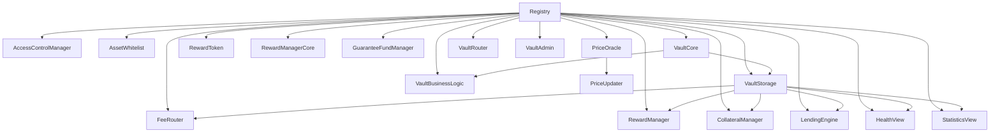

# 前端与智能合约连接完整指南

## 🎯 概述

本指南详细说明如何将前端应用与 RWA Lending Platform 智能合约进行连接，包括测试网部署、合约调用和前端集成。

当前这份总指南覆盖 legacy / 通用订单、AI Credits 与 blocks-only 三条主线读写口径。blocks-only 已纳入默认前端接入、默认上线 checklist 与默认联调要求，并按“交易收尾（trade closeout）/到期收尾（maturity closeout）+ 三层状态模型”实施。

### 前后端职责边界（2026-04-01）

当前仓库已经明确了前端、后端、索引器三层职责，本指南需要与以下两份文档保持一致：

1. [frontend-backend-unified-schema-ssot.md](frontend-backend-unified-schema-ssot.md)：定义表名、字段语义、模块归属、金额/时间/幂等口径。
2. [Usage-Guide/SaaS-Backend-Implementation-Guide.md](Usage-Guide/SaaS-Backend-Implementation-Guide.md)：定义 Prisma、迁移、索引器、RLS、多租户与链下读模型实现。

前端应按下面的边界工作：

1. 钱包发起的普通用户写操作，优先直连明确用户入口：`VaultCore`、`AICreditsVault`。
2. 借款成交不是 `VaultCore.borrow(...)` 直达账本模式，而是意向签名 + 公开撮合入口模式：`VaultBusinessLogic.finalizeMatch(...)`。谁来广播这笔成交交易，不由链上权限强制限定为“后端”；任何拿到完整 borrower/lender 签名、reserve 与撮合参数的一侧都可以发起。
3. `SettlementManager` 需要按角色区分：普通用户还款应走 `VaultCore.repay(...) -> SettlementManager.repayAndSettle(...)` 内部桥接；keeper/运营侧到期结算或清算才直接调用 `SettlementManager.settleOrLiquidate(orderId)`。
4. 用户当前态与系统当前态，应优先调用**按权限允许的专属链上 View**：普通钱包页默认主读 `PositionView`、`HealthView`、`StatisticsView`、`RewardView`；`SystemView`、`ValuationOracleView`、`ModuleHealthView`、部分 `LoanFlowView` / `LiquidatorView` / `FeeRouterView` 接口则更多属于后台、运维或诊断读面。
5. 历史列表、活动流、榜单、审计、跨页聚合、跨钱包搜索，不应由前端直接扫链拼装，应优先读取后端 read model / indexer API。

### 当前合约对齐补充（2026-04-01）

1. `Registry` 是模块地址唯一来源；前端不得再把手写地址表当作最高权威。
2. `KEY_STATS` 的 canonical key 是 `VAULT_STATISTICS`，当前读面对应 `StatisticsView`；不要创造 `STATISTICS_VIEW` 作为注册键。
3. `KEY_PRICE_UPDATER` 的业务名称统一叫 `PRICE_UPDATER`，但链上兼容 raw key 仍是 `COINGECKO_PRICE_UPDATER`。
4. `KEY_LIQUIDATION_VIEW` 的对外名称统一叫 `LiquidatorView`，不要把 `LiquidationView` 当正式契约名。
5. blocks-only 已纳入这份总指南的默认建模要求；字段、事件与 UX 必须按 `lifecycle + closeReason + shortfallStatus + collateralDisposition` 与 Funds-Flow 主线术语执行。

### 当前 legacy 清算补充（2026-04-15）

1. legacy / 通用订单的自动风险、自动清算、自动结算，当前必须按 strict authoritative valuation 理解；兼容读口 `getUserTotalDebtValue(...)` / `calculateDebtValue(...)` 只应当作 best-effort 兼容读。
2. legacy / 通用订单在抵押不足时，剩余债务不会再被隐式吞没；链上会显式写入 `IShortfallLedger`。`LiquidatedWithShortfall` / `DefaultedWithShortfall` 仅作为兼容读面标签，主终态判定必须回到三层状态快照。
3. 前端、客服、后端读模型都不得再用“liquidation 后 debt 看起来接近 0”去推断订单已经 clean close，必须读取显式 status 与 shortfall ledger。
4. blocks-only 已进入当前主线实施范围；应在本指南中按 trade closeout / maturity closeout 与三层状态模型展开具体接入步骤。

### 统一价格消费规则（新增 SSOT）

价格相关前端逻辑必须统一遵循下面这条链路：

1. 链下价格采集
2. 按目标资产 `assetDecimals` 归一化成链上价格
3. 统一调用 `PriceUpdater.updateAssetPrice`
4. 统一由 `PriceOracle` 存储
5. 前端只认链上最终价和链下发布状态

这意味着：

1. 前端不得直接消费 Google Finance、CoinGecko 或其他 source 的 raw 值做业务判断。
2. 前端不得把 `defaultPriceValue` 当成权威价格；这是字段名，值语义也要按资产 `assetDecimals` 解释。
3. 前端显示“价格可用”至少要同时满足：链上可读 + 链下 publish status 正常。

### 多链运行时配置规则（2026-04-13）

前端运行时配置现在统一按单一 release artifact 消费，规则文件见 [frontend-config/networks/README.md](../frontend-config/networks/README.md) 和 [frontend-config/networks/release-schema.ts](../frontend-config/networks/release-schema.ts)。

必须遵守：

1. 前端运行时不得直接读取 `core.json`。
2. 前端运行时不得自己拼接多个部署文件。
3. EVM 网络优先消费 `frontend-config/networks/<network>.release.json`。
4. 直接依赖本仓库代码的 TypeScript 前端读取 `frontend-config/networks/<network>.ts`。
5. 地址读取统一走 `contracts`。
6. 版本锚点统一走 `releaseId` 和 `generatedAt`。
7. 来源追踪统一走 `sourceFiles`。
8. 若需要知道某个地址对应哪个 Registry key，读取 `contracts.<ContractName>.registryKey`。
9. 当前这套统一规则仅覆盖本仓库维护的 EVM 网络，不包含 SVM。

## 📋 目录

1. [环境准备](#环境准备)
2. [智能合约部署流程](#智能合约部署流程)
3. [合约地址管理](#合约地址管理)
4. [前端集成方案](#前端集成方案)
5. [合约调用示例](#合约调用示例)
6. [测试和验证](#测试和验证)
7. [生产环境部署](#生产环境部署)
8. [模块键解码与前端配合](#模块键解码与前端配合)
9. [错误处理和调试](#错误处理和调试)
10. [CollateralManager（抵押账本）前端配合要点（2026-01）](#collateralmanager抵押账本前端配合要点2026-01)
11. [接口变更与迁移指南（2025-09）](#接口变更与迁移指南2025-09)
12. [缓存推送失败重试（CacheUpdateFailed）前端配合](#缓存推送失败重试cacheupdatefailed前端配合)
13. [资金链（Funds Flow / SSOT）前端配合（2026-01）](#资金链funds-flow--ssot前端配合2026-01)
14. [Block-based Deadline 与 ETA 映射（前端/keeper 必须遵守）](#block-based-deadline-与-eta-映射前端keeper-必须遵守)
15. [AI Credits 计费规范（按次计费：链上购买 + 链下扣次 + 多租户对账）](#ai-credits-计费规范按次计费链上购买--链下扣次--多租户对账)

## 🔧 环境准备

### 1. 环境变量配置

首先确保你的 `.env` 文件包含必要的配置：

```bash
# 网络配置
ARBITRUM_SEPOLIA_RPC_URL=https://sepolia-rollup.arbitrum.io/rpc
ARBITRUM_RPC_URL=https://arb1.arbitrum.io/rpc

# 部署账户
PRIVATE_KEY=your_private_key_here

# API Keys
ARBISCAN_API_KEY=your_arbiscan_api_key
ETHERSCAN_API_KEY=your_etherscan_api_key

# Gas 报告
REPORT_GAS=true
```

### 2. 检查环境配置

请参考 `docs/Usage-Guide/runbook/README.md` 中的标准检查流程。

### 3. 安全配置与钱包管理

#### 3.1. 环境变量安全配置

**创建环境变量文件**：

```bash
# 复制环境变量模板
cp env.example .env

# 编辑 .env 文件，填写真实值
# 注意：不要将 .env 文件提交到 Git 仓库
```

**环境变量模板**：
项目提供 `.env.template` 文件作为格式说明，包含：

- 网络 RPC URL 配置
- API 密钥配置
- 私钥配置（仅用于测试）
- Gas 报告配置
- 安全配置检查清单

#### 3.2. 钱包资产备份

**部署前备份钱包资产**：

请参考 `docs/Usage-Guide/runbook/README.md` 中的钱包资产与水龙头要求流程。

**备份功能特性**：

- ✅ 自动备份 ETH 余额
- ✅ 自动备份常见代币余额（USDC、WETH、ARB 等）
- ✅ 生成时间戳备份文件
- ✅ 支持多网络备份
- ✅ 防止意外转空钱包

**备份文件位置**：

```
scripts/secrets/backups/
├── wallet-backup-arbitrum-sepolia-2024-01-15T10-30-00-000Z.json
├── wallet-backup-arbitrum-sepolia-2024-01-15T11-45-00-000Z.json
└── ...
```

#### 3.3. 安全最佳实践

**私钥管理**：

- 🔒 使用测试钱包进行开发测试
- 🔒 主网私钥单独安全存储
- 🔒 定期更换私钥
- 🔒 使用硬件钱包存储大额资产

**环境隔离**：

- 🌐 测试网和主网使用不同钱包
- 🌐 开发环境和生产环境分离
- 🌐 定期清理测试环境

**备份策略**：

- 📁 定期备份钱包资产信息
- 📁 备份环境配置文件
- 📁 备份部署记录和合约地址
- 📁 使用加密存储敏感信息

**部署前检查清单**：

请根据需要查阅 `docs/Usage-Guide/runbook/README.md` 中的 `pnpm run cli` 与对应网络的测试流程。

## 🚀 智能合约部署流程

### 1. 部署顺序总览

由于合约系统高度模块化且存在复杂依赖关系，需要按照以下顺序分批部署：

#### 第一批：基础与注册中心

- **Registry**（全局模块注册表）
- **ModuleKeys**、**ActionKeys**（常量库，通常只需部署一次或直接用库）

#### 第二批：权限与白名单

- **AccessControlManager**（权限管理，建议用代理部署）
- **AssetWhitelist**（资产白名单，建议用代理部署）
- **AuthorityWhitelist**（如有需要）

#### 第三批：预言机与价格系统

- **PriceOracle**（价格预言机）
- **PriceUpdater**（价格更新器）
- **ValuationOracleView**（价格只读门面；健康检查走 `GracefulDegradation`，不要求 oracle 合约实现额外 health 方法）

#### 第四批：核心业务与奖励系统

- **FeeRouter**（手续费路由，建议用代理部署）
- **RewardToken**（奖励通证；SSOT = `Registry[KEY_EASY_TOKEN]`（EasyToken））
- **RewardManagerCore**、**RewardManager**（奖励管理，建议用代理部署）
- **RewardConfig**（治理写入口聚合，如需）
- **EarnConfig / EasyEmissionConfig / FeatureRegistry / GovernanceGate**（Reward 子模块；通过 Registry 解析）

#### 第五批：Vault 相关

- **CollateralManager**、**LendingEngine / VaultLendingEngine**、**HealthView**、**StatisticsView（替代 VaultStatistics）**、**GuaranteeFundManager**（均建议用代理部署）
- **VaultStorage**（需要前面所有模块的地址，建议用代理部署）
- **VaultBusinessLogic**（如有）
- **VaultCore**（需要 VaultStorage 和业务逻辑模块地址，建议用代理部署）
- **VaultRouter**、**VaultAdmin**（如有）

#### 第六批：其他模块

- **LoanNFT**、**RWAToken**、**Mock 合约**等

### 2. 详细部署步骤与依赖说明

#### 1. Registry

- 先部署 Registry，后续所有模块地址都注册到这里。

#### 2. 权限与白名单

- AccessControlManager、AssetWhitelist、AuthorityWhitelist（如有）都可以独立部署，但后续需要注册到 Registry。

#### 3. 预言机系统

- 先部署 PriceOracle，再部署 PriceUpdater，并初始化二者的互相关联。
- **ValuationOracleView** 依赖 `Registry(KEY_PRICE_ORACLE)`，作为前端/运维的价格只读门面；
  其 oracle 健康检查通过 `GracefulDegradation.checkPriceOracleHealth(...)` 实现（不要求 `PriceOracle` 提供额外 health 方法）。

#### 4. 奖励系统

- 先部署奖励通证（SSOT = `Registry[KEY_EASY_TOKEN]`（EasyToken）），再部署 RewardManagerCore、RewardManager。
- RewardManager/RewardManagerCore 均以 **Registry** 作为唯一依赖入口（`initialize(registry)`）：
  - RewardToken / RewardManagerCore 等模块地址通过 `Registry.getModuleOrRevert(ModuleKeys.*)` 解析（避免在构造/initialize 里传入多地址导致指针漂移）。
  - 部署后务必在 Registry 中绑定 `KEY_EASY_TOKEN`、`KEY_REWARD_MANAGER_CORE` 等必要模块，否则写路径会因 `ModuleNotRegistered` revert。
- RewardConfig（如启用）可用于聚合治理写入口；EarnConfig、EasyEmissionConfig 等参数模块建议先部署并注册到 Registry。

#### 5. Vault 相关

- 先部署 CollateralManager、LendingEngine/VaultLendingEngine、HealthView、StatisticsView（替代 VaultStatistics）、GuaranteeFundManager（这些都需要 Registry 地址）。
- 部署 VaultStorage 时，需要传入上述所有模块的地址，以及 RWA Token、结算Token地址。
- 部署 VaultBusinessLogic（如有）。
- 部署 VaultCore 时，需要 VaultStorage 和业务逻辑模块的地址。
- VaultRouter、VaultAdmin 依赖 VaultStorage。

#### 6. 其他

- LoanNFT、RWAToken 等可在主业务部署后部署。

### 3. 自动化部署脚本

部署动作现已由对应的 `pnpm run deploy:*` 和集成 Runbook 管理。具体部署与验证指令（如 `localhost` 测试或 `arbitrum-sepolia`/`bnb-testnet`），请**强制参考**并执行以下 SSOT：

- `docs/Usage-Guide/runbook/README.md`
- `docs/Usage-Guide/runbook/Deploy-Testnet-BNB.md`

#### 选择测试网络与执行部署

请不要尝试直接在命令行拼接参数，而是调用 `pnpm` 中声明的 preflight 与 deploy 脚本：

```bash
# 执行 BNB Testnet Live Deploy Preflight
pnpm run deploy:preflight:bnb-testnet

# 实际执行部署
pnpm run deploy:bnb-testnet
```

### 4. 典型部署依赖关系图


```mermaid
graph TD
  Registry --> AccessControlManager
  Registry --> AssetWhitelist
  Registry --> PriceOracle
  Registry --> FeeRouter
  Registry --> RewardToken
  Registry --> RewardManagerCore
  Registry --> RewardManager
  Registry --> CollateralManager
  Registry --> LendingEngine
  Registry --> HealthView
  Registry --> StatisticsView
  Registry --> GuaranteeFundManager
  Registry --> VaultStorage
  Registry --> VaultCore
  Registry --> VaultBusinessLogic
  Registry --> VaultRouter
  Registry --> VaultAdmin
  PriceOracle --> PriceUpdater
  VaultStorage --> CollateralManager
  VaultStorage --> LendingEngine
  VaultStorage --> HealthView
  VaultStorage --> StatisticsView
  VaultStorage --> FeeRouter
  VaultStorage --> RewardManager
  VaultCore --> VaultStorage
  VaultCore --> VaultBusinessLogic
```

### 5. 部署最佳实践

#### 重要提醒

- 每部署一个合约，务必记录其地址，并及时注册到 Registry
- 部署 VaultStorage 时，务必确保所有依赖模块都已部署并地址可用
- 建议每批部署后，运行一次合约初始化和权限配置脚本
- 前端集成时，使用自动生成的合约地址配置文件

#### 环境检查

部署与依赖一致性的检查已经内置在 `deploy:preflight` 和 `test:live:preflight` 脚本流程中。具体要求请参考 `runbook`。

## 📍 合约地址管理

### 1. 部署记录文件

部署完成后，前端相关的地址与模块键权威来源如下：

```bash
# 链地址快照（前端推荐直接消费）
frontend-config/contracts-arbitrum-sepolia.ts
frontend-config/contracts-arbitrum.ts
frontend-config/contracts-localhost.ts

# 模块键 SSOT
frontend-config/moduleKeys.ts

# Registry 查询辅助
frontend-config/registry-service.ts

# 部署/链下记录
deployments/*.json
```

前端如果在独立仓库中开发，建议把 `frontend-config/` 作为同步产物引入，而不是在应用侧再维护一份手写地址常量。

### 2. 地址格式示例

```json
{
  "Registry": "0x...",
  "VaultCore": "0x...",
  "SettlementManager": "0x...",
  "BlocksOnlyCoordinator": "0x...",
  "VaultRouter": "0x...",
  "PositionView": "0x...",
  "HealthView": "0x...",
  "StatisticsView": "0x...",
  "LoanFlowView": "0x...",
  "RewardView": "0x...",
  "FeeRouterView": "0x...",
  "LiquidatorView": "0x...",
  "BlocksOnlyView": "0x...",
  "AICreditsVault": "0x...",
  "EasyToken": "0x..."
}
```

### 3. 前端地址配置

推荐直接基于仓库现有 `frontend-config/contracts-*.ts` 生成运行时映射，而不是在应用层再创建第二份手写配置：

```typescript
import {
  CONTRACT_ADDRESSES as ARBITRUM_SEPOLIA_ADDRESSES,
  NETWORK_CONFIG as ARBITRUM_SEPOLIA_NETWORK,
} from "../../frontend-config/contracts-arbitrum-sepolia";
import {
  CONTRACT_ADDRESSES as ARBITRUM_ADDRESSES,
  NETWORK_CONFIG as ARBITRUM_NETWORK,
} from "../../frontend-config/contracts-arbitrum";

export const ADDRESS_BOOK = {
  arbitrumSepolia: {
    addresses: ARBITRUM_SEPOLIA_ADDRESSES,
    network: ARBITRUM_SEPOLIA_NETWORK,
  },
  arbitrum: {
    addresses: ARBITRUM_ADDRESSES,
    network: ARBITRUM_NETWORK,
  },
} as const;

export type SupportedNetwork = keyof typeof ADDRESS_BOOK;

export function getAddressBook(network: SupportedNetwork) {
  return ADDRESS_BOOK[network];
}
```

补充约束：

1. `frontend-config/contracts-*.ts` 是“已解析地址快照”；适合首屏加载、降级模式和离线环境。
2. 真正的模块权威来源仍然是 `Registry`；对于经常升级的 View，前端应支持按 module key 动态解析并做本地缓存。
3. `frontend-config/moduleKeys.ts` 与 `src/constants/ModuleKeys.sol` 必须视为同一份 SSOT，禁止在前端重写第三套 key 字符串。

## 🌐 前端集成方案

### 1. 使用 Ethers.js

```typescript
// src/utils/contracts.ts
import { BrowserProvider, Contract } from "ethers";
import { getAddressBook, type SupportedNetwork } from "../config/contracts";
import { getModuleKeyHash, type ModuleKeyName } from "../../frontend-config/moduleKeys";

const REGISTRY_ABI = [
  "function getModule(bytes32 key) external view returns (address)",
];

export class RegistryAwareContractManager {
  private provider!: BrowserProvider;
  private signer: any;
  private readonly network: SupportedNetwork;
  private moduleAddressCache = new Map<string, string>();

  constructor(network: SupportedNetwork) {
    this.network = network;
  }

  async connectWallet() {
    if (typeof window.ethereum !== "undefined") {
      await window.ethereum.request({ method: "eth_requestAccounts" });
      this.provider = new BrowserProvider(window.ethereum);
      this.signer = await this.provider.getSigner();
    } else {
      throw new Error("MetaMask not found");
    }
  }

  private getRegistry() {
    const { addresses } = getAddressBook(this.network);
    return new Contract(addresses.Registry, REGISTRY_ABI, this.signer ?? this.provider);
  }

  async getModuleAddress(moduleKeyName: ModuleKeyName) {
    if (this.moduleAddressCache.has(moduleKeyName)) {
      return this.moduleAddressCache.get(moduleKeyName)!;
    }

    const registry = this.getRegistry();
    const addr = await registry.getModule(getModuleKeyHash(moduleKeyName));
    if (!addr || /^0x0{40}$/i.test(addr)) {
      throw new Error(`Module ${moduleKeyName} is not registered`);
    }

    this.moduleAddressCache.set(moduleKeyName, addr);
    return addr;
  }

  async getStatisticsView() {
    const address = await this.getModuleAddress("KEY_STATS");
    return new Contract(
      address,
      [
        "function getGlobalStatisticsWithMeta() view returns ((uint256 totalUsers, uint256 activeUsers, uint256 totalCollateral, uint256 totalDebt, uint256 lastUpdateBlock), bool isValid, uint256 blockNumber)",
      ],
      this.signer ?? this.provider,
    );
  }

  async getHealthView() {
    const address = await this.getModuleAddress("KEY_HEALTH_VIEW");
    return new Contract(
      address,
      [
        "function getUserHealthFactorWithMeta(address user) view returns (uint256 healthFactor, bool isValid, uint256 blockNumber)",
      ],
      this.signer ?? this.provider,
    );
  }

  async getRewardView() {
    const address = await this.getModuleAddress("KEY_REWARD_VIEW");
    return new Contract(
      address,
      [
        "function getUserBalanceWithMeta(address user) view returns (uint256 balance, uint256 blockNumber, bool isValid)",
        "function getUserRewardSummaryWithMeta(address user) view returns (uint256 totalBurned, uint256 pendingPenalty, uint8 level, uint256 lastActivity, uint256 blockNumber, bool isValid)",
      ],
      this.signer ?? this.provider,
    );
  }

  async getVaultCore() {
    const { addresses } = getAddressBook(this.network);
    return new Contract(
      addresses.VaultCore,
      [
        "function deposit(address asset, uint256 amount) external",
        "function withdraw(address asset, uint256 amount) external",
        "function repay(uint256 orderId, address debtAsset, uint256 amount) external",
      ],
      this.signer ?? this.provider,
    );
  }
}
```

### 2. 使用 React Hooks（新增 RewardView 查询示例）

```typescript
// src/hooks/useContracts.ts
import { useState, useEffect } from "react";
import { RegistryAwareContractManager } from "../utils/contracts";

export function useContracts() {
  const [contractManager, setContractManager] =
    useState<RegistryAwareContractManager | null>(null);
  const [isConnected, setIsConnected] = useState(false);
  const [loading, setLoading] = useState(true);

  useEffect(() => {
    const initContracts = async () => {
      try {
        const manager = new RegistryAwareContractManager("arbitrumSepolia");
        await manager.connectWallet();
        setContractManager(manager);
        setIsConnected(true);
      } catch (error) {
        console.error("Failed to connect contracts:", error);
      } finally {
        setLoading(false);
      }
    };

    initContracts();
  }, []);

  return { contractManager, isConnected, loading };
}
```

### 3. React 组件示例

```typescript
// src/components/VaultInterface.tsx
import React, { useState, useEffect } from 'react';
import { useContracts } from '../hooks/useContracts';

export function VaultInterface() {
  const { contractManager, isConnected, loading } = useContracts();
  const [stats, setStats] = useState<any>(null);

  useEffect(() => {
    if (contractManager && isConnected) {
      loadStats();
    }
  }, [contractManager, isConnected]);

  const loadStats = async () => {
    try {
      const statisticsView = await contractManager!.getStatisticsView();
      const [globalStats, isValid, blockNumber] =
        await statisticsView.getGlobalStatisticsWithMeta();
      setStats({
        data: globalStats,
        meta: { isValid, blockNumber },
      });
    } catch (error) {
      console.error('Failed to load statistics:', error);
    }
  };

  if (loading) return <div>Loading...</div>;
  if (!isConnected) return <div>Please connect your wallet</div>;

  return (
    <div>
      <h2>Protocol Statistics</h2>
      <pre>{JSON.stringify(stats, null, 2)}</pre>
    </div>
  );
}
```

### 4. 前端直连链上 vs 读取后端读模型

前端不要把所有页面都做成“浏览器直接扫链”。当前推荐分层如下：

| 场景 | 首选来源 | 说明 |
| --- | --- | --- |
| 用户发起交易 | 链上写入口合约 | 普通用户资金动作走 `VaultCore` / `AICreditsVault`；借款成交默认由前端收集 borrower/lender 签名、确认 reserve、组装参数后直接调用公开撮合入口 `VaultBusinessLogic.finalizeMatch(...)`；`SettlementManager` 仅在 keeper/运营结算清算时直接调用 |
| 钱包当前仓位、健康因子、单用户奖励 | 链上 View | 默认主读 `PositionView` / `HealthView` / `RewardView`；`FeeRouterView` 只作费用补充与同步诊断 |
| 系统总览卡片 | 链上 View | 首屏与单页当前态优先读取 `StatisticsView`；`LoanFlowView` 仅在确实需要流量/资格分析时补充，不应替代统计主卡 |
| 历史记录、活动流、榜单、后台筛选 | 后端 read model API | 由 `chain_events` + 各类读模型表提供，不要前端自己扫日志 |
| Registry/模块调试页 | `RegistryView` 或后端 `registry_modules` | 调试界面可以直连链上；运营后台更建议读后端快照 |

### 4.1 前端-合约接入矩阵（目标架构）

状态口径：

- `已接入`：当前合约已经有适合前端直连的真实入口或主读面，且本指南要求前端按该入口接入。
- `未接入`：规范希望前端使用，但当前合约或现有接入层还缺少适合直接承接该职责的入口。
- `仅诊断使用`：已有 ABI/地址与只读聚合能力，但不应作为普通业务主路径。

| 合约 / 模块 | 规范定位 | 当前状态 | 前端接入要求 |
| --- | --- | --- | --- |
| `VaultCore` | 标准产品线普通用户写入口 | 已接入 | 前端钱包直接调用 `deposit(...)` / `withdraw(...)` / `repay(...)`；不要再把普通用户资金动作回退为“前端签名 + 后端命令执行”。 |
| `SettlementManager` | keeper / 运营结算与清算写入口 | 已接入 | 真实公开交易入口是 `settleOrLiquidate(orderId)`；但普通用户还款仍应走 `VaultCore.repay(...) -> SettlementManager.repayAndSettle(...)`，不要把 `repayAndSettle(...)` 暴露成普通用户按钮。 |
| `BlocksOnlyCoordinator` | blocks-only 产品写入口 | 已接入 | blocks-only 已进入主线接入范围，但必须按 trade-like 交割实现接入：`finalizeMatchBlocks(...)` 创建 `ACTIVE + COORDINATOR_CUSTODY`，`repayBlocks(...)` 只会把订单推进到 debt-free 的 `REPAID`，真正关闭要么走 `closeRepaidTradeBlocks(...)`，要么到 maturity 后走 `settleOrLiquidateBlocks(...)`。 |
| `FeeRouter` | 费用路由写入口 | 仅诊断使用 | 协议内部会写入 FeeRouter，但普通业务前端不应直接调用它作为主入口；保留给运维、对账、专项调试。 |
| `AICreditsVault` | AI Credits 钱包购买入口 | 已接入 | 前端钱包直接调用 `buyCredits(...)`；后端只保留 usage 扣次、批量结算与审计。 |
| `PositionView` | 用户仓位主读面 | 已接入 | 当前仓位、抵押、债务、order 相关用户当前态优先直读链上，不再以 backend projection 为主。 |
| `HealthView` | 用户健康度主读面 | 已接入 | 用户风险、健康因子、清算边界等当前态直读链上；跨用户筛选或后台巡检才使用后端聚合。 |
| `DashboardView` | 聚合仪表盘读面 | 仅诊断使用 | 可以用于调试页、诊断页、可选聚合页，但不应替代 Position/Health/Statistics/Reward 这些专属 SSOT 读面。 |
| `RewardView` | 奖励当前态主读面 | 已接入 | 单用户奖励余额、锁仓、罚金、资格状态以链上主读；后端只保留历史、排行、审计和大分页聚合。 |
| `StatisticsView` | 系统当前态统计主读面 | 已接入 | 单页系统统计卡片优先链上读取；只有跨页快照固化、历史趋势和榜单聚合才下沉到后端 read model。 |

### 4.1.1 读权限收紧版矩阵（按源码真实 gate）

这一张表不是按“模块名字听起来像前端还是后端”分类，而是按**当前合约真实权限语义**分类。判断规则如下：

1. `普通用户可直读`：普通钱包在不持有额外运营角色时，仍可通过 self-read 或 public read 读到自己页面所需的主数据。
2. `仅后台可读`：默认依赖 `ActionKeys.ACTION_VIEW_SYSTEM_DATA`、`ActionKeys.ACTION_VIEW_PRICE_DATA`、`ActionKeys.ACTION_VIEW_RISK_DATA`、`ActionKeys.ACTION_VIEW_SYSTEM_STATUS`、`ActionKeys.ACTION_VIEW_LIQUIDATION_DATA` 或 admin 级角色，不应作为普通钱包页主读。
3. `仅诊断使用`：模块内可能有部分 self-read 或 public read，但它的默认职责是路由、聚合、权限探测、诊断或运营辅助，不应取代专属 SSOT 读面。

> 注意：同一个模块里可能同时存在 self-read 和 ops/admin read。本表按**普通产品前端默认落点**归类，不代表该模块全部方法都同权。

| 模块 | 默认归类 | 典型可用方法 | 权限事实 | 前端落点 |
| --- | --- | --- | --- | --- |
| `PositionView` | 普通用户可直读 | `getUserPositionWithMeta(user, asset)`、`getUserCacheStatusWithMeta(user)` | 单用户仓位走 Scheme U self-read；但 `batchGetUserPositionsWithMeta(...)` 是 ops/admin，`getUserTotalCollateralValue(user)` 还要求 `ActionKeys.ACTION_VIEW_RISK_DATA` 或 admin。 | 作为仓位页、抵押/债务卡片主读；不要把估值口径方法误当成所有钱包页都可直读。 |
| `HealthView` | 普通用户可直读 | `getUserHealthFactorWithMeta(user)` | 单用户健康因子走 Scheme U self-read；`batchGetHealthFactorsWithMeta(...)` 仅 ops/admin。 | 作为用户风险页、健康因子提示主读。 |
| `RewardView` | 普通用户可直读 | `getUserBalanceWithMeta(user)`、`getUserRewardSummaryWithMeta(user)`、`getUserEarnStateWithMeta(user)` | 用户奖励相关读面走 Scheme U self-read；`getSystemRewardStatsWithMeta()` 等系统统计需要 `ActionKeys.ACTION_VIEW_SYSTEM_DATA` / admin。 | 作为奖励中心、锁仓/罚金/等级主读。 |
| `StatisticsView` | 普通用户可直读 | `getGlobalStatisticsWithMeta()`、`getGlobalSnapshotWithMeta()`、`getUserSnapshotWithMeta(user)` | 全局统计快照是 public read；用户快照、担保余额、最后活跃块高走 Scheme U self-read。 | 适合首页统计卡片和用户自己的统计快照。 |
| `BlocksOnlyView` | 普通用户可直读 | `getBlocksOnlyOrder(orderId)`、`getBlocksOnlyOrderState(orderId)`、`getBorrowerOrdersPaginated(...)`、`getSystemOrdersPaginated(...)` | borrower/lender 可读取自己参与的订单，非参与者仍需 `ACTION_VIEW_USER_DATA` 或 `ACTION_ADMIN`；显式生命周期必须以 `getBlocksOnlyOrderState(orderId)` 为准；分页接口当前返回三层状态对象（`runtime + lifecycle + closeReason + shortfallStatus + collateralDisposition + hasLoss`），不再返回纯 runtime 数组。 | 作为 blocks-only 订单详情、列表页、trade close / maturity close 当前态、keeper 收敛校验的主读面。 |
| `DashboardView` | 仅诊断使用 | `getUserOverviewWithMeta(user, trackedAssets)` | 聚合总览本身走 Scheme U self-read，但它是 Position/Health/SystemRisk 的聚合门面；`getUserAssetBreakdownWithMeta(...)` 还叠加 `ActionKeys.ACTION_VIEW_PRICE_DATA`。 | 可做个人 dashboard 或调试页，但不应替代 Position/Health/Statistics/Reward 专属读面。 |
| `FeeRouterView` | 仅诊断使用 | `getSyncStatus()`、`getUserFeeStatisticsWithMeta(user, feeType)`、`getUserStatsWithMeta(user)` | 有 self-read 用户费率/费用统计，也有 admin-only 全局统计；同时承担同步健康检查。 | 适合作为费用中心补充页和 observability 页，不是主业务首页读面。 |
| `UserView` | 仅诊断使用 | 用户聚合类接口 | 模块整体走 Scheme U；但职责是聚合门面而非底层 SSOT。 | 只适合聚合页或过渡层，不应替代 Position/Health/Reward/Statistics。 |
| `LoanFlowView` | 仅诊断使用 | 用户维度 loan-flow 接口 | 用户维度接口走 Scheme U；系统级或批量统计需要 `ActionKeys.ACTION_VIEW_SYSTEM_DATA` / admin。 | 适合作为资金流分析、奖励资格分析、诊断补充，不是普通钱包页首选主读。 |
| `AccessControlView` | 仅诊断使用 | `getUserPermissionWithMeta(user, actionKey)`、`getUserPermissionLevelWithMeta(user)` | 读权限缓存走 Scheme U self-read。 | 只用于权限 preflight、调试、BFF 诊断，不是业务数据读面。 |
| `RegistryView` | 仅诊断使用 | `getAllRegisteredModules()`、`getRegisteredModuleKeysPaginated(...)` | 目前是 public read，无额外 view role。 | 适合地址发现、预检、版本排障；不承载业务当前态。 |
| `SystemView` | 仅后台可读 | `getModule(...)`、`routeStatistics()`、`routeReward()`、`routePosition()` | 几乎所有模块路由/发现接口都要求 `ActionKeys.ACTION_VIEW_SYSTEM_DATA`。 | 给后台、运维、只读网关做模块路由和预检；普通钱包页不要把它当首选入口。 |
| `ModuleHealthView` | 仅后台可读 | `getModuleHealthStatus(module)` | 需要 `ActionKeys.ACTION_VIEW_SYSTEM_STATUS` 或 admin。 | 纯运维/监控页。 |
| `ValuationOracleView` | 仅后台可读 | `getAssetPrice(...)`、`getAssetPriceWithDecimals(...)`、`getAssetPrices(...)` | 价格读面要求 `ActionKeys.ACTION_VIEW_PRICE_DATA`。 | 给后台估值、风控、预检或只读网关使用；普通钱包页不要默认直连。 |
| `LiquidatorView` | 仅诊断使用 | `getUserLiquidationStats(user)`、`getSeizableCollaterals(user)`、`getSystemLiquidationSnapshot()` | 用户维度统计走 Scheme U self-read，但清算估值/排行榜/系统视图分别要求 `ActionKeys.ACTION_VIEW_LIQUIDATION_DATA`、`ActionKeys.ACTION_VIEW_SYSTEM_DATA`、`ActionKeys.ACTION_VIEW_RISK_DATA` 等更高权限。 | 适合清算控制台、诊断页、收益页；不应替代普通用户主仓位读面。 |

### 4.2 源码核对版前端接入清单（按方法级）

这一节直接对照当前仓库合约源码，回答三个问题：

1. 前端真正应该接哪个合约。
2. 应该调用哪些公开方法。
3. 哪些方法虽然存在，但不应当作为普通前端主路径。

#### A. 成交广播主入口：VaultBusinessLogic

这是借贷主流程里最容易被说错的模块。当前主线里，legacy / 通用订单的成交广播不应表述成“只能后端命令执行”。当前真实公开入口如下：

| 合约 | 前端应接方法 | 前端必须准备的输入 | 前端不要误用的点 |
| --- | --- | --- | --- |
| `VaultBusinessLogic` | `finalizeMatch(...)` | `BorrowIntent`、`LendIntent[]`、borrower 签名、lender 签名数组 | 不要把 `VaultCore.borrowFor(...)` 当成普通用户入口；它是下游编排点。 |

前端对照源码必须满足的撮合职责：

1. 自己收 borrower 签名，也自己拿 lenderSigner 的签名。
2. 先确认 lender reserve 已经存在，且被消费的 reserve 资产必须等于 borrowAsset。
3. 自己组装完整参数，再发交易。
4. 自己处理签名过期、reserve 不足、asset mismatch、term/rate 不匹配等失败场景。

`finalizeMatch(...)` 对应的标准 intent 结构来自 [src/libraries/SettlementIntentLib.sol](src/libraries/SettlementIntentLib.sol)：

| 结构体 | 字段 |
| --- | --- |
| `BorrowIntent` | `borrower`、`collateralAsset`、`collateralAmount`、`borrowAsset`、`amount`、`termDays`、`rateBps`、`expireAt`、`salt` |
| `LendIntent` | `lenderSigner`、`asset`、`amount`、`minTermDays`、`maxTermDays`、`minRateBps`、`expireAt`、`salt` |

前端签名口径必须与源码保持一致：

1. EIP-712 domain 固定是 `name = "RwaLending"`、`version = "1"`、`chainId = 当前链`、`verifyingContract = VaultBusinessLogic 地址`。
2. `expireAt` 在当前仓库里语义是 expireBlock，不是 unix timestamp。
3. 本节聚焦 legacy / 通用订单的 `finalizeMatch(...)` 签名口径；blocks-only 撮合与收尾请按本指南 blocks-only 专节及 Funds-Flow 主线口径执行。

#### B. 普通用户资金写入口：VaultCore

`VaultCore` 是普通用户最主要的钱包直连接口。对照 [src/interfaces/IVaultCore.sol](src/interfaces/IVaultCore.sol) 和 [src/Vault/VaultCore.sol](src/Vault/VaultCore.sol)，前端应接下面这些方法：

| 方法 | 用途 | 前置条件 | 备注 |
| --- | --- | --- | --- |
| `deposit(asset, amount)` | 单资产存入抵押 | `asset != 0`、`amount > 0`，并且用户先给 `CollateralManager` 做 ERC20 approve | `VaultCore` 会走 `VaultRouter.processUserOperation(...)`；不要把 approve spender 配成 VaultCore。 |
| `withdraw(asset, amount)` | 单资产提取抵押 | `asset != 0`、`amount > 0` | 仍然走 `VaultRouter -> CollateralManager`。 |
| `repay(orderId, asset, amount)` | 普通订单还款 | `asset != 0`、`amount > 0`，并且用户先给 `VaultCore` 做 debt asset approve | `VaultCore` 会先把钱转给 `SettlementManager`，再调用 `repayAndSettle(...)`。 |
| `batchDeposit(assets, amounts)` | 批量存款 | 长度一致、非空、不能超过 batch cap | 适合资产篮子充值页。 |
| `batchWithdraw(assets, amounts)` | 批量提款 | 长度一致、非空、不能超过 batch cap | 适合批量释放抵押。 |
| `batchRepay(orderIds, assets, amounts)` | 批量还款 | 长度一致、非空、不能超过 batch cap | 前端可做批量债务处理，但要控制 gas。 |

`VaultCore` 里这些方法不应被前端当作主入口：

| 方法 | 原因 |
| --- | --- |
| `borrowFor(...)` | 只允许业务编排模块调用，不是普通用户借款入口。 |
| `repayFor(...)` | 只允许 `OrderEngine` 做内部账本同步。 |

#### C. keeper / 运营写入口：SettlementManager

`SettlementManager` 在前端文案里不能再被笼统描述成“普通用户入口”。对照 [src/interfaces/ISettlementManager.sol](src/interfaces/ISettlementManager.sol) 和 [src/Vault/liquidation/modules/SettlementManager.sol](src/Vault/liquidation/modules/SettlementManager.sol)，它有两条完全不同的路径：

| 方法 | 前端是否应直接调用 | 谁来调 | 说明 |
| --- | --- | --- | --- |
| `repayAndSettle(user, debtAsset, repayAmount, orderId)` | 否 | 仅 VaultCore | 这是内部桥接函数，源码有 `onlyVaultCore`。普通用户不要直接碰。 |
| `settleOrLiquidate(orderId)` | 是，但只限 keeper/运营前端 | keeper、机器人、运营钱包 | 真实公开清算入口，需要 `ActionKeys.ACTION_LIQUIDATE`；borrower 不能 self-liquidate。 |

前端实现 keeper 控制面时，必须额外理解这些行为：

1. 只有到期或风险可清算时才能成功，否则会触发 `SettlementManager__NotLiquidatable()`。
2. 普通订单走这里；blocks-only 当前不在这份总指南的默认 keeper/前端范围内。
3. 清算入口内部会读 `ORDER_ENGINE`、`PositionView`、`LiquidationRiskManager`、`LiquidationManager`，因此前端只负责交易发起和错误解码，不要在浏览器里复制一套清算逻辑。
4. 对 legacy / 通用订单，`settleOrLiquidate(orderId)` 成功后并不保证一定 clean close；若抵押不足，终态要通过 `LendingEngineView.getOrderStateSnapshot(orderId)` 中的 `lifecycle + shortfallStatus + collateralDisposition` 联合判定，而不是再依赖旧的混合枚举名。
5. keeper UI 在交易确认后应额外读取 `SettlementManager.getShortfallLedger(orderId)` / `hasActiveShortfall(orderId)`，并与 `LendingEngineView.getOrderStateSnapshot(orderId)` 对齐，而不是只看 `PayoutExecuted` 或 debt delta。
6. 兼容的 `getUserTotalDebtValue(...)` / `calculateDebtValue(...)` 不能再作为 keeper 预检的 authoritative 数据源；自动决策应依赖链上 strict 路径。

#### D. blocks-only 产品写入口：BlocksOnlyCoordinator

当前 blocks-only 已纳入主线接入范围，但必须按它独立的 trade-like 交割模型接入，不能再套用 legacy / 通用订单的 keeper/liquidation 语义。对照 [src/interfaces/IBlocksOnlyCoordinator.sol](src/interfaces/IBlocksOnlyCoordinator.sol) 与 [src/blocks-only/BlocksOnlyCoordinator.sol](src/blocks-only/BlocksOnlyCoordinator.sol)，前端/keeper 需要把下面几条当成当前实现事实：

1. `finalizeMatchBlocks(...)` 创建的是 `ACTIVE + COORDINATOR_CUSTODY`，而不是传统贷款的“创建后等待 settleOrLiquidate”。
2. `repayBlocks(...)` 只会把订单推进到 debt-free 但仍 open 的 `REPAID`；不得从 `remainingDebt == 0` 或 `repaidPrincipal` 反推订单已 closed。
3. debt-free trade close 必须显式调用 `closeRepaidTradeBlocks(orderId)`，对应 `CLOSED + BLOCKS_TRADE_CLOSE + RETURNED_TO_BORROWER`。
4. maturity 之后 keeper 走 `settleOrLiquidateBlocks(orderId)`，其结果是 blocks-only maturity close，而不是通用 liquidation：
  - debt-free maturity close：`CLOSED + BLOCKS_MATURITY_CLOSE + RETURNED_TO_BORROWER`
  - unpaid maturity close：`CLOSED + BLOCKS_MATURITY_CLOSE + DELIVERED_TO_LENDER`
5. 显式状态必须读取 `BlocksOnlyView.getBlocksOnlyOrderState(orderId)`；`getBlocksOnlyOrder(orderId)` 里的 `status / remainingDebt / canCloseTrade` 只用于运行时辅助显示与兼容校验。

#### E. AI Credits 钱包写入口：AICreditsVault

对照 [src/interfaces/IAICreditsVault.sol](src/interfaces/IAICreditsVault.sol) 和 [src/core/AICreditsVault.sol](src/core/AICreditsVault.sol)：

| 方法 | 前端用途 | 关键限制 |
| --- | --- | --- |
| `creditsBalance(tenantId, user)` | 查询链上审计余额 | 返回的是 credits 自然数，不是 ERC20 decimals。 |
| `buyCredits(tenantId, payToken, payAmount, credits, clientOrderId)` | 用户钱包购买 credits | `clientOrderId` 不能为 0；同一 `(tenantId, user, clientOrderId)` 只能用一次；`payAmount` 必须精确等于 `credits * unitPrice`。 |
| `settleBatch(...)` | 否，普通前端不接 | 这是 operator 批量扣次入口，需要 `ACTION_SET_PARAMETER`。 |

#### F. 当前态主读：PositionView / HealthView / RewardView / StatisticsView

这些 View 才是用户当前态页面的主读面。后端 projection 不应再抢主读职责。

`PositionView` 对照 [src/interfaces/IPositionView.sol](src/interfaces/IPositionView.sol) 和 [src/Vault/view/modules/PositionView.sol](src/Vault/view/modules/PositionView.sol)：

| 方法 | 页面用途 | 权限语义 |
| --- | --- | --- |
| `getUserPositionWithMeta(user, asset)` | 单资产仓位卡片 | self-read 允许；跨用户读通常需要 `ACTION_VIEW_USER_DATA` / `ACTION_ADMIN`。 |
| `batchGetUserPositionsWithMeta(users, assets)` | 批量运维视图 | 普通用户前端不要拿它枚举全站用户。 |
| `getUserTotalCollateralValue(user)` | 汇总抵押值 | 这是估值读口径，源码要求 `ACTION_VIEW_RISK_DATA` 或 admin；不能默认当成普通钱包页稳定主读。 |
| `getUserCacheStatusWithMeta(user)` | 诊断缓存有效性 | 真实签名只有 `user` 一个参数，适合 debug/diagnostic 页。 |

`HealthView` 对照 [src/Vault/view/modules/HealthView.sol](src/Vault/view/modules/HealthView.sol)：

| 方法 | 页面用途 | 权限语义 |
| --- | --- | --- |
| `getUserHealthFactorWithMeta(user)` | 用户健康因子、风险提示 | self-read 允许；跨用户读需要 viewer/admin。 |
| `batchGetHealthFactorsWithMeta(users)` | 风控后台、运营批量看盘 | 这是枚举型批量读取，不适合普通钱包页。 |

`RewardView` 对照 [src/Vault/view/modules/RewardView.sol](src/Vault/view/modules/RewardView.sol)：

| 方法 | 页面用途 | 权限语义 |
| --- | --- | --- |
| `getUserBalanceWithMeta(user)` | Easy 余额卡片 | 用户自查主入口。 |
| `getUserRewardSummaryWithMeta(user)` | 奖励中心摘要 | 返回 `totalBurned`、`pendingPenalty`、`level`、`lastActivity` 等。 |
| `getUserEarnStateWithMeta(user)` | 锁仓/资格状态 | 返回 `lockedEasy`、`eligibleLoanCount`、`onTimeRepayCount`。 |
| `getUserEasyEarnedWithMeta(user)` | 已赚取 Easy | 适合奖励流水总览。 |
| `getUserEasyStakedWithMeta(user)` | 已质押 Easy | 适合 staking 卡片。 |
| `getUserEasySpentWithMeta(user)` | 已消费 Easy | 适合消费/回收页面。 |
| `getUserRecentActivitiesWithMeta(user, fromBlock, toBlock, limit)` | 用户近期奖励活动 | 适合近 N 条活动窗口；全量历史仍建议后端索引。 |
| `getSystemRewardStatsWithMeta()` | 否，普通前端不应主用 | system-only 读，更适合运营后台。 |

`StatisticsView` 对照 [src/Vault/view/modules/StatisticsView.sol](src/Vault/view/modules/StatisticsView.sol)：

| 方法 | 页面用途 | 权限语义 |
| --- | --- | --- |
| `getGlobalStatisticsWithMeta()` | 协议首页统计卡片 | 适合首屏当前态。 |
| `getGlobalSnapshotWithMeta()` | 全局快照详情 | 适合系统概览页。 |
| `getUserSnapshotWithMeta(user)` | 用户统计快照 | 需要遵守 user-scoped 读取权限。 |
| `getUserGuaranteeBalanceWithMeta(user, asset)` | 保证金/担保余额展示 | 适合担保相关详情页。 |
| `getUserLastActiveTimeWithMeta(user)` | 用户最近活跃块高 | 适合用户状态摘要。 |

#### G. 前端钱包直连迁移最小 Registry Key / 权限 / Spender 清单

上面的章节已经覆盖了方法级接入，但如果是另一仓要真正把主流程切成“前端钱包直接调用链上入口”，还需要一张更短的实施表。下面这些项没有逐条落地，就不能算迁移完成。

| 用途 | 最小合约 / 模块 | Registry key | 前端必须知道的权限或前置条件 |
| --- | --- | --- | --- |
| 普通用户存款/提款/还款 | `VaultCore` | `KEY_VAULT_CORE` | `deposit` 前先给 `CollateralManager` approve；`repay` 前先给 `VaultCore` approve。 |
| 抵押 approve spender | `CollateralManager` | `KEY_CM` | 抵押类 ERC20 存入的 spender 应解析到 `KEY_CM`，不要错配成 `VaultCore`。 |
| 普通借款成交广播 | `VaultBusinessLogic` | `KEY_VAULT_BUSINESS_LOGIC` | 公开 `external` 入口，无 onlyRole；但前端必须自己准备 borrower/lender 签名、reserve 与完整撮合参数。 |
| 普通订单 keeper 结算/清算 | `SettlementManager` | `KEY_SETTLEMENT_MANAGER` | 仅 keeper/运营侧使用；执行方必须具备 `ActionKeys.ACTION_LIQUIDATE`。 |
| AI Credits 购买 | `AICreditsVault` | `KEY_AI_CREDITS_VAULT` | `clientOrderId != 0`，且 `(tenantId, user, clientOrderId)` 不可复用。 |
| 仓位主读 | `PositionView` | `KEY_POSITION_VIEW` | 普通钱包页主读；跨用户读取不是默认前端权限。 |
| 健康度主读 | `HealthView` | `KEY_HEALTH_VIEW` | 普通钱包页主读；批量风险读取属于后台/运维。 |
| 奖励主读 | `RewardView` | `KEY_REWARD_VIEW` | 用户维度 self-read 可用；系统统计需要 `ActionKeys.ACTION_VIEW_SYSTEM_DATA`。 |
| 统计主读 | `StatisticsView` | `KEY_STATS` | canonical raw key 是 `VAULT_STATISTICS`，不要创造 `STATISTICS_VIEW`。 |
| 价格/估值预检 | `ValuationOracleView` | `KEY_VALUATION_ORACLE_VIEW` | 默认要求 `ActionKeys.ACTION_VIEW_PRICE_DATA`；不要把它当普通钱包页默认主读。 |

迁移期间前端至少要在启动 preflight 中校验上表里的 key 是否都能通过 Registry 解析。如果缺任意一项，UI 应显式进入降级或阻断，而不是继续发交易。

另外有两个容易漏掉的事实：

1. `KEY_VAULT_BUSINESS_LOGIC` 对当前主线的前端钱包直连成交是核心必需项，不能只在别的文档里顺手提到。
2. 共享的前端 ModuleKeys 产物必须与 Solidity SSOT 保持一致；如果你们前端 SDK 或生成文件里缺少这些当前主线 key，应该视为迁移阻断项，而不是运行时再兜底。

#### G.1 前端钱包直连最小 ABI / 事件 / 错误码 契约

上面的表已经说明“该调谁”，但前端真实开发还需要再锁死三件事：参数 tuple 顺序、事件字段语义、custom error selector 归类。之前文档在这里还不够工程化，尤其是 `finalizeMatch(...)` 成功后没有独立成功事件、AICredits 购买路径使用通用错误名、以及 blocks-only 字段全是 block 轴语义，这些都容易在联调时踩坑。

`VaultBusinessLogic.finalizeMatch(...)` 的 ABI 输入顺序必须严格按 [src/libraries/SettlementIntentLib.sol](src/libraries/SettlementIntentLib.sol) 来，不允许前端自己改名后再重排：

| tuple | 字段顺序 | 前端必须知道的语义 |
| --- | --- | --- |
| `BorrowIntent` | `borrower`, `collateralAsset`, `collateralAmount`, `borrowAsset`, `amount`, `termDays`, `rateBps`, `expireAt`, `salt` | `expireAt` 语义是 `expireBlock`，不是 unix timestamp。 |
| `LendIntent` | `lenderSigner`, `asset`, `amount`, `minTermDays`, `maxTermDays`, `minRateBps`, `expireAt`, `salt` | `lenderSigner` 是签名人，不是最终 `LoanOrder.lender`。 |

`finalizeMatch(...)` 还有三个实现事实必须写死到前端联调文档里：

1. `sigLenders.length` 必须和 `lendIntents.length` 完全相等，否则会先触发 `ArrayLengthMismatch`。
2. `VaultBusinessLogic` 自己不再发“成交成功”专属事件，成功判定不能依赖不存在的 `MatchFinalized` / `LoanMatched` 事件，而要依赖 `tx receipt + downstream 事件 + 主读面收敛`。
3. `LendReserveConsumed` / `LendReserveConsumedAtBlock` 只代表 reserve 被消费，不等于 UI 可以直接把订单视为最终成功；订单落地仍应以后续读面和链上结果为准。

前端至少要识别下面这些关键事件，不能只记事件名，不记字段：

| 事件 | 合约 | 字段级语义 |
| --- | --- | --- |
| `LendReserveConsumed(lendIntentHash, lenderSigner, asset, amount, blockNumber)` | `VaultBusinessLogic` | `amount` 是 token base units；`blockNumber` 是区块轴，不是时间戳。 |
| `RepayAndSettleProcessed(user, debtAsset, repayAmount, orderId, releasedAllCollateral, blockNumber)` | `SettlementManager` | 普通用户还款成功后的主确认事件；`releasedAllCollateral` 决定 UI 是否立即刷新抵押展示。 |
| `CollateralReleased(user, collateralAsset, collateralAmount, blockNumber)` | `SettlementManager` | collateral release 是单独事件，不要从 `RepayAndSettleProcessed` 猜释放数量。 |
| `LiquidationShortfallOpened(orderId, borrower, debtAsset, status, pricingMode, coveredDebt, remainingDebt, shortfallAmount, valuationBlock, liquidationBlock, evidenceHash)` | `SettlementManager` / `IShortfallLedger` | legacy / 通用订单发生 shortfall 的权威事实；UI/后端不得再把这类订单压平成普通 liquidated。 |
| `LiquidationShortfallRecoveryApplied(orderId, recoverySource, recoveryAmount, remainingDebt, shortfallAmount, lastRecoveryBlock, evidenceHash)` | `SettlementManager` / `IShortfallLedger` | 这是 `SettlementManager` 显式记账减债后的权威事实。当前实现只证明有权限调用方按 `recoverySource` / `evidenceHash` 申请了 shortfall 减债，不等于准备金、补偿池、GuaranteeFundManager 或链下追偿已自动接入协议执行链。 |
| `LiquidationShortfallStatusChanged(orderId, previousStatus, newStatus, remainingDebt, shortfallAmount, evidenceHash)` | `SettlementManager` / `IShortfallLedger` | shortfall 生命周期变化的权威事实。若 `newStatus = WRITTEN_OFF`，应展示为显式运营/治理核销，而不是“真实回款已完成”。 |
| blocks-only 事件族 | `BlocksOnlyCoordinator` / `BlocksOnlyView` | 已纳入主线前端订阅与收敛范围。`BLOCKS_ONLY_MATCH_FINALIZED`、`BLOCKS_ONLY_REPAID`、`BLOCKS_ONLY_TRADE_CLOSED`、`BLOCKS_ONLY_DELIVERED` 只负责证明写路径发生；订单终态仍必须以 `BlocksOnlyView.getBlocksOnlyOrderState(orderId)` 收敛。 |
| `CreditsPurchased(tenantId, buyer, payToken, payAmount, credits, clientOrderId, blockNumber)` | `AICreditsVault` | `clientOrderId` 是链上幂等锚点；`credits` 是自然数协议单位，不是 ERC20 decimals。 |

错误码这部分之前也不够集中。前端至少要把下面这批 selector 归成稳定语义，而不是每个页面各自猜：

| 错误码 | 来源 | 前端语义 |
| --- | --- | --- |
| `SettlementIntentLib__InvalidSignature()` | `VaultBusinessLogic` 路径 | 签名错误、签名人错误或签名与参数不匹配。 |
| `SettlementIntentLib__IntentExpired()` | `VaultBusinessLogic` 路径 | `expireAt` 已过，前端应提示“订单已过期”，不是“节点故障”。 |
| `SettlementIntentLib__AlreadyMatched()` | `VaultBusinessLogic` 路径 | 订单已被成交或 reserve 已被消费，属于业务冲突。 |
| `VaultBusinessLogic__AssetMismatch(expected, got)` | `VaultBusinessLogic` | lender reserve 资产与 borrow asset 不一致。 |
| `VaultBusinessLogic__InsufficientReservedSum(totalReserved, requiredBorrow)` | `VaultBusinessLogic` | reserve 不足，前端应提示补 reserve 或改报价。 |
| `VaultBusinessLogic__InsufficientCollateral(current, required)` | `VaultBusinessLogic` | 抵押不足，应先走 `deposit(...)`。 |
| `SettlementManager__OnlyVaultCore()` | `SettlementManager` | 前端或后端错误地直接调用了 `repayAndSettle(...)`。 |
| `SettlementManager__NotLiquidatable()` | `SettlementManager` | keeper 触发过早，或当前风险条件不满足。 |
| `SettlementManager__BorrowerCannotSelfLiquidate()` | `SettlementManager` | borrower 不能把 keeper 清算入口当普通用户入口。 |
| `SettlementManager__NoCollateral()` | `SettlementManager` | 对 legacy / 通用订单，常见含义是 strict collateral valuation 不可用或不存在可估值抵押，不等于账本一定没有抵押。 |
| `SettlementManager__ShortfallMissing(orderId)` | `SettlementManager` | 运营/治理试图读取或推进不存在的 shortfall ledger。 |
| `SettlementManager__ShortfallAlreadyExists(orderId)` | `SettlementManager` | 同一 legacy 订单 shortfall 被重复创建，属于写路径一致性问题。 |
| `ZeroAddress()` | `AICreditsVault` 等共享错误 | 参数缺失或地址未配置。 |
| `InvalidCaller()` | `AICreditsVault` | 当前实现把 `credits=0`、`clientOrderId=0`、重复订单、未配置价格、支付金额不精确都折叠到这个错误里，前端必须结合 preflight 上下文做二次分类。 |

如果你们前端还缺少一份“页面 -> selector -> UX 提示”的映射表，建议直接以上表为基线生成，而不是继续依赖节点吐出来的英文原始报错。

#### H. 聚合读面：DashboardView 与 FeeRouterView

这两个模块可以接，但要明确它们的定位不是替代专属 View 的底层 SSOT。

`DashboardView` 对照 [src/Vault/view/modules/DashboardView.sol](src/Vault/view/modules/DashboardView.sol)：

| 方法 | 适合页面 | 注意事项 |
| --- | --- | --- |
| `getUserOverviewWithMeta(user, trackedAssets)` | 单用户聚合总览页 | 内部会组合 `PositionView` 和 `HealthView`；适合 dashboard，不适合替代底层专属读面。 |
| `getUserAssetBreakdownWithMeta(user, assets)` | 单用户资产分解页 | 读取价格时需要 `ACTION_VIEW_PRICE_DATA`；若 price read 失败，价格可能回落为 0。 |

`FeeRouterView` 对照 [src/Vault/view/modules/FeeRouterView.sol](src/Vault/view/modules/FeeRouterView.sol)：

| 方法 | 适合页面 | 注意事项 |
| --- | --- | --- |
| `getSyncStatus()` | 诊断 FeeRouterView 是否已同步 | 非常适合健康检查与 observability 页。 |
| `getUserFeeStatisticsWithMeta(user, feeType)` | 用户费用统计 | user-scoped 读，遵守 self / viewer / admin 语义。 |
| `getUserDynamicFeeWithMeta(user, feeType)` | 用户动态费率 | 用于费率说明页。 |
| `getUserStatsWithMeta(user)` | 用户费路由摘要 | 适合用户费用中心。 |
| `getUserFeeConfigWithMeta(user)` | 用户费率配置展示 | 适合展示 VIP / 折扣档位。 |
| `getGlobalFeeStatisticsWithMeta(...)` | 否，普通前端不应主用 | 这是 admin 视角全局统计。 |
| `getGlobalOperationStatsWithMeta()` | 否，普通前端不应主用 | 也是 admin 视角。 |

#### I. FeeRouter 本体只做配置/诊断，不做普通前端主写入口

对照 [src/interfaces/IFeeRouter.sol](src/interfaces/IFeeRouter.sol) 与 [src/Vault/FeeRouter.sol](src/Vault/FeeRouter.sol)，前端若要接 Fee 相关“配置读取”，最有用的是：

| 方法 | 用途 |
| --- | --- |
| `isTokenSupported(token)` | 判断某 token 是否支持费路由 |
| `getSupportedTokens()` | 拿 fee routing 支持 token 列表 |
| `getPlatformTreasury()` / `getEcosystemVault()` | 运维/诊断展示 |

但普通用户业务前端不要把 `FeeRouter` 写入口当主路径，实际业务写交易仍应走 `VaultCore` / `VaultBusinessLogic` / `AICreditsVault`。

### 4.3 前端接入落地规则（源码对齐后）

为了避免再次漂移，前端实现必须遵守下面这些硬规则：

1. 普通用户写交易默认只从 `VaultCore`、`VaultBusinessLogic`、`AICreditsVault` 中选，不要再造一层“后端命令执行入口”。
2. 普通订单还款只能调 `VaultCore.repay(...)`，不要绕过 VaultCore 直接调 `SettlementManager.repayAndSettle(...)`。
3. 普通订单成交广播默认调 `VaultBusinessLogic.finalizeMatch(...)`。
4. 当前态主读默认走 `PositionView`、`HealthView`、`RewardView`、`StatisticsView`；`DashboardView` 和 `FeeRouterView` 只做聚合补充，不替代底层专属 View。
5. 所有用户维度的批量读取 API 都要谨慎使用；很多函数虽然是 `view`，但设计语义是 viewer/admin 批量枚举，不是浏览器普通页面主路径。
6. 任何需要“跨页历史、全局排行、活动流、模糊搜索、审计留痕”的页面，都应走后端索引与 read model，而不是前端直接扫链。

推荐与后端表的一一对应关系：

| 前端页面 / 功能 | 后端读模型 / 事实表 | 消费规则 |
| --- | --- | --- |
| 我的仓位列表 | `user_positions_current` | 金额字段读 `amount/amountRaw`，估值字段读 `valueUsd`（或字段名 `valueValue`，但必须结合 decimals 解释） |
| 风险页 / 清算预警 | `user_health_current` / `liquidation_records` | 门槛一律按 `blockNumber/maturityBlock`，不要用 `timestamp` |
| 首页统计卡片 | `system_statistics_current` / `loan_flow_global_current` | 跨资产聚合值只认统一归一化后的 value |
| 奖励中心 | `reward_user_cache` | Easy 余额/锁定/惩罚字段不要再使用 `points` 旧命名 |
| 费用分账页 | `fee_distributions` | 事件历史与统计统一从后端聚合，不要本地重复拆账 |
| 资产可用性页 | `assets` / `asset_whitelist_snapshots` / `price_snapshots` | “可用价格”至少要求链上可读 + publish status 正常 |
| 模块健康页 | `module_health_snapshots` / `cache_retry_queue` | 用于运维告警与重试状态展示 |

字段消费约束：

1. `amount` 只表示 token base units，跨资产汇总必须读 `valueUsd`。
2. `price` 一律读链上 price 值并结合 `assetDecimals` 解释；若底层历史字段仍叫 `priceValue`，也不要把它当成“固定 8 位”语义。
3. 协议门槛、到期、可执行判断统一用 `openBlock / maturityBlock / closeBlock / updatedBlock / termBlocks`。
4. 事件唯一键与活动流去重统一用 `(chainId, txHash, logIndex)`；不要在前端自造第二套 eventId。

### 5. 前端消费后端 API DTO 契约

本节用于锁定前端读取后端 read model API 时的字段契约。规则如下：

1. 后端 DTO 字段名应优先与前端统一业务名、链上读面语义保持一致；若底层表字段不同，应在后端 adapter 层完成映射，不把库表命名直接暴露给前端。
2. `numeric / bigint` 字段对前端统一按字符串返回，避免 JS 精度丢失。
3. 地址统一返回 checksum 或小写字符串都可以，但同一 API 内必须保持一致。
4. `updatedAt` 使用 ISO 8601 字符串；链上业务门槛判断仍只认 block 字段。

#### 5.1 `user_positions_current` DTO

用途：仓位页、资产页、用户总览页当前态。

```ts
export interface UserPositionCurrentDto {
  chainId: number;
  userAddress: string;
  assetAddress: string;
  collateralAmount: string;
  debtAmount: string;
  collateralValueUsd: string | null;
  debtValueUsd: string | null;
  isValid: boolean;
  blockNumber: number | null;
  version: string | null;
  requestId: string | null;
  seq: string | null;
  updatedAt: string;
}
```

前端消费约束：

1. `collateralAmount` / `debtAmount` 只用于单资产展示，不应用于跨资产总值汇总。
2. 跨资产汇总、排序、风控卡片优先读 `collateralValueUsd` / `debtValueUsd`。
3. `isValid=false` 或 `blockNumber=null` 时，页面应展示“缓存可能陈旧”而不是继续当实时值使用。
4. `version / requestId / seq` 主要用于诊断和并发排障，普通 UI 可不展示，但不能擅自删除。

推荐 API 形状：

```json
{
  "items": [
    {
      "chainId": 421614,
      "userAddress": "0x1234...abcd",
      "assetAddress": "0xabcd...1234",
      "collateralAmount": "150000000",
      "debtAmount": "50000000",
      "collateralValueUsd": "15000000000",
      "debtValueUsd": "5000000000",
      "isValid": true,
      "blockNumber": 12456789,
      "version": "42",
      "requestId": "position:0x1234...abcd:0xabcd...1234:42",
      "seq": "108",
      "updatedAt": "2026-04-01T09:30:00.000Z"
    }
  ]
}
```

#### 5.2 `reward_user_cache` DTO

用途：奖励中心、等级页、消费校验、用户概览。

```ts
export interface RewardUserCacheDto {
  chainId: number;
  userAddress: string;
  level: number | null;
  walletEasyBalance: string | null;
  lockedEasy: string | null;
  pendingPenalty: string | null;
  eligibleLoanCount: string | null;
  onTimeRepayCount: string | null;
  totalEasyEarned: string | null;
  lastUpdateBlock: number | null;
  updatedAt: string;
}
```

字段映射说明：

1. 若底层表仍为 `penalty_debt` 一类命名，API 层统一映射为 `pendingPenalty`，不要把存储命名继续传给前端。
2. 如果后端同时聚合了钱包余额读面，允许补充 `walletEasyBalance`；若该值直接来自 `RewardView.getUserBalanceWithMeta`，应在接口文档里明确它不是表内原生列，而是组合字段。
3. 禁止重新引入 `points`、`walletPoints`、`availablePoints` 等旧命名。

前端消费约束：

1. `level`、`lockedEasy`、`pendingPenalty`、`eligibleLoanCount`、`onTimeRepayCount` 应与 `RewardView` 读面语义保持一致。
2. “可消费余额”应由前端或后端显式派生为 `max(walletEasyBalance - pendingPenalty, 0)`；不要覆盖底层原字段。
3. 若要展示奖励活动流，应单独请求 read model / activities API，不要塞进本 DTO。

#### 5.3 blocks-only DTO

blocks-only 已进入默认前端实施范围，但 DTO 必须按三层状态模型建，而不是继续暴露单一 `status` 作为业务真相。推荐最小字段集合：

1. `runtime`：直接映射 `BlocksOnlyView.getBlocksOnlyOrderState(orderId).runtime`，保留 `termBlocks`、`maturityBlock`、`remainingDebt`、`canCloseTrade`、`canSettleOrLiquidate` 等运行时辅助字段。
2. `lifecycle`：映射 `ACTIVE / REPAID / CLOSED`。
3. `closeReason`：映射 `BLOCKS_TRADE_CLOSE / BLOCKS_MATURITY_CLOSE`，未关闭时为 `NONE`。
4. `shortfallStatus`：当前 blocks-only 主路径固定应为 `NONE`。
5. `collateralDisposition`：映射 `COORDINATOR_CUSTODY / RETURNED_TO_BORROWER / DELIVERED_TO_LENDER`。
6. `hasLoss`：直接使用 view 返回值，不要再从 `remainingDebt` 或旧 `status` 推导。

分页接口升级提示（2026-04）：

1. `BlocksOnlyView.getBorrowerOrdersPaginated(...)` 与 `getSystemOrdersPaginated(...)` 已从“纯 runtime 列表”升级为“三层状态对象列表”。
2. 分页列表项字段统一从 `item.runtime.*` 读取，例如 `item.runtime.orderId`、`item.runtime.status`、`item.runtime.remainingDebt`。
3. 列表页若要判断终态，不应再只看 `item.runtime.status`，必须联合读取 `item.lifecycle + item.closeReason + item.shortfallStatus + item.collateralDisposition + item.hasLoss`。

#### 5.4 推荐 API 路由

```ts
GET /api/read-model/user-positions/current?chainId=421614&user=0x...
GET /api/read-model/reward/user-cache?chainId=421614&user=0x...
```

返回规范：

1. 列表接口返回 `items + nextCursor`。
2. 单条详情接口直接返回 DTO 对象，找不到返回 `404`。
3. 若数据来自缓存层，允许附带 `meta: { source: "cache" | "indexer", updatedAt: string }`，但不得覆盖 DTO 主字段语义。

## 📞 合约调用示例

### 0. 最终版返回约定

- 链上 `view`/`WithMeta` 接口：前端应用层统一封装为 `{ data, meta }`。
- `meta` 统一字段：`isValid`、`blockNumber`，如合约还返回 `version / requestId / seq`，继续放在 `meta` 下。
- 后端 read-model DTO：继续保持表字段平铺，不额外包一层 `data/meta`，避免 API 二次抽象。
- 若链上 ABI 使用 tuple 返回，前端应在**解包后立即重命名**为最终版字段，不要把 `cacheBlock`、`summary[0]` 这类中间态继续向上传播。

```ts
type ChainReadMeta = {
  isValid: boolean;
  blockNumber: number | null;
  version?: string | null;
  requestId?: string | null;
  seq?: string | null;
};

type ChainReadResult<T> = {
  data: T;
  meta: ChainReadMeta;
};
```

### 1. 读取数据

```typescript
type ChainReadMeta = {
  isValid: boolean;
  blockNumber: bigint | null;
  version?: bigint | null;
  requestId?: string | null;
  seq?: bigint | null;
};

type ChainReadResult<T> = {
  data: T;
  meta: ChainReadMeta;
};

// 获取协议统计（首页卡片推荐）
async function readProtocolStatistics(): Promise<
  ChainReadResult<{
    totalUsers: bigint;
    activeUsers: bigint;
    totalCollateral: bigint;
    totalDebt: bigint;
    lastUpdateBlock: bigint;
  }>
> {
  const statisticsView = await contractManager.getStatisticsView();
  const [stats, isValid, blockNumber] =
    await statisticsView.getGlobalStatisticsWithMeta();
  return {
    data: stats,
    meta: { isValid, blockNumber },
  };
}

// 获取用户余额（RewardView）
async function readUserEasyBalance(
  userAddress: string,
): Promise<ChainReadResult<{ balance: bigint }>> {
  const rewardView = await contractManager.getRewardView();
  const [balance, blockNumber, isValid] =
    await rewardView.getUserBalanceWithMeta(userAddress);
  return {
    data: { balance },
    meta: { isValid, blockNumber },
  };
}

// 获取健康因子（HealthView 权威入口）
async function readUserHealthFactor(
  userAddress: string,
): Promise<ChainReadResult<{ healthFactor: bigint }>> {
  const healthView = await contractManager.getHealthView();
  const [healthFactor, isValid, blockNumber] =
    await healthView.getUserHealthFactorWithMeta(userAddress);
  return {
    data: { healthFactor },
    meta: { isValid, blockNumber },
  };
}

// 查询用户汇总（唯一推荐入口：RewardView）
async function readUserRewardSummary(
  user: string,
): Promise<
  ChainReadResult<{
    totalBurned: bigint;
    pendingPenalty: bigint;
    level: number;
    lastActivity: bigint;
  }>
> {
  const rewardView = await contractManager.getRewardView();
  const [totalBurned, pendingPenalty, level, lastActivity, blockNumber, isValid] =
    await rewardView.getUserRewardSummaryWithMeta(user);
  return {
    data: {
      totalBurned,
      pendingPenalty,
      level,
      lastActivity,
    },
    meta: { isValid, blockNumber },
  };
}

// 查询历史活动流
// 推荐：优先调用后端 read model API，而不是在浏览器中自己分页扫链。
async function listUserActivities(user: string) {
  const response = await fetch(`/api/read-model/reward-activities?user=${user}`);
  return response.json();
}
```

### 2. 写入操作

> ⚠️ 抵押类资产的 **approve spender** 通常是 `CollateralManager`。
> 即使你的入口是 `VaultCore/VaultRouter`，也不要把 spender 错配成 `VaultCore/VaultRouter`；否则存款会因 allowance 不足而 revert。
>
> 资金链（托管者/真实去向/内部调用串联）以 Funds-Flow 为唯一权威：`docs/Usage-Guide/Funds-Flow-Architecture-Guide.md`。

```typescript
// 存款
async function deposit(asset: string, amount: bigint) {
  const vaultCore = await contractManager.getVaultCore();
  const tx = await vaultCore.deposit(asset, amount);
  await tx.wait();
  return tx;
}

// 取款
async function withdraw(asset: string, amount: bigint) {
  const vaultCore = await contractManager.getVaultCore();
  const tx = await vaultCore.withdraw(asset, amount);
  await tx.wait();
  return tx;
}

// 借款（SSOT：撮合/订单化路径）
//
// ⚠️ 当前架构已**移除** `VaultCore.borrow(asset, amount)`（直达账本会绕开 orderId/费用/Reward 编排）。
// 借款不是用户直接点 `VaultCore.borrow(...)` 的单入口模式，而是“意向签名 + 公开撮合入口”模式。
// 当前目标架构里由前端自己调 `VaultBusinessLogic.finalizeMatch(...)`；
// 前端不仅收 borrower 签名，还要拿 lender 签名、确认 reserve、组装参数并自己广播成交交易。
// 链上权限模型也支持这一点：任何拿到完整 borrower/lender 签名、reserve 与匹配参数的一侧都可以广播这笔成交交易。
// 资金链与内部调用串联请以 Funds-Flow 文档为唯一权威（本集成文档不复述）：
//   `docs/Usage-Guide/Funds-Flow-Architecture-Guide.md`
//
// 前端至少需要负责：
// - borrower/lenderSigner 的意向签名（EIP-712）
// - reserve 检查与匹配参数组装
// - 展示撮合结果与 orderId
// - 还款时携带 orderId 调用 `VaultCore.repay(orderId, ...)`
// - 直接调用 finalizeMatch 广播成交交易。

/**
 * ===========================
 * termBlocks SSOT（按区块期限）撮合签名要点
 * ===========================
 *
 * 对齐文档：
 * - `docs/Usage-Guide/Time-Dependency-Refactor-Guide.md` 的 “termBlocks SSOT 完整迁移：Matchflow / Intent / Guarantee”
 *
 * 核心结论（必须）：
 * - termDays 仅可作为 UX bucket（legacy）；**签名与撮合必须使用 termBlocks**
 * - `expireAt` 字段名保留，但语义是 **expireBlock**（block.number），不是 unix timestamp
 * - EIP-712 verifyingContract 必须是 **VaultBusinessLogic 地址**（撮合入口），不是 library 地址
 *
 * EIP-712 结构体（字段顺序强约束；与 `SettlementIntentLib` 保持一致）：
 * - BorrowIntentBlocks: borrower, collateralAsset, collateralAmount, borrowAsset, amount, termBlocks, rateBps, expireAt, salt
 * - LendIntentBlocks: lenderSigner, asset, amount, minTermBlocks, maxTermBlocks, minRateBps, expireAt, salt
 *
 * 对齐 `SettlementIntentLib` 的 type string（用于 struct hash；必须一字不差）：
 * - BorrowIntentBlocks(address borrower,address collateralAsset,uint256 collateralAmount,address borrowAsset,uint256 amount,uint256 termBlocks,uint256 rateBps,uint256 expireAt,bytes32 salt)
 * - LendIntentBlocks(address lenderSigner,address asset,uint256 amount,uint256 minTermBlocks,uint256 maxTermBlocks,uint256 minRateBps,uint256 expireAt,bytes32 salt)
 *
 * termBlocks 显式映射（SSOT，示例；以链上 TermBlocksLib 为准）：
 * - 5d => 36000, 10d => 72000, 15d => 108000, 30d => 216000, 60d => 432000, 90d => 648000, 180d => 1296000, 360d => 2592000
 *
 * 重要（生产推荐）：
 * - termBlocks 的 SSOT 应来自链下 “TermBlocks 映射快照”（可按日校正、带版本），前端不要自行用“秒/天”推导。
 * - TermBlocksLib 的表仅作为 baseline/兼容参考；blocks-term intent 的 termBlocks 以快照为准，并被签名固化。
 */

// 可复制示例：ethers v6 生成 blocks-term digest 并签名（仅展示核心）
//
// import { ethers } from "ethers";
// const domain = {
//   name: "RwaLending",
//   version: "1",
//   chainId: await signer.provider!.getNetwork().then(n => n.chainId),
//   verifyingContract: vaultBusinessLogicAddr, // 关键：撮合入口
// };
//
// const types = {
//   BorrowIntentBlocks: [
//     { name: "borrower", type: "address" },
//     { name: "collateralAsset", type: "address" },
//     { name: "collateralAmount", type: "uint256" },
//     { name: "borrowAsset", type: "address" },
//     { name: "amount", type: "uint256" },
//     { name: "termBlocks", type: "uint256" },
//     { name: "rateBps", type: "uint256" },
//     { name: "expireAt", type: "uint256" }, // 语义：expireBlock
//     { name: "salt", type: "bytes32" },
//   ],
//   LendIntentBlocks: [
//     { name: "lenderSigner", type: "address" },
//     { name: "asset", type: "address" },
//     { name: "amount", type: "uint256" },
//     { name: "minTermBlocks", type: "uint256" },
//     { name: "maxTermBlocks", type: "uint256" },
//     { name: "minRateBps", type: "uint256" },
//     { name: "expireAt", type: "uint256" }, // 语义：expireBlock
//     { name: "salt", type: "bytes32" },
//   ],
// };
//
// 推荐：直接用 signTypedData（EIP-712 标准签名；合约侧 recover(digest, sig) 即可验证）
// const sigBorrower = await borrowerSigner.signTypedData(domain, types, borrowIntentBlocks);
//
// const sigLender = await lenderSigner.signTypedData(domain, types, lendIntentBlocks);
//
// 如需“可复现/可审计”的 digest（用于日志/排障/对账），再计算：
// const borrowDigest = ethers.TypedDataEncoder.hash(domain, types, borrowIntentBlocks);
// const lendDigest = ethers.TypedDataEncoder.hash(domain, types, lendIntentBlocks);
//
// ⚠️ reserve/cancel/consume 使用的是 “struct hash”（不是 digest）：
// - borrowStructHash = keccak256(abi.encode(typeHashBorrow, ...fields))
// - lendStructHash   = keccak256(abi.encode(typeHashLend, ...fields))
//
// ethers v6 可直接用 ABI 编码复现（示例：lendStructHash）：
// const typeHashLend = ethers.keccak256(ethers.toUtf8Bytes(
//   "LendIntentBlocks(address lenderSigner,address asset,uint256 amount,uint256 minTermBlocks,uint256 maxTermBlocks,uint256 minRateBps,uint256 expireAt,bytes32 salt)"
// ));
// const lendStructHash = ethers.keccak256(ethers.AbiCoder.defaultAbiCoder().encode(
//   ["bytes32","address","address","uint256","uint256","uint256","uint256","uint256","bytes32"],
//   [typeHashLend, lendIntentBlocks.lenderSigner, lendIntentBlocks.asset, lendIntentBlocks.amount, lendIntentBlocks.minTermBlocks, lendIntentBlocks.maxTermBlocks, lendIntentBlocks.minRateBps, lendIntentBlocks.expireAt, lendIntentBlocks.salt]
// ));

// 还款/结算（普通用户入口是 VaultCore；SettlementManager 负责内部结算桥接）
async function repay(orderId: bigint, debtAsset: string, amount: bigint) {
  // 注意：repay 的 approve spender 是 VaultCore。
  // 用户不要直接调用 SettlementManager.repayAndSettle(...)；
  // 正确路径是 VaultCore.repay(...) 先把资金转入 SettlementManager，再由 SettlementManager 完成 orderId 校验、账本清算与可能的抵押释放。
  // await ERC20(debtAsset).approve(vaultCoreAddr, amount)
  const vaultCore = await contractManager.getVaultCore();
  const tx = await vaultCore.repay(orderId, debtAsset, amount);
  await tx.wait();
  return tx;
}

// 清算/处置（keeper/机器人入口，通用订单 SSOT）
async function settleOrLiquidate(
  orderId: bigint,
  provider: ethers.Provider,
  keeperSigner: ethers.Signer,
  registryAddress: string,
  accessControlManagerAddress: string,
) {
  // 这个 helper 只适用于通用 ORDER_ENGINE 订单。
  // 这不是普通借款用户“还款”入口，而是具备 ActionKeys.ACTION_LIQUIDATE 权限的一侧在到期或风险触发时执行的 keeper/运营入口。
  // 约束：调用者必须具备 ActionKeys.ACTION_LIQUIDATE 权限；且 keeper/liquidator 必须与 borrower 不同（否则会因权限/接收者约束而被拒绝）
  //
  // ActionKey（与 src/constants/ActionKeys.sol 对齐）：
  //   bytes32 actionKey = ActionKeys.ACTION_LIQUIDATE
  //
  // 推荐做法：先检查 role，再调用入口，避免链上无意义 revert。
  const ACTION_LIQUIDATE = ethers.keccak256(ethers.toUtf8Bytes("LIQUIDATE"));

  // 通过 Registry 拿 SettlementManager 地址（避免写死地址）
  const registry = new ethers.Contract(
    registryAddress,
    ["function getModule(bytes32 key) external view returns (address)"],
    provider,
  );
  const settlementManagerAddr: string = await registry.getModule(
    ethers.keccak256(ethers.toUtf8Bytes("SETTLEMENT_MANAGER")),
  );
  if (!settlementManagerAddr || settlementManagerAddr === ethers.ZeroAddress) {
    throw new Error("Registry missing SETTLEMENT_MANAGER");
  }

  const acm = new ethers.Contract(
    accessControlManagerAddress,
    ["function hasRole(bytes32 role, address account) external view returns (bool)"],
    provider,
  );
  const has = await acm.hasRole(
    ACTION_LIQUIDATE,
    await keeperSigner.getAddress(),
  );
  if (!has) {
    throw new Error(
      `MissingRole(): keeper lacks ActionKeys.ACTION_LIQUIDATE (${ACTION_LIQUIDATE}). ` +
        `Ask admin to grant this role to keeper.`,
    );
  }

  const settlementManager = new ethers.Contract(
    settlementManagerAddr,
    ["function settleOrLiquidate(uint256 orderId) external"],
    keeperSigner,
  );
  const tx = await settlementManager.settleOrLiquidate(orderId);
  await tx.wait();
  return tx;
}
```

> 🧪 本地快速排障（推荐）：见 `docs/Usage-Guide/Funds-Flow-Architecture-Guide.md` 的 “本地一键 Smoke”。
> 它会检查 Registry 注册/连线，并对 `MissingRole()` / `SettlementManager__NotLiquidatable()` 做精准解码与修复提示。

### 3. 事件监听

```typescript
import { AbiCoder, Interface, keccak256, toUtf8Bytes } from "ethers";

const dataPushIface = new Interface([
  "event DataPushed(bytes32 indexed dataTypeHash, bytes payload)",
]);

async function listenToRewardEvents(provider: any, currentUser: string) {
  const rewardEarnStateHash = keccak256(toUtf8Bytes("REWARD_EARN_STATE_UPDATED"));
  const topic0 = dataPushIface.getEvent("DataPushed").topicHash;

  provider.on({ topics: [topic0, rewardEarnStateHash] }, (log: any) => {
    const parsed = dataPushIface.parseLog(log);
    const [user, lockedEasy, eligibleLoanCount, onTimeRepayCount, blockNumber] =
      AbiCoder.defaultAbiCoder().decode(
        ["address", "uint256", "uint256", "uint256", "uint256"],
        parsed.args.payload,
      );

    if (user.toLowerCase() !== currentUser.toLowerCase()) return;

    console.log("reward earn state updated", {
      user,
      lockedEasy,
      eligibleLoanCount,
      onTimeRepayCount,
      blockNumber,
    });
  });
}
```

## 🧪 测试和验证

### 1. 使用我们的测试脚本

所有集成测试和系统验证均已整合至 Live Tests（例如 `test:live:platform-baseline`，`test:live:reward-baseline` 等）。

请务必查阅 `docs/Usage-Guide/runbook/Test-Live-Local.md` 和 `Test-Live-BNB.md` 了解最新测试套件规范：

```bash
# 执行 BNB 测试网全流程 Baseline (配合 Autonode 或单边执行)
pnpm run test:live:platform-baseline:bnb-testnet
pnpm run test:live:reward-baseline:bnb-testnet
```

### 2. 前端测试

```typescript
// src/tests/contracts.test.ts
import { RegistryAwareContractManager } from "../utils/contracts";

describe("Contract Integration Tests", () => {
  let contractManager: RegistryAwareContractManager;

  beforeEach(async () => {
    contractManager = new RegistryAwareContractManager("arbitrumSepolia");
    await contractManager.connectWallet();
  });

  test("should resolve statistics view from registry", async () => {
    const statisticsView = await contractManager.getStatisticsView();
    expect(statisticsView).toBeDefined();
  });

  test("should get protocol statistics snapshot", async () => {
    const statisticsView = await contractManager.getStatisticsView();
    const [stats, isValid, blockNumber] =
      await statisticsView.getGlobalStatisticsWithMeta();
    expect(stats).toBeDefined();
    expect(typeof isValid).toBe("boolean");
    expect(blockNumber).toBeDefined();
  });
});
```

## 🚀 生产环境部署

### 1. 主网部署

请参考主网/测试网的专门流程。所有 `pnpm` 发版和验证均合并至 Hardhat 流程并由 CI 接管。

### 2. 前端生产配置

```typescript
// src/config/production.ts
import { getAddressBook } from "./contracts";

export const PRODUCTION_CONFIG = {
  network: "arbitrum",
  rpcUrl: process.env.REACT_APP_ARBITRUM_RPC_URL,
  addresses: getAddressBook("arbitrum").addresses,
};
```

### 3. 监控和日志

已更新至新基础设施（如 Graph/Subquery 或后端 SaaS Read model 同步）。相关事件同步链路参阅 `manifest.json` 与 `events.md`。

## 🔍 模块键解码与前端配合

### 1. 背景说明

为了优化 gas 成本，我们的智能合约在事件中直接使用 `bytes32` 格式的模块键，而不是转换为可读字符串。前端需要配合进行解码以提供友好的用户体验。

### 2. 模块键解码器

#### 2.1. 创建解码工具

```typescript
// utils/moduleKeyDecoder.ts
export class ModuleKeyDecoder {
  // 模块键映射表（与合约中的 ModuleKeys.sol 保持一致）
  private static readonly MODULE_KEYS = {
    "0x5641554c545f434f524500000000000000000000000000000000000000000000":
      "VAULT_CORE",
    "0x4c49515549444154494f4e5f4d414e4147455200000000000000000000000000":
      "LIQUIDATION_MANAGER",
    "0x50524943455f4f5241434c450000000000000000000000000000000000000000":
      "PRICE_ORACLE",
    "0x5245574152445f4d414e4147455200000000000000000000000000000000000000":
      "REWARD_MANAGER",
    "0x474f5645524e414e43455f4d414e414745520000000000000000000000000000":
      "GOVERNANCE_MANAGER",
    // 添加更多模块键...
  };

  /**
   * 将 bytes32 模块键转换为可读字符串
   */
  static decodeModuleKey(key: string): string {
    return (
      this.MODULE_KEYS[key.toLowerCase()] ||
      `UNKNOWN_MODULE_${key.slice(0, 10)}`
    );
  }

  /**
   * 批量解码模块键
   */
  static decodeModuleKeys(keys: string[]): string[] {
    return keys.map((key) => this.decodeModuleKey(key));
  }

  /**
   * 安全解码模块键，处理未知键
   */
  static safeDecodeModuleKey(key: string): { name: string; isKnown: boolean } {
    const name = this.decodeModuleKey(key);
    const isKnown = !name.startsWith("UNKNOWN_MODULE_");

    return {
      name: isKnown ? name : `未知模块 (${key.slice(0, 10)}...)`,
      isKnown,
    };
  }

  /**
   * 获取所有已知模块键
   */
  static getKnownModuleKeys(): string[] {
    return Object.values(this.MODULE_KEYS);
  }
}
```

### 4. 注册表解析优先策略与注意事项（强烈推荐）

> 前端地址解析应以 Registry 为“单一真实来源（SSoT）”，避免硬编码地址或从零散事件推断地址。以下为实践要点与与其它策略的对比说明。

#### 4.1 注册表解析（推荐方案）

- 核心思路：使用 `Registry.getModule(bytes32 key)`/`getModuleOrRevert` 解析模块地址，模块键使用与链上 `ModuleKeys.sol` 完全一致的 UPPER_SNAKE 字符串的 `keccak256` 值。
- 生成 KEY（前端示例）：

```typescript
import { keccak256, toUtf8Bytes } from "ethers";

// 通过 UPPER_SNAKE 生成 bytes32 模块键
const KEY_REWARD_MANAGER = keccak256(toUtf8Bytes("REWARD_MANAGER"));
const KEY_VAULT_CORE = keccak256(toUtf8Bytes("VAULT_CORE"));

// 解析模块地址
const rewardManagerAddr = await registry.getModule(KEY_REWARD_MANAGER);
const vaultCoreAddr = await registry.getModule(KEY_VAULT_CORE);
```

- 事件订阅：监听 `ModuleAddressUpdated`，发生变更时刷新前端缓存（参考上文 `useRegistryEvents`）。
- 建议在前端建立一个与后端一致的 KEY 生成工具（与后端 `scripts/deploy/moduleKeys.ts` 对齐）。

#### 4.2 与其它策略的对比

| 策略                                                       | 优点                                   | 缺点                     | 适用场景                  |
| ---------------------------------------------------------- | -------------------------------------- | ------------------------ | ------------------------- |
| 注册表解析（本方案）                                       | 动态、权威、可监听升级；与链上治理一致 | 需要维护 KEY 生成与解码  | 生产环境、长期维护        |
| 本地/构建时地址配置（如 `frontend-config/contracts-*.ts`） | 上手快、无需链上读取                   | 易过期；多环境管理成本高 | 开发期兜底、离线/灰度环境 |
| 事件推断地址（非注册表事件）                               | 可快速试验                             | 来源不统一、容易不完整   | 调研阶段，不建议上线      |

结论：前端应“以注册表解析为主”，地址配置文件可作为“冷启动兜底”。应用启动后以 Registry 地址解析结果覆盖本地配置。

#### 4.3 关键实现细节

- 与链上常量对齐：KEY 必须与 `contracts/constants/ModuleKeys.sol` 完全一致（UPPER_SNAKE → `keccak256(toUtf8Bytes(name))`），避免大小写或空格导致解析失败。
- 小写规范：事件监听时建议将 bytes32 转为小写字符串再比对（文档示例的解码器已处理）。
- 视图与只读入口：
  - `REWARD_VIEW`：统一 Reward 只读与 DataPush 入口，查询 0 gas；
  - `VAULT_CORE`：后续如需“由 Core 解析 View 地址”的路径，可通过 `KEY_VAULT_CORE → VaultCore.viewContractAddrVar()`；
  - `VAULT_STATISTICS (KEY_STATS)`：当前指向 `StatisticsView`（只读聚合）。不要使用 `STATISTICS_VIEW` 作为注册键（非 canonical）。
- 多环境与热更新：
  - 首屏可读取 `frontend-config/contracts-*.ts` 作为初值，随后立即用 Registry 解析结果更新状态；
  - 监听 `ModuleAddressUpdated` 保持前端地址热更新；
  - 本地开发若未部署 Mock，确保组件对缺失模块地址具备降级处理（例如隐藏相关功能）。

#### 4.4 前后端 KEY 对齐建议

- 后端已提供 `scripts/deploy/moduleKeys.ts`（集中 KEY 常量与 `key/keyOf` 工具），前端可创建等价的 `utils/moduleKeys.ts`：

```typescript
import { keccak256, toUtf8Bytes } from "ethers";

export const MODULE_KEYS = {
  REWARD_MANAGER: "REWARD_MANAGER",
  REWARD_VIEW: "REWARD_VIEW",
  VAULT_CORE: "VAULT_CORE",
  LENDING_ENGINE: "LENDING_ENGINE",
  // ... 按需补全，与后端保持一致
} as const;

export type ModuleKeyName = keyof typeof MODULE_KEYS;
export const key = (name: ModuleKeyName) =>
  keccak256(toUtf8Bytes(MODULE_KEYS[name]));
```

这样可以避免多处散落硬编码，确保与链上注册键一致。

#### 2.2. 性能优化版本

```typescript
// utils/moduleKeyDecoder.ts (带缓存)
export class ModuleKeyDecoder {
  private static readonly MODULE_KEYS = {
    // ... 模块键映射
  };

  private static cache = new Map<string, string>();

  static decodeModuleKey(key: string): string {
    const normalizedKey = key.toLowerCase();

    if (this.cache.has(normalizedKey)) {
      return this.cache.get(normalizedKey)!;
    }

    const result =
      this.MODULE_KEYS[normalizedKey] || `UNKNOWN_MODULE_${key.slice(0, 10)}`;
    this.cache.set(normalizedKey, result);

    return result;
  }

  /**
   * 清除缓存
   */
  static clearCache(): void {
    this.cache.clear();
  }
}
```

### 3. 事件监听和解码

#### 3.1. 创建事件监听器

```typescript
// hooks/useRegistryEvents.ts
import { ethers } from "ethers";
import { ModuleKeyDecoder } from "../utils/moduleKeyDecoder";

export const useRegistryEvents = (registryContract: ethers.Contract) => {
  const listenToModuleUpdates = (callback: (event: any) => void) => {
    registryContract.on(
      "ModuleAddressUpdated",
      (
        key: string,
        oldAddr: string,
        newAddr: string,
        blockNumber: number,
        event: any,
      ) => {
        // 解码模块键
        const moduleName = ModuleKeyDecoder.decodeModuleKey(key);

        const decodedEvent = {
          moduleKey: key,
          moduleName, // 解码后的可读名称
          oldAddress: oldAddr,
          newAddress: newAddr,
          blockNumber,
          transactionHash: event.transactionHash,
        };

        callback(decodedEvent);
      },
    );
  };

  const listenToBatchUpdates = (callback: (events: any[]) => void) => {
    registryContract.on(
      "BatchModuleChanged",
      (
        keys: string[],
        oldAddresses: string[],
        newAddresses: string[],
        executor: string,
        event: any,
      ) => {
        const decodedEvents = keys.map((key, index) => ({
          moduleKey: key,
          moduleName: ModuleKeyDecoder.decodeModuleKey(key),
          oldAddress: oldAddresses[index],
          newAddress: newAddresses[index],
          executor,
          blockNumber: event.blockNumber,
          transactionHash: event.transactionHash,
        }));

        callback(decodedEvents);
      },
    );
  };

  return { listenToModuleUpdates, listenToBatchUpdates };
};
```

#### 3.2. React 组件示例

```typescript
// components/ModuleUpdateHistory.tsx
import React, { useState, useEffect } from 'react';
import { useRegistryEvents } from '../hooks/useRegistryEvents';

interface ModuleUpdateEvent {
  moduleKey: string;
  moduleName: string;
  oldAddress: string;
  newAddress: string;
  blockNumber: number;
  transactionHash: string;
}

export const ModuleUpdateHistory: React.FC = () => {
  const [events, setEvents] = useState<ModuleUpdateEvent[]>([]);
  const { listenToModuleUpdates } = useRegistryEvents(registryContract);

  useEffect(() => {
    const handleModuleUpdate = (event: ModuleUpdateEvent) => {
      setEvents(prev => [event, ...prev]);
    };

    listenToModuleUpdates(handleModuleUpdate);
  }, []);

  return (
    <div>
      <h3>模块更新历史</h3>
      {events.map((event, index) => (
        <div key={index} className="event-card">
          <div className="module-name">
            <strong>{event.moduleName}</strong>
            <span className="module-key">({event.moduleKey.slice(0, 10)}...)</span>
          </div>
          <div className="address-change">
            <span className="old-addr">旧地址: {event.oldAddress}</span>
            <span className="arrow">→</span>
            <span className="new-addr">新地址: {event.newAddress}</span>
          </div>
          <div className="metadata">
            <span>区块: {event.blockNumber}</span>
            <a href={`https://arbiscan.io/tx/${event.transactionHash}`} target="_blank">
              查看交易
            </a>
          </div>
        </div>
      ))}
    </div>
  );
};
```

### 4. 配置管理

#### 4.1. 模块键配置文件

```typescript
// config/moduleKeys.ts
export const MODULE_KEYS_CONFIG = {
  // 从合约中提取的模块键映射
  VAULT_CORE:
    "0x5641554c545f434f524500000000000000000000000000000000000000000000",
  LIQUIDATION_MANAGER:
    "0x4c49515549444154494f4e5f4d414e4147455200000000000000000000000000",
  PRICE_ORACLE:
    "0x50524943455f4f5241434c450000000000000000000000000000000000000000",
  REWARD_MANAGER:
    "0x5245574152445f4d414e4147455200000000000000000000000000000000000000",
  GOVERNANCE_MANAGER:
    "0x474f5645524e414e43455f4d414e414745520000000000000000000000000000",
  // ... 更多模块键
} as const;

// 反向映射
export const MODULE_KEYS_REVERSE = Object.entries(MODULE_KEYS_CONFIG).reduce(
  (acc, [name, key]) => {
    acc[key.toLowerCase()] = name;
    return acc;
  },
  {} as Record<string, string>,
);
```

#### 4.2. 工具函数

```typescript
// utils/registryUtils.ts
export const registryUtils = {
  /**
   * 格式化模块地址显示
   */
  formatModuleAddress(address: string): string {
    return `${address.slice(0, 6)}...${address.slice(-4)}`;
  },

  /**
   * 检查地址是否为零地址
   */
  isZeroAddress(address: string): boolean {
    return address === "0x0000000000000000000000000000000000000000";
  },

  /**
   * 获取模块状态描述
   */
  getModuleStatus(oldAddr: string, newAddr: string): string {
    if (this.isZeroAddress(oldAddr)) return "新增模块";
    if (this.isZeroAddress(newAddr)) return "移除模块";
    return "更新模块";
  },

  /**
   * 验证模块键格式
   */
  isValidModuleKey(key: string): boolean {
    return /^0x[a-fA-F0-9]{64}$/.test(key);
  },
};
```

### 5. 错误处理和调试

#### 5.1. 错误处理

```typescript
// utils/moduleKeyDecoder.ts
export class ModuleKeyDecoder {
  // ... 现有代码 ...

  /**
   * 调试模式解码
   */
  static debugDecodeModuleKey(key: string): {
    name: string;
    originalKey: string;
    normalizedKey: string;
    isKnown: boolean;
    cacheHit: boolean;
  } {
    const normalizedKey = key.toLowerCase();
    const cacheHit = this.cache.has(normalizedKey);
    const name = this.decodeModuleKey(key);
    const isKnown = !name.startsWith("UNKNOWN_MODULE_");

    return {
      name,
      originalKey: key,
      normalizedKey,
      isKnown,
      cacheHit,
    };
  }
}
```

#### 5.2. 调试工具

```typescript
// utils/debugUtils.ts
export const debugUtils = {
  /**
   * 打印模块键解码信息
   */
  logModuleKeyDecode(key: string): void {
    const debug = ModuleKeyDecoder.debugDecodeModuleKey(key);
    console.log("Module Key Decode Debug:", debug);
  },

  /**
   * 验证模块键映射完整性
   */
  validateModuleKeyMapping(): void {
    const knownKeys = ModuleKeyDecoder.getKnownModuleKeys();
    console.log("Known Module Keys:", knownKeys);

    // 检查是否有重复的键
    const keySet = new Set(knownKeys);
    if (keySet.size !== knownKeys.length) {
      console.warn("Duplicate module keys detected!");
    }
  },
};
```

### 6. 最佳实践

#### 6.1. 性能优化

1. **使用缓存**：避免重复解码相同的模块键
2. **批量处理**：对于大量事件，使用批量解码
3. **懒加载**：只在需要时进行解码

#### 6.2. 用户体验

1. **显示原始键**：在界面上同时显示解码后的名称和原始键
2. **未知模块处理**：优雅处理未知的模块键
3. **加载状态**：在解码过程中显示加载状态

#### 6.3. 维护性

1. **同步更新**：当合约中的模块键发生变化时，及时更新前端映射
2. **版本管理**：为模块键映射添加版本控制
3. **自动化测试**：编写测试确保解码器正确工作

## 📝 最佳实践

### 1. 错误处理

```typescript
async function safeContractCall(contractCall: () => Promise<any>) {
  try {
    return await contractCall();
  } catch (error) {
    if (error.code === "ACTION_REJECTED") {
      throw new Error("Transaction was rejected by user");
    } else if (error.code === "INSUFFICIENT_FUNDS") {
      throw new Error("Insufficient funds for transaction");
    } else {
      throw new Error(`Contract call failed: ${error.message}`);
    }
  }
}
```

### 2. Gas 优化

```typescript
// 估算 Gas 费用
async function estimateGas(
  contract: ethers.Contract,
  method: string,
  ...args: any[]
) {
  try {
    const gasEstimate = await contract[method].estimateGas(...args);
    return gasEstimate;
  } catch (error) {
    console.error("Gas estimation failed:", error);
    throw error;
  }
}
```

### 3. 状态管理

```typescript
// 使用 React Context 管理合约状态
const ContractContext = React.createContext<RegistryAwareContractManager | null>(null);

export function ContractProvider({ children }: { children: React.ReactNode }) {
  const [contractManager, setContractManager] = useState<RegistryAwareContractManager | null>(null);

  useEffect(() => {
    const initContracts = async () => {
      const manager = new RegistryAwareContractManager('arbitrumSepolia');
      await manager.connectWallet();
      setContractManager(manager);
    };

    initContracts();
  }, []);

  return (
    <ContractContext.Provider value={contractManager}>
      {children}
    </ContractContext.Provider>
  );
}
```

## 🔗 相关资源

- [智能合约标准文档](./SmartContractStandard.md)
- [脚本系统升级报告](./SCRIPTS_SYSTEM_UPGRADE.md)
- [Hardhat 配置文档](https://hardhat.org/docs)
- [Ethers.js 文档](https://docs.ethers.org/)
- [Arbitrum 文档](https://developer.arbitrum.io/)
- [AI Credits 计费规范（按次计费）](./Usage-Guide/AI-Credits-Billing-Guide.md)

## 🎯 总结

通过以上步骤，你可以：

1. **部署智能合约**到测试网
2. **管理合约地址**和配置
3. **集成前端应用**与合约交互
4. **测试和验证**功能
5. **部署到生产环境**

使用我们的脚本系统可以大大简化部署和测试流程，提高开发效率！

---

**下一步建议**：

1. 先部署到 Arbitrum Sepolia 测试网
2. 使用我们的测试脚本验证功能
3. 开发前端界面并集成合约调用
4. 进行充分测试后部署到主网

## 🔄 VaultRouter 协调器接口（简化版 2025-08）

> ⚠️ 重要说明：根据 `docs/Architecture-Guide.md` 及视图模块拆分方案，从 2025-08 起 `VaultRouter` 不再承担任何读操作，也不再缓存业务数据。当前前端查询必须优先对齐 **专属 View + ActionKeys + Registry SSOT**：普通钱包页默认走 `PositionView`、`HealthView`、`StatisticsView`、`RewardView`；`UserView`、`DashboardView`、`FeeRouterView`、`LoanFlowView`、`LiquidatorView` 更偏聚合/诊断；`SystemView`、`ValuationOracleView`、`ModuleHealthView` 则默认属于后台或运维读面。blocks-only 默认读面为 `BlocksOnlyView.getBlocksOnlyOrderState(...)` 与分页三层状态对象。

### 1. 只写不读

- `VaultRouter` 仅对外暴露 **4 个写入/路由函数**，全部为 `non-view` 调用：
  | 函数 | 调用方(合约) | 说明 |
  | --- | --- | --- |
  | `processUserOperation(user, operationType, asset, amount, blockNumber)` | 兼容路由层 | 仅保留给兼容脚本/旧入口。新前端不要再把它当主写入口；正常用户写路径应直接调用 `VaultCore`、`SettlementManager` 等明确入口。 |
  | `pushUserPositionUpdate(user, asset, collateral, debt)` | CollateralManager / LendingEngine | 业务模块更新完抵押/债务后推送最新快照；前端 **不会** 直接调用。 |
  | `HealthView.pushRiskStatus(user, hfBps, minHFBps, under, blockNumber)` | LendingEngine / LiquidationRiskManager 等 | 健康因子/风险状态推送；前端不调用（best-effort + 链下重试）。 |
  | `pushAssetStatsUpdate(asset, totalCollateral, totalDebt, price)` | StatisticsView / 推送编排模块 | 资产聚合数据推送；前端不调用。 |

### 2. 前端应调用的查询接口

- **普通钱包主读**：`PositionView`、`HealthView`、`RewardView`、`StatisticsView`。
- **用户聚合补充**：`UserView` / `DashboardView` 只作为聚合门面或轻量页补充，不替代专属 SSOT 读面。
- **系统数据（更新）**：
  - `ValuationOracleView` ⇒ `getAssetPrice/getAssetPrices/isPriceValid`，但默认要求 `ActionKeys.ACTION_VIEW_PRICE_DATA`
  - `HealthView` ⇒ `getUserHealthFactorWithMeta/batchGetHealthFactors`；其中 batch/system 类接口仍受相应 role gate 约束
  - `SystemRiskView` ⇒ `getLiquidationThreshold/getMinHealthFactor`（system-only 风险参数；**公开只读**）
  - `StatisticsView` ⇒ 全局统计聚合
  - `BatchView` ⇒ `batchGetAssetPrices/batchGetModuleHealth` 等批量查询
  - `RegistryView` ⇒ 模块键枚举/反查/分页
  - `SystemView` ⇒ **系统级路由/聚合门面（仅后台或只读网关默认使用）**：地址真相仍然只认 `Registry` / `ModuleKeys`。
- **清算/诊断数据（更新）**：`LiquidatorView` ⇒ 用户维度统计可走 Scheme U self-read；排行榜、系统快照、估值等接口按 `ActionKeys.ACTION_VIEW_SYSTEM_DATA`、`ActionKeys.ACTION_VIEW_LIQUIDATION_DATA`、`ActionKeys.ACTION_VIEW_RISK_DATA` 分层。
- **权限数据**：`AccessControlView` ⇒ `getUserPermissionWithMeta`, `getUserPermissionLevelWithMeta` 等。
- **系统级快照(可选)**：`ViewCache` ⇒ `getSystemStatus` / `batchGetSystemStatus`。
  （用户维度缓存已并入 `UserView`，前端无需单独调用 ViewCache 获取用户缓存。）

### 2.1 View 层与前端结合：方式、方法与 MUST 约束（2026-01）

> 目标：把 “View 层是前端读接口 SSOT” 这件事落到工程实践，避免出现：
>
> - 地址漂移（Registry 与 SystemView 路由不一致）
> - 权限口径不一致（同类数据走不同入口行为不同）
> - 批量接口超限/OOG
> - 缓存陈旧但 UI 无提示
> - push 失败不可观测、不可重试

#### 2.1.1 地址发现：Registry 为 SSOT，SystemView 为“可选路由表”（推荐组合）

- **推荐做法（启动时）**：
  - 用 `Registry.getModuleOrRevert(key)` 解析每个专属 View 的地址（SSOT）
  - 同时调用 `SystemView.route*()` 做一次 **Preflight 对齐校验**（路由表可消费、且与 Registry 完全一致）
  - 对每个 View 读取 `getVersionInfo()`（用于升级排障：api/schema/implementation）

> 仓库已提供可复用的“Preflight 参考实现”：`scripts/e2e/utils/view-preflight.ts`（前端/后端可按同思路实现）。

#### 2.1.2 权限（Read Gate）：前端必须按 `VIEW_*_DATA` 口径设计调用链

多数 View 读接口是 **role-gated** 的（典型错误为 `MissingRole()`），但这不应被误解成“产品当前态默认回退为后端主读”。当前正确分工如下：

- **默认路径：前端直连链上 View**
  - **适用**：普通用户当前态、自查页、单页系统当前态。
  - **要求**：优先选用 self-read 或 public 的专属 View 方法，并按 `isValid/blockNumber/version` 做前端降级。
  - **说明**：若某个方法本身带 `VIEW_*_DATA` gate，而当前钱包不具备权限，前端应改用同职责下更适合钱包直连的专属读面或降级展示，不要因此把整条主读路径重新改成 backend projection。

- **补充路径：后端 View Read Gateway**
  - **适用**：system-level 读面、跨用户读、admin/ops 页面、需要持有专门 read role 的只读代理。
  - **边界**：这里只是“后端代发 `eth_call` 到链上 View”，不是 projection 主读，也不是把链下缓存重新定义成当前态真相。
  - **限制**：只在权限、限流、审计或 SSR 明确需要时使用，不能覆盖普通用户当前态主路径。

#### 2.1.2.1 权限 Preflight（可复制；推荐前端/后端都实现）

目标：在发起大量 `eth_call` 之前，先判断“当前调用方（钱包或只读网关）是否具备读取能力”，并把“权限缺失/缓存未就绪”的状态以产品语义展示给用户。

**推荐数据源：`AccessControlView`（权限缓存）**

- `AccessControlView` 提供 user-dim 权限缓存读取（Scheme U：self read 允许；非 self 需要 `ActionKeys.ACTION_VIEW_USER_DATA` 或 `ActionKeys.ACTION_ADMIN`）。
- 返回值包含 `isValid/blockNumber`（缓存 TTL 以 `ViewConstants.CACHE_DURATION` 为准），前端需按 meta 语义降级处理。

可复制代码（ethers v6 + TypeChain）：

```ts
import { AccessControlView__factory } from "@/types/factories";
import { ActionKeys } from "@/types/ActionKeys"; // 由类型生成或手工维护 bytes32 常量

export async function preflightPermissions(
  provider: any,
  accessControlViewAddr: string,
) {
  const signer = await provider.getSigner();
  const caller = await signer.getAddress();

  const acv = AccessControlView__factory.connect(
    accessControlViewAddr,
    provider,
  );

  // 只检查“当前调用方自己的权限位”：self-read 永远允许，不会因为 Scheme U 被拒绝。
  const [canViewUser, canViewSystem] = await Promise.all([
    acv.getUserPermissionWithMeta(caller, ActionKeys.ACTION_VIEW_USER_DATA),
    acv.getUserPermissionWithMeta(caller, ActionKeys.ACTION_VIEW_SYSTEM_DATA),
  ]);

  // 统一 meta 口径：isValid=false 视为“未知”，UI 应提示“权限缓存尚未就绪/可能延迟”
  return {
    caller,
    canViewUserData: canViewUser[0],
    canViewSystemData: canViewSystem[0],
    meta: {
      userData: { isValid: canViewUser[1], blockNumber: canViewUser[2] },
      systemData: { isValid: canViewSystem[1], blockNumber: canViewSystem[2] },
    },
  };
}
```

> 实操建议：
>
> - 若 `AccessControlView` meta `isValid=false`：先提示“权限缓存未就绪”，并在真正调用 View 时依然捕获 `MissingRole()` 做兜底。
> - 若某个页面必须经过只读网关，应在产品文案里明确“这是链上 View 代理读取，不是后端 projection 主读”。

#### 2.1.2.2 价格 Preflight（新增，前端必须实现）

价格相关 UI 在放开借贷、健康度、LTV、清算提示之前，至少要检查两类状态：

1. 链上最终价是否可读、是否仍有效
2. 链下 publish status 是否为最新成功状态

推荐产品语义：

1. `chainPriceReadable=true` 且 `publishStatus=ok`：正常展示
2. `chainPriceReadable=true` 但 `publishStatus=missing|lagging`：展示“链上价格已写入，但链下发布状态未确认”
3. `chainPriceReadable=false`：直接禁止任何依赖价格的交易决策 UI

前端不应再把“链上能读到 price”单独当作价格系统完全健康的充分条件。

前端需要明确知道（并在 UI 中处理）以下只读权限键（见 `src/constants/ActionKeys.sol`）：

- `ActionKeys.ACTION_VIEW_USER_DATA`：用户私域（PositionView/UserView/PreviewView/RiskView 的 user-scope 读取等；Scheme U）
- `ActionKeys.ACTION_VIEW_RISK_DATA`：风险/健康的系统级或运维侧读取（如 PositionView 估值口径、部分 LiquidatorView / RiskView 读取）
- `ActionKeys.ACTION_VIEW_PRICE_DATA`：价格与估值预检（ValuationOracleView/BatchView 价格类接口、DashboardView 的价格拆分读取等）
- `ActionKeys.ACTION_VIEW_SYSTEM_DATA`：系统级信息（SystemView、RewardView system stats、LoanFlowView system totals 等）
- `ActionKeys.ACTION_VIEW_LIQUIDATION_DATA`：清算估值和清算专门视图（LiquidatorView 的 liquidation-scoped 读取）
- `ActionKeys.ACTION_VIEW_SYSTEM_STATUS`：模块健康和系统状态观测（ModuleHealthView 等）
  > 说明：`RegistryView` 当前是 public read，不依赖 `ActionKeys.ACTION_VIEW_SYSTEM_DATA`。
  > 说明：`SystemRiskView` 的 system-only 风险参数当前公开只读，不要求 `ActionKeys.ACTION_VIEW_RISK_DATA`。
  > 说明：`RewardView.getSystemRewardStats*` 为 system-only 读取，需 `ActionKeys.ACTION_VIEW_SYSTEM_DATA` 或 `ActionKeys.ACTION_ADMIN`。

> **强制要求**：同一类数据，无论走“聚合器入口”还是“专属 View 入口”，权限行为必须一致（见 `scripts/e2e/e2e-localhost-batch-aggregators-acceptance.ts` 的验收口径）。

#### 2.1.3 三类聚合器：Dashboard / CacheOptimized / Batch 的“分工”与前端推荐用法

- **DashboardView（UI 聚合 + meta）**
  - 适合：用户资产总览页、资产 breakdown 卡片、需要 `positionIsValid/blockNumber/version` 的 UI
  - 典型调用：`getUserOverviewWithMeta(user, trackedAssets[])`、`getUserAssetBreakdownWithMeta(user, assets[])`

- **CacheOptimizedView（批量 + 最少 RPC 次数）**
  - 适合：多用户/多资产列表页、监控面板、一次性拉取 `(user,asset)` 组合
  - 典型调用：`batchGetUserPositionsWithMeta(users[], assets[])`、`getSystemStats()`

- **BatchView（轻量 batch：risk/price/system-status）**
  - 适合：批量 healthFactor、批量风险评估（含 meta）、批量价格、模块健康/系统降级历史
  - 典型调用：`batchGetHealthFactors(users[])`、`batchGetRiskAssessments(users[])`、`batchGetAssetPrices(assets[])`

#### 2.1.4 有效性字段（meta）是“产品需求”：UI 必须展示/处理 `isValid/blockNumber/version`

对前端来说，`isValid/blockNumber/version` 不是“调试信息”，而是**是否可信/是否陈旧**的产品语义：

- **当 `isValid=false`**：
  - UI 必须提示“数据可能延迟/陈旧”，并显示 `blockNumber`（若有）用于用户判断
  - 不要静默把 0 值当成真实值（尤其是 price/healthFactor/统计总量）
- **当 `blockNumber` 不单调/为 0**：
  - 视为“不可用/未知”，UI 需降级（隐藏某些字段、提示需要刷新或等待索引）
- **当 `version` 存在**：
  - 可用于前端/后端做幂等去重、比对“是否读到了新快照”

> 说明：`PreviewView.preview*` 已透传 `PositionView` 的 `isValid/blockNumber/version`，请与 PositionView 的 meta 语义一致处理。
>
> 必须授权：`PreviewView` 合约地址在部署时**必须**授予 `ActionKeys.ACTION_VIEW_USER_DATA`，用于其内部调用 `PositionView.getUserPositionWithMeta`。
> 否则外部调用 `preview*` 会因内部读权限失败而回滚（`MissingRole()`）。

> TTL/过期窗口以链上 `ViewConstants.CACHE_DURATION` 为准（当前为 5 minutes）；前端不要自行硬编码另一个 TTL。

##### View push 失败重试（`CacheUpdateFailedWithContext`，严格 B+（Snapshot + 单入口编排器））

> 适用对象：**后端 Read Service / 运维重试服务**（前端钱包通常不执行 push）。  
> 目标：做到 “失败可观测 → 可重放 → 版本冲突可自愈”，避免 View 缓存长期陈旧。

- **监听事件（MUST）**：`CacheEvents.CacheUpdateFailedWithContext`
  - 对于 `StatisticsView` 的 user-scope 推送：`asset == address(0)` 表示“user-scoped stats”。
  - **在严格 B+ 中**：`CacheUpdateFailedWithContext` 的 `(collateral, debt)` 字段承载“期望写入的 snapshot”（不是 delta）。
- **重试策略（推荐默认）**：
  - **不要重放 delta**。应调用单入口编排器 **重算 SSOT 快照后再推**：
    - `StatisticsPushManager.retryUserStats(user)`
    - `StatisticsPushManager.retryGuarantee(user, asset)`
  - 若失败原因包含 `StatisticsView__OutOfOrderSeq`：通常是上游乱序或并发 bug，优先告警人工处理（默认不自动重试）。
- **权限要求（部署必须配置）**：
  - 重试服务地址需要具备 `ActionKeys.ACTION_VIEW_PUSH`（用于调用 `StatisticsPushManager.retry*`）
  - `StatisticsPushManager` 合约地址需要具备 `ActionKeys.ACTION_VIEW_PRICE_DATA`（用于读取 `PositionView` 的估值快照；B+ 链路以统一 value unit SSOT 作为估值基准）

> 实施清单与验收脚本建议见：  
> `docs/Usage-Guide/StatisticsView-Strict-B-Push-Pipeline-Implementation-Checklist.md`

**部署侧提醒（本地/生产都适用）**

- **Registry 绑定（SSOT）**：
  - `ModuleKeys.KEY_STATS` → `StatisticsView`
  - `ModuleKeys.KEY_STATS_PUSH_MANAGER` → `StatisticsPushManager`
- **前端/后端拿地址的方式**：
  - 若你们做后端 Read/Retry Service：建议用 `Registry.getModuleOrRevert(ModuleKeys.KEY_STATS_PUSH_MANAGER)` 获取编排器地址
  - 本地开发：`scripts/deploy/deploylocal.ts` 会输出到 `frontend-config/contracts-localhost.ts`（将来前端可以直接导入）

#### 2.1.4.1 前端 API 清单（meta-first，2026-01）

以下接口已按“user-dim 必须携带 meta”的严格口径统一，前端需按新返回值解包并展示/降级处理。

> ⚠️ ABI 强约束：下方列出的 struct 字段顺序即 ABI tuple 顺序。未来前端必须使用最新 ABI/TypeChain 重新生成类型；
> 严禁按旧字段顺序做手工 `abi.decode`/跨语言解码。

**View 模块清单（按实际合约补全，2026-04-01）**

以下清单按当前仓库 `src/Vault/view/modules/` 的实际 View 合约整理。目标不是穷举每一个 helper，而是锁定前端真正需要知道的权威入口、典型接口、meta 字段和容易写错的点。

**1) PositionView（仓位 SSOT）**

- 文件：`src/Vault/view/modules/PositionView.sol`
- 典型接口：
  - `getUserPositionWithMeta(user, asset)` → `(collateral, debt, isValid, blockNumber, version)`
  - `getUserCollateral(user, asset)` / `getUserDebt(user, asset)`
  - `batchGetUserPositions(...)`
- 前端用途：仓位页、资产持仓卡片、抵押/债务当前态。
- 必须理解：`blockNumber` 是快照块；`version` 是并发版本；`isValid=false` 代表缓存不可直接当实时值用。

**2) HealthView（健康因子 SSOT）**

- 文件：`src/Vault/view/modules/HealthView.sol`
- 典型接口：
  - `getUserHealthFactorWithMeta(user)` → `(healthFactor, isValid, blockNumber)`
  - `batchGetHealthFactors(users[])`
- 前端用途：健康因子、风险提示、清算预警。
- 必须理解：`healthFactor` 口径是 bps，`10_000 = 100%`，不是 18 decimals。

**3) UserView（用户聚合入口）**

- 文件：`src/Vault/view/modules/UserView.sol`
- 典型接口：
  - `getUserPosition(user, asset)` / `getUserPositionService(user, asset)`
  - `getUserTotalCollateral(user)` / `getUserTotalDebt(user)`
  - `getHealthFactor(user)` / `getUserHealthFactor(user)`
  - `getUserStats(user, asset)`
- 前端用途：单用户聚合读取、轻量用户中心、兼容层。
- 必须理解：UserView 走 Scheme U（`ActionKeys.ACTION_VIEW_USER_DATA` / `ActionKeys.ACTION_ADMIN` 的非 self 读取），但它只是聚合门面，不替代 PositionView / HealthView / RewardView / StatisticsView 的底层 SSOT。

**4) PreviewView（交易前预演）**

- 文件：`src/Vault/view/modules/PreviewView.sol`
- 典型接口：
  - `previewBorrow(...)`
  - `previewDeposit(...)`
  - `previewRepay(...)`
  - `previewWithdraw(...)`
- 返回重点：`newHF`、`newLTV`、`maxBorrowable`，并透传 `positionIsValid/positionBlockNumber/positionVersion`。
- 前端用途：交易确认页预估、风险提示、按钮可用性判断。
- 必须理解：PreviewView 依赖 PositionView 读权限；部署时必须有对应 `ActionKeys.ACTION_VIEW_USER_DATA` 授权。

**5) DashboardView（UI 聚合）**

- 文件：`src/Vault/view/modules/DashboardView.sol`
- 典型接口：
  - `getUserOverview(user, assets[])`
  - `getUserAssetBreakdown(user, assets[])`
- 返回重点：`positionValidFlags[]`、`positionBlockNumbers[]`、`positionVersions[]`、`healthBlockNumber`。
- 前端用途：个人概览页、资产总览卡片、诊断型 dashboard 页面。
- 必须理解：`getUserOverview*` 走 Scheme U；`getUserAssetBreakdown*` 还额外依赖 `ActionKeys.ACTION_VIEW_PRICE_DATA`，因此不应被当成普通钱包页默认必经入口。

**6) CacheOptimizedView（大批量页面）**

- 文件：`src/Vault/view/modules/CacheOptimizedView.sol`
- 典型接口：
  - `batchGetUserPositions(users[], assets[])`
  - `getUserSummary(user, assets[])`
- 前端用途：多用户监控页、列表页、批量面板。
- 必须理解：适合减少 RPC 次数，但不是所有字段都比专属 View 更权威。

**7) StatisticsView（协议统计 SSOT）**

- 文件：`src/Vault/view/modules/StatisticsView.sol`
- 典型接口：
  - `getGlobalStatisticsWithMeta()`
  - `getUserSnapshotWithMeta(user)`
  - `getTotalUsersWithMeta()` / `getActiveUsersWithMeta()`
- 返回重点：用户统计读面带 `version`、`seq`、`lastAppliedRequestId`；全局读面带 `isValid/blockNumber`。
- 前端用途：首页协议统计、用户统计概览、后台总览。
- 必须理解：`KEY_STATS` 对应 Registry raw key `VAULT_STATISTICS`；不要在前端引入 `STATISTICS_VIEW` 新名字。

**8) LoanFlowView（借还流量 SSOT）**

- 文件：`src/Vault/view/modules/LoanFlowView.sol`
- 典型接口：
  - `getUserLoanFlowWithMeta(user)`
  - `getGlobalLoanFlowWithMeta()`
- 返回重点：`borrowVolumeValue`、`repayVolumeValue`、`borrowCount`、`repayCount`、`version`、`seq`、`lastAppliedRequestId`、`isValid`、`blockNumber`。
- 前端用途：借还流量分析、奖励资格分析、增长看板、诊断补充。
- 必须理解：`getUserLoanFlowWithMeta(user)` 走 Scheme U；`getGlobalLoanFlowWithMeta()` 当前是 public read，但模块整体更适合作为分析/诊断补充，而不是首页主统计卡的默认数据源。value 字段仍必须按统一 value 口径解释，不能假设成固定 8 位。

**9) RewardView（奖励读面 SSOT）**

- 文件：`src/Vault/view/modules/RewardView.sol`
- 典型接口：
  - `getUserBalanceWithMeta(user)`
  - `getUserRewardSummaryWithMeta(user)`
  - `getUserEarnStateWithMeta(user)`
  - `getUserEasyEarnedWithMeta(user)` / `getUserEasySpentWithMeta(user)`
  - `getUserRecentActivitiesWithMeta(user, fromBlock, toBlock, limit)`
- 前端用途：奖励中心、等级页、消费页、最近活动。
- 必须理解：
  - `walletEasyBalance = readUserEasyBalance(user).data.balance`
  - `availableEasyBalance = max(walletEasyBalance - pendingPenalty, 0)`
  - 不得重新使用 `points`、`walletPoints`、`availablePoints` 旧命名。

**10) FeeRouterView（费用读面 SSOT）**

- 文件：`src/Vault/view/modules/FeeRouterView.sol`
- 典型接口：
  - `batchGetUserFeeStatisticsWithMeta(users[])`
  - `batchGetGlobalFeeStatisticsWithMeta(tokens[], feeTypes[])`
  - `getUserFeeAnalyticsWithMeta(user, feeTypes[])`
- 前端用途：费用中心补充页、账户级费用统计、同步诊断页。
- 必须理解：用户维度读取走 Scheme U；全局统计与系统配置类读取默认只给 `ActionKeys.ACTION_ADMIN`。空数组必须 `revert EmptyArray()`；前端必须先做空数组防御。

**11) LiquidatorView（清算读面 SSOT）**

- 文件：`src/Vault/view/modules/LiquidatorView.sol`
- 典型接口：
  - `getUserLiquidationStats(user)`
  - `batchGetLiquidationStats(users[])`
  - `getSeizableCollateralAmount(user, asset)`
  - `getSeizableCollaterals(user)`
  - `getUserTotalCollateralValue(user)`
  - `getGlobalLiquidationView()` / `getLiquidatorProfitView(user)`
- 前端用途：清算控制台、可清算资产页、排行榜、收益页、诊断页。
- 必须理解：对外权威名是 `LiquidatorView`，不是 `LiquidationView`。用户维度统计接口走 Scheme U；`calculateCollateralValue(...)` 需要 `ActionKeys.ACTION_VIEW_LIQUIDATION_DATA`，排行榜/系统快照走 `ActionKeys.ACTION_VIEW_SYSTEM_DATA`，委托 PositionView 的估值还会间接受 `ActionKeys.ACTION_VIEW_RISK_DATA` 影响，因此不要把整个模块误判为“普通钱包页默认主读”。

**12) LiquidationRiskView / SystemRiskView / RiskView（风险三分层）**

- 文件：
  - `src/Vault/view/modules/RiskView.sol`
  - `src/Vault/view/modules/SystemRiskView.sol`
  - `src/Vault/view/modules/LiquidationRiskView.sol`
- 分工：
  - `RiskView`：用户维度风险评估，如 `getUserRiskAssessment(user)`、`batchGetRiskAssessments(users[])`
  - `SystemRiskView`：system-only 风险参数，如 `getLiquidationThreshold()`、`getMinHealthFactor()`
  - `LiquidationRiskView`：清算相关布尔判断与分数，如 `isLiquidatable(...)`、`getLiquidationRiskScore(user)`
- 前端用途：风险看板、参数展示、清算前检查。
- 必须理解：`SystemRiskView` 是系统参数权威入口；`LiquidationRiskView` 不再承担 system-only 参数接口。

**13) ValuationOracleView（价格只读 SSOT）**

- 文件：`src/Vault/view/modules/ValuationOracleView.sol`
- 典型接口：
  - `getAssetPrice(asset)`
  - `getAssetPrices(assets[])`
  - `isPriceValid(asset)`
  - `checkPriceOracleHealth(...)` / `batchCheckPriceOracleHealth(...)`
  - `hasUpgradePermission(user)`
- 前端用途：价格展示、价格健康状态、后台预检、升级权限诊断。
- 必须理解：价格类方法默认要求 `ActionKeys.ACTION_VIEW_PRICE_DATA`；价格是否可用不能只看 `price > 0`，还要同时看 `isValid/blockNumber` 和链下 publish status。普通钱包页不要把这个模块当默认直连前提。

**14) BatchView（轻量批量接口）**

- 文件：`src/Vault/view/modules/BatchView.sol`
- 典型接口：
  - `batchGetHealthFactors(users[])`
  - `batchGetRiskAssessments(users[])`
  - `batchGetAssetPrices(assets[])`
  - `batchGetModuleHealth(modules[])`
- 前端用途：批量价格、批量风险、模块健康与系统面板。
- 必须理解：所有多数组接口都要遵守 `MAX_BATCH_SIZE`；超限会触发 `BatchTooLarge`。

**15) RegistryView / SystemView（地址与路由层）**

- 文件：
  - `src/Vault/view/modules/RegistryView.sol`
  - `src/Vault/view/modules/SystemView.sol`
- 分工：
  - `RegistryView`：模块枚举、地址反查、批量地址查询。
  - `SystemView`：系统级只读聚合与路由门面。
- 前端用途：启动预热、模块调试页、路由校验。
- 必须理解：Registry 是地址 SSOT，模块 key 统一以 `ModuleKeys` 为准；`RegistryView` 当前是 public read，而 `SystemView` 大多数路由/发现接口要求 `ActionKeys.ACTION_VIEW_SYSTEM_DATA`。SystemView 只做聚合/路由，不是地址真相源。

**16) AccessControlView（读权限预检）**

- 文件：`src/Vault/view/modules/AccessControlView.sol`
- 典型接口：
  - `getUserPermissionWithMeta(user, permission)`
  - `getUserPermissionLevelWithMeta(...)`
- 前端用途：读权限预检、隐藏无权限菜单、直连链上模式的调用前检查。
- 必须理解：这是权限缓存读面，不是业务数据读面。其 self/non-self 语义也走 Scheme U；即便预检通过，真正调用 View 时仍需捕获 `MissingRole()` 做最终兜底。

**17) ModuleHealthView / ViewCache（系统观测层）**

- 文件：
  - `src/Vault/view/modules/ModuleHealthView.sol`
  - `src/Vault/view/modules/ViewCache.sol`
- 典型接口：
  - `ModuleHealthView`：模块健康、失败次数、详情哈希等只读查询
  - `ViewCache`：`getSystemStatus` / `batchGetSystemStatus`
- 前端用途：运维页、系统健康页、降级提示。
- 必须理解：`ModuleHealthView` 默认要求 `ActionKeys.ACTION_VIEW_SYSTEM_STATUS` 或 `ActionKeys.ACTION_ADMIN`，天然属于后台/运维页；`detailsHash` 只是诊断摘要，真正可读原因通常要靠链下映射或日志。

**18) BlocksOnlyView**

- 当前不纳入这份总指南的默认前端读面清单。
- 若后续 trade-like 方案恢复推进，再单列其接口、权限与 DTO 约束。

**19) LendingEngineView / LoanNFTView（辅助只读）**

- 文件：
  - `src/Vault/view/modules/LendingEngineView.sol`
  - `src/Vault/view/modules/LoanNFTView.sol`
- 典型接口：
  - `LendingEngineView.canAccessLoanOrder(orderId, user)`
  - `LoanNFTView.getUserLoanCount(user)`
- 前端用途：订单访问控制、用户 loan 数量、详情页辅助字段。

**20) View 层统一 meta 约束**

- 只要接口返回 `isValid/blockNumber/version/seq/requestId`，前端就必须把它当产品字段处理，而不是调试字段。
- `blockNumber=0` 或 `isValid=false` 时，UI 应展示“未知/陈旧/待刷新”。
- `version/seq/requestId` 主要服务于后端重试、并发诊断和缓存一致性；前端至少要在诊断页或日志中保留它们。

**Reward 前端配合（必做）**

- 展示口径建议：
  - `walletEasyBalance = readUserEasyBalance(user).data.balance`
  - `pendingPenalty = readUserRewardSummary(user).data.pendingPenalty`
  - `availableEasyBalance = max(walletEasyBalance - pendingPenalty, 0)`（用于“可消费”展示）
- 关键语义：当存在 `pendingPenalty` 时，后续奖励入账会先抵扣欠分，再增加钱包 Easy 余额；因此“本次赚取”不一定等于“钱包净增”。
- 事件联动（推荐最小集合）：
  - 订阅 `EASY_MINTED`、`REWARD_BURNED`、`REWARD_PENALTY_LEDGER_UPDATED`、`REWARD_EARN_STATE_UPDATED`、`EASY_SPENT`、`EASY_RECYCLED_SPLIT`
  - 收到事件后刷新 `getUserBalanceWithMeta` + `getUserRewardSummaryWithMeta`，不要只本地累加/相减
- 写前校验（消费前）：
  - 必须先读 `availableEasyBalance`，不足则前端直接拦截并提示“存在待抵扣 penalty 或余额不足”
  - 交易前再做一次 quick-refresh，降低并发下 UI 误判
- 本地环境排障（dev/qa）：
  - 若奖励写路径报 `ModuleNotRegistered(REWARD_EARN_CONFIG)`，优先检查 Registry 是否绑定了 `REWARD_EARN_CONFIG -> EarnConfig`
  - 该项缺失会导致奖励参数写入（如 level multiplier / dynamic params）失败，进而影响前端联调结果

**治理投票权（stEASY / Gate / CrossChainGovernance）前端配合（集成必读）**

> 目标：把“投票权 token / 委托激活 / gate 资格判断 / CrossChainGovernance SSOT 绑定”一次讲清楚，避免出现“有余额但投票权为 0”或“绑定漂移导致治理交易 revert”。

- **投票权 token（SSOT）**：`EasyStaking (stEASY)`（`ERC20Votes` / `IVotes`）。
- **委托激活（非常重要）**：`ERC20Votes` 需要 delegate 才会产生 checkpoints；因此可能出现 `balanceOf > 0` 但 `getVotes/getPastVotes == 0`。
  - 前端建议在用户进入治理页时检查 `stEASY.getVotes(user)`，若为 0 则引导执行一次 `stEASY.delegate(user)`（自委托）。
- **Gate 资格判断（UI/预检建议）**：
  - 从 Registry 解析 `GOVERNANCE_GATE` 地址（若未绑定则表示“未启用 gate 门控”）。
  - 调用 `GovernanceGate.isEligibleToPropose/ isEligibleToVote(user, snapshotBlock, votesToken)`：
    - `snapshotBlock` 建议用 `currentBlock - 1`（或与提案快照对齐：`proposal.startBlock - 1`）
    - `votesToken` 使用 stEASY 地址（`Registry[KEY_EASY_STAKING]`）
- **CrossChainGovernance 的 SSOT 绑定（Scheme B：缓存 + 强约束）**：
  - `CrossChainGovernance` 初始化口径：`initialize(admin, registry)`（registry 必填）
  - 治理 token 的唯一 SSOT 是 `Registry[KEY_EASY_STAKING]`
  - 合约内部会缓存 `governanceToken`，但关键路径会强校验一致性；若 Registry 更新了 `KEY_EASY_STAKING` 且未同步缓存，`createProposal/vote` 会 revert
  - 运维要求：Registry 更新 `KEY_EASY_STAKING` 后，应调用 `CrossChainGovernance.syncGovernanceTokenFromRegistry()` 刷新缓存

**AICreditsVault（AI Credits SSOT）**

- Registry key：`AI_CREDITS_VAULT`（`keccak256("AI_CREDITS_VAULT")`）
- 余额只读：`creditsBalance(tenantId, user)`（单位：credit，1=1次）
- 链上购买/充值入口：`buyCredits(...)`（以当前 AICreditsVault 合约实现为准）

**LoanFlowView（协议借贷流量，value SSOT）**

- `getUserLoanFlowWithMeta(user)` → `(borrowVolumeValue, repayVolumeValue, borrowCount, repayCount, version, seq, lastAppliedRequestId, isValid, blockNumber)`
  - 口径：**protocol-level** borrow+repay flow�但必须按统一 value 口径解释）
  - 访问：用户本人可读；非本人需 `ActionKeys.ACTION_VIEW_USER_DATA` / `ActionKeys.ACTION_ADMIN`
- `getGlobalLoanFlowWithMeta()` → `(totalBorrowVolumeValue, totalRepayVolumeValue, totalBorrowCount, totalRepayCount, isValid, blockNumber)`
  - 访问：**公开只读**（适合前端公开展示“协议总量”类指标；如需敏感化可在后续版本再加 gate）

**非缓存 user-dim（同样要求 meta）**

- `UserView.getUserTokenBalance(user, token)` → `(balance, isValid, blockNumber)`
- `UserView.getUserSettlementBalanceStrict(user)` → `(balance, isValid, blockNumber)`
- `LoanNFTView.getUserLoanCount(user)` → `(count, isValid, blockNumber)`
- `LendingEngineView.canAccessLoanOrder(orderId, user)` → `(hasAccess, isValid, blockNumber)`
- `RiskView.calculateHealthFactorExcludingGuarantee(user, asset)` → `(healthFactor, isValid, blockNumber)`
- `ValuationOracleView.hasUpgradePermission(user)` → `(hasPermission, isValid, blockNumber)`
- `LiquidationRiskView.isLiquidatable(user)` → `(liquidatable, isValid, blockNumber)`
- `LiquidationRiskView.isLiquidatable(user, collateral, debt, asset)` → `(liquidatable, isValid, blockNumber)`
- `LiquidationRiskView.getLiquidationRiskScore(user)` → `(riskScore, isValid, blockNumber)`
- `LiquidationRiskView.batchIsLiquidatable(users[])` → `(flags[], isValid, blockNumber)`
- `LiquidationRiskView.batchGetLiquidationRiskScores(users[])` → `(scores[], isValid, blockNumber)`

**FeeRouterView（批量空数组严格校验）**

- `batchGetUserFeeStatisticsWithMeta(users[])` / `batchGetGlobalFeeStatisticsWithMeta(tokens[], feeTypes[])` /
  `getUserFeeAnalyticsWithMeta(user, feeTypes[])`：空数组必定 `revert EmptyArray()`。

#### 2.1.5 批量边界（MAX_BATCH_SIZE）与错误口径：必须 chunk + 识别 `BatchTooLarge`

- `MAX_BATCH_SIZE`（当前为 100）适用于多数组合批量入口（Dashboard/CacheOptimized/Batch 等）。
- **超限必须** `revert BatchTooLarge(length,max)`；空数组必须 `revert EmptyArray()`（全仓一致口径）。
- 前端建议：
  - 对大数组做 `chunk(assets/users, 100)` 分批并发调用
  - 错误识别优先用 **TypeChain ABI 的 custom error selector**；不要依赖 revert string
  - 参考本文档 “前端如何精准识别 custom error” 小节（见下方 5.3）

#### 2.1.6 可观测性与离线重试：DataPushed + CacheUpdateFailed 是前端/后端协同闭环

- **监听服务**统一订阅 `DataPushed(bytes32 indexed dataTypeHash, bytes payload)`（见本文档 §9）
- **push 失败**（主流程不中断）通过失败事件可观测：
  - `CacheUpdateFailed(...)`（SSOT，见本文档 §11）
  - `ViewCachePushFailed(...)`（CollateralManager best-effort push 失败提示）
- **离线重试**：后端/运维以 admin 身份调用 `PositionView.retryUserPositionUpdate(user, asset)`，前端只展示状态与发起请求（见本文档 §11.3）

> 本仓库已提供端到端验收脚本，可作为前后端联调与回归基准：
>
> - `scripts/e2e/e2e-localhost-batch-aggregators-acceptance.ts`（三聚合器职责/权限/超限）
> - `scripts/e2e/e2e-localhost-scenario-matrix.ts`（ARCH 5.1.3：E2E-01/02/03，包含“失败注入→重试→统计”闭环）

#### 2.1.7 前端与合约配合要点（写入/估值/权限）

**A) 地址与配置对齐（必须）**

- 启动时使用 `Registry.getModuleOrRevert(key)` 作为地址 SSOT；`SystemView.route*()` 仅做校验。
- 代币列表以 `FeeRouter.getSupportedTokens()` 为准，前端不要硬编码 symbol → address。
- 代币精度使用 `ERC20.decimals()`，不要假设 USDC=6 或 18。

**B) 估值与价格**

- 前端展示的“债务总值”应来自 `UserView/HealthView/PositionView` 的估值口径，而不是本地加总。
- 当 `isValid=false` 或 `blockNumber==0` 时必须降级展示（避免误导）。
- 如果引入新资产，确保链上已完成：
  - `AssetWhitelist.addAllowedAsset`
  - `PriceOracle.configureAsset + updatePrice`
  - `FeeRouter.addSupportedToken`

**C) 写入路径与权限**

- 业务写入走 `VaultCore` / `VaultBusinessLogic`；前端不要调用只读 View 作为写入入口。
- 读接口若带 `VIEW_*_DATA` gate，应优先选择 self-read / public 的链上专属 View 方法；只有 system-level、跨用户或 admin/ops 读面才考虑只读网关代发 `eth_call`。

**D) Guarantee Extension（如启用）**

- 若 `EarlyRepaymentGuaranteeManager` 对某资产启用：
  - `finalizeMatch` 期间会从 borrower 拉取保证金（期限语义以 block 口径为准；若启用 termBlocks 方案，则 termBlocks 为 SSOT）。
  - 前端需对 `GuaranteeFundManager` 预先 `approve` 足额的 promisedInterest，否则会报 `ERC20InsufficientAllowance`。
  - **平台费路由**：提前还款 `platformFee` 会先转入 `FeeRouter` 再 `distributePrepaid` 分发（feeType = `FEE_TYPE_EARLY_REPAYMENT_PLATFORM`）。

**E) 清算相关（Liquidation）**

- 前端只读使用 `LiquidatorView`；当前主线里，通用订单的 keeper 入口为 `SettlementManager.settleOrLiquidate(...)`。
- 若遇到 `MissingRole()`，需要检查 `ActionKeys.ACTION_LIQUIDATE` 与 `ActionKeys.ACTION_VIEW_RISK_DATA` 是否授予给执行方与 SettlementManager。
  - **平台份额路由**：清算残值中的 platform share 先进入 `FeeRouter` 再分发（feeType = `FEE_TYPE_LIQUIDATION_PLATFORM`）。

### 3. 实现示例（TypeScript / Ethers v6）

```ts
import { ethers } from "ethers";
import { VaultCore__factory } from "@/types/factories";

const signer = provider.getSigner();
const vaultCore = VaultCore__factory.connect(addresses.VaultCore, signer);

// 用户存款操作
export async function deposit(asset: string, amount: bigint) {
  const tx = await vaultCore.deposit(asset, amount);
  await tx.wait();
}

// 用户还款操作
export async function repay(orderId: bigint, debtAsset: string, amount: bigint) {
  const tx = await vaultCore.repay(orderId, debtAsset, amount);
  await tx.wait();
}
```

> 新前端业务不要再把 `VaultRouter.processUserOperation(...)` 当主入口。Router 仅保留兼容/协调角色；当前主线的正常用户写路径应直接走 `VaultCore`、`VaultBusinessLogic`、`AICreditsVault` 等明确写入口；keeper/运营清算则走 `SettlementManager`。

### 4. 调用方同步要求

- 若后端或脚本仍依赖旧版 `IVaultRouter` 的只读接口，请改到对应 View 子模块。
- `VaultRouter` 已瘦身为写路由/协调器；同步更新 `@/types` 代码生成与合约地址配置，避免旧 ABI 残留。

---

以上即为最新 `VaultRouter` 协调器的前端集成规范，后续业务查询请直接面向子视图模块。

## 🧱 CollateralManager（抵押账本）前端配合要点（2026-01）

> 目标：避免前端“误把业务模块当 View 用”，同时明确账本 getter 只用于排障、枚举与少量兜底读取。

### 1) 查询入口选择（推荐顺序）

- **正常 UI 查询（推荐）**：优先调用各专属 View（0 gas `view` 查询 + 缓存/聚合能力）
  - 用户仓位/资产维度：`PositionView` / `UserView`
  - 系统统计：`StatisticsView`
  - 价格：`ValuationOracleView` / 批量价格：`BatchView`
- **账本 getter（谨慎使用）**：仅在“排障 / 兜底 / 枚举资产列表”时使用 `CollateralManager` 的 getter：
  - `getCollateral(user, asset)`：返回 **抵押账本数量**（不含估值）
  - `getTotalCollateralByAsset(asset)`：返回 **该资产全局抵押总量**（不含估值）
  - `getUserCollateralAssets(user)`：返回用户抵押过的资产列表（用于枚举；列表随抵押为 0 会移除）
- **明确禁止/已移除**：`CollateralManager` **不提供任何“估值/美元价值/抵押价值”接口**；估值请走 `ValuationOracleView` 或 View 层聚合（遵循 `docs/Architecture-Guide.md`）。

### 2) ERC20 授权（approve）协作约定

- **抵押存入**：前端需要对 **`CollateralManager` 地址**执行 `ERC20(asset).approve(CollateralManager, amount)`（或更高额度）。
- **抵押提取**：通常不需要 approve（提取由 `CollateralManager` 直接 `transfer` 到 receiver）。

### 3) 事件 / DataPush 订阅（前端/监听服务）

- `CollateralManager` 会发出业务事件：`DepositProcessed` / `WithdrawProcessed` / `BatchDepositProcessed` / `BatchWithdrawProcessed`（可用于 UI/索引服务同步）。
- 同时会通过统一入口 `DataPushed(bytes32 dataTypeHash, bytes payload)` 推送同等信息。前端轻量活动流/提醒可优先监听 `DataPushed`；后端索引器、强一致消费者或补偿服务不应只订阅 `DataPushed`，还应补充核心业务事件与失败事件。
- View 推送失败告警（不回滚主流程）：`ViewCachePushFailed(address user, address asset, bytes reason)`
  - 含义：抵押账本写入成功，但 **View 层快照推送失败**；UI 侧应优先以 View 查询为主，如发现缓存陈旧可提示“数据可能延迟”，并配合后端重试/告警闭环（另见本文档 `CacheUpdateFailed` 章节）。

## 💸 资金链（Funds Flow / SSOT）前端配合（2026-01）

> 本节是 `docs/Usage-Guide/Funds-Flow-Architecture-Guide.md` 的前端落地版：只写“前端需要做什么”，不重复合约内部实现细节。

## Block-based Deadline 与 ETA 映射（前端/keeper 必须遵守）

> 对齐文档：`docs/Usage-Guide/Time-Dependency-Refactor-Guide.md`（本项目强约束：链上门槛统一用 `block.number/epoch/round`，链下做墙钟映射与调度）。

### 核心约束（必须理解为产品语义，而不是“实现细节”）

- **链上只认 block**：
  - `maturityBlock` / `deadlineBlock` / `maxAgeBlocks` 等字段，都是**区块高度口径**
  - 任何“是否到期/是否过期/是否可清算/是否允许动作”的判断都必须基于 `block.number`（或 round/epoch 单调性）
- **前端展示的是 ETA（估计值）**：
  - UI 展示的“到期时间/截止时间”只能是 **ETA**（estimated time of arrival）
  - ETA 可能在拥堵/停摆时漂移：这是链的现实约束，不能用“更精准的本地时间”解决
- **keeper 的计算机时间只用于调度**：
  - keeper/机器人可以用 NTP 对齐“什么时候发交易”
  - 但**链上判定永远不使用** keeper 的计算机时间

### 接口/返回值配合（避免误用）

> 对齐文档：`docs/Usage-Guide/Time-Dependency-Refactor-Guide.md` 的“命名规范（强制）”。

- **字段命名必须 block 化**：
  - 必须：`...Block` / `...Blocks`（门槛语义）
  - 必须：`updateBlock` / `cacheBlock`（观测/元数据）
  - 禁止：`timestamp` / `daysSince` / `hoursSince` / `secondsSince`（墙钟语义）
- **展示字段（可选）**：
  - 如果 UI 需要做“年龄/剩余时间”展示，合约侧**只需要返回** `updateBlock`（以及必要时的 `deadlineBlock`）
  - 前端自行计算 `ageBlocks = currentBlock - updateBlock`，再映射为“约 X 分钟/天（估计值）”
  - **坚决禁止**合约返回 `approxDays/approxHours` 之类字段（哪怕标注“仅展示”也容易被误用）
- **关于事件中的 `ts` 字段（历史遗留）**：
  - 在部分 `DataPushed` schema 里仍会出现 `ts`（时间戳）字段——它只能用于链下索引/活动流展示
  - UI/keeper **不得**把 `ts` 当作任何 deadline/门槛语义；门槛语义只能来自 `...Block/...Blocks`

### 推荐实现：用平均出块时间估算 ETA

公式：

- `ETA = now + (deadlineBlock - currentBlock) * avgBlockTimeSeconds`

建议：

- `avgBlockTimeSeconds` 作为**网络配置**（例如 Arbitrum/Arbitrum Sepolia），可在运行时按最近 N 个 block 采样做平滑更新。

### 交易确认数口径（前端必须与 Time-Dependency SSOT 一致）

> 对齐文档：`docs/Usage-Guide/Time-Dependency-Refactor-Guide.md` 新增的“链下确认数口径（新增 SSOT）”。

- **确认数的权威口径**：
  - 已上链交易的确认数统一按“最新块高 - 交易所在块高 + 1”计算
  - 若 `receipt.blockNumber` 为空，表示交易尚未被打包，确认数必须视为 `0`
- **前端优先接口**：
  - 优先使用 `eth_getTransactionReceipt` 读取 `receipt.blockNumber`
  - 优先使用 `eth_blockNumber` 读取最新块高
  - **不要**为了只拿最新块高而优先调用 `eth_getBlockByNumber("latest")`
- **标准公式**：
  - `confirmations = latestBlock - txBlockNumber + 1`
  - 不要写成 `latestBlock - txBlockNumber`，否则会少算当前所在块
- **状态分层建议**：
  - `receipt.blockNumber == null`：UI 展示“已广播，待打包”
  - `confirmations > 0` 但未达到业务阈值：UI 展示“已上链，等待更多确认”
  - 达到业务阈值后：UI 才展示“已确认”
- **高价值动作的 finality 分层**：
  - 普通交易进度可用 `latest`
  - 风险更高的资金动作、批量结算、清算结果页，前端应允许后端或配置层切换到 `safe` / `finalized` 口径
  - UI 文案应明确区分“已上链”“已确认”“已最终确认”，不要混成一个状态

#### 前端实现建议（ethers / viem 都适用）

- 轮询顺序建议：先拿 `tx receipt`，再拿最新块高，最后计算确认数
- 若只需要确认数，不要额外拉整块对象；只有在要显示完整区块时间、出块者、gas 等信息时才读取 block 对象
- 本地缓存状态建议至少区分：`submitted`、`mined`、`confirmed`、`finalized`

#### UI 文案建议（避免把“打包”误写成“确认”）

- 推荐：
  - “交易已广播，等待打包”
  - “交易已上链，已确认 X 个区块”
  - “交易已达到业务确认阈值”
  - “交易已最终确认”
- 不推荐：
  - “交易成功”用于仅拿到 txHash 的阶段
  - “已确认”用于仅拿到第一个 receipt 的阶段（除非该页面业务阈值就是 1）

#### 同一套 ETA 映射也适用于 “ageBlocks”（缓存/快照年龄展示）

- `ageBlocks = currentBlock - updateBlock`
- `ageSecondsApprox = ageBlocks * avgBlockTimeSeconds`
- UI 推荐展示：
  - “更新于约 \(ageBlocks\) 个区块前（约 X 分钟，估计值）”
  - 若 `updateBlock==0` 或 `updateBlock>currentBlock`：展示 “更新区块未知/不可用”，不要硬算 ETA

可复制示例（ethers v6）：

```ts
import { ethers } from "ethers";

export async function estimateEtaFromDeadlineBlock(
  provider: ethers.Provider,
  deadlineBlock: bigint,
  avgBlockTimeSeconds: number,
) {
  const currentBlock = BigInt(await provider.getBlockNumber());
  const nowMs = Date.now();
  if (deadlineBlock <= currentBlock) {
    return { currentBlock, deadlineBlock, etaMs: nowMs };
  }

  const blocksLeft = deadlineBlock - currentBlock;
  const etaMs = nowMs + Number(blocksLeft) * avgBlockTimeSeconds * 1000;
  return { currentBlock, deadlineBlock, etaMs };
}

export async function estimateAgeApproxFromUpdateBlock(
  provider: ethers.Provider,
  updateBlock: bigint,
  avgBlockTimeSeconds: number,
) {
  const currentBlock = BigInt(await provider.getBlockNumber());
  if (updateBlock === 0n || updateBlock > currentBlock) {
    return {
      currentBlock,
      updateBlock,
      ageBlocks: 0n,
      ageSecondsApprox: null as number | null,
    };
  }
  const ageBlocks = currentBlock - updateBlock;
  const ageSecondsApprox = Number(ageBlocks) * avgBlockTimeSeconds;
  return { currentBlock, updateBlock, ageBlocks, ageSecondsApprox };
}
```

### UI 文案建议（避免“blockNumber=deadline”的误导）

- 推荐展示：
  - “预计在约 \(N\) 个区块后到期（ETA：yyyy-mm-dd hh:mm，估计值）”
  - 当网络拥堵/停摆时：加提示 “ETA 会随区块速度变化”
- 不要展示：
  - “到期时间戳：xxxxx” 作为门槛语义

### 字段约束清单（`blockNumber` / `ts` 等）

> 目标：把所有“门槛/有效性”语义收敛到 `...Block/...Blocks`，并把遗留字段明确降级为观测/索引字段，防止被误用成 deadline。

#### 1) 先做“字段语义归类”：新增字段 vs 保留字段

| 遗留字段名（示例）                                                       | 是否允许保留                    | 正确语义（必须写清                                                      | 推荐新增字段（SSOT）                                                  | 前端/keeper处理要点                                                                    |
| ------------------------------------------------------------------------ | ------------------------------- | ----------------------------------------------------------------------- | --------------------------------------------------------------------- | -------------------------------------------------------------------------------------- |
| `event.blockNumber`（日志元数据）                                        | ✅ 保留                         | **链上日志所在区块高度**（权威、不可伪造）                              | 无                                                                    | 可用于 UI 显示“发生于某区块”、用于索引幂等键。                                         |
| 入参叫 `blockNumber`（例如“客户端观测块高/链下来源块高”）                | ✅ 保留（但语义必须降级）       | **观测字段**：caller 观测到的块高/数据源块高；只允许做“单调不回退/审计” | 若有门槛语义：`deadlineBlock` / `maturityBlock` / `executeAfterBlock` | 不能把该 `blockNumber` 当 deadline；更不能与 `block.number` 做“是否过期”比较。         |
| 返回值/struct 里叫 `blockNumber`（例如 `(value, isValid, blockNumber)`） | ✅ 保留（常见，短期难以改 ABI） | **meta 口径的 cache/update block**：表示该快照写入/更新发生的区块       | `updateBlock` / `cacheBlock`（推荐作为新字段名）                      | 前端解包后请立刻重命名本地变量：`cacheBlock`/`updateBlock`，避免与 deadline 混淆。     |
| `ts` / `timestamp`（常见于 `DataPushed` payload schema）                 | ✅ 仅限索引/展示                | **仅用于活动流/索引排序/展示**，不参与任何门槛语义                      | 若有门槛语义：一律用 `...Block/...Blocks`                             | UI/keeper 不得用 `ts` 推导“是否到期/是否可执行”；必须用 `deadlineBlock/currentBlock`。 |
| `daysSince` / `hoursSince` / `secondsSince`                              | ❌ 禁止                         | 墙钟口径的“已过去时间”容易被误用成门槛                                  | `updateBlock`（链上）+ `ageBlocks`（链下计算）                        | 只返回 blocks 信息；“约 X 天/小时”由前端 ETA 映射计算并标注估计值。                    |

#### 2) 推荐新增字段（门槛/有效性 SSOT）

- **门槛类（必须）**：`deadlineBlock`、`maturityBlock`、`executeAfterBlock`、`cooldownBlocks`、`maxAgeBlocks`
- **meta 类（强烈推荐）**：`updateBlock`（或 `cacheBlock`）、`isValid`
- **派生值（链下计算，禁止链上输出“天/小时”）**：
  - `currentBlock = provider.getBlockNumber()`
  - `ageBlocks = currentBlock - updateBlock`
  - `blocksLeft = deadlineBlock - currentBlock`
  - 然后用 `avgBlockTimeSeconds` 做 ETA 映射并标注“估计值”

#### 3) 前端/keeper 兼容改造 checklist（可复制到迁移 PR）

- [ ] **解包即重命名**：对所有返回 tuple/struct 中的 `blockNumber`，在本地变量名改成 `cacheBlock` / `updateBlock`（避免误用）。
- [ ] **门槛只看 blocks**：所有“是否到期/是否过期/是否可执行/是否可清算”的判断只使用 `...Block/...Blocks` 与 `currentBlock`。
- [ ] **`ts` 只用于展示/索引**：UI/keeper 禁止用 `ts/timestamp` 做门槛判断或调度判定。
- [ ] **UI 展示统一走 ETA 映射**：对 `deadlineBlock` 或 `ageBlocks` 展示“约 X 分钟/天”时，必须标注“估计值”，并在拥堵/停摆时提示 ETA 漂移。
- [ ] **兼容期双读**（如果同时存在新旧字段）：优先使用 `...Block/...Blocks`；旧字段仅用于观测展示或 debug。
- [ ] **确认数统一公式**：所有交易进度页、结果页、轮询 hook 必须统一使用 `confirmations = latestBlock - txBlockNumber + 1`。
- [ ] **接口统一**：确认数场景优先用 `eth_getTransactionReceipt + eth_blockNumber`；不要把 `eth_getBlockByNumber("latest")` 当默认实现。
- [ ] **状态文案统一**：区分“已广播 / 已上链 / 已确认 / 已最终确认”，禁止把 receipt 已返回直接写成“最终成功”。

#### 4) ABI 演进建议（不破坏旧前端的最小策略）

- **不要在同一个 struct/tuple 里重排字段**（ABI tuple 顺序是强约束；重排会让旧前端 silent wrong decode）。
- **推荐做法**：保留旧函数/旧字段（标注 deprecated），新增 `*AtBlock/*WithBlockMeta` 函数返回“命名正确”的新字段（`...Block/...Blocks`）。
- **清理时机**：只在明确的 breaking release 里删除 legacy 字段/旧函数，并要求前端同步更新 TypeChain。

## 🧾 AI Credits 计费规范（按次计费：链上购买 + 链下扣次 + 多租户对账）

如果你的产品包含 AI 能力，并且希望使用“按次计费/次数包（USDC/USDT 购买）+ 链下幂等扣次 + 链上可审计余额（B）”的组合（不牺牲 AI 调用体验），请阅读：

- [AI-Credits-Billing-Guide.md（统一规范）](./Usage-Guide/AI-Credits-Billing-Guide.md)

### 0) 资产列表 / Token List 的 SSOT 口径（非常重要）

前端经常会遇到三类“看起来像 token list”的需求，但它们的**权威来源不同**，也**不保证完全相同**：

- **资产白名单（允许参与抵押/借贷/账本写入的资产集合）**：
  - SSOT：`AssetWhitelist.getAllowedAssets()`
  - 用途：前端的“可选抵押资产/可选借贷资产”候选集（写入口前的前置校验）
- **有价格的资产集合（价格系统支持的资产集合）**：
  - SSOT：`PriceOracle.getSupportedAssets()`（或走 View：`ValuationOracleView` / `BatchView` 进行批量查询）
  - 用途：前端的“可估值资产”集合（价格展示、健康因子、清算风险提示等）
- **会进入费用分发的 token 集合（FeeRouter 支持列表）**：
  - SSOT：`FeeRouter.getSupportedTokens()`
  - 用途：任何会走 `FeeRouter.distributeNormal/distributeDynamic/batchDistribute` 的 token 必须在此列表里，否则会 `TokenNotSupported`（见架构指南）

推荐实践（前端展示层）：

- **展示层 token universe（并集）**：`union(allowedAssets, supportedAssets, feeSupportedTokens)`，用于“系统支持资产总览/多 token 余额对账/调试面板”
- **写入口选择（交集/过滤）**：例如抵押存入只允许 `allowedAssets`；展示估值必须同时满足“有价格且价格有效”
- **不要假设三者一致**：部署/治理配置差异、dirty state、增量上新流程都会造成短时间不一致；UI 侧必须容错并清晰提示

### 1) 抵押存取（写入口速查）

本节只说明“approve 给谁 + 调哪个写入口”，不复述抵押托管者/真实资金去向等资金链细节（见 Funds-Flow SSOT）。

- **approve（必须）**：`ERC20(collateralAsset).approve(CollateralManager, amount)`
- **写入口（用户）**：`VaultCore.deposit(...)` / `VaultCore.withdraw(...)`
- **UI 查询（推荐）**：优先 `PositionView`；需要轻量聚合时可补充 `UserView`（0 gas `eth_call`）
- **资金链 SSOT**：`docs/Usage-Guide/Funds-Flow-Architecture-Guide.md`

### 2) 出借 reserve（写入口速查）

本节只说明“approve 给谁 + 调哪个写入口”，不复述资金池托管者/真实资金去向等资金链细节（见 Funds-Flow SSOT）。

- **approve（必须）**：`ERC20(asset).approve(VaultBusinessLogic, amount)`
- **写入口**：`VaultBusinessLogic.reserveForLending(...)` / `VaultBusinessLogic.cancelReserve(...)`
- **前端职责**：生成/展示 `lendHash`（幂等键）与签名材料（可复现/可审计）
- **资金链 SSOT**：`docs/Usage-Guide/Funds-Flow-Architecture-Guide.md`

> termBlocks 约定（termBlocks SSOT）：  
> `lendHash` 必须是 **LendIntentBlocks 的 EIP-712 struct hash**（不是 digest），并且其 `expireAt` 语义为 expireBlock。  
> 即：链下按 `SettlementIntentLib.hashLendIntentBlocks(LendIntentBlocks)` 等价的 type string/字段顺序计算 struct hash，用于：
>
> - `reserveForLending(..., lendHash)` 的幂等键
> - 撮合入口里与签名一起复现校验

#### TermBlocks 快照 SSOT

blocks-only 已纳入这份总指南的默认前端/keeper 集成范围。本节 termBlocks 快照结构、产品目录和 API 示例按默认主线执行，并要求消费方显式区分 debt-free open 与 closeout 终态。
  - 不建议继续签名新 intent（否则 borrower/lender 可能用不同版本）
  - 可允许用户“继续使用本地缓存的上一版快照”签名，但 UI 必须强提示“使用旧快照，可能降低撮合成功率”

**把 snapshotId 绑定进 `salt`（强烈推荐，便于审计与复现）**：

- 因为合约结构体里没有 `snapshotId` 字段，最简单的做法是把它编码进 `salt`，让“使用了哪个快照”可从签名材料复现出来。

示例（ethers v6，salt 构造）：

```ts
import { ethers } from "ethers";

export function buildSaltWithSnapshot(snapshotId: string, userNonce: bigint) {
  return ethers.keccak256(
    ethers.AbiCoder.defaultAbiCoder().encode(
      ["string", "uint256"],
      [snapshotId, userNonce],
    ),
  );
}
```

### 3) 撮合放款（Finalize Match / Borrow Disbursement）

- **目标模式（推荐）**：由前端钱包直接调用 `VaultBusinessLogic.finalizeMatch(...)` 完成原子撮合与成交广播。
- **链上权限事实**：`VaultBusinessLogic.finalizeMatch(...)` 是公开 `external` 入口，只带 registry / pause / reentrancy 防护，不带 onlyRole 或 onlyBusinessModule；因此谁来发起成交落链，取决于谁掌握完整签名、reserve 与参数，而不是链上强制“只能后端”。
- **前端职责**：前端不只收 borrower 签名，还要拿到 lender 侧签名、确认 reserve、组装参数、发起 `finalizeMatch(...)` 交易，并处理失败重试与错误解码。
- **后端保留职责**：后端可保留报价目录、签名中继、审计记录、历史查询和跨页聚合 API，但不再代替用户提交成交交易。
- **若当前部署仍是 termDays 版本**：可以继续调用现有 `VaultBusinessLogic.finalizeMatch(...)`，但新接入与新部署应统一按 termBlocks 方案实现。
- **如何判断是否已启用 termBlocks 方案**：
  - 你的前端 ABI/TypeChain 若找不到 blocks-term 的结构体/签名（例如 `BorrowIntentBlocks/LendIntentBlocks`），说明当前部署仍是旧版 termDays 接口；需要先升级合约再切 termBlocks 签名与调用。
- **前端需要保证**：borrower 与 lenders 的签名数据、reserve 选择结果和最终撮合参数都可复现（用于追责与排障）

撮合放款的资金拨付、费用分发与 `LoanOrder` 字段语义等资金链口径请以 Funds-Flow 为唯一权威（本文件不复述）。

termBlocks 方案必须满足：

- **BorrowIntentBlocks.termBlocks** 来自链下显式映射表（不要链上推导）
- **BorrowIntentBlocks/LendIntentBlocks.expireAt** 语义为 expireBlock（`block.number > expireAt` 过期）
- EIP-712 域：`name="RwaLending"`, `version="1"`, `chainId`, `verifyingContract=VaultBusinessLogic`

#### 3.1 前端自带撮合广播 vs 保留撮合服务

这一节只回答一个争议点：既然 `VaultBusinessLogic.finalizeMatch(...)` 是公开链上入口，那么借款成交到底应由谁来广播。

先给结论：**从合约角度看，两种模式都可执行，但本仓库当前文档的目标架构已经切到“前端自带撮合广播”**。保留撮合服务广播只作为兼容阶段或过渡方案，而不是新的默认模式。

| 模式 | 谁负责广播成交交易 | 前端职责 | 后端/撮合服务职责 | 适用场景 | 主要代价 |
| --- | --- | --- | --- | --- | --- |
| 前端自带撮合广播 | 前端钱包 / 用户本人 | 借款人与出借人的意向签名收集、报价选择、对手方签名收集、reserve 对齐、`finalizeMatch(...)` 广播、失败重试与错误解码 | 可选地提供报价目录、签名中继、只读聚合 API；不再代替用户发成交交易 | 这是当前推荐目标；成交广播完全回到前端钱包，符合“前端钱包直接调用链上入口” | 前端复杂度明显上升；需要处理撮合失败、签名过期、reserve 竞争、MEV/报价时效、广播重试 |
| 保留撮合服务 | 撮合服务 / keeper | 生成 borrower 签名、展示报价与成交结果、在 UI 中展示 orderId / 状态；可选地让 lender 在独立界面签名 | 收集 borrower/lender 签名、做匹配与报价、校验 reserve、统一广播 `finalizeMatch(...)`、处理失败重放与监控 | 仅适合迁移过渡期、灰度切流或应急兜底 | 仍然保留服务端执行层；产品和前后端容易误把它说成“没有公开链上入口” |

无论选哪一种模式，下面这些事实都不变：

1. 借款成交的公开链上入口是 `VaultBusinessLogic.finalizeMatch(...)`，不是 `VaultCore.borrow(...)`。
2. `VaultCore.borrowFor(...)` 属于编排下游调用点，不是普通用户直接面对的成交入口。
3. borrower/lender 的意向签名、reserve 状态、termBlocks 快照版本、orderId 展示，都是撮合链路的一部分；只是这些职责可以在前端或撮合服务之间重新分配。

推荐的决策口径：

1. 用户普通资金动作必须先完成钱包直连：`VaultCore.deposit / withdraw / repay`、`AICreditsVault.buyCredits`。
2. 成交广播默认切到“前端自带撮合广播”：前端负责 borrower/lender 双边签名、reserve 校验、参数组装和最终交易提交。
3. 如果仍保留撮合服务广播，必须把它标注为兼容过渡层，而不是新的标准主路径，并在产品口径里明确：这是职责选择，不是链上权限限制。

### 4) 还款/结算（Repay → Settle）

- **approve（必须）**：`ERC20(debtAsset).approve(VaultCore, amount)`
- **写入口（用户）**：`VaultCore.repay(orderId, debtAsset, amount)`

这里需要特别区分两条路径：

1. **普通用户还款路径**：用户调 `VaultCore.repay(...)`，由 `VaultCore` 把 debt asset 转入 `SettlementManager`，再内部调用 `SettlementManager.repayAndSettle(...)`。`repayAndSettle(...)` 的 `onlyVaultCore` 语义是“把普通用户入口统一收敛到 VaultCore”，不是“前端永远不能用 SettlementManager”。
2. **keeper / 运营结算清算路径**：`SettlementManager.settleOrLiquidate(orderId)` 是独立的 keeper 入口，只适用于有 `ActionKeys.ACTION_LIQUIDATE` 权限的一侧，不是普通用户自助还款入口。

还款后的结算分支、抵押释放与费用去向等资金链细节请以 Funds-Flow 为唯一权威（本文件不复述）。

### 5) 违约清算（写入口速查）

- **通用订单入口（keeper 推荐，SSOT）**：`SettlementManager.settleOrLiquidate(orderId)`（需要 `ActionKeys.ACTION_LIQUIDATE`）
- **blocks-only 订单入口**：默认 keeper / 后端范围内必须覆盖 `closeRepaidTradeBlocks(orderId)` 与 `settleOrLiquidateBlocks(orderId)` 两条收尾路径，并按三层状态回读收敛。
- **用户侧前端**：
  - 不应提供“直接清算”按钮给普通用户
  - 应校验 `keeper != borrower`，否则提示“清算需由第三方 keeper 执行”
  - 只读展示与事件订阅以 `LiquidatorView`/`LiquidationRiskManager`/`HealthView` 为准
  - legacy / 通用订单若出现 shortfall，必须额外展示“已清算但仍有剩余债务待处理”的状态，而不是直接显示为 clean closed

#### 5.1 重要：`SettlementManager__NoCollateral` 不一定代表“用户没抵押”

我们在真实链路测试和新实现语义下都要按下面的 fail-closed 口径理解：

`PriceOracle.getPrice` 不可用或 strict collateral valuation 失败 → `SettlementManager` 无法选出可估值抵押 → `SettlementManager__NoCollateral()`

因此，对前端/keeper UI 来说：

- `NoCollateral` 可能是 **估值不可用 / 价格过期 / 资产未配置价格 / 没有任何 strict 可估值抵押**，而不是账本里没有抵押
- 不能直接把 `NoCollateral` 翻译成“你没有抵押物”，否则会误导用户与运营

#### 5.2 前端/keeper UI 的推荐排障与提示（按 SSOT 分层）

当清算失败且错误包含 `SettlementManager__NoCollateral`（或你捕获到相同语义的 revert）时：

- **先查账本是否有抵押（数量口径）**（不依赖价格）：
  - `CollateralManager.getUserCollateralAssets(user)` + `CollateralManager.getCollateral(user, asset)`
- **再查价格是否可用（价格口径）**：
  - 推荐：`ValuationOracleView.isPriceValid(asset)`（返回 `isValid, blockNumber`；该模块默认要求 `ActionKeys.ACTION_VIEW_PRICE_DATA`，或走 `BatchView.batchGetAssetPrices` 批量查）
  - 同时展示 `getAssetPrice` 返回的 blockNumber（提示 stale）
- **最后给出 UI 提示文案**（建议）：
  - “清算失败：系统无法对抵押资产估值（价格可能过期或未配置）。请刷新价格/检查预言机状态后重试。”

这套提示能在 dirty state / 配置差异下仍准确解释现象。

#### 5.3 前端如何“精准识别” custom error（包括 Hardhat/节点无法解码的情况）

在部分环境里你可能会遇到：

- 报错信息只包含 `unrecognized custom error (return data: 0x66e24701)`，**没有错误名**
- 这时仅靠 `error.message.includes("SettlementManager__NoCollateral")` 会失败

推荐做法（ethers v6）：

- **优先**：用合约的 `Interface` 去 `parseError(revertData)`（需要 ABI/TypeChain 包含 `error ...` 定义）
- **兜底**：提取 `revertData` 的前 4 字节 selector（如 `0x66e24701`），用 **selector→语义** 的映射表识别

示例（只展示核心逻辑）：

```ts
import { Interface, id } from "ethers";

// 1) 有 ABI 时：直接解析
const settlementIface = new Interface([
  "error SettlementManager__NoCollateral()",
  "error SettlementManager__NotLiquidatable()",
  "error SettlementManager__DebtNotCleared()",
  // ...按需补全
]);

export function decodeCustomError(e: any) {
  const msg = String(e?.message ?? e);
  const revertData: string | undefined =
    (e?.data as string) ||
    (e?.error?.data as string) ||
    (e?.info?.error?.data as string) ||
    undefined;

  if (revertData?.startsWith("0x")) {
    try {
      const parsed = settlementIface.parseError(revertData);
      return {
        kind: "named",
        name: parsed?.name,
        signature: parsed?.signature,
      };
    } catch {
      // 2) 兜底：selector
      const selector = revertData.slice(0, 10).toLowerCase();
      const NO_COLLATERAL = id("SettlementManager__NoCollateral()")
        .slice(0, 10)
        .toLowerCase();
      if (selector === NO_COLLATERAL)
        return {
          kind: "selector",
          name: "SettlementManager__NoCollateral",
          selector,
        };
      return { kind: "selector", name: "UnknownCustomError", selector };
    }
  }

  // 最差情况：只有 message
  return { kind: "message", message: msg };
}
```

注意：

- 如果你希望“精准识别”，前端应尽量使用 **TypeChain 生成的工厂/ABI**（让 custom error 进入 ABI）
- 当无法解析时，至少要保留 selector（例如上报 Sentry/日志），便于后续补全映射

### 6) 费用与分账（Fee Flow）

- **写入侧 SSOT**：费用类资金统一由 `FeeRouter` 路由与分发（前端通常不直接调用写入口）
- **预存分发**：清算/保证金等路径使用 `FeeRouter.distributePrepaid`；前端同样以 `FeeDistributed`/`FeeRouterView` 作为唯一拆分口径
- **读侧（推荐）**：`FeeRouterView` + 订阅 `DataPushed`

#### 6.1 重要：`platformTreasury` 与 `ecosystemVault` 可能相同（dirty state / 部署配置差异）

我们在本地（非清洁/dirty）环境实际跑出：`platformTreasury == ecosystemVault`。这种配置并不违反协议，但会导致一个常见误区：

- 如果你用“分别看两个地址余额变化（balance delta）”来推导 platform/eco 的拆分，
  - 你会看到 **两个 delta 都等于总额**（因为其实是同一个地址收到两笔转账/同一笔总额）
  - 从余额 delta 无法区分 platform/eco 的拆分比例

结论（必须写清楚）：

- **前端展示 platform/eco 拆分时，不要用余额 delta 推导**
- **拆分权威口径是 SSOT：`FeeDistributed` 事件 / `FeeRouterView` 推送统计**

#### 6.2 前端如何“正确展示拆分”（推荐两种实现）

**方案 A：基于交易回执解析 `FeeDistributed`（强一致，适合“本次交易详情页”）**

```ts
import { Interface } from "ethers";

const feeRouterIface = new Interface([
  "event FeeDistributed(address indexed token, uint256 platformAmount, uint256 ecoAmount)",
]);

export function parseFeeDistributed(
  receipt: any,
  feeRouterAddr: string,
  tokenAddr: string,
) {
  const target = tokenAddr.toLowerCase();
  const fr = feeRouterAddr.toLowerCase();
  for (const log of receipt.logs) {
    if ((log.address ?? "").toLowerCase() !== fr) continue;
    try {
      const parsed = feeRouterIface.parseLog(log);
      if (parsed?.name !== "FeeDistributed") continue;
      const token = String(parsed.args.token).toLowerCase();
      if (token !== target) continue;
      return {
        platformAmount: BigInt(parsed.args.platformAmount),
        ecoAmount: BigInt(parsed.args.ecoAmount),
      };
    } catch {
      // ignore
    }
  }
  return null;
}
```

**方案 B：基于 `FeeRouterView` / `DataPushed` 推送统计（适合“账户级历史/全局统计”）**

- 订阅 `DataPushed(bytes32 dataTypeHash, bytes payload)`：
  - `USER_FEE`（用户级费用记录）
  - `GLOBAL_FEE_STATS`（全局分发次数/分发总额）
- 或直接调用 `FeeRouterView` 的只读接口（如果你的前端不做链上事件索引）

#### 6.3 多租户/多环境的额外建议（避免 SSOT 漂移）

- 永远以 **Registry 解析出的模块地址**为准（FeeRouter/FeeRouterView/SettlementManager/各 View），不要硬编码“某个合约地址表”作为权威来源
- 费用拆分展示要容错：
  - 当 `platformTreasury == ecosystemVault` 时，UI 可以提示“平台与生态金库为同一地址（部署配置）”，但拆分金额仍以事件/统计展示

## 🔁 接口变更与迁移指南（2025-09）

### 1) 清算只读接口统一到 LiquidatorView（SystemView 不作为权威入口）

- 从本版本起，清算相关只读查询的权威入口为 `LiquidatorView`：
  - `getLiquidatorProfitView(liquidator)`
  - `getGlobalLiquidationView()`
  - `batchGetLiquidatorProfitViews(liquidators[])`
  - `getLiquidatorLeaderboard(limit)`
  - `getLiquidatorTempDebt(liquidator, asset)`
  - `getLiquidatorProfitRate()`
- `SystemView` 作为系统级聚合门面，可能会聚合/转发部分清算指标以便兼容旧调用，但**权威入口仍是 `LiquidatorView`**；前端请优先切换到 `LiquidatorView`。

示例（ethers v6）：

```ts
import { LiquidatorView__factory } from "@/types/factories";

export function getLiquidatorView(provider: any, addr: string) {
  return LiquidatorView__factory.connect(addr, provider);
}

export async function fetchLiquidatorStats(
  provider: any,
  addr: string,
  user: string,
) {
  const lv = getLiquidatorView(provider, addr);
  const profitView = await lv.getLiquidatorProfitView(user);
  const global = await lv.getGlobalLiquidationView();
  return { profitView, global };
}
```

### 2) 批量资产价格查询请使用 BatchView

- 批量资产价格：`BatchView.batchGetAssetPrices(assets[])`。
- 单资产价格：`ValuationOracleView.getAssetPrice(asset)`（返回 `price, blockNumber, isValid`）。

示例：

```ts
import { BatchView__factory } from "@/types/factories";

export async function batchFetchPrices(
  provider: any,
  batchViewAddr: string,
  assets: string[],
) {
  const bv = BatchView__factory.connect(batchViewAddr, provider);
  return bv.batchGetAssetPrices(assets); // 返回 { asset, price }[]
}
```

- 为了统一前端调用风格：所有 View 暴露 `registryAddrVar()`（部分合约仍保留 `registryAddr()` 兼容，后续移除）。

迁移建议：

```ts
const registryAddr = await systemView.registryAddrVar();
const registryAddr2 = await batchView.registryAddrVar(); // 推荐
```

### 3) SystemRiskView（system-only 风险参数入口）

- `SystemRiskView` 是 system-only 风险参数的**权威入口**：
  - `getLiquidationThreshold()`
  - `getMinHealthFactor()`
- `LiquidationRiskView` 已移除上述 system-only 接口；前端不得再调用旧入口。

### 4) UUPS \_authorizeUpgrade 与前端

- `_authorizeUpgrade` 为合约内部升级授权逻辑，不面向前端调用，无需在前端做任何适配。

- SystemView 为系统级聚合门面（可选）：可用于统一入口/兼容旧调用；但清算仍以 `LiquidatorView` 为权威入口，健康用 `HealthView`，价格用 `ValuationOracleView`，注册表用 `RegistryView`，统计用 `StatisticsView`，批量用 `BatchView`。
- 本文档示例基于 ethers v6 与自动生成的 TypeChain 工厂类（`@/types/factories`）。

## 🔄 接口变更与迁移指南（2026-01 · Breaking Changes）

本次升级对前端是 **破坏性变更**，请务必同步更新 `types/` 强类型产物 / ABI 与解包逻辑：

1. **UserView 用户维度新增 meta**
   - `getUserPosition/getUserPositionService/getUserCollateral/getUserDebt/getUserTotalCollateral/getUserTotalDebt`
   - `getHealthFactor/getUserHealthFactor/getUserStats`
   - `previewBorrow/previewDeposit/previewRepay/previewWithdraw`
   - `getUserTokenBalance/getUserSettlementBalanceStrict`（非缓存也统一返回 meta）

2. **DashboardView / CacheOptimizedView 返回结构调整**
   - `DashboardView.getUserOverview` → 追加 `positionValidFlags/positionBlockNumbers/positionVersions/healthBlockNumber`
   - `DashboardView.getUserAssetBreakdown` → 返回 `UserAssetOverviewMeta[]`（每项含 position meta）
   - `CacheOptimizedView.batchGetUserPositions` → `UserPositionItemMeta[]`
   - `CacheOptimizedView.getUserSummary` → 返回 `(summary, positionValidFlags, positionBlockNumbers, positionVersions, healthBlockNumber)`

3. **LiquidatorView / RewardView 用户读接口统一 meta**
   - `LiquidatorView.getUserLiquidationStats/getSeizableCollateralAmount/getSeizableCollaterals/getUserTotalCollateralValue`
   - `LiquidatorView.batchGetLiquidationStats`（返回 stats + meta）

- `RewardView.getUserBalanceWithMeta/getUserRewardSummaryWithMeta/getUserEarnStateWithMeta/getUserEasyEarnedWithMeta/getUserEasySpentWithMeta/getUserRecentActivitiesWithMeta`

4. **LendingEngineView / RiskView / ValuationOracleView / LiquidationRiskView（Scheme A）**
   - `getUserLoanCount/canAccessLoanOrder` → 增加 `isValid/blockNumber`
   - `calculateHealthFactorExcludingGuarantee` → 增加 `isValid/blockNumber`
   - `hasUpgradePermission` → 增加 `isValid/blockNumber`

- `getAssetPrice/getAssetPrices/isPriceValid/checkPriceOracleHealth/batchCheckPriceOracleHealth` → 增加 `isValid/blockNumber`（或 `validFlags[]/blockNumbers[]`）
- `LiquidationRiskView` 用户读与 batch 读均增加 `isValid/blockNumber`

5. **FeeRouterView 批量空数组必须 revert**
   - `batchGetUserFeeStatisticsWithMeta` / `batchGetGlobalFeeStatisticsWithMeta` / `getUserFeeAnalyticsWithMeta`
   - 空数组统一 `revert EmptyArray()`；长度不匹配仍 `ArrayLengthMismatch`

前端迁移建议：

- 先更新 `types/` 强类型产物 / ABI，再逐处替换解包（例如 `const [value] = await view.fn(...)`）。
- UI 必须处理 `isValid=false` / `blockNumber=0` 的降级展示（详见 §2.1.4）。

## 📦 监控相关新模块 (2025-08 升级)

| Registry Key              | 合约                 | 目录                                            |
| ------------------------- | -------------------- | ----------------------------------------------- |
| `KEY_DEGRADATION_CORE`    | `DegradationCore`    | `contracts/core/monitor/DegradationCore.sol`    |
| `KEY_DEGRADATION_MONITOR` | `DegradationMonitor` | `contracts/core/monitor/DegradationMonitor.sol` |

> ⚠️ 旧的 `GracefulDegradation*` 模块已迁移到 `core/monitor/` 路径，名称保持兼容，但前端应尽快切换到上表新 Key。

补充说明（重要）：

- **写路径 SSOT（单入口协调器）**：
  - 系统级降级事件记录应统一从 `DegradationMonitor` 进入（如 `recordDegradationEvent*`），由其协调写入 `DegradationCore`（聚合统计）与 `DegradationStorage`（ring-buffer 历史）。
  - 子模块写入默认允许 `msg.sender == Registry[KEY_DEGRADATION_MONITOR]`，避免给 Monitor 合约授 `ACTION_ADMIN`（最小权限）。
- **趋势查询 `getSystemDegradationTrends()` 的 SSOT/口径**：
  - 若 `DegradationMonitor` 配置了 analytics 子模块（`_analyticsModuleAddr != 0` 且有代码），则趋势读取为 **O(1)**，直接转发至 analytics。
  - 若 analytics **未配置/为空**（本仓库默认；历史实现已移除），则 `DegradationMonitor` 会采用 **方案 A**（read-time 计算）：
    - `recentEvents` / `mostFrequentModule`：从 `DegradationStorage` 的环形缓冲区（最多 **100** 条）扫描计算。
    - `totalEvents` / `averageFallbackValue`：优先读取 `DegradationCore` 的聚合统计（生命周期累计）；若 Core 不可用则退化为缓冲区窗口统计。
  - `recentEvents` 的“最近窗口”以 **block 口径**定义：`ViewConstants.CACHE_DURATION_BLOCKS`（链无关；不要用 seconds）。

## 🧾 EventHistoryManager（前端协作：历史/活动流的权威事件入口）

`EventHistoryManager` 是 **events-only** 的“历史记录入口”：链上不存储历史列表，所有历史/活动都应通过事件与 `DataPushed` 供链下索引服务消费。

- **写入侧（链上模块/后端）**：
  - `recordEvent(eventType, user, asset, amount, extraData)`（需要 `ACTION_MANAGE_EVENT_HISTORY`）
  - 触发事件：`HistoryRecorded(eventType, user, asset, amount, extraData, blockNumber)`
  - 同时发出 Unified DataPush：`DataPushed(DATA_TYPE_HISTORY, abi.encode(...))`

- **前端协作要点**：
  - **前端不应尝试“链上查询历史”**：合约没有 `getHistory(...)` 之类的读接口。
  - 前端应依赖 **链下 Indexer / Read Service**（订阅 `DataPushed` 或 `HistoryRecorded`）提供分页/筛选。
  - `eventType` 建议统一用 `keccak256("UPPER_SNAKE_CASE")`，并在前端/后端共享映射表（可与 `DataPushTypes` 统一管理）。

### 9. Unified DataPush Integration (v1)

前端活动流 / 轻量监听服务可以优先订阅 `DataPushed(bytes32 indexed dataTypeHash, bytes payload)`，但这条规则只适用于前端展示层，不适用于后端索引器全量落库。

必须区分：

1. 前端 UI 活动流、Toast、用户侧轻量提醒：可以优先监听 `DataPushed`。
2. 后端 indexer / read service：必须同时订阅 `DataPushed` 与核心业务事件，不能再把 `DataPushed` 当唯一事实来源。当前至少要覆盖 `RewardView`、`StatisticsView`、`LoanFlowView`、`LoanNFT`、`FeeRouter`、`AICreditsVault` 等模块的业务事件。
3. 前端若需要历史分页、后台筛选、审计查询，应直接调用后端 read model API，而不是在浏览器里自己补一套事件索引。

> Reward 事件解码口径：下表中的 Reward/Easy 数值字段都表示 Easy 数量（SSOT = `Registry[KEY_EASY_TOKEN]`；18 decimals）。前端/索引层只按当前 schema 解码；若本地历史 decoder 仍使用旧字段名，只允许在解析层做一次映射，不再在事件表逐项维护兼容别名。

```ts
// ethers v6 – example
const iface = new Interface([
  "event DataPushed(bytes32 indexed dataTypeHash, bytes payload)",
]);
provider.on({ topics: [iface.getEvent("DataPushed").topic] }, (log) => {
  const { dataTypeHash, payload } = iface.parseLog(log).args;
  switch (dataTypeHash) {
    case keccak256(toUtf8Bytes("USER_FEE")):
      const [user, feeType, amount] = AbiCoder.defaultAbiCoder().decode(
        ["address", "bytes32", "uint256"],
        payload,
      );
      // ... handle
      break;
    // ... other cases
  }
});
```

| dataTypeHash                    | Producer                                              | Decoding Schema                                                                                                                                                 |
| ------------------------------- | ----------------------------------------------------- | --------------------------------------------------------------------------------------------------------------------------------------------------------------- |
| `USER_FEE`                      | `FeeRouterView`                                       | `(address user, bytes32 feeType, uint256 amount, uint256 personalFeeBps)`                                                                                       |
| `GLOBAL_FEE_STATS`              | `FeeRouterView`                                       | `(uint256 totalDistributions, uint256 totalAmount)`                                                                                                             |
| `EASY_MINTED`                   | `RewardView`                                          | `(address borrower, address lender, uint256 totalMinted, uint256 borrowerShare, uint256 lenderShare, uint256 orderId, uint256 amountValue, uint256 blockNumber)`（`amountValue` 为字段名） |
| `REWARD_BURNED`                 | `RewardView`                                          | `(address user, uint256 amount, string reason, uint256 blockNumber)`                                                                                            |
| `REWARD_LEVEL_UPDATED`          | `RewardView`                                          | `(address user, uint8 level, uint256 blockNumber)`                                                                                                              |
| `REWARD_STATS_UPDATED`          | `RewardView`                                          | `(uint256 totalBatchOps, uint256 totalCachedRewards, uint256 blockNumber)`                                                                                      |
| `REWARD_PENALTY_LEDGER_UPDATED` | `RewardView`                                          | `(address user, uint256 pendingDebt, uint256 blockNumber)`                                                                                                      |
| `REWARD_EARN_STATE_UPDATED`     | `RewardView`                                          | `(address user, uint256 lockedEasy, uint256 eligibleLoanCount, uint256 onTimeRepayCount, uint256 blockNumber)`                                                  |
| `EASY_SPENT`                    | `RewardView`                                          | `(address user, uint8 spendType, uint256 amount, uint256 blockNumber)`                                                                                          |
| `EASY_RECYCLED_SPLIT`           | `RewardView`                                          | `(address payer, uint256 amount, uint256 burnAmount, uint256 teamAmount, uint256 ecoAmount, uint8 spendType, uint256 blockNumber)`                              |
| `DEPOSIT_PROCESSED`             | `CollateralManager`                                   | `(address user, address asset, uint256 amount, uint256 blockNumber)`                                                                                            |
| `WITHDRAW_PROCESSED`            | `CollateralManager`                                   | `(address user, address asset, uint256 amount, uint256 blockNumber)`                                                                                            |
| `BATCH_DEPOSIT_PROCESSED`       | `CollateralManager`                                   | `(address user, uint256 operationCount, uint256 blockNumber)`                                                                                                   |
| `BATCH_WITHDRAW_PROCESSED`      | `CollateralManager`                                   | `(address user, uint256 operationCount, uint256 blockNumber)`                                                                                                   |
| `USER_DEGRADATION`              | `CollateralManager` / `LendingEngine` / `PriceOracle` | `(address user, address module, address asset, string reason, bool usedFallback, uint256 value, uint256 blockNumber)`                                           |
| `MODULE_HEALTH`                 | `ModuleHealthView`                                    | `(address module, bool ok, bytes32 detailsHash, uint32 failures, uint256 ts)`                                                                                   |
| `SYSTEM_STATUS_CACHE`           | `ViewCache`                                           | `(address asset, uint256 collateral, uint256 debt, uint256 util, uint256 ts)`                                                                                   |

| `USER_DATA_UPDATE` | `CacheOptimizedView` | `(address user, uint256 healthFactor, uint256 totalCollateral, uint256 totalDebt)` |
| `POSITION_DATA_UPDATE` | `CacheOptimizedView` | `(address user, address asset, uint256 collateral, uint256 debt)` |
| `GLOBAL_STATS_UPDATE` | `CacheOptimizedView` | `(bytes32 dataKey, uint256 value)` |
| `GLOBAL_DEGRADATION` | `DegradationMonitor` / `DegradationCore` | `(implementation-defined; see core/monitor)` |
| `ASSET_WHITELIST_ADDED` | `AssetWhitelist` | `(address asset, address actor, uint256 ts)` |
| `ASSET_WHITELIST_REMOVED` | `AssetWhitelist` | `(address asset, address actor, uint256 ts)` |
| `ASSET_WHITELIST_BATCH_ADDED` | `AssetWhitelist` | `(address[] assets, address actor, uint256 addedCount, uint256 totalCount, uint256 ts)` |
| `ASSET_WHITELIST_BATCH_REMOVED` | `AssetWhitelist` | `(address[] assets, address actor, uint256 removedCount, uint256 totalCount, uint256 ts)` |
| `ASSET_WHITELIST_INFO_UPDATED` | `AssetWhitelist` | `(address asset, address actor, uint256 ts)` |
| `ASSET_WHITELIST_REGISTRY_UPDATED` | `AssetWhitelist` | `(address oldRegistry, address newRegistry, address actor, uint256 ts)` |

Reward 事件表只保留当前 payload schema；不要再把 `points`、`walletPoints`、`availablePoints` 一类字段名写进前端契约文档。

#### Reward 字段命名对照表（前端强约束）

| 旧名（应移除）                                                 | 标准名（必须保留）                                                                | 适用范围                        | 约束说明                                                                                                        |
| -------------------------------------------------------------- | --------------------------------------------------------------------------------- | ------------------------------- | --------------------------------------------------------------------------------------------------------------- |
| `points` / `rewardPoints` / `userPoints`                       | `easyAmount` 或按语义拆分为 `walletEasyBalance` / `lockedEasy` / `pendingPenalty` | 通用 Reward 数值字段            | 禁止继续用 points 泛指 Reward 数量；进入前端业务层后必须改成 Easy 语义名。                                      |
| `walletPoints` / `rewardBalance`                               | `walletEasyBalance`                                                               | 用户钱包可见 Reward 余额        | 对应 `readUserEasyBalance(user).data.balance`；展示、store、selector、DTO 统一使用该名。                        |
| `availablePoints` / `spendablePoints`                          | `availableEasyBalance`                                                            | 前端消费前校验、消费页展示      | 表示 `max(walletEasyBalance - pendingPenalty, 0)`；不要再创造第二套“可消费积分”命名。                           |
| `penaltyPoints` / `debtPoints`                                 | `pendingPenalty`                                                                  | Penalty 读模型、消费前校验      | 对应 `REWARD_PENALTY_LEDGER_UPDATED.pendingDebt` 和 RewardSummary 里的待抵扣负债；前端统一叫 `pendingPenalty`。 |
| `lockedPoints` / `frozenPoints`                                | `lockedEasy`                                                                      | Earn 状态、借贷锁定观测         | 对应 `getUserEarnStateWithMeta(user)` 与 `REWARD_EARN_STATE_UPDATED`。                                          |
| `qualifiedOrderCount` / `eligibleOrders`                       | `eligibleLoanCount`                                                               | Earn 状态                       | 与链上 schema 保持同名，不再改写成前端自造别名。                                                                |
| `repaySuccessCount` / `onTimeRepays` / `repayHits`             | `onTimeRepayCount`                                                                | Earn 状态                       | 与链上 schema 保持同名，不再缩写或改写。                                                                        |
| `levelId` / `rewardTier`                                       | `level`                                                                           | Reward 等级展示与事件解码       | 对应 `REWARD_LEVEL_UPDATED.level`；如果 UI 需要文案，再单独映射显示文本，不改底层字段名。                       |
| `spentPoints` / `consumedPoints`                               | `easySpentAmount` 或事件原名 `amount`                                             | 消费事件解码、前端活动流        | 事件解码层可保留 payload 原名 `amount`；进入前端业务对象后建议命名为 `easySpentAmount`。                        |
| `recycledPoints` / `burnedPoints` / `teamPoints` / `ecoPoints` | `recycledEasyAmount` / `burnAmount` / `teamAmount` / `ecoAmount`                  | `EASY_RECYCLED_SPLIT` 解码结果  | Split 结果必须保留 Easy / burn / team / eco 语义，禁止重新包装成 points 口径。                                  |
| `account` / `wallet`（在 Reward payload 中代替 user）          | `user`                                                                            | Reward 事件 payload、Reward DTO | 事件 schema 已固定用 `user`；前端解码对象默认也应保留 `user`。                                                  |
| `ts` / `timestamp`（替代 Reward 事件里的区块字段）             | `blockNumber`                                                                     | Reward 事件 payload、Reward DTO | Reward 事件当前统一使用 `blockNumber`；如果前端要展示 wall-clock time，应在索引层派生，不改 payload 字段名。    |

- 解析层兼容规则：如果历史 decoder 仍输出旧名，只允许在 decoder adapter 里做一次映射；进入前端 store / hook / selector / DTO 后必须全部切换到“标准名”。
- 文档与代码约束：新的前端示例、接口类型、状态字段、表格列名，不得再出现 `points`、`walletPoints`、`availablePoints` 这一类旧口径。
- 事件解码约束：事件 payload 字段优先保持与链上 schema 同名；只有进入前端业务对象时，才允许把通用 `amount` 显式命名成 `easyAmount` / `easySpentAmount` / `recycledEasyAmount`。

> 前端解析逻辑应**避免**硬编码 ABI，统一通过 Hash → Schema map 自动解码。

#### 9.1 AssetWhitelist DataPush “schema SSOT”（给 indexer 的最小建模建议）

> 说明：当前仓库尚未引入链下 indexer 的 schema 工程，因此本小节作为临时 SSOT。后续落地 indexer 时请把本节内容迁移为正式 schema/decoder。

- **订阅事件**：统一订阅 `DataPushed(bytes32 indexed dataTypeHash, bytes payload)`（不要同时依赖 `AssetAdded/AssetRemoved/...`，避免重复消费）
- **类型常量来源（SSOT）**：`src/constants/DataPushTypes.sol`
- **Producer 合约**：`src/access/AssetWhitelist.sol`

推荐 indexer 表结构（最小）：

- `asset_whitelist_events`：
  - `dataTypeHash` (bytes32)
  - `asset` (address, nullable) — 批量事件可置空，改用数组字段或拆分多行
  - `assets` (address[], nullable)
  - `actor` (address)
  - `addedCount/removedCount/totalCount` (uint256, nullable)
  - `oldRegistry/newRegistry` (address, nullable)
  - `blockNumber` (uint256)
  - `blockNumber` / `txHash` / `logIndex`（用于幂等与回溯）

解码要点：

- `ASSET_WHITELIST_*` 的 `payload` 均为 `abi.encode(...)`，按上表的 “Decoding Schema” 直接 `AbiCoder.defaultAbiCoder().decode([...], payload)` 即可。
- 对于批量事件：
  - **方案 A（推荐）**：indexer 拆分为多行（每个 asset 一行），并共享同一 `(blockNumber, txHash, logIndex)` 作为父关联键。
  - **方案 B**：保留数组字段（适合 Postgres/BigQuery），查询时再展开。

### 10. 用户级优雅降级事件订阅（前端）

> 说明：自 2025-08 起，业务合约会在“带降级”路径中直接上报用户级事件，前端可按登录地址过滤展示专属于该用户的降级记录。

```ts
import { Interface, AbiCoder, toUtf8Bytes, keccak256 } from "ethers";

const iface = new Interface([
  "event DataPushed(bytes32 indexed dataTypeHash, bytes payload)",
]);
const TOPIC = iface.getEvent("DataPushed").topic;
const USER_DEGRADATION = keccak256(toUtf8Bytes("USER_DEGRADATION"));

provider.on({ topics: [TOPIC, USER_DEGRADATION] }, (log) => {
  const parsed = iface.parseLog(log);
  const { dataTypeHash, payload } = parsed.args as {
    dataTypeHash: string;
    payload: string;
  };
  if (dataTypeHash !== USER_DEGRADATION) return;
  const [user, module, asset, reason, usedFallback, value, blockNumber] =
    AbiCoder.defaultAbiCoder().decode(
      ["address", "address", "address", "string", "bool", "uint256", "uint256"],
      payload,
    );

  // 仅展示当前登录用户
  if (user.toLowerCase() !== connectedAddress.toLowerCase()) return;
  // 渲染到“我的降级记录”页签
  addUserDegradation({
    user,
    module,
    asset,
    reason,
    usedFallback,
    value,
    blockNumber: Number(blockNumber),
  });
});
```

提示：管理员/Owner 可继续通过 `DegradationMonitor` 的只读接口查看系统级统计与历史；普通用户仅依赖该事件进行“只看自己”的前端展示。

### 11. 缓存推送失败重试（CacheUpdateFailed）前端配合

> 说明：推送失败策略是**分层的**（不是“一刀切”）：
>
> - **PositionView guarded 读取失败**会 emit `CacheUpdateFailed(...)`（主流程不中断，靠链下重试/告警闭环）。
> - **部分 best-effort 推送模块**（如 `LendingEngineCore`/`LiquidationManager`）也会 emit 同 ABI 的 `CacheUpdateFailed(...)`；请用 `contract_address` 区分来源。
> - 其它写路径可能选择“失败即回滚”以维持强一致（以链上实际 revert 原因为准）。
>   前端需针对“有事件可观测”的场景做提示与交互闭环。

#### 11.1 事件监听

- 订阅 `CacheUpdateFailed` **与** `CacheUpdateFailedWithContext`：
  - `CacheUpdateFailed`：兼容事件，字段为 `(user, asset, viewAddr, collateral, debt, reason)`
  - `CacheUpdateFailedWithContext`：新增上下文字段 `(requestId, seq, nextVersion)`，用于并发/幂等诊断
- 主要来源：
  - `PositionView` 的 guarded 读取失败
  - 部分 best-effort 推送模块（如 `LendingEngineCore`/`LiquidationManager`）
  - 使用 `contract_address` 区分来源
  - 过滤当前登录用户：`args.user.toLowerCase() === connectedAddress.toLowerCase()`
  - 记录 `asset` / `viewAddr` / `reason` / `blockNumber` / `logIndex`，作为重试幂等键
- 可选：在同一监听服务中并入 `DataPushed`，便于统一管道

#### 11.2 UI/状态展示

- 当用户/资产存在未清理的失败记录：
  - 在资产卡/仓位页显示 “缓存更新失败，已排队人工处理”
  - 展示最近失败时间、原因摘要（截断 bytes reason）
  - 若来自 `CacheUpdateFailedWithContext`，可展示 `requestId/seq/nextVersion` 作为诊断信息
  - 标记缓存数据“可能陈旧”，提示刷新时间
- 若后端提供重试 API，则提供“请求重试”按钮（前端不直接持有 admin）

#### 11.3 后端协同（调用约定）

- 后端监听事件 → 写 `cache_retry_queue` 队列 → 值班/自动策略调用链上 `PositionView.retryUserPositionUpdate(user, asset)`（仅 admin）。若推送因模块缓存过期被拒，可要求运维调用 `PositionView.refreshModuleCache()` 或 `VaultRouter.refreshModuleCache()` 后再重试。
- 前端调用后端 API：
  - `POST /cache-retry/request` `{ user, asset, viewAddr, blockNumber, logIndex }`
  - `GET /cache-retry/status?user=&asset=` 返回队列状态、最近重试时间、尝试次数
- 成功后端应广播/回写状态（可用 WebSocket/SSE）以更新前端提示

#### 11.4 兼容与降级

- 若前端未连接监听服务，可在用户登录后查询重试队列表（后端接口）并补渲染提示
- 未提供重试 API 时，只做告警提示，不露出“请求重试”按钮
