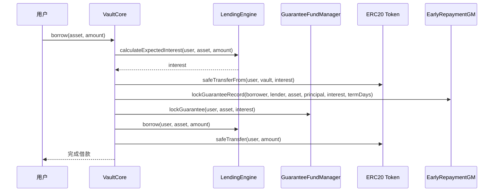
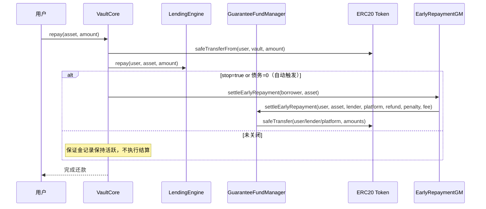
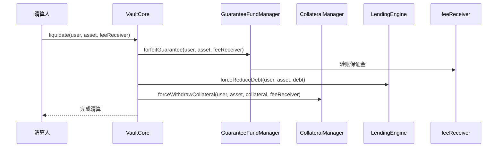

# RWA 借贷平台保证金系统实现

## 📋 概述

本文档详细说明了在 RWA 借贷平台中实现的保证金系统。该系统实现了"借款时需支付与利息等额的保证金"的设计，为平台提供了额外的风险缓冲机制。

## 🎯 设计目标

### 核心特性
- **风险缓冲**：在用户违约时保障出借人利益
- **先行锁定**：借款时预先锁定与利息等额的保证金
- **灵活管理**：支持锁定、释放和没收操作
- **安全可靠**：使用 SafeERC20 确保资金安全

### 业务逻辑（更新后）
1. **借款时**：前端或上游撮合传入 `annualRateBps` 与 `termDays`，在 `VaultBusinessLogic.borrowWithRate` 以纯计算得到预计利息；
   - `EarlyRepaymentGuaranteeManager.lockGuaranteeRecord` 仅记录（不转账）；
   - `GuaranteeFundManager.lockGuarantee` 真实托管资金（`safeTransferFrom` 用户 → GFM 池）。
2. **还款时**：
   - 如果用户该资产债务清零（或前端显式 `repayWithStop`），`EarlyRepaymentGuaranteeManager.settleEarlyRepayment` 进行规则计算并调用 `GuaranteeFundManager.settleEarlyRepayment` 一次性三路分发（返还借款人、罚金给出借人、平台手续费）；
   - GFM 在真实资金变化处统一推送 View 缓存与 DataPush（统一链下采集与前端展示）。
3. **清算时**：
   - 使用 `GuaranteeFundManager.forfeitPartial` 或 `settleDefault` 将保证金没收并分发给一个或多个接收者；
   - 统一由 GFM 推送 View 与 DataPush。

## 🏗️ 系统架构

### 核心模块

#### 1. GuaranteeFundManager.sol
**职责**：保证金管理核心模块
- 锁定用户保证金
- 释放用户保证金  
- 没收用户保证金（清算场景）
- 提供查询接口

**关键函数**：
```solidity
function lockGuarantee(address user, address asset, uint256 amount) external
function releaseGuarantee(address user, address asset, uint256 amount) external
function forfeitGuarantee(address user, address asset, address feeReceiver) external
function getLockedGuarantee(address user, address asset) external view returns (uint256)
```

#### 2. LendingEngine / 业务入口（低gas路径）
**推荐路径**：上游传 `annualRateBps` 与 `termDays`；`VaultBusinessLogic.borrowWithRate` 以纯计算得到预计利息（0 外部读取）。
**可选路径**：调用 `LendingEngine.estimateInterest(asset, principal, termDays)` 单次 view 获取利息。

**关键函数**：
```solidity
function calculateExpectedInterest(address user, address asset, uint256 amount) external view returns (uint256)
function setInterestRate(address asset, uint256 annualRate) external onlyGovernance
```

#### 3. Vault / 业务编排
**保证金集成（职责清晰）**：
- 借款：ERGM 只记录；GFM 锁保托管；
- 还款：ERGM 计算并触发 GFM 早偿结算；
- 清算：直接调用 GFM 的没收接口（支持部分/多接收人）。

**关键函数**：
```solidity
function _calculateAndLockGuarantee(address user, address asset, uint256 amount) internal
function _releaseGuarantee(address user, address asset, uint256 amount) internal
function _forfeitGuarantee(address user, address asset, address feeReceiver) internal
function liquidate(address user, address asset, address feeReceiver) external
```

## 🔄 业务流程

### 1. 借款流程（含保证金，方案B-职责清晰）



### 2. 还款流程（释放保证金/早偿结算）



### 3. 清算流程（没收保证金）



## 🛡️ 安全特性

### 1. 权限控制
- **VaultCore 专用**：只有 VaultCore 合约可以调用保证金核心功能
- **治理权限**：利率设置、模块升级等管理功能仅治理可调用
- **紧急控制**：支持暂停和恢复功能

### 2. 资金安全
- **SafeERC20**：所有 ERC20 操作使用 SafeERC20 库
- **余额验证**：操作前验证用户余额充足
- **转账验证**：操作后验证转账结果

### 3. 错误处理
- **模块化错误**：统一的 try/catch 错误处理
- **事件记录**：详细的操作事件记录
- **回滚机制**：失败时自动回滚状态

## 📊 技术实现

### 1. 利率计算
```solidity
// 年利率以 1e18 为基数
interest = (amount * rate) / 1e18
```

### 2. 保证金管理
```solidity
// 用户保证金映射
mapping(address => mapping(address => uint256)) private _userGuarantees;

// 资产总保证金
mapping(address => uint256) private _totalGuaranteesByAsset;
```

### 3. 模块集成
```solidity
// 通过 VaultStorage 获取模块地址
address guaranteeFundManager = IVaultStorage(vaultStorage).getGuaranteeFundManager();
```

## 🧪 测试覆盖

### 测试场景
1. **初始化测试**：验证合约正确初始化
2. **权限测试**：验证权限控制机制
3. **保证金操作测试**：验证锁定、释放、没收功能
4. **批量操作测试**：验证批量处理功能
5. **边界条件测试**：验证异常情况处理

### 测试文件
- `test/GuaranteeFundManager.test.ts`：保证金管理模块测试

## 🔧 部署配置

### 1. 模块注册
```solidity
// 在 VaultAdmin 中注册保证金管理模块
await vaultAdmin.registerModule("guaranteeFundManager", guaranteeFundManager.address);
```

### 2. 利率设置
```solidity
// 设置资产年利率（以 1e18 为基数）
await lendingEngine.setInterestRate(asset, ethers.parseUnits("0.05", 18)); // 5% 年利率
```

### 3. 权限配置
```solidity
// 确保 VaultCore 有权限调用保证金管理模块
await guaranteeFundManager.setVaultCore(vaultCore.address);
```

## 📈 性能优化

### 1. Gas 优化
- **批量操作**：支持批量锁定和释放保证金
- **存储优化**：使用高效的映射结构
- **调用优化**：减少不必要的外部调用

### 2. 查询优化
- **缓存机制**：本地缓存常用数据
- **索引优化**：优化查询路径
- **批量查询**：支持批量状态查询

## 🔮 未来扩展

### 1. 功能扩展
- **动态利率**：支持基于市场条件的动态利率
- **保证金池**：实现保证金池机制
- **保险机制**：集成第三方保险

### 2. 治理扩展
- **参数投票**：支持治理投票调整参数
- **时间锁**：实现参数变更时间锁
- **多签支持**：支持多签治理

## 📝 总结

保证金系统的实现为 RWA 借贷平台提供了：

1. **风险控制**：通过预先锁定保证金降低违约风险
2. **收益保障**：清算时没收保证金为平台提供收入
3. **用户体验**：透明的保证金机制，用户可预期成本
4. **系统安全**：多重安全机制保护用户资金

该系统完全集成到现有的模块化架构中，保持了代码的可维护性和可扩展性。 