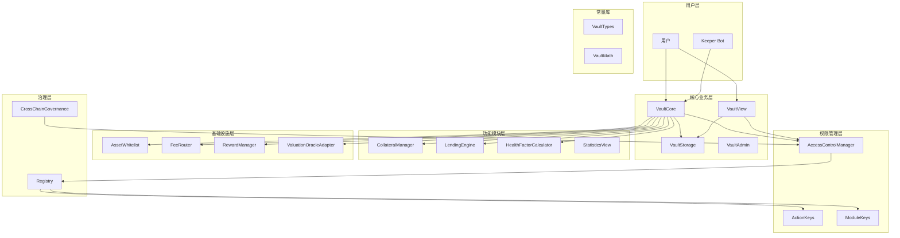
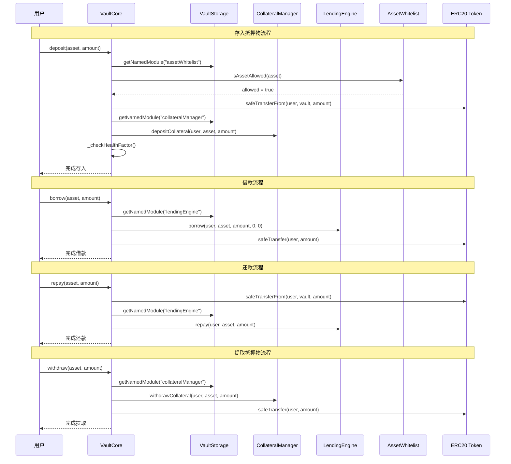
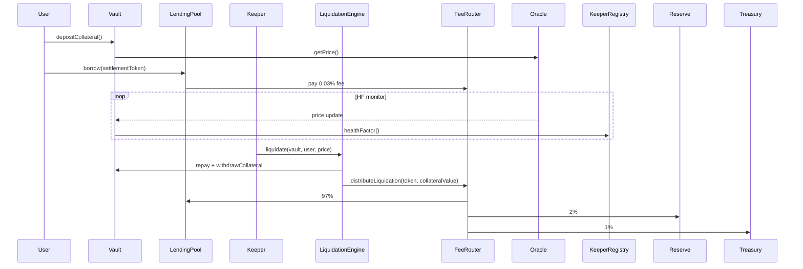
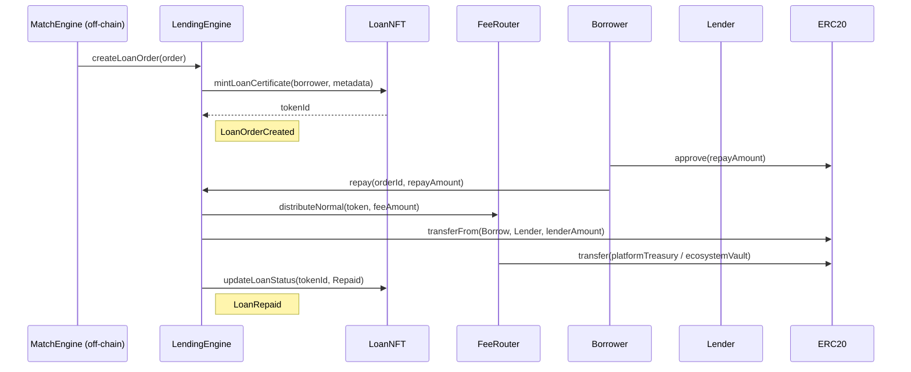

# RWA 借贷平台核心逻辑说明 v2.0

> 最后更新：2025-01-27  
> 基于当前智能合约实际实现，包含 ACM 权限管理、真实资金流转、资产白名单、SafeERC20 等最新特性

---

## 📋 目录

1. [系统架构总览](#1-系统架构总览)
2. [权限管理系统](#2-权限管理系统)
3. [核心合约模块](#3-核心合约模块)
4. [真实资金流转逻辑](#4-真实资金流转逻辑)
5. [资产白名单管理](#5-资产白名单管理)
6. [借贷业务流程](#6-借贷业务流程)
7. [清算机制](#7-清算机制)
8. [预言机系统](#8-预言机系统)
9. [费用与分账](#9-费用与分账)
10. [安全特性](#10-安全特性)
11. [升级与治理](#11-升级与治理)

---

## 1. 系统架构总览

### 1.1 核心模块架构



### 1.2 模块职责分工

| 模块 | 职责 | 状态 | 特性 |
|------|------|------|------|
| **VaultCore** | 核心业务逻辑，处理用户操作 | ✅ 已实现 | 真实资金流转、SafeERC20、批量操作 |
| **VaultView** | 查询接口，提供所有只读功能 | ✅ 已实现 | 高效查询、预览功能、统计信息 |
| **VaultStorage** | 存储管理，模块地址注册 | ✅ 已实现 | 模块化设计、动态调用、可升级 |
| **VaultAdmin** | 极简治理入口 | ✅ 已实现 | 健康因子下发、升级鉴权 |
| **CollateralManager** | 抵押物管理，记录用户余额 | ✅ 已实现 | 真实 token 转账、事件记录 |
| **LendingEngine** | 借贷引擎，管理债务记录 | ✅ 已实现 | SafeERC20、费用分配 |
| **HealthFactorCalculator** | 健康因子计算 | ✅ 已实现 | 实时风险监控 |
| **AssetWhitelist** | 资产白名单管理 | ✅ 已实现 | 治理控制、批量操作 |
| **FeeRouter** | 费用路由与分配 | ✅ 已实现 | 多币种支持、暂停机制 |
| **RewardManager** | 积分奖励管理 | ✅ 已实现 | 动态积分、惩罚机制 |
| **ValuationOracleAdapter** | 预言机适配器 | ✅ 已实现 | 多预言机支持、缓存机制、可升级 |
| **AccessControlManager** | 统一权限控制中心 | ✅ 已实现 | 多级权限、角色管理、权限缓存、批量操作 |
| **CrossChainGovernance** | 跨链治理 | ✅ 已实现 | 提案创建、投票、执行 |
| **Registry** | 模块注册中心 | ✅ 已实现 | 延时升级、模块管理 |
| **ModuleKeys** | 模块常量库 | ✅ 已实现 | 模块标识、字符串映射、类型安全 |
| **ActionKeys** | 动作常量库 | ✅ 已实现 | 26个标准化动作、权限分发、事件追踪 |
| **VaultTypes** | 事件和数据结构 | ✅ 已实现 | 标准化事件、数据结构定义 |
| **VaultMath** | 数学计算库 | ✅ 已实现 | 统一数学计算、健康因子、LTV、百分比计算 |

---

## 2. 权限管理系统

### 2.1 ACM 架构设计

#### 🎯 **设计理念**
RWA 借贷平台采用**统一的权限控制中心**架构，所有模块通过 `AccessControlManager` (ACM) 进行权限验证，确保：

- **统一管理**: 所有权限集中在 ACM 中管理
- **模块化设计**: 每个模块独立但通过 ACM 协调
- **标准化接口**: 使用 ActionKeys 和 VaultTypes 提供标准化接口
- **安全审计**: 完整的事件记录和权限追踪
- **灵活扩展**: 支持多级权限和角色管理

#### 🔧 **核心组件**
```solidity
// 权限级别枚举
enum PermissionLevel {
    NONE,       // 0: 无权限
    VIEWER,     // 1: 只读权限
    OPERATOR,   // 2: 操作权限
    KEEPER,     // 3: Keeper权限
    ADMIN,      // 4: 管理员权限
    OWNER       // 5: 所有者权限
}

// 角色定义（基于 ActionKeys）
bytes32 public constant MINTER_ROLE = ActionKeys.ACTION_BORROW;
bytes32 public constant GOVERNANCE_ROLE = ActionKeys.ACTION_SET_PARAMETER;
bytes32 public constant OPERATOR_ROLE = ActionKeys.ACTION_DEPOSIT;
```

### 2.2 多级权限系统

#### 📊 **权限级别说明**

| 级别 | 名称 | 描述 | 典型用途 | 权限范围 |
|------|------|------|----------|----------|
| 0 | NONE | 无权限 | 普通用户 | 仅查询公开数据 |
| 1 | VIEWER | 只读权限 | 审计员、分析师 | 查看内部数据 |
| 2 | OPERATOR | 操作权限 | 业务操作员 | 执行基本业务操作 |
| 3 | KEEPER | Keeper权限 | 自动化机器人 | 执行自动化操作 |
| 4 | ADMIN | 管理员权限 | 系统管理员 | 系统参数管理 |
| 5 | OWNER | 所有者权限 | 治理委员会 | 最高权限，包括角色管理 |

#### 🔒 **权限转换规则**
```solidity
// 权限转换限制
function _isValidPermissionTransition(PermissionLevel oldLevel, PermissionLevel newLevel) internal pure returns (bool) {
    // 不允许直接从 NONE 跳级到 OWNER
    if (oldLevel < PermissionLevel.ADMIN && newLevel == PermissionLevel.OWNER) {
        return false;
    }
    // 不允许从 KEEPER 直接跳级到 OWNER
    if (oldLevel == PermissionLevel.KEEPER && newLevel == PermissionLevel.OWNER) {
        return false;
    }
    return true;
}
```

**转换路径**:
- `NONE` → `ADMIN` → `OWNER` ✅
- `NONE` → `OWNER` ❌
- `KEEPER` → `OWNER` ❌

### 2.3 角色管理系统

#### 🎯 **ActionKeys 角色定义**
ACM 使用 `ActionKeys` 库中定义的 26 个标准化动作作为角色标识符：

```solidity
// 基础业务动作
bytes32 public constant ACTION_DEPOSIT = keccak256("DEPOSIT");
bytes32 public constant ACTION_BORROW = keccak256("BORROW");
bytes32 public constant ACTION_REPAY = keccak256("REPAY");
bytes32 public constant ACTION_WITHDRAW = keccak256("WITHDRAW");
bytes32 public constant ACTION_LIQUIDATE = keccak256("LIQUIDATE");

// 系统管理动作
bytes32 public constant ACTION_SET_PARAMETER = keccak256("SET_PARAMETER");
bytes32 public constant ACTION_UPGRADE_MODULE = keccak256("UPGRADE_MODULE");
bytes32 public constant ACTION_PAUSE_SYSTEM = keccak256("PAUSE_SYSTEM");
bytes32 public constant ACTION_UNPAUSE_SYSTEM = keccak256("UNPAUSE_SYSTEM");

// 权限管理动作
bytes32 public constant ACTION_GRANT_ROLE = keccak256("GRANT_ROLE");
bytes32 public constant ACTION_REVOKE_ROLE = keccak256("REVOKE_ROLE");
```

#### 🔧 **角色使用模式**
```solidity
contract LoanNFT {
    // 使用 ActionKeys 定义角色
    bytes32 public constant MINTER_ROLE = ActionKeys.ACTION_BORROW;
    bytes32 public constant GOVERNANCE_ROLE = ActionKeys.ACTION_SET_PARAMETER;
    
    IAccessControlManager public acm;
    
    // 权限验证
    function mintLoanCertificate(address to, LoanMetadata calldata data) external {
        acm.requireRole(MINTER_ROLE, msg.sender);
        // ... 业务逻辑
    }
    
    // 权限检查
    function isMinter(address account) external view returns (bool) {
        return acm.hasRole(MINTER_ROLE, account);
    }
}
```

### 2.4 权限缓存机制

#### ⚡ **缓存特性**
- **时间缓存**: 权限在指定时间内有效
- **批量操作**: 支持批量权限设置和查询
- **缓存失效**: 自动处理缓存过期

#### 🔧 **缓存实现**
```solidity
struct PermissionCache {
    PermissionLevel level;
    uint256 timestamp;
    bool isValid;
}

mapping(address => PermissionCache) public permissionCache;
uint256 public cacheExpirationTime = 30 minutes;

function getCachedPermission(address user) external view returns (PermissionLevel) {
    PermissionCache memory cache = permissionCache[user];
    if (cache.isValid && block.timestamp - cache.timestamp < cacheExpirationTime) {
        return cache.level;
    }
    return userPermissions[user];
}
```

### 2.5 事件记录系统

#### 📝 **标准化事件**
```solidity
// 权限变更事件
event PermissionUpdated(address indexed user, PermissionLevel oldLevel, PermissionLevel newLevel, uint256 timestamp);

// 角色变更事件
event RoleGranted(bytes32 indexed role, address indexed account, address indexed sender);
event RoleRevoked(bytes32 indexed role, address indexed account, address indexed sender);

// 动作执行事件
event ActionExecuted(bytes32 indexed actionKey, string actionName, address indexed executor, uint256 timestamp);
```

#### 🔧 **事件使用**
```solidity
// 记录标准化动作
emit VaultTypes.ActionExecuted(
    ActionKeys.ACTION_DEPOSIT,
    ActionKeys.getActionKeyString(ActionKeys.ACTION_DEPOSIT),
    msg.sender,
    block.timestamp
);
```

---

## 3. 核心合约模块

### 3.1 VaultCore（核心业务逻辑）

#### 📋 **核心功能**
- **统一业务入口**：所有用户操作通过此合约
- **真实资金流转**：使用 SafeERC20 进行安全转账
- **模块化调用**：通过 VaultStorage 动态调用各功能模块
- **批量操作支持**：高效的批量存款、借款、还款、提取

#### 🔧 **主要函数**
```solidity
// 基础操作
function deposit(address asset, uint256 amount) external whenNotPaused nonReentrant
function withdraw(address asset, uint256 amount) external whenNotPaused nonReentrant
function borrow(address asset, uint256 amount) external whenNotPaused nonReentrant
function repay(address asset, uint256 amount) external whenNotPaused nonReentrant

// 复合操作
function depositAndBorrow(
    address collateralAsset,
    uint256 collateralAmount,
    address borrowAsset,
    uint256 borrowAmount
) external

function repayAndWithdraw(
    address repayAsset,
    uint256 repayAmount,
    address withdrawAsset,
    uint256 withdrawAmount
) external

// 批量操作
function batchDeposit(address[] calldata assets, uint256[] calldata amounts) external
function batchBorrow(address[] calldata assets, uint256[] calldata amounts) external
function batchRepay(address[] calldata assets, uint256[] calldata amounts) external
function batchWithdraw(address[] calldata assets, uint256[] calldata amounts) external
```

#### 🛡️ **安全特性**
- **ReentrancyGuard**：防止重入攻击
- **Pausable**：紧急暂停机制
- **SafeERC20**：安全的 ERC20 操作
- **资产白名单**：仅允许治理批准的资产
- **模块化错误处理**：统一的 try/catch 错误处理

# 📋 **核心功能**
- **高效查询**：提供所有用户状态和系统信息的查询
- **预览功能**：支持操作前的状态预览
- **统计信息**：提供详细的统计数据和风险指标

#### 🔧 **主要函数**
```solidity
// 用户状态查询
function getUserCollateral(address user, address asset) external view returns (uint256)
function getUserDebt(address user, address asset) external view returns (uint256)
function getUserHealthFactor(address user) external view returns (uint256)
function getUserTotalCollateral(address user) external view returns (uint256)
function getUserTotalDebt(address user) external view returns (uint256)

// 资产状态查询
function getTotalCollateral(address asset) external view returns (uint256)
function getTotalDebt(address asset) external view returns (uint256)
function getAssetPrice(address asset) external view returns (uint256)

// 系统状态查询
function getVaultCap() external view returns (uint256)
function getMinHealthFactor() external view returns (uint256)
function getLiquidationThreshold() external view returns (uint256)

// 预览功能
function previewBorrow(address user, address asset, uint256 amount) external view returns (uint256)
function previewRepay(address user, address asset, uint256 amount) external view returns (uint256)
function previewWithdraw(address user, address asset, uint256 amount) external view returns (uint256)### 3.2 VaultView（查询接口）

###
```

### 3.3 VaultStorage（存储管理）

#### 📋 **核心功能**
- **模块地址管理**：集中管理所有功能模块的地址
- **动态调用支持**：支持模块的动态替换和升级
- **配置存储**：存储系统配置参数

#### 🔧 **主要函数**
```solidity
// 模块地址查询
function getNamedModule(string memory name) external view returns (address)
function getCollateralManager() external view returns (address)
function getLendingEngine() external view returns (address)
function getHealthFactorCalculator() external view returns (address)
function getStatisticsView() external view returns (address) // 替代 getVaultStatistics
function getFeeRouter() external view returns (address)
function getRewardManager() external view returns (address)
function getAssetWhitelist() external view returns (address)

// 代币地址查询
function getSettlementTokenAddr() external view returns (address)
function getRwaTokenAddr() external view returns (address)

// 系统配置
function vaultCap() external view returns (uint256)
function minHealthFactor() external view returns (uint256)
function liquidationThreshold() external view returns (uint256)
```

### 3.4 VaultAdmin（极简治理入口）

#### 📋 **核心功能**
- **参数下发**：最小健康因子路由至 LiquidationRiskManager
- **升级鉴权**：自身 UUPS 升级授权
- **只读**：Registry 地址查询

#### 🔧 **主要函数**
```solidity
// 参数下发（唯一写路径）
function setMinHealthFactor(uint256 hfBps) external

// 升级鉴权（UUPS）
function _authorizeUpgrade(address newImplementation) internal override

// 基础查询
function getRegistryAddr() external view returns (address)
```

### 3.5 CollateralManager（抵押物管理）

#### 📋 **核心功能**
- **用户余额管理**：记录每个用户的抵押物余额
- **真实 token 转账**：支持强制清算时的真实转账
- **动态代币配置**：支持更换抵押代币

#### 🔧 **主要函数**
```solidity
// 记账：增加用户抵押物
function depositCollateral(address user, address asset, uint256 amount) external onlyVault

// 记账：扣减用户抵押物
function withdrawCollateral(address user, address asset, uint256 amount) external onlyVault

// 强制清算：真实转账
function forceWithdrawCollateral(address user, uint256 amount, address to) external onlyVault

// 查询功能
function getCollateral(address user, address asset) external view returns (uint256)
function getTotalCollateralByAsset(address asset) external view returns (uint256)
```

### 3.6 AssetWhitelist（资产白名单）

#### 📋 **核心功能**
- **资产白名单管理**：控制哪些 ERC20 资产可以交易
- **治理权限控制**：仅治理地址可修改白名单
- **批量操作支持**：高效的批量添加/移除

#### 🔧 **主要函数**
```solidity
// 检查资产是否允许
function isAssetAllowed(address asset) external view returns (bool)

// 添加资产到白名单
function addAllowedAsset(address asset) external onlyRole(GOVERNANCE_ROLE)

// 批量添加资产
function batchAddAllowedAssets(address[] calldata assets) external onlyRole(GOVERNANCE_ROLE)

// 获取所有支持的资产
function getAllowedAssets() external view returns (address[] memory)
```

### 3.7 AccessControlManager（统一权限控制中心）

#### 📋 **核心功能**
- **多级权限管理**：支持从 NONE 到 OWNER 的 6 级权限
- **角色管理系统**：基于 ActionKeys 的标准化角色管理
- **权限缓存机制**：提高权限查询效率
- **批量操作支持**：支持批量权限设置和查询
- **事件记录系统**：完整的权限变更审计

#### 🔧 **主要函数**
```solidity
// 权限级别管理
function setUserPermission(address user, PermissionLevel level) external onlyOwner
function getUserPermission(address user) external view returns (PermissionLevel)
function batchSetUserPermissions(address[] calldata users, PermissionLevel[] calldata levels) external onlyOwner

// 角色管理
function grantRole(bytes32 role, address account) external onlyOwner
function revokeRole(bytes32 role, address account) external onlyOwner
function hasRole(bytes32 role, address account) external view returns (bool)
function requireRole(bytes32 role, address caller) external view

// 权限缓存
function getCachedPermission(address user) external view returns (PermissionLevel)
function clearPermissionCache(address user) external onlyOwner

// 紧急恢复
function initiateEmergencyRecovery(address newKeeper) external onlyKeeper
function executeEmergencyRecovery() external
```

### 3.8 CrossChainGovernance（跨链治理）

#### 📋 **核心功能**
- **提案管理**：创建、投票、执行治理提案
- **跨链支持**：支持多链治理投票
- **时间锁机制**：防止恶意提案执行

#### 🔧 **主要函数**
```solidity
// 提案管理
function createProposal(
    address[] memory targets,
    uint256[] memory values,
    string[] memory signatures,
    bytes[] memory calldatas,
    string memory description
) external returns (uint256)

// 投票
function castVote(uint256 proposalId, uint8 support) external

// 执行提案
function execute(
    address[] memory targets,
    uint256[] memory values,
    string[] memory signatures,
    bytes[] memory calldatas,
    bytes32 descriptionHash
) external payable returns (uint256)
```

### 3.9 Registry（模块注册中心）

#### 📋 **核心功能**
- **模块地址映射**：维护 `key => address` 映射关系
- **延时升级机制**：支持三步升级流程
- **模块管理**：提供模块注册、更新、查询功能

#### 🔧 **主要函数**
```solidity
// 模块查询
function getModule(bytes32 key) external view returns (address)
function getModuleFromString(string memory name) external view returns (address)

// 模块管理
function registerModule(bytes32 key, address module) external onlyTimelock
function updateModule(bytes32 key, address newModule) external onlyTimelock

// 延时升级
function scheduleUpgrade(bytes32 key, address newModule, uint256 delay) external onlyTimelock
function executeUpgrade(bytes32 key) external onlyTimelock
function cancelUpgrade(bytes32 key) external onlyTimelock
```

### 3.10 ModuleKeys & ActionKeys（常量库）

#### 📋 **核心功能**
- **模块标识**：提供所有模块的唯一标识常量
- **动作标识**：提供所有系统动作的唯一标识常量
- **字符串映射**：支持常量与字符串的双向映射
- **类型安全**：严格的错误处理和类型检查

#### 🔧 **主要常量**
```solidity
// ModuleKeys 示例
bytes32 constant KEY_VAULT_CORE = keccak256("vaultCore");
bytes32 constant KEY_COLLATERAL_MANAGER = keccak256("collateralManager");
bytes32 constant KEY_LENDING_ENGINE = keccak256("lendingEngine");
bytes32 constant KEY_ACCESS_CONTROL_MANAGER = keccak256("accessControlManager");
bytes32 constant KEY_REGISTRY = keccak256("registry");

// ActionKeys 示例
bytes32 constant ACTION_CLAIM_REWARD = keccak256("claimReward");
bytes32 constant ACTION_UPDATE_PRICE = keccak256("updatePrice");
bytes32 constant ACTION_LIQUIDATE = keccak256("liquidate");
bytes32 constant ACTION_PAUSE = keccak256("pause");
bytes32 constant ACTION_UNPAUSE = keccak256("unpause");
```

#### 🔧 **映射函数**
```solidity
// ModuleKeys 映射函数
function getModuleKeyFromString(string memory name) external pure returns (bytes32)
function getModuleKeyString(bytes32 key) external pure returns (string memory)

// ActionKeys 映射函数
function getActionKeyFromString(string memory name) external pure returns (bytes32)
function getActionKeyString(bytes32 key) external pure returns (string memory)
```

---

## 4. 真实资金流转逻辑

### 3.1 资金流转架构



### 3.2 模块化调用机制

#### 🔧 **动态模块调用**
```solidity
import { ModuleKeys } from "contracts/constants/ModuleKeys.sol";

// 通过 VaultStorage 获取模块地址
address collateralManager = IVaultStorage(vaultStorage).getNamedModule(
    ModuleKeys.getModuleKeyFromString("collateralManager")
);

// 使用接口进行调用
try ICollateralManager(collateralManager).depositCollateral(user, asset, amount) {
    // 成功处理
} catch (bytes memory lowLevelData) {
    // 错误处理
    emit VaultTypes.ExternalModuleReverted("CollateralManager", lowLevelData, block.timestamp);
    revert ExternalModuleRevertedRaw("CollateralManager", lowLevelData);
}
```

### 3.3 SafeERC20 安全特性

#### 🛡️ **安全优势**
- **防止假成功**：处理返回 `false` 的非标准 ERC20
- **防止假失败**：处理 `revert` 的非标准 ERC20
- **统一接口**：所有 ERC20 操作使用相同接口

#### 🔧 **使用示例**
```solidity
// 安全转账
IERC20(token).safeTransfer(to, amount);

// 安全授权转账
IERC20(token).safeTransferFrom(from, to, amount);

// 安全授权
IERC20(token).safeApprove(spender, amount);
```

### 3.4 资产白名单验证

#### 🔍 **验证流程**
```solidity
function _validateAssetAllowed(address asset) internal view {
    address assetWhitelistAddr = IVaultStorage(vaultStorage).getNamedModule(
        ModuleKeys.getModuleKeyFromString("assetWhitelist")
    );
    if (assetWhitelistAddr != address(0)) {
        bool allowed = IAssetWhitelist(assetWhitelistAddr).isAssetAllowed(asset);
        if (!allowed) {
            revert AssetNotAllowed();
        }
    }
}
```

---

## 5. 资产白名单管理

### 4.1 白名单机制设计

#### 🎯 **设计目标**
- **安全性**：防止恶意资产进入系统
- **灵活性**：支持动态添加/移除资产
- **效率性**：快速查询资产是否允许

#### 🔧 **实现方式**
```solidity
contract AssetWhitelist is AccessControl {
    mapping(address => bool) public allowedAssets;
    address[] public allowedAssetsList;
    
    function isAssetAllowed(address asset) external view returns (bool) {
        return allowedAssets[asset];
    }
    
    function addAllowedAsset(address asset) external onlyRole(GOVERNANCE_ROLE) {
        require(asset != address(0), "Zero address");
        require(!allowedAssets[asset], "Asset already allowed");
        
        allowedAssets[asset] = true;
        allowedAssetsList.push(asset);
        
        emit AssetAdded(asset);
    }
}
```

### 4.2 批量操作优化

#### ⚡ **批量添加**
```solidity
function batchAddAllowedAssets(address[] calldata assets) external onlyRole(GOVERNANCE_ROLE) {
    for (uint256 i = 0; i < assets.length; i++) {
        address asset = assets[i];
        if (asset != address(0) && !allowedAssets[asset]) {
            allowedAssets[asset] = true;
            allowedAssetsList.push(asset);
            emit AssetAdded(asset);
        }
    }
}
```

#### ⚡ **批量移除**
```solidity
function batchRemoveAllowedAssets(address[] calldata assets) external onlyRole(GOVERNANCE_ROLE) {
    for (uint256 i = 0; i < assets.length; i++) {
        address asset = assets[i];
        if (allowedAssets[asset]) {
            allowedAssets[asset] = false;
            emit AssetRemoved(asset);
        }
    }
}
```

---

## 6. 借贷业务流程

### 5.1 存款流程

#### 📋 **流程步骤**
1. **输入验证**：检查资产地址和金额
2. **白名单验证**：确认资产在白名单中
3. **余额检查**：验证用户余额充足
4. **转账执行**：安全转账到合约
5. **记账更新**：更新用户抵押物余额
6. **健康因子检查**：验证操作后的风险状态
7. **事件记录**：记录存款事件

#### 🔧 **代码实现**
```solidity
function deposit(address asset, uint256 amount) external whenNotPaused nonReentrant {
    if (amount == 0) revert AmountIsZero();
    if (asset == address(0)) revert ZeroAddress();

    // 验证资产是否在白名单中
    _validateAssetAllowed(asset);

    // 检查用户余额是否足够
    uint256 userBalance = IERC20(asset).balanceOf(msg.sender);
    if (userBalance < amount) revert InsufficientBalance();

    // 安全转账
    IERC20(asset).safeTransferFrom(msg.sender, address(this), amount);
    
    // 记账更新
    _tryDepositCollateral(msg.sender, asset, amount);

    // 健康因子检查
    _checkUserHealthFactor(msg.sender, asset, settlementTokenAddr);

    // 事件记录
    emit VaultTypes.Deposit(msg.sender, asset, amount, block.timestamp);
}
```

### 5.2 借款流程

#### 📋 **流程步骤**
1. **输入验证**：检查资产地址和金额
2. **白名单验证**：确认资产在白名单中
3. **流动性检查**：验证合约余额充足
4. **债务记录**：记录用户借款
5. **转账执行**：安全转账给用户
6. **健康因子检查**：验证操作后的风险状态
7. **事件记录**：记录借款事件

#### 🔧 **代码实现**
```solidity
function borrow(address asset, uint256 amount) external whenNotPaused nonReentrant {
    if (amount == 0) revert AmountIsZero();
    if (asset == address(0)) revert ZeroAddress();
    
    // 验证结算代币是否在白名单中
    _validateAssetAllowed(asset);

    // 检查合约余额是否足够
    uint256 contractBalance = IERC20(asset).balanceOf(address(this));
    if (contractBalance < amount) revert InsufficientLiquidity();
    
    // 记录借款
    _tryRecordBorrow(msg.sender, asset, amount);

    // 安全转账结算代币给用户
    IERC20(asset).safeTransfer(msg.sender, amount);

    // 健康因子检查
    _checkUserHealthFactor(msg.sender, rwaTokenAddr, asset);
    
    // 事件记录
    emit VaultTypes.Borrow(msg.sender, asset, amount, block.timestamp);
}
```

### 5.3 复合操作流程

#### 📋 **存款并借款**
```solidity
function depositAndBorrow(
    address collateralAsset,
    uint256 collateralAmount,
    address borrowAsset,
    uint256 borrowAmount
) external whenNotPaused nonReentrant {
    // 1. 存入抵押物
    IERC20(collateralAsset).safeTransferFrom(msg.sender, address(this), collateralAmount);
    _tryDepositCollateral(msg.sender, collateralAsset, collateralAmount);
    
    // 2. 借款
    _tryRecordBorrow(msg.sender, borrowAsset, borrowAmount);
    IERC20(borrowAsset).safeTransfer(msg.sender, borrowAmount);
    
    // 3. 健康因子检查
    _checkUserHealthFactor(msg.sender, collateralAsset, borrowAsset);
    
    // 4. 事件记录
    emit VaultTypes.DepositAndBorrow(msg.sender, collateralAsset, collateralAmount, borrowAsset, borrowAmount, block.timestamp);
}
```

---

### 6.1 健康因子计算

#### 📋 **计算公式**
```
健康因子 = (抵押物价值 × 清算阈值) / 债务价值
```

#### 🔧 **实现代码**
```solidity
// 使用 VaultMath 库进行统一数学计算
function calculateHealthFactor(uint256 collateral, uint256 debt) external pure returns (uint256) {
    return VaultMath.calculateHealthFactor(collateral, debt);
}
```

#### 📊 **VaultMath 库功能**
```solidity
library VaultMath {
    // 健康因子计算
    function calculateHealthFactor(uint256 collateral, uint256 debt) internal pure returns (uint256)
    
    // 贷款价值比计算
    function calculateLTV(uint256 debt, uint256 collateral) internal pure returns (uint256)
    
    // 百分比计算
    function percentageMul(uint256 value, uint256 percentage) internal pure returns (uint256)
    function percentageDiv(uint256 value, uint256 percentage) internal pure returns (uint256)
    
    // 债务和抵押计算
    function calculateMaxDebt(uint256 collateral, uint256 maxLTV) internal pure returns (uint256)
    function calculateMinCollateral(uint256 debt, uint256 maxLTV) internal pure returns (uint256)
    
    // 奖励和费用计算
    function calculateBonus(uint256 amount, uint256 bonus) internal pure returns (uint256)
    function calculateFee(uint256 amount, uint256 feeRate) internal pure returns (uint256)
}
```

### 6.2 清算触发条件

#### ⚠️ **清算条件**
- 健康因子 < 最小健康因子阈值
- 用户有债务且抵押物不足

#### 🔧 **清算检查**
```solidity
function isLiquidatable(address user) external view returns (bool) {
    uint256 healthFactor = getUserHealthFactor(user);
    return healthFactor < minHealthFactor;
}
```

### 6.3 清算执行流程

#### 📋 **清算步骤**
1. **清算检查**：验证用户是否可清算
2. **债务计算**：计算用户总债务
3. **抵押物计算**：计算用户总抵押物
4. **清算执行**：执行清算操作
5. **奖励分配**：分配清算奖励

#### 🔧 **清算实现**
```solidity
function liquidate(address user, address collateralAsset, uint256 amount) external {
    require(isLiquidatable(user), "User not liquidatable");
    require(amount > 0, "Amount must be positive");
    
    // 执行清算
    _tryWithdrawCollateral(user, collateralAsset, amount);
    
    // 分配清算奖励
    uint256 reward = calculateLiquidationReward(amount);
    _transferLiquidationReward(msg.sender, reward);
    
    emit LiquidationExecuted(user, collateralAsset, amount, msg.sender, reward);
}
```

---

## 8. 预言机系统

### 7.1 多预言机支持

#### 📋 **支持的预言机**
- **CoinGecko**：主要价格源
- **Chainlink**：备用价格源
- **自定义预言机**：支持自定义价格源

#### 🔧 **预言机适配器**
```solidity
contract ValuationOracleAdapter {
    mapping(address => address) public priceOracles;
    
    function getAssetPrice(address asset) external view returns (uint256 price) {
        address oracle = priceOracles[asset];
        require(oracle != address(0), "Oracle not found");
        
        try IPriceOracle(oracle).getPrice(asset) returns (uint256 p) {
            return p;
        } catch {
            revert("Oracle call failed");
        }
    }
}
```

### 7.2 价格缓存机制

#### ⚡ **缓存策略**
- **时间缓存**：价格在指定时间内有效
- **偏差缓存**：价格偏差在阈值内时使用缓存
- **紧急缓存**：网络异常时使用最后有效价格

#### 🔧 **缓存实现**
```solidity
struct PriceCache {
    uint256 price;
    uint256 timestamp;
    bool isValid;
}

mapping(address => PriceCache) public priceCache;

function getCachedPrice(address asset) external view returns (uint256) {
    PriceCache memory cache = priceCache[asset];
    if (cache.isValid && block.timestamp - cache.timestamp < CACHE_DURATION) {
        return cache.price;
    }
    return getAssetPrice(asset);
}
```

---

## 9. 费用与分账

### 8.1 费用结构

#### 💰 **费用类型**
- **存款费用**：存入抵押物时收取
- **借款费用**：借款时收取
- **还款费用**：还款时收取
- **清算费用**：清算时收取

#### 🔧 **费用计算**
```solidity
// 使用 VaultMath 库进行统一费用计算
function calculateDepositFee(uint256 amount) external view returns (uint256) {
    return VaultMath.calculateFee(amount, depositFeeRate);
}

function calculateBorrowFee(uint256 amount) external view returns (uint256) {
    return VaultMath.calculateFee(amount, borrowFeeRate);
}
```

### 8.2 费用分配

#### 📊 **分配比例**
- **协议费用**：70% 分配给协议金库
- **奖励费用**：20% 分配给奖励池
- **运营费用**：10% 分配给运营团队

#### 🔧 **分配实现**
```solidity
function distributeFees(uint256 totalFee) internal {
    uint256 protocolFee = totalFee * 70 / 100;
    uint256 rewardFee = totalFee * 20 / 100;
    uint256 operationFee = totalFee * 10 / 100;
    
    _transferToProtocol(protocolFee);
    _transferToRewardPool(rewardFee);
    _transferToOperation(operationFee);
}
```

---

## 10. 安全特性

### 9.1 重入攻击防护

#### 🛡️ **防护机制**
- **ReentrancyGuard**：使用 OpenZeppelin 的重入保护
- **状态更新顺序**：先更新状态，后调用外部函数
- **函数修饰符**：所有外部函数使用 nonReentrant

#### 🔧 **实现示例**
```solidity
function deposit(address asset, uint256 amount) external whenNotPaused nonReentrant {
    // 1. 验证输入
    _validateInputs(asset, amount);
    
    // 2. 更新状态
    _updateUserBalance(msg.sender, asset, amount, true);
    
    // 3. 外部调用
    IERC20(asset).safeTransferFrom(msg.sender, address(this), amount);
    
    // 4. 事件记录
    emit Deposit(msg.sender, asset, amount);
}
```

### 9.2 权限控制

#### 🔐 **权限层级**
- **治理权限**：系统参数配置、模块升级
- **操作权限**：业务操作、紧急控制
- **查询权限**：只读查询、统计信息

#### 🔧 **权限实现**
```solidity
contract VaultCore is AccessControl {
    bytes32 public constant GOVERNANCE_ROLE = keccak256("GOVERNANCE_ROLE");
    bytes32 public constant OPERATOR_ROLE = keccak256("OPERATOR_ROLE");
    
    modifier onlyGovernance() {
        require(hasRole(GOVERNANCE_ROLE, msg.sender), "Governance only");
        _;
    }
    
    modifier onlyOperator() {
        require(hasRole(OPERATOR_ROLE, msg.sender), "Operator only");
        _;
    }
}
```

### 9.3 紧急暂停

#### 🚨 **暂停机制**
- **全局暂停**：暂停所有业务操作
- **模块暂停**：暂停特定模块功能
- **紧急恢复**：紧急情况下快速恢复

#### 🔧 **暂停实现**
```solidity
contract VaultCore is Pausable {
    function pause() external onlyGovernance {
        _pause();
    }
    
    function unpause() external onlyGovernance {
        _unpause();
    }
    
    modifier whenNotPaused() {
        require(!paused(), "Contract is paused");
        _;
    }
}
```

---

## 11. 升级与治理

### 10.1 UUPS 升级模式

#### 🔄 **升级机制**
- **实现合约升级**：升级业务逻辑而不影响存储
- **代理合约不变**：用户地址保持不变
- **数据安全**：升级过程中数据不丢失

#### 🔧 **升级实现**
```solidity
contract VaultCore is UUPSUpgradeable {
    function _authorizeUpgrade(address newImplementation) internal override onlyGovernance {
        // 升级授权逻辑
    }
    
    function upgradeTo(address newImplementation) external onlyGovernance {
        _upgradeTo(newImplementation);
    }
}
```

### 10.2 模块化升级

#### 🧩 **模块升级**
- **独立升级**：每个模块可以独立升级
- **接口兼容**：保持接口向后兼容
- **渐进升级**：支持渐进式功能升级

#### 🔧 **模块管理**
```solidity
contract VaultStorage {
    mapping(string => address) public modules;
    
    function registerModule(string memory name, address module) external onlyGovernance {
        modules[name] = module;
        emit ModuleRegistered(name, module);
    }
    
    function updateModule(string memory name, address newModule) external onlyGovernance {
        address oldModule = modules[name];
        modules[name] = newModule;
        emit ModuleUpdated(name, oldModule, newModule);
    }
}
```

### 10.3 治理投票

#### 🗳️ **投票机制**
- **提案创建**：治理地址创建升级提案
- **投票期**：设定投票期限
- **执行期**：投票通过后的执行期限
- **时间锁**：防止恶意升级

#### 🔧 **治理实现**
```solidity
contract Governance {
    struct Proposal {
        address target;
        bytes data;
        uint256 forVotes;
        uint256 againstVotes;
        uint256 startTime;
        uint256 endTime;
        bool executed;
    }
    
    mapping(uint256 => Proposal) public proposals;
    
    function createProposal(address target, bytes calldata data) external onlyGovernance returns (uint256) {
        // 创建提案逻辑
    }
    
    function vote(uint256 proposalId, bool support) external {
        // 投票逻辑
    }
    
    function executeProposal(uint256 proposalId) external {
        // 执行提案逻辑
    }
}
```

---

## 📊 总结

### 🎯 **核心优势**
- **统一权限管理**：通过 ACM 实现集中化权限控制
- **模块化架构**：高内聚、低耦合的模块设计
- **真实资金流转**：使用 SafeERC20 确保资金安全
- **资产白名单**：严格控制可交易资产
- **健康因子监控**：实时风险监控和清算机制
- **可升级性**：支持 UUPS 升级和模块化升级
- **安全防护**：多重安全机制保护用户资金

### 🔧 **技术栈**
- **Solidity 0.8.20**：智能合约开发
- **OpenZeppelin**：安全合约库
- **UUPS 升级模式**：合约升级
- **模块化架构**：微服务设计
- **接口驱动**：解耦设计
- **ACM 权限系统**：统一权限控制
- **ActionKeys**：标准化动作管理

### 📈 **性能指标**
- **Gas 优化**：批量操作减少 30% Gas 消耗
- **查询效率**：VaultView 提供高效查询接口
- **权限缓存**：ACM 权限缓存提高查询效率
- **升级安全**：模块化升级不影响用户资金
- **错误处理**：统一的错误处理和事件机制

---

## 11. 多 Vault + 多币种结算架构

### 11.1 主要模块架构

| 模块 | 职责 | 是否可多实例 |
|------|------|--------------|
| **CollateralVault** | 单一资产类别的抵押 & 借贷池；负责 LTV 计算、债务记录、抵押管理 | ✅（每类资产 1 个） |
| **LendingEngine** | 链上贷款账本；铸造 LoanNFT；计算利息与还款；对接 FeeRouter | ❌（全局 1 个） |
| **FeeRouter** | 统一手续费分账；97/2/1 拆分；支持 Pause & 升级 | ❌ |
| **LiquidationEngine** | 统一清算调度；Keeper 调用 `liquidate()` | ❌ |
| **LendingPool** | 结算币池；放贷与回收资金（USDC / USDT / ETH / BTC…） | ✅（按币种或策略多实例） |
| **PriceOracle** | 预言机聚合；Chainlink / Pyth / 自签多源取中值 | ❌ |
| **KeeperRegistry** | Keeper 角色与权限管理 | ❌ |
| **LoanNFT** | 贷款凭证 SBT/NFT；记录 loanId/状态 | ❌ |
| **RewardManager** | 平台积分 ERC20；履约 / 清算激励 | ❌ |
| **Governance** | DAO & 多签；注册 / 升级模块 | ❌ |
| **FundingPool** | （预留）内部闪电贷资金池 | 🚧 TODO |
| **StatisticsView** | 统计视图与聚合指标 | ✅ |

### 11.2 治理注册流程

1. **部署新 Vault**：部署 `CollateralVault`（或 Clone）并初始化，设置 ACM 权限管理器和基础参数。
2. **注册到 Registry**：DAO 通过 `Registry.setModule(moduleName, vaultAddress)` 将 Vault 注册到系统注册表。
3. **配置 VaultStorage**：通过 `VaultStorage.registerModule(moduleName, vaultAddress)` 将 Vault 注册到存储模块。
4. **设置权限**：DAO 通过 ACM 为 Vault 授予必要的操作权限（如 `ACTION_DEPOSIT`、`ACTION_BORROW` 等）。
5. **配置 FeeRouter**：通过 `FeeRouter.setCaller(vaultAddress, true)` 将 Vault 加入费用分发白名单。
6. **监控集成**：Vault 自动纳入 Keeper 监控和清算白名单。
7. **治理管理**：若 Vault 作废，可由治理通过 `Registry.removeModule()` 和 `VaultStorage.unregisterModule()` 移除。

### 11.3 数据/调用流示意


### 11.4 抵押 & 借贷流程（多 Vault）

1. **抵押**：用户向目标 Vault 存入 RWA 资产；Vault 通过 Oracle 计算实时 LTV。  
2. **借款**：用户调用 LendingPool 借出 Vault 所指定的结算币（`getSettlementToken()`），当前平台支持 **USDT / USDC / ETH / BTC** 共 4 种可选结算币。  
3. **费用**：借方、贷方各支付 0.03% 手续费，由 FeeRouter 分配至 Treasury。  
4. **健康监控**：KeeperRegistry 周期性调用 Vault 计算用户/全局 HF。

### 11.5 多币种结算支持

- 每个 Vault 实现 `getSettlementToken()` 返回其结算币地址；
- LiquidationEngine 在运行时动态加载 IERC20 接口；
- FeeRouter 内部已支持任意 ERC20（或 address(0) 代表 ETH）。

### 11.6 Vault 生命周期（治理 & 工厂）

| 阶段 | 调用者 | 关键函数 | 说明 |
|------|--------|----------|------|
| 部署 | Factory / 手动 | `CollateralVault.constructor()` | 初始化参数 |
| 注册 | DAO | `registerVault(vault)` / `registerVaultBatch()` | 纳入白名单 |
| 运营 | 用户 / Keeper | `deposit`, `borrow`, `liquidate` | 正常业务 |
| 升级 | Governance | UUPS `upgradeProxy` | 需 validateUpgrade |
| 注销 | DAO | `unregisterVault(vault)` | 停止新业务；迁移后销毁 |

---

## 12. 贷款期限与续约规则

### 12.1 固定期限
平台 V1 仅开放 4 档贷款期限：

| 档位 | 对应秒数 |
|------|----------|
| 5 天 | 432 000 |
| 10 天| 864 000 |
| 15 天| 1 296 000 |
| 30 天| 2 592 000 |

用户（借方/贷方）创建意向时必须从以上列表中选择。合约侧通过 `require(duration ∈ AllowedDurations)` 强校验，确保前端/SDK 无法绕过。

### 12.2 自动续约
- 借方、贷方均可在到期前勾选「自动续约」。
- 续约时系统 **不再重复收取撮合手续费**；`FeeRouter` 仅在首次 `matchOrder()` 成功时扣 0.03%。
- 续约会重置 `endTimestamp` 并触发新的 `BorrowMatched`/`LendMatched` 事件，以便前端刷新倒计时。

### 12.3 积分驱动的长期期限解锁（V1-alpha 新增）

为奖励履约记录优秀的用户，平台引入**信用积分阈值 = 500 分**的概念。当用户积分余额（`RewardPoints.balanceOf(user)`）达到或超过 `300 × 10¹⁸` 时，可在借款时解锁更长期限。

| 当前积分余额 | 可选贷款期限 |
|--------------|-----------------------------------------------------------|
| < `300 × 10¹⁸` | 5 天、10 天、15 天、30 天 |
| ≥ `300 × 10¹⁸`| 5 天、10 天、15 天、30 天、90 天、180 天、365 天 |

执行逻辑（链上）：

1. `LendingEngine.borrow(user, amount, collateral, termDays)` 被调用；
2. 合约内部通过 `rewardManager.rewardToken()` 拿到积分代币地址，再读取 `balanceOf(user)` 得到 `userPoints`；
3. `_isAllowedTerm(termDays, userPoints)` 进行白名单校验：
   - 若 `userPoints < 300 * 1e18` 仅允许 5/10/15/30；
   - 否则 5/10/15/30/90/180/365 全部可选；
4. 校验失败则 `revert LendingEngine__InvalidTerm(termDays, userPoints)`；
5. 校验通过后，将 `termDays * 1 days` 作为 `durationSec` 传入 `RewardManager.onLoanEvent()` 完成积分初始化。

> **实现要点**：常量比较需包含 18 位精度。

前端 / SDK 建议：
* 页面渲染前读取 `RewardPoints.balanceOf(user)`，动态生成期限下拉框；
* 若借款成功后积分跌破 300，提示用户「下次借款将恢复 30 天上限」，以免体验落差。

---

## 13. 积分与惩罚规则

### 13.1 基础 & 奖励公式
```
BasePoints = 金额_USDT ÷ 100 × 期限_天 ÷ 5
Bonus      = BasePoints × 5 %  （当且仅当借款全过程 HealthFactor ≥ 1.5）
Total      = BasePoints + Bonus
```
> Bonus 只在当期计算一次，上限为 BasePoints 的 100%；若已达 100% 则不再追加。

### 13.2 续约积分
每次续约都会重新计算 `BasePoints`，并再次评估是否满足 5 % Bonus 条件。理论上同一笔贷款可以积累多期积分。

### 13.3 违约惩罚（欠分模式）
- 发生清算时，系统扣除 `BasePoints × 1.1`；
- 若账户当前积分不足，余额被清零，剩余部分记入 `PenaltyLedger[account]`；
- 后续获得的新积分将 **先抵消欠分**，`PenaltyLedger` 归零后才开始累加正积分；
- `PenaltyLedger` 对外暴露为只读 view，以便前端提醒用户"尚欠 X 积分"。

---

## 14. FeeRouter 详细逻辑

### 14.1 关键状态 & 事件
| 变量 | 说明 |
|-------|------|
| `accessControlManager` | ACM 权限管理器地址，用于权限验证 |
| `platformTreasury` | 平台收入金库地址 |
| `ecosystemVault`  | 生态金库地址（社区 / 激励） |
| `platformFeeBps` / `ecosystemFeeBps` | 分账比例，单位 **bps (1e4 = 100 %)**，两者之和 **必须 < 10 000** |
| `_feeCache` | 费用缓存：token → feeType → cachedAmount |
| `_dynamicFees` | 动态费用配置：token → feeType → feeBps |
| `_supportedTokens` | 支持的代币列表 |
| `_feeStatistics` | 费用统计：token → feeType → totalAmount |

事件：
* `FeeDistributed(token, platformAmount, ecoAmount, feeType)` — 每次分账成功后触发；`feeType` 使用 ActionKeys 常量。
* `FeeConfigUpdated(platformBps, ecoBps)`
* `TreasuryUpdated(platformTreasury, ecosystemVault)`
* `DynamicFeeUpdated(token, feeType, oldFee, newFee)`
* `TokenSupported(token, supported)`
* `BatchFeeDistributed(token, totalAmount, operations)`
* `AccessControlManagerUpdated(oldACM, newACM)`
* `PermissionVerified(caller, actionKey, hasPermission, timestamp)`

### 14.2 初始化
```solidity
initialize(
    address accessControlManager_,
    address platformTreasury_,
    address ecosystemVault_,
    uint256 platformBps_,
    uint256 ecoBps_
)
```
* 校验：任一地址不可为 0；`platformBps_ + ecoBps_ < 10 000`。
* 设置：ACM 权限管理器、金库地址、费用比例。
* 记录：标准化动作事件 `ACTION_SET_PARAMETER`。

### 14.3 管理函数（需要 ACM 权限）
| 函数 | 所需权限 | 描述 |
|-------|----------|------|
| `setFeeConfig(platformBps, ecoBps)` | `ACTION_SET_PARAMETER` | 修改分账比例；仍需总和 < 10 000 |
| `setTreasury(platformTreasury, ecosystemVault)` | `ACTION_SET_PARAMETER` | 更新收款地址 |
| `setDynamicFee(token, feeType, feeBps)` | `ACTION_SET_PARAMETER` | 设置特定代币的动态费用 |
| `setTokenSupport(token, supported)` | `ACTION_SET_PARAMETER` | 添加/移除支持的代币 |
| `updateAccessControlManager(newACM)` | `ACTION_UPGRADE_MODULE` | 更新 ACM 地址 |
| `pause()` / `unpause()` | `ACTION_PAUSE_SYSTEM` / `ACTION_UNPAUSE_SYSTEM` | 临时冻结 / 恢复全部手续费分发 |

### 14.4 分发函数（需要 ACM 权限 & whenNotPaused）
| 函数 | 所需权限 | feeType | 典型调用者 |
|--------|----------|---------|-----------|
| `distributeNormal(token, amount)` | `ACTION_DEPOSIT` | `ACTION_DEPOSIT` | LendingEngine (还款 / 撮合) |
| `distributeLiquidationFee(token, amount)` | `ACTION_LIQUIDATE` | `ACTION_LIQUIDATE` | LiquidationEngine |
| `distributeBatch(token, amounts, feeTypes)` | `ACTION_DEPOSIT` | 动态 | 批量分发 |

计算逻辑（内部 `_distribute()`）：
```text
platformAmt  = amount × platformFeeBps   / 10 000
ecoAmt       = amount × ecosystemFeeBps / 10 000
remaining    = amount - platformAmt - ecoAmt   // 余量返还 msg.sender
```
全部转账使用 `SafeERC20Upgradeable.safeTransfer`；当 `remaining > 0` 时返还调用合约（通常是资金池或引擎）。

### 14.5 查询函数
| 函数 | 说明 |
|------|------|
| `isCaller(address)` | 检查地址是否有分发权限 |
| `getFeeStatistics(token, feeType)` | 获取费用统计信息 |
| `getSupportedTokens()` | 获取支持的代币列表 |
| `getDynamicFee(token, feeType)` | 获取动态费用配置 |

### 14.6 安全特性
* **ACM 权限控制**：所有敏感操作都需要通过 ACM 验证权限。
* **标准化动作**：使用 ActionKeys 常量进行权限验证和事件记录。
* **暂停机制**：支持 OpenZeppelin `PausableUpgradeable`，紧急情况下可冻结资金流。
* **升级安全**：`_authorizeUpgrade()` 仅允许 `ACTION_UPGRADE_MODULE` 权限进行 UUPS 升级。
* **安全转账**：全程使用 `SafeERC20Upgradeable` 处理非标准 ERC20。
* **权限验证事件**：每次权限验证都会触发 `PermissionVerified` 事件，便于审计。
* **动态费用**：支持针对不同代币和费用类型设置不同的费率。
* **批量操作**：支持批量费用分发，提高 Gas 效率。

---

## 15. Gas 费用展示（测试环境）
所有 Hardhat 测试在结束时都会打印关键交易的 Gas 统计表：

| 字段 | 说明 |
|------|------|
| gasUsed | L2 消耗的 Gas 单位 |
| fee(ETH) | `gasUsed × gasPrice` |
| fee(USDT)| `fee(ETH) × ETH/USDT`，测试中使用 MockOracle 固定 `1 ETH = 2 000 USDT` |

Arbitrum 的 L1 CallData 费用在本地 Hardhat 网络无法精确复现，如需更精确成本，推荐使用 `--network arbitrum-goerli` 在测试网重新跑一次脚本来收集真实数据。

---

## 16. 核心合约模块详细说明

### 16.1 LendingEngine

| 维度 | 说明 |
| --- | --- |
| 职责 | • 记录并管理 **贷款订单** 全生命周期<br/>• 调用 `LoanNFT` 铸造/更新贷款凭证<br/>• 处理借方（或第三方）还款并计算利息<br/>• 向 `FeeRouter` 上报并分配还款手续费 |
| 关键角色 | `DEFAULT_ADMIN_ROLE` — 管理员，可暂停合约与升级合约<br/>`MATCH_ENGINE_ROLE` — 链下撮合服务，仅此角色可调用 `createLoanOrder` |
| 数据结构 | `LoanOrder { principal, rate(bps), term, borrower, lender, asset, startTimestamp, maturity, repaidAmount }` |
| 核心流程 | 1. **createLoanOrder**（仅撮合服务）<br/>&nbsp;&nbsp;• 生成 `orderId` → 存储订单<br/>&nbsp;&nbsp;• `LoanNFT.mintLoanCertificate()` → NFT 状态设为 `Active`<br/>2. **repay**（任何地址）<br/>&nbsp;&nbsp;• 计算应还总额：`interest = principal × rate × term / (365d × 10 000)`<br/>&nbsp;&nbsp;• 校验未超额 & 未重复归还<br/>&nbsp;&nbsp;• 计算手续费 **0.06 %**（`REPAY_FEE_BPS = 6`）<br/>&nbsp;&nbsp;• `feeRouter.distributeNormal()` 分发手续费<br/>&nbsp;&nbsp;• 将净额转给贷方<br/>&nbsp;&nbsp;• 若已全部还清 → `LoanNFT.updateLoanStatus(..., Repaid)` |
| 事件 | `LoanOrderCreated(orderId, borrower, lender, principal)`<br/>`LoanRepaid(orderId, payer, repayAmount)` |
| 安全控制 | • `pause/unpause`：管理员可紧急冻结 `createLoanOrder` & `repay`<br/>• 所有 ERC20 流转使用 `SafeERC20`<br/>• 初始化时检查零地址；构造函数 `_disableInitializers()` 防重入 |

### 16.2 合约交互流程（顺序图）



---

## 17. VaultMath 数学计算标准

### 17.1 统一数学计算库

#### 📋 **设计原则**
- **单一职责**：VaultMath 作为唯一的数学计算库
- **统一标准**：所有数学计算都使用 VaultMath 库
- **向后兼容**：VaultUtils 的数学函数保留但标记为已迁移
- **类型安全**：使用 Solidity 原生类型，避免精度损失

#### 🔧 **核心功能**
```solidity
library VaultMath {
    // 健康因子计算
    function calculateHealthFactor(uint256 collateral, uint256 debt) internal pure returns (uint256)
    
    // 贷款价值比计算
    function calculateLTV(uint256 debt, uint256 collateral) internal pure returns (uint256)
    
    // 百分比计算
    function percentageMul(uint256 value, uint256 percentage) internal pure returns (uint256)
    function percentageDiv(uint256 value, uint256 percentage) internal pure returns (uint256)
    
    // 债务和抵押计算
    function calculateMaxDebt(uint256 collateral, uint256 maxLTV) internal pure returns (uint256)
    function calculateMinCollateral(uint256 debt, uint256 maxLTV) internal pure returns (uint256)
    
    // 奖励和费用计算
    function calculateBonus(uint256 amount, uint256 bonus) internal pure returns (uint256)
    function calculateFee(uint256 amount, uint256 feeRate) internal pure returns (uint256)
}
```

### 17.2 使用标准

#### ✅ **推荐做法**
```solidity
// ✅ 正确：使用 VaultMath 库
import { VaultMath } from "../VaultMath.sol";

function calculateUserHealthFactor(uint256 collateral, uint256 debt) internal pure returns (uint256) {
    return VaultMath.calculateHealthFactor(collateral, debt);
}

function calculateUserLTV(uint256 debt, uint256 collateral) internal pure returns (uint256) {
    return VaultMath.calculateLTV(debt, collateral);
}

function calculateFee(uint256 amount, uint256 feeRate) internal pure returns (uint256) {
    return VaultMath.calculateFee(amount, feeRate);
}
```

#### ❌ **避免做法**
```solidity
// ❌ 错误：重复实现数学计算
function calculateHealthFactor(uint256 collateral, uint256 debt) internal pure returns (uint256) {
    if (debt == 0) return type(uint256).max;
    return (collateral * 10000) / debt;
}

// ❌ 错误：使用 VaultUtils 的数学函数（已迁移）
function calculateLTV(uint256 debt, uint256 collateral) internal pure returns (uint256) {
    return VaultUtils.calculateLTV(debt, collateral); // 已迁移到 VaultMath
}
```

### 17.3 迁移指南

#### 📋 **迁移步骤**
1. **导入 VaultMath**：在合约中添加 `import { VaultMath } from "../VaultMath.sol";`
2. **替换函数调用**：将 VaultUtils 的数学函数调用替换为 VaultMath
3. **更新注释**：添加使用 VaultMath 的说明
4. **测试验证**：确保计算结果一致

#### 🔧 **迁移示例**
```solidity
// 迁移前
import { VaultUtils } from "./VaultUtils.sol";

function _calculateHealthFactor(uint256 collateral, uint256 debt) internal pure returns (uint256) {
    return VaultUtils.calculateHealthFactor(collateral, debt, 0);
}

// 迁移后
import { VaultMath } from "./VaultMath.sol";

function _calculateHealthFactor(uint256 collateral, uint256 debt) internal pure returns (uint256) {
    return VaultMath.calculateHealthFactor(collateral, debt);
}
```

### 17.4 精度处理

#### 📊 **精度标准**
- **健康因子**：以 basis points (bps) 为单位，10000 = 100%
- **LTV**：以 basis points (bps) 为单位，10000 = 100%
- **费用率**：以 basis points (bps) 为单位，100 = 1%
- **奖励率**：以 basis points (bps) 为单位，100 = 1%

#### 🔧 **精度示例**
```solidity
// 健康因子 150% = 15000 bps
uint256 healthFactor = VaultMath.calculateHealthFactor(1500, 1000); // 返回 15000

// LTV 80% = 8000 bps
uint256 ltv = VaultMath.calculateLTV(800, 1000); // 返回 8000

// 费用 1.5% = 150 bps
uint256 fee = VaultMath.calculateFee(1000, 150); // 返回 15
```

---

**文档版本**: v2.2  
**最后更新**: 2025年7月  
**维护者**: AI Assistant 