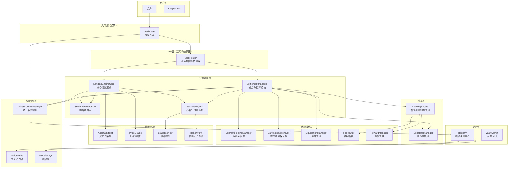

# RWA 借贷平台核心逻辑说明 v3.0

> 最后更新：2025-12  
> 基于当前智能合约实际实现，包含双架构设计（事件驱动 + View层缓存）、ACM 权限管理、撮合结算、保证金系统、资产白名单、SafeERC20 等最新特性13。
> 资金链与资产流动口径统一以 Funds-Flow SSOT 为准：`docs/Usage-Guide/Funds-Flow-Architecture-Guide.md`。

---

## 📋 目录

1. [系统架构总览](#1-系统架构总览)
2. [权限管理系统](#2-权限管理系统)
3. [核心合约模块](#3-核心合约模块)
4. [资金链（Funds Flow / SSOT）](#4-资金链funds-flow--ssot)
5. [资产白名单管理](#5-资产白名单管理)
6. [借贷业务流程](#6-借贷业务流程)
7. [清算机制](#7-清算机制)
8. [预言机系统](#8-预言机系统)
9. [费用与分账](#9-费用与分账)
10. [安全特性](#10-安全特性)
11. [升级与治理](#11-升级与治理)

---

## 1. 系统架构总览

### 1.1 双架构设计

RWA 借贷平台采用**双架构设计**，结合事件驱动架构和 View 层缓存架构：

- **事件驱动架构**：所有操作通过事件记录，支持数据库收集和 AI 分析
- **View 层缓存架构**：提供快速免费查询，所有查询函数使用 view（0 gas）
- **实时数据流**：数据库实时收集和处理事件数据
- **Gas 优化**：查询免费，只在数据更新时支付 Gas

### 1.2 核心模块架构


```mermaid
graph TB
    subgraph "用户层"
        User[用户]
        Keeper[Keeper Bot]
    end

    subgraph "入口层（极简）"
        VaultCore[VaultCore<br/>极简入口]
    end

    subgraph "View层（双架构协调器）"
        VaultRouter[VaultRouter<br/>双架构智能协调器]
    end

    subgraph "业务逻辑层"
        LendingEngineCore[LendingEngineCore<br/>核心借贷逻辑]
        SettlementManager[SettlementManager<br/>撮合与结算模块]
        SettlementMatchLib[SettlementMatchLib<br/>撮合结算库]
        PushManagers[PushManagers<br/>严格B+推送编排]
    end

    subgraph "账本层"
        CollateralManager[CollateralManager<br/>抵押物管理]
        LendingEngine[LendingEngine<br/>借贷引擎/订单管理]
    end

    subgraph "功能模块层"
        GuaranteeFundManager[GuaranteeFundManager<br/>保证金管理]
        EarlyRepaymentGM[EarlyRepaymentGM<br/>提前还款保证金]
        LiquidationManager[LiquidationManager<br/>清算管理]
        FeeRouter[FeeRouter<br/>费用路由]
        RewardManager[RewardManager<br/>奖励管理]
    end

    subgraph "基础设施层"
        AssetWhitelist[AssetWhitelist<br/>资产白名单]
        PriceOracle[PriceOracle<br/>价格预言机]
        StatisticsView[StatisticsView<br/>统计视图]
        HealthView[HealthView<br/>健康因子视图]
    end

    subgraph "权限管理层"
        ACM[AccessControlManager<br/>统一权限控制]
        ActionKeys[ActionKeys<br/>50个动作键]
        ModuleKeys[ModuleKeys<br/>模块键]
    end

    subgraph "治理层"
        Registry[Registry<br/>模块注册中心]
        VaultAdmin[VaultAdmin<br/>治理入口]
    end

    User --> VaultCore
    VaultCore --> VaultRouter
    VaultRouter --> LendingEngineCore
    VaultRouter --> SettlementManager
    LendingEngineCore --> SettlementMatchLib
    SettlementManager --> SettlementMatchLib
    SettlementManager --> CollateralManager
    SettlementManager --> LendingEngine
    SettlementManager --> GuaranteeFundManager
    SettlementManager --> EarlyRepaymentGM
    SettlementManager --> LiquidationManager
    SettlementManager --> PushManagers
    LendingEngineCore --> PushManagers
    LendingEngine --> CollateralManager
    LendingEngine --> FeeRouter
    LendingEngine --> RewardManager
    PushManagers --> StatisticsView
    PushManagers --> HealthView
    LendingEngineCore --> AssetWhitelist
    LendingEngineCore --> PriceOracle
    VaultCore --> ACM
    SettlementManager --> ACM
    LendingEngineCore --> ACM
    Registry --> ModuleKeys
    Registry --> ActionKeys
    ACM --> Registry
```

### 1.3 模块职责分工

| 模块                     | 职责                         | 状态      | 特性                                       |
| ------------------------ | ---------------------------- | --------- | ------------------------------------------ |
| **VaultCore**            | 极简入口，传送数据至 View 层 | ✅ 已实现 | 双架构设计、极简实现、Registry 升级能力    |
| **VaultRouter**          | 双架构智能协调器             | ✅ 已实现 | 事件驱动、View 层缓存、模块分发、免费查询  |
| **SettlementManager**    | 结算与清算收口模块           | ✅ 已实现 | 早偿、清算提取、统一结算路由               |
| **PushManagers**         | 视图推送编排器               | ✅ 已实现 | 统一快照推送、严格 B+ 重试机制 (Strict B+) |
| **SettlementMatchLib**   | 撮合结算库                   | ✅ 已实现 | 原子化操作、订单落地、保证金锁定           |
| **CollateralManager**    | 抵押物管理，记录用户余额     | ✅ 已实现 | 事件记录、账本维护                         |
| **LendingEngine**        | 借贷引擎，管理贷款订单       | ✅ 已实现 | 订单生命周期、SafeERC20、LoanNFT           |
| **GuaranteeFundManager** | 保证金基金管理               | ✅ 已实现 | 批量操作、账本维护                         |
| **EarlyRepaymentGM**     | 提前还款保证金管理           | ✅ 已实现 | 记录管理、规则计算、早偿结算               |
| **LiquidationManager**   | 清算管理                     | ✅ 已实现 | 模块化清算、风险评估                       |
| **AssetWhitelist**       | 资产白名单管理               | ✅ 已实现 | 治理控制、批量操作                         |
| **FeeRouter**            | 费用路由与配置               | ✅ 已实现 | 多币种支持、暂停机制                       |
| **RewardManager**        | 积分奖励管理                 | ✅ 已实现 | 动态积分、惩罚机制                         |
| **PriceOracle**          | 价格预言机                   | ✅ 已实现 | 多预言机支持、缓存机制、优雅降级           |
| **StatisticsView**       | 统计视图                     | ✅ 已实现 | 数据聚合、保证金统计、活跃用户统计         |
| **HealthView**           | 健康因子视图                 | ✅ 已实现 | 健康因子缓存、风险状态推送                 |
| **AccessControlManager** | 统一权限控制中心             | ✅ 已实现 | 多级权限、角色管理、权限缓存、批量操作     |
| **Registry**             | 模块注册中心                 | ✅ 已实现 | 延时升级、模块管理、Registry 家族          |
| **VaultAdmin**           | 极简治理入口                 | ✅ 已实现 | 健康因子下发、升级鉴权                     |
| **ModuleKeys**           | 模块常量库                   | ✅ 已实现 | 模块标识、字符串映射、类型安全             |
| **ActionKeys**           | 动作常量库                   | ✅ 已实现 | **50个**标准化动作、权限分发、事件追踪     |
| **SystemEvents**         | 标准化事件                   | ✅ 已实现 | 跨模块共享事件 SSOT（原 VaultTypes）       |
| **VaultMath**            | 数学计算库                   | ✅ 已实现 | 统一数学计算、健康因子、LTV、百分比计算    |

---

## 2. 权限管理系统

### 2.1 ACM 架构设计

#### 🎯 **设计理念**

RWA 借贷平台采用**统一的权限控制中心**架构，所有模块通过 `AccessControlManager` (ACM) 进行权限验证，确保：

- **统一管理**: 所有权限集中在 ACM 中管理
- **模块化设计**: 每个模块独立但通过 ACM 协调
- **标准化接口**: 使用 ActionKeys 和 SystemEvents 提供标准化接口
- **安全审计**: 完整的事件记录和权限追踪
- **灵活扩展**: 支持多级权限和角色管理

#### 🔧 **核心组件**

```solidity
// 权限级别枚举
enum PermissionLevel {
    NONE,       // 0: 无权限
    VIEWER,     // 1: 只读权限
    OPERATOR,   // 2: 操作权限
    KEEPER,     // 3: Keeper权限
    ADMIN,      // 4: 管理员权限
    OWNER       // 5: 所有者权限
}

// 角色定义（基于 ActionKeys）
bytes32 public constant MINTER_ROLE = ActionKeys.ACTION_BORROW;
bytes32 public constant GOVERNANCE_ROLE = ActionKeys.ACTION_SET_PARAMETER;
bytes32 public constant OPERATOR_ROLE = ActionKeys.ACTION_DEPOSIT;
```

### 2.2 多级权限系统

#### 📊 **权限级别说明**

| 级别 | 名称     | 描述       | 典型用途       | 权限范围                               |
| ---- | -------- | ---------- | -------------- | -------------------------------------- |
| 0    | NONE     | 无权限     | 普通用户       | 仅查询公开数据                         |
| 1    | VIEWER   | 只读权限   | 审计员、分析师 | 查看内部数据（需拥有查看相关角色）     |
| 2    | OPERATOR | 操作权限   | 业务操作员     | 执行基本业务操作（需拥有业务相关角色） |
| 4    | ADMIN    | 管理员权限 | 系统管理员     | 系统参数管理（需拥有管理相关角色）     |

**注意**: 当前实现中，KEEPER 和 OWNER 权限级别未在 PermissionLevel 枚举中实现。Keeper 功能通过独立的 `_keeper` 地址和 `onlyKeeper` 修饰符实现，Owner 功能通过 `_owner` 地址和 `onlyOwner` 修饰符实现。

#### 🔒 **权限级别说明**

当前实现采用**基于角色的权限系统**，权限级别根据账户拥有的角色动态推断：

**权限级别推断规则**:

- 拥有 `ACTION_SET_PARAMETER` 或 `ACTION_UPGRADE_MODULE` 角色 → `ADMIN`
- 拥有 `ACTION_DEPOSIT` 或 `ACTION_BORROW` 等业务角色 → `OPERATOR`
- 拥有 `ACTION_VIEW` 等查看角色 → `VIEWER`
- 无任何角色 → `NONE`

**注意**: 当前实现不支持直接设置权限级别，也不支持 OWNER 和 KEEPER 权限级别。如需更高级别的权限控制，应通过授予相应的角色来实现。

### 2.3 角色管理系统

#### 🎯 **ActionKeys 角色定义**

ACM 使用 `ActionKeys` 库中定义的 **44 个**标准化动作作为角色标识符：

```solidity
// 基础业务动作
bytes32 public constant ACTION_DEPOSIT = keccak256("DEPOSIT");
bytes32 public constant ACTION_BORROW = keccak256("BORROW");
bytes32 public constant ACTION_REPAY = keccak256("REPAY");
bytes32 public constant ACTION_WITHDRAW = keccak256("WITHDRAW");
bytes32 public constant ACTION_LIQUIDATE = keccak256("LIQUIDATE");

// 系统管理动作
bytes32 public constant ACTION_SET_PARAMETER = keccak256("SET_PARAMETER");
bytes32 public constant ACTION_UPGRADE_MODULE = keccak256("UPGRADE_MODULE");
bytes32 public constant ACTION_PAUSE_SYSTEM = keccak256("PAUSE_SYSTEM");
bytes32 public constant ACTION_UNPAUSE_SYSTEM = keccak256("UNPAUSE_SYSTEM");

// 权限管理动作
bytes32 public constant ACTION_GRANT_ROLE = keccak256("GRANT_ROLE");
bytes32 public constant ACTION_REVOKE_ROLE = keccak256("REVOKE_ROLE");
```

#### 🔧 **角色使用模式**

```solidity
contract LoanNFT {
    // 使用 ActionKeys 定义角色
    bytes32 public constant MINTER_ROLE = ActionKeys.ACTION_BORROW;
    bytes32 public constant GOVERNANCE_ROLE = ActionKeys.ACTION_SET_PARAMETER;

    IAccessControlManager public acm;

    // 权限验证
    function mintLoanCertificate(address to, LoanMetadata calldata data) external {
        acm.requireRole(MINTER_ROLE, msg.sender);
        // ... 业务逻辑
    }

    // 权限检查
    function isMinter(address account) external view returns (bool) {
        return acm.hasRole(MINTER_ROLE, account);
    }
}
```

### 2.4 权限级别推断机制

#### ⚡ **动态推断特性**

- **基于角色**: 权限级别根据账户拥有的角色动态推断
- **优先级**: ADMIN > OPERATOR > VIEWER > NONE
- **简化设计**: 当前实现采用简化架构，权限级别由角色自动推断，不直接设置

#### 🔧 **权限推断实现**

```solidity
function getUserPermissionWithMeta(address user)
    external
    view
    returns (PermissionLevel level, bool isValid, uint256 blockNumber)
{
    if (user == address(0)) return PermissionLevel.NONE;

    // 检查是否拥有管理员角色
    if (hasRole(ActionKeys.ACTION_SET_PARAMETER, user) ||
        hasRole(ActionKeys.ACTION_UPGRADE_MODULE, user)) {
        return PermissionLevel.ADMIN;
    }

    // 检查是否拥有操作员角色
    if (hasRole(ActionKeys.ACTION_DEPOSIT, user) ||
        hasRole(ActionKeys.ACTION_BORROW, user)) {
        return PermissionLevel.OPERATOR;
    }

    // 检查是否拥有查看者角色
    if (hasRole(ActionKeys.ACTION_VIEW, user)) {
        return PermissionLevel.VIEWER;
    }

    return PermissionLevel.NONE;
}
```

**注意**: 当前实现中，权限级别是根据角色动态推断的，不支持直接设置权限级别。如需更细粒度的权限控制，应通过授予/撤销相应的 ActionKeys 角色来实现。

### 2.5 事件记录系统

#### 📝 **标准化事件**

```solidity
// 权限变更事件
event PermissionUpdated(address indexed user, PermissionLevel oldLevel, PermissionLevel newLevel, uint256 blockNumber);

// 角色变更事件
event RoleGranted(bytes32 indexed role, address indexed account, address indexed sender);
event RoleRevoked(bytes32 indexed role, address indexed account, address indexed sender);

// 动作执行事件
event ActionExecuted(bytes32 indexed actionKey, string actionName, address indexed executor, uint256 blockNumber);
```

#### 🔧 **事件使用**

```solidity
// 记录标准化动作
emit SystemEvents.ActionExecuted(
    ActionKeys.ACTION_DEPOSIT,
    ActionKeys.getActionKeyString(ActionKeys.ACTION_DEPOSIT),
    msg.sender,
    block.number
);
```

---

## 3. 核心合约模块

### 3.1 VaultCore（极简入口）

#### 📋 **核心功能**

- **极简入口**：双架构设计的极简入口合约
- **数据传送**：将用户操作传送至 View 层处理
- **Registry 升级**：支持 Registry 模块升级能力
- **地址暴露**：暴露 Registry 和 View 合约地址

#### 🔧 **主要函数**

```solidity
// 用户操作（传送数据至 View 层）
function deposit(address asset, uint256 amount) external
function withdraw(address asset, uint256 amount) external
function borrow(address asset, uint256 amount) external
function repay(address asset, uint256 amount) external

// Registry 基础升级能力
function upgradeModule(bytes32 moduleKey, address newAddress) external onlyAdmin
function executeModuleUpgrade(bytes32 moduleKey) external onlyAdmin

// 基础查询
function registryAddrVar() external view returns (address)
function getRegistry() external view returns (address)
function getModule(bytes32 moduleKey) external view returns (address)
```

#### 🛡️ **设计特点**

- **极简实现**：移除复杂逻辑（权限验证、业务委托、资产白名单验证、暂停/恢复）
- **双架构支持**：遵循双架构设计，只负责传送数据
- **可升级**：支持 UUPS 升级模式

### 3.2 VaultRouter（双架构智能协调器）

#### 📋 **核心功能**

- **双架构协调**：事件驱动 + View 层缓存
- **用户操作处理**：接收 VaultCore 传送的操作，分发到相应模块
- **View 层缓存**：提供快速免费查询（0 gas）
- **数据推送**：统一数据推送接口，支持数据库收集

#### 🔧 **主要函数**

```solidity
// 用户操作处理（由 VaultCore 调用）
function processUserOperation(
    address user,
    bytes32 operationType,
    address asset,
    uint256 amount,
    uint256 blockNumber
) external onlyAuthorizedContract

// 数据推送接口（由业务模块调用）
function pushUserPositionUpdate(
    address user,
    address asset,
    uint256 collateral,
    uint256 debt
) external onlyBusinessContract

function pushSystemStateUpdate(
    address asset,
    uint256 totalCollateral,
    uint256 totalDebt
) external onlyBusinessContract

// 查询接口（免费查询，0 gas）已迁移到 View 模块
// - PositionView/UserView：仓位与用户聚合（均返回 meta）
// - HealthView：健康因子（返回 isValid/blockNumber）
// - ValuationOracleView/BatchView：价格（返回 isValid/blockNumber 或 validFlags）
//
// 示例（UserView）：
// function getUserPosition(address user, address asset) external view
//     returns (uint256 collateral, uint256 debt, bool isValid, uint256 blockNumber, uint64 version)
// function getUserCollateral(address user, address asset) external view
//     returns (uint256 collateral, bool isValid, uint256 blockNumber, uint64 version)
// function getUserDebt(address user, address asset) external view
//     returns (uint256 debt, bool isValid, uint256 blockNumber, uint64 version)
//
// 批量查询
// function batchGetUserPositions(address[] calldata users, address[] calldata assets)
//     external view returns (UserPositionItemMeta[] memory)
// function batchGetAssetPrices(address[] calldata assets)
//     external view returns (AssetPriceItem[] memory)

// 缓存管理
function clearExpiredCache(address user) external onlyAdmin
function getCacheStats() external view returns (uint256, uint256, uint256, uint256)
function refreshModuleCache() external onlyAdmin
```

#### 🛡️ **设计特点**

- **模块地址缓存**：1小时有效期，减少 Registry 查询
- **View 层缓存**：5分钟有效期，提供快速查询
- **事件驱动**：统一事件发出，支持数据库收集
- **数据推送**：使用 DataPushLibrary 统一推送

### 3.3 VaultBusinessLogic（业务逻辑模块）

#### 📋 **核心功能**

- **撮合/资金池编排入口**：撮合与资金池相关链路以 Funds-Flow 文档为 SSOT
- **保证金扩展流编排**：不改变借贷主资金链 SSOT（细节同样以 Funds-Flow 为准）
- **批量编排**：聚合参数校验与模块协作，不在此维护“资金去向”细节

#### 🔧 **入口与函数（SSOT）**

为避免在多个文档中重复维护资金链细节（并引入口径漂移），本节不再枚举/复述与资金链强相关的函数签名与调用顺序。

- 资金链唯一权威：[`docs/Usage-Guide/Funds-Flow-Architecture-Guide.md`](Usage-Guide/Funds-Flow-Architecture-Guide.md)
- 前端集成与 approve/入口说明：[`docs/FRONTEND_CONTRACTS_INTEGRATION.md`](FRONTEND_CONTRACTS_INTEGRATION.md)

#### 🛡️ **设计特点**

- **撮合结算**：使用 SettlementMatchLib 进行原子化操作
- **保证金集成**：与保证金模块协作，口径以 Funds-Flow SSOT 为准
- **SafeERC20**：所有 ERC20 操作使用安全转账
- **ReentrancyGuard**：防止重入攻击

### 3.4 LendingEngine（借贷引擎/订单管理）

#### 📋 **核心功能**

- **订单生命周期管理**：创建、还款、状态更新
- **LoanNFT 集成**：每个订单对应一个 NFT
- **费用口径**：费用资金链与分配口径见 Funds-Flow SSOT
- **优雅降级**：价格预言机异常时的降级处理

#### 🔧 **主要函数**

```solidity
// 订单创建（由 SettlementMatchLib 调用，需要 ACTION_ORDER_CREATE 权限）
function createLoanOrder(LoanOrder calldata order) external returns (uint256 orderId)
// LoanOrder 结构体包含：principal, rate, termBlocks, borrower, lender, asset, startBlock, maturityBlock, repaidAmount

// 还款处理（需要 ACTION_REPAY 权限）
function repay(uint256 orderId, uint256 repayAmount) external

// 查询功能
function getLoanOrder(uint256 orderId) external view returns (LoanOrder memory)
function getUserOrders(address user) external view returns (uint256[] memory)
function calculateExpectedInterest(address user, address asset, uint256 amount)
    external view returns (uint256)
```

#### 🛡️ **设计特点**

- **onlyVaultCore**：仅 VaultCore 可调用账本写入
- **LoanNFT**：每个订单对应一个 NFT，便于追踪
- **费用口径**：费用资金链与分配口径见 Funds-Flow SSOT
- **优雅降级**：集成 GracefulDegradation 库处理价格异常

### 3.5 VaultAdmin（极简治理入口）

#### 📋 **核心功能**

- **参数下发**：阈值/最小健康因子 **SSOT** 下沉至 `KEY_LIQUIDATION_CONFIG_MANAGER → LiquidationConfigModule`；`LiquidationRiskManager` 仅做兼容透传与只读聚合
- **升级鉴权**：自身 UUPS 升级授权
- **只读**：Registry 地址查询

#### 🔧 **主要函数**

```solidity
// 参数下发（唯一写路径）
function setMinHealthFactor(uint256 hfBps) external

// 升级鉴权（UUPS）
function _authorizeUpgrade(address newImplementation) internal override

// 基础查询
function getRegistryAddr() external view returns (address)
```

### 3.6 CollateralManager（抵押物管理）

#### 📋 **核心功能**

- **用户余额管理**：记录每个用户的抵押物余额
- **动态代币配置**：支持更换抵押代币

#### 🔧 **主要函数**

```solidity
// 核心业务逻辑（由 VaultRouter 调用）
function processDeposit(address user, address asset, uint256 amount) external onlyVaultRouter
function processWithdraw(address user, address asset, uint256 amount) external onlyVaultRouter

// 兼容性接口（重定向到核心函数）
function depositCollateral(address user, address asset, uint256 amount) external onlyVaultRouter
function withdrawCollateral(address user, address asset, uint256 amount) external onlyVaultRouter

// 批量操作
function batchProcessDeposit(address user, address[] calldata assets, uint256[] calldata amounts) external onlyVaultRouter
function batchProcessWithdraw(address user, address[] calldata assets, uint256[] calldata amounts) external onlyVaultRouter

// 查询功能
function getCollateral(address user, address asset) external view returns (uint256)
function getTotalCollateralByAsset(address asset) external view returns (uint256)
function getUserCollateralAssets(address user) external view returns (address[] memory)
```

### 3.6.x PositionView（仓位视图 + 抵押估值）

#### 🔧 **主要估值函数（只读，统一口径）**

```solidity
function getUserTotalCollateralValue(address user) external view returns (uint256)
function getTotalCollateralValue() external view returns (uint256)
function getAssetValue(address asset, uint256 amount) external view returns (uint256)
```

### 3.7 AssetWhitelist（资产白名单）

#### 📋 **核心功能**

- **资产白名单管理**：控制哪些 ERC20 资产可以交易
- **治理权限控制**：仅治理地址可修改白名单
- **批量操作支持**：高效的批量添加/移除

#### 🔧 **主要函数**

```solidity
// 检查资产是否允许
function isAssetAllowed(address asset) external view returns (bool)

// 添加资产到白名单（需要 ACTION_ADD_WHITELIST 权限）
function addAllowedAsset(address asset) external

// 从白名单移除资产（需要 ACTION_REMOVE_WHITELIST 权限）
function removeAllowedAsset(address asset) external

// 批量添加资产（需要 ACTION_ADD_WHITELIST 权限）
function batchAddAllowedAssets(address[] calldata assets) external

// 批量移除资产（需要 ACTION_REMOVE_WHITELIST 权限）
function batchRemoveAllowedAssets(address[] calldata assets) external

// 获取所有支持的资产
function getAllowedAssets() external view returns (address[] memory)

// 获取资产详细信息
function getAssetInfo(address asset) external view returns (AssetInfo memory)
```

### 3.8 AccessControlManager（统一权限控制中心）

#### 📋 **核心功能**

- **权限级别（推断）**：`getUserPermissionWithMeta` 按角色动态推断（NONE / VIEWER / OPERATOR / ADMIN）
- **角色管理系统（SSOT）**：基于 ActionKeys 的标准化角色管理（`grantRole/revokeRole/hasRole/requireRole`）
- **事件审计**：`RoleGranted/RoleRevoked` 用于链下审计与权限盘点
- **职责边界（SSOT）**：系统暂停/恢复由 `VaultRouter` 收敛（`ACTION_PAUSE_SYSTEM` / `ACTION_UNPAUSE_SYSTEM`），ACM 不维护“暂停状态机”

#### 🔧 **主要函数**

```solidity
// 权限级别查询（动态推断）
function getUserPermissionWithMeta(address user) external view returns (PermissionLevel, bool, uint256)
// 注意：权限级别根据角色动态推断，不支持直接设置

// 角色管理
function grantRole(bytes32 role, address account) external onlyOwner
function revokeRole(bytes32 role, address account) external onlyOwner
function hasRole(bytes32 role, address account) external view returns (bool)
function requireRole(bytes32 role, address caller) external view
```

### 3.9 CrossChainGovernance（跨链治理）

#### 📋 **核心功能**

- **提案管理**：创建、投票、执行治理提案
- **跨链支持**：支持多链治理投票
- **时间锁机制**：防止恶意提案执行

#### 🔧 **主要函数**

```solidity
// 提案管理（需要 GOVERNANCE_ROLE 权限）
function createProposal(
    string calldata description,
    bytes[] calldata actions,
    address[] calldata targets,
    uint256 votingPeriod
) external returns (uint256 proposalId)

// 投票
function castVote(uint256 proposalId, VoteOption option) external

// 执行提案（需要 EXECUTOR_ROLE 权限）
function executeProposal(uint256 proposalId) external

// 跨链投票
function receiveCrossChainVote(
    uint256 proposalId,
    uint256 chainId,
    uint256 forVotes,
    uint256 againstVotes,
    uint256 abstainVotes,
    bytes calldata signature
) external

// 查询功能
function getProposalState(uint256 proposalId) external view returns (ProposalState)
function getProposal(uint256 proposalId) external view returns (Proposal memory)
```

### 3.10 Registry（模块注册中心）

#### 📋 **核心功能**

- **模块地址映射**：维护 `key => address` 映射关系
- **延时升级机制**：支持三步升级流程
- **模块管理**：提供模块注册、更新、查询功能

#### 🔧 **主要函数**

```solidity
// 模块查询
function getModule(bytes32 key) external view returns (address)
function getModuleOrRevert(bytes32 key) external view returns (address)

// 模块管理（通过 RegistryCore 模块）
function setModule(bytes32 key, address module) external
function setModuleWithReplaceFlag(bytes32 key, address module, bool replace) external

// 延时升级（通过 RegistryUpgradeManager 模块）
function scheduleUpgrade(bytes32 key, address newModule, uint256 delay) external
function executeModuleUpgrade(bytes32 key) external
function cancelUpgrade(bytes32 key) external

// 治理管理（通过 RegistryAdmin 模块）
function setAdmin(address newAdmin) external
function acceptAdmin() external
```

### 3.11 ModuleKeys & ActionKeys（常量库）

#### 📋 **核心功能**

- **模块标识**：提供所有模块的唯一标识常量
- **动作标识**：提供所有系统动作的唯一标识常量
- **字符串映射**：支持常量与字符串的双向映射
- **类型安全**：严格的错误处理和类型检查

#### 🔧 **主要常量**

```solidity
// ModuleKeys 示例
bytes32 constant KEY_VAULT_CORE = keccak256("vaultCore");
bytes32 constant KEY_COLLATERAL_MANAGER = keccak256("collateralManager");
bytes32 constant KEY_LENDING_ENGINE = keccak256("lendingEngine");
bytes32 constant KEY_ACCESS_CONTROL_MANAGER = keccak256("accessControlManager");
bytes32 constant KEY_REGISTRY = keccak256("registry");

// ActionKeys 示例
bytes32 constant ACTION_CLAIM_REWARD = keccak256("claimReward");
bytes32 constant ACTION_UPDATE_PRICE = keccak256("updatePrice");
bytes32 constant ACTION_LIQUIDATE = keccak256("liquidate");
bytes32 constant ACTION_PAUSE = keccak256("pause");
bytes32 constant ACTION_UNPAUSE = keccak256("unpause");
```

#### 🔧 **映射函数**

```solidity
// ModuleKeys 映射函数
function getModuleKeyFromString(string memory name) external pure returns (bytes32)
function getModuleKeyString(bytes32 key) external pure returns (string memory)

// ActionKeys 映射函数
function getActionKeyFromString(string memory name) external pure returns (bytes32)
function getActionKeyString(bytes32 key) external pure returns (string memory)
```

---

## 4. 资金链（Funds Flow / SSOT）

本仓库所有“链上资金链路/入口收口/费用分账/清算/保证金扩展路径”的**唯一权威口径（SSOT）**统一以 `docs/Usage-Guide/Funds-Flow-Architecture-Guide.md` 为准。

为避免与实现漂移，本文件不再维护资金流转的 sequence diagram / 分步伪代码；如需前端调用入口与 approve 细节，统一见 `docs/FRONTEND_CONTRACTS_INTEGRATION.md`。

### 4.1 模块化调用机制

#### 🔧 **动态模块调用**

```solidity
import { ModuleKeys } from "contracts/constants/ModuleKeys.sol";
import { Registry } from "contracts/registry/Registry.sol";

// 通过 Registry 获取模块地址
address collateralManager = Registry(_registryAddr).getModuleOrRevert(
    ModuleKeys.KEY_CM
);

// 使用接口进行调用
try ICollateralManager(collateralManager).depositCollateral(user, asset, amount) {
    // 成功处理
} catch (bytes memory lowLevelData) {
    // 错误处理
    emit SystemEvents.ExternalModuleReverted("CollateralManager", lowLevelData, block.number);
    revert ExternalModuleRevertedRaw("CollateralManager", lowLevelData);
}
```

### 4.2 SafeERC20 安全特性

#### 🛡️ **安全优势**

- **防止假成功**：处理返回 `false` 的非标准 ERC20
- **防止假失败**：处理 `revert` 的非标准 ERC20
- **统一接口**：所有 ERC20 操作使用相同接口

#### 🔧 **使用示例**

```solidity
// 安全转账
IERC20(token).safeTransfer(to, amount);

// 安全授权转账
IERC20(token).safeTransferFrom(from, to, amount);

// 安全授权
IERC20(token).safeApprove(spender, amount);
```

### 4.3 资产白名单验证

#### 🔍 **验证流程**

```solidity
function _checkAssetWhitelist(address asset) internal view {
    address assetWhitelist = _getModuleAddress(ModuleKeys.KEY_ASSET_WHITELIST);
    if (assetWhitelist != address(0)) {
        if (!IAssetWhitelist(assetWhitelist).isAssetAllowed(asset)) {
            revert AssetNotAllowed();
        }
    }
}
```

---

## 5. 资产白名单管理

### 5.1 白名单机制设计

#### 🎯 **设计目标**

- **安全性**：防止恶意资产进入系统
- **灵活性**：支持动态添加/移除资产
- **效率性**：快速查询资产是否允许

#### 🔧 **实现方式**

```solidity
contract AssetWhitelist is Initializable, UUPSUpgradeable, IAssetWhitelist {
    /// @notice Registry合约地址
    address private _registryAddr;

    /// @notice 资产白名单映射
    mapping(address => bool) private _allowedAssets;

    /// @notice 支持的资产地址列表
    address[] private _assetList;

    /// @notice 资产索引映射：asset → index（优化数组操作）
    mapping(address => uint256) private _assetIndex;

    /// @notice 资产数量计数器
    uint256 private _assetCount;

    /// @notice 资产详细信息映射
    mapping(address => AssetInfo) private _assetInfo;

    struct AssetInfo {
        bool isActive;
        uint256 addedAt;
        address addedBy;
        uint256 lastUpdated;
        uint256 updateCount;
    }

    function isAssetAllowed(address asset) external view returns (bool) {
        return _allowedAssets[asset];
    }

    function addAllowedAsset(address asset) external onlyValidRegistry {
        _requireRole(ActionKeys.ACTION_ADD_WHITELIST, msg.sender);
        if (asset == address(0)) revert ZeroAddress();
        if (_allowedAssets[asset]) revert AmountIsZero(); // 已存在

        _allowedAssets[asset] = true;
        _assetList.push(asset);
        _assetIndex[asset] = _assetList.length - 1;
        _assetCount++;

        _assetInfo[asset] = AssetInfo({
            isActive: true,
            addedAt: block.number,
            addedBy: msg.sender,
            lastUpdated: block.number,
            updateCount: 1
        });

        emit AssetAdded(ActionKeys.ACTION_ADD_WHITELIST, asset, msg.sender, block.number);

        // 记录标准化动作事件
        emit SystemEvents.ActionExecuted(
            ActionKeys.ACTION_ADD_WHITELIST,
            ActionKeys.getActionKeyString(ActionKeys.ACTION_ADD_WHITELIST),
            msg.sender,
            block.number
        );
    }
}
```

### 5.2 批量操作优化

#### ⚡ **批量添加**

```solidity
function batchAddAllowedAssets(address[] calldata assets) external onlyValidRegistry {
    _requireRole(ActionKeys.ACTION_ADD_WHITELIST, msg.sender);
    if (assets.length == 0) revert AmountIsZero();

    uint256 addedCount = 0;
    for (uint256 i = 0; i < assets.length; i++) {
        address asset = assets[i];
        if (asset != address(0) && !_allowedAssets[asset]) {
            _allowedAssets[asset] = true;
            _assetList.push(asset);
            _assetIndex[asset] = _assetList.length - 1;
            _assetCount++;

            _assetInfo[asset] = AssetInfo({
                isActive: true,
                addedAt: block.number,
                addedBy: msg.sender,
                lastUpdated: block.number,
                updateCount: 1
            });

            addedCount++;
        }
    }

    emit AssetsBatchAdded(
        ActionKeys.ACTION_ADD_WHITELIST,
        assets,
        msg.sender,
        addedCount,
        assets.length
    );

    // 记录标准化动作事件
    emit SystemEvents.ActionExecuted(
        ActionKeys.ACTION_ADD_WHITELIST,
        ActionKeys.getActionKeyString(ActionKeys.ACTION_ADD_WHITELIST),
        msg.sender,
        block.number
    );
}
```

#### ⚡ **批量移除**

```solidity
function batchRemoveAllowedAssets(address[] calldata assets) external onlyValidRegistry {
    _requireRole(ActionKeys.ACTION_REMOVE_WHITELIST, msg.sender);
    if (assets.length == 0) revert AmountIsZero();

    uint256 removedCount = 0;
    for (uint256 i = 0; i < assets.length; i++) {
        address asset = assets[i];
        if (asset != address(0) && _allowedAssets[asset]) {
            _allowedAssets[asset] = false;
            _assetCount--;

            // 更新资产信息
            _assetInfo[asset].isActive = false;
            _assetInfo[asset].lastUpdated = block.number;
            _assetInfo[asset].updateCount++;

            // 从数组中移除（优化实现）
            uint256 index = _assetIndex[asset];
            if (index < _assetList.length - 1) {
                address lastAsset = _assetList[_assetList.length - 1];
                _assetList[index] = lastAsset;
                _assetIndex[lastAsset] = index;
            }
            _assetList.pop();
            delete _assetIndex[asset];

            removedCount++;
        }
    }

    emit AssetsBatchRemoved(
        ActionKeys.ACTION_REMOVE_WHITELIST,
        assets,
        msg.sender,
        removedCount,
        assets.length
    );

    // 记录标准化动作事件
    emit SystemEvents.ActionExecuted(
        ActionKeys.ACTION_REMOVE_WHITELIST,
        ActionKeys.getActionKeyString(ActionKeys.ACTION_REMOVE_WHITELIST),
        msg.sender,
        block.number
    );
}
```

### 5.3 资产信息管理

#### 📊 **资产详细信息**

系统维护每个资产的详细信息，包括：

- **isActive**：资产是否激活
- **addedAt**：添加区块
- **addedBy**：添加者地址
- **lastUpdated**：最后更新区块
- **updateCount**：更新次数

#### 🔧 **查询功能**

```solidity
// 获取资产详细信息
function getAssetInfo(address asset) external view returns (AssetInfo memory)

// 获取支持的资产数量
function getAssetCount() external view returns (uint256)

// 根据索引获取资产地址
function getAssetAtIndex(uint256 index) external view returns (address)

// 获取所有支持的资产
function getAllowedAssets() external view returns (address[] memory)
```

#### 🔧 **资产信息更新**

```solidity
// 更新资产信息（需要 ACTION_SET_PARAMETER 权限）
function updateAssetInfo(address asset) external onlyValidRegistry {
    _requireRole(ActionKeys.ACTION_SET_PARAMETER, msg.sender);
    if (asset == address(0)) revert ZeroAddress();
    if (!_allowedAssets[asset]) revert AmountIsZero();

    _assetInfo[asset].lastUpdated = block.number;
    _assetInfo[asset].updateCount++;

    emit AssetInfoUpdated(
        ActionKeys.ACTION_SET_PARAMETER,
        asset,
        msg.sender,
        block.number
    );
}
```

### 5.4 优化特性

#### ⚡ **数组操作优化**

- **索引映射**：使用 `_assetIndex` 映射实现 O(1) 的资产查找
- **高效移除**：批量移除时使用交换最后一个元素的方式，避免数组遍历
- **计数器**：使用 `_assetCount` 计数器快速获取资产数量

#### 🛡️ **安全特性**

- **Registry 集成**：通过 Registry 获取 ACM 进行权限验证
- **标准化事件**：所有操作都发出 `SystemEvents.ActionExecuted` 事件
- **错误处理**：使用自定义错误 `ZeroAddress` 和 `AmountIsZero`
- **UUPS 升级**：支持可升级合约模式

---

## 6. 借贷业务流程

借贷相关的“资金链路/入口/费用/清算/保证金扩展路径”均属于资金链 SSOT 范畴，统一以 `docs/Usage-Guide/Funds-Flow-Architecture-Guide.md` 为准（本文件不再复述）。

- 用户视角流程说明：`docs/Usage-Guide/UserFlow.md`
- 前端调用入口与 approve 示例：`docs/FRONTEND_CONTRACTS_INTEGRATION.md`
- 保证金系统实现与配置：`docs/GuaranteeFundImplementation.md`

---

## 7. 清算机制

### 7.1 健康因子计算

#### 📋 **计算公式**

```
健康因子 = (抵押物价值 × 清算阈值) / 债务价值
```

#### 🔧 **实现口径（对齐当前代码与架构指南）**

- **健康因子数值口径（bps）**：`healthFactor = collateralValue / debtValue * 10_000`（在代码中由 `LiquidationRiskLib.calculateHealthFactor` 或 `HealthFactorLib.calcHealthFactor` 提供）。
- **清算判定主路径（避免除法）**：以 `HealthFactorLib.isUnderCollateralized(collateralValue, debtValue, thresholdBps)` 判定是否低于阈值（阈值来自 `LiquidationConfigModule`/`LiquidationRiskManager` 的 SSOT 读取）。

> **注意**：
>
> - `LiquidationViewLibrary` 已移除，避免旧口径（如 1e18）与职责边界分叉。
> - 预言机与优雅降级只在 `VaultLendingEngine`/`PositionView` 的估值路径内执行，清算域不直接访问预言机。

### 7.2 清算触发条件

#### ⚠️ **清算条件**

- 健康因子 < 最小健康因子阈值
- 用户有债务且抵押物不足

#### 🔧 **清算检查**

```solidity
function isLiquidatable(address user)
    external
    view
    returns (bool liquidatable, bool isValid, uint256 blockNumber)
{
    (uint256 healthFactor, , ) = getUserHealthFactorWithMeta(user);
    liquidatable = healthFactor < minHealthFactor;
    isValid = true;
    blockNumber = block.number;
}
```

### 7.3 清算执行流程（模块化清算系统）

#### 📋 **清算步骤**

对齐当前实现与 `docs/Architecture-Guide.md` 的 SSOT 口径：

1. **keeper/机器人入口（推荐/默认，按产品线区分）**：legacy / 通用订单调用 `SettlementManager.settleOrLiquidate(orderId)`；blocks-only 订单调用 `BlocksOnlyCoordinator.settleOrLiquidateBlocks(orderId)`
2. **清算分支直达账本写入**：由 `SettlementManager` 内部编排，必要时转交 `LiquidationManager`
3. **单点推送（best-effort）**：`LiquidatorView.pushLiquidationUpdate/Batch` 作为对外唯一推送点

清算资金链与内部调用顺序统一以 Funds-Flow SSOT 为准：`docs/Usage-Guide/Funds-Flow-Architecture-Guide.md`。

#### 🔧 **清算实现（LiquidationManager）**

当前 `LiquidationManager` 的定位是“**直达账本执行器 + 单点推送**”，并保留显式参数入口用于测试/应急；keeper 常态入口应走产品对应的上游编排入口，而不是把 blocks-only 也表述成默认走 `SettlementManager.settleOrLiquidate(orderId)`。

**清算系统架构**：

- **SettlementManager**：legacy / 通用订单的对外写入口（SSOT）
- **BlocksOnlyCoordinator**：blocks-only 产品线的对外写入口（SSOT）
- **LiquidationManager**：清算执行器（直达账本写入 + best-effort 单点推送）
- **LiquidationRiskManager / HealthView**：风控只读聚合/缓存（不承载写入口）
- **LiquidationPayoutManager**：清算分配配置（资金链口径见 Funds-Flow SSOT）
- **LiquidatorView**：DataPush 单点（链下消费与重试）

详见 [清算系统集成总结文档](./liquidation-system-integration-summary.md)

---

## 8. 预言机系统

### 8.1 PriceOracle 概述

PriceOracle 是一个面向多来源写价链路的多资产价格预言机系统，为平台提供实时、可靠的价格数据服务。

#### 📋 **核心功能**

- **多资产支持**：支持多种 ERC20 资产价格查询
- **价格更新**：支持手动和批量价格更新
- **价格验证**：价格有效性和时效性检查（通过 `maxPriceAge` 配置）
- **优雅降级**：集成 GracefulDegradation 库处理价格异常
- **权限控制**：基于 AccessControlManager 的细粒度权限管理
- **可升级性**：使用 UUPS 代理模式，支持合约升级

#### 🔧 **核心接口**

```solidity
interface IPriceOracle {
    // 价格查询
    function getPrice(address asset) external view returns (uint256 price, uint256 blockNumber, uint256 assetDecimals);
    function getPrices(address[] calldata assets) external view returns (uint256[] memory prices, uint256[] memory blockNumbers, uint256[] memory assetDecimalsArray);
    function isPriceValid(address asset) external view returns (bool isValid);

    // 资产配置
    function configureAsset(address asset, string calldata sourceId, uint256 assetDecimals, uint256 maxPriceAge) external;
    function getAssetConfig(address asset) external view returns (AssetConfig memory);

    // 价格更新（需要 ACTION_UPDATE_PRICE 权限）
    function updatePrice(address asset, uint256 price, uint256 blockNumber) external;
    function updatePrices(address[] calldata assets, uint256[] calldata prices, uint256[] calldata blockNumbers) external;
}
```

#### 📊 **数据结构**

```solidity
struct PriceData {
    uint256 price;        // 价格（SSOT: 按 assetDecimals 缩放的 USD 价格）
    uint256 blockNumber;    // 价格更新区块
    uint256 assetDecimals; // 资产精度（token decimals；用于 amount(base units) → valueUsd 换算，并同时决定 price/value 精度）
    bool isValid;         // 价格是否有效
}

struct AssetConfig {
    string sourceId;   // 链下 source 资产 ID
    uint256 assetDecimals; // 资产精度（token decimals；用于估值缩放；不是 price 精度）
    bool isActive;        // 资产是否激活
    uint256 maxPriceAge;  // 最大价格年龄（秒）
}
```

### 8.2 价格缓存机制

#### ⚡ **缓存策略**

- **时间缓存**：价格在指定时间内有效（通过 `maxPriceAge` 配置）
- **价格验证**：检查价格有效性和时效性
- **优雅降级**：集成 GracefulDegradation 库处理价格异常

> **详细说明**：关于 PriceOracle 的完整架构设计、使用指南、集成示例和最佳实践，请参考 [PriceOracle 使用指南](../Usage-Guide/PriceOracle-Guide.md)。

---

## 9. 费用与分账

#### 📌 **配置口径**

- 费用比例通过 `platformFeeBps` 与 `ecosystemFeeBps` 配置，且满足 `platformFeeBps + ecosystemFeeBps < 10000`。
- 费用的资金链与对账口径统一以 Funds-Flow SSOT 为准：`docs/Usage-Guide/Funds-Flow-Architecture-Guide.md`。

---

## 10. 安全特性

### 10.1 重入攻击防护

#### 🛡️ **防护机制**

- **ReentrancyGuardUpgradeable**：使用 OpenZeppelin 的可升级重入保护
- **状态更新顺序**：遵循 CEI（Checks-Effects-Interactions）模式，先检查条件，再更新状态，最后调用外部函数
- **函数修饰符**：所有可能改变状态的外部函数使用 `nonReentrant` 修饰符

#### 🔧 **实现示例**

```solidity
import "@openzeppelin/contracts-upgradeable/security/ReentrancyGuardUpgradeable.sol";

contract VaultBusinessLogic is
    Initializable,
    UUPSUpgradeable,
    ReentrancyGuardUpgradeable,
    PausableUpgradeable
{
    function exampleNonReentrantAction(
        address token,
        uint256 amount
    ) external whenNotPaused nonReentrant {
        // 1. 检查条件（Checks）
        if (token == address(0)) revert ZeroAddress();
        if (amount == 0) revert AmountIsZero();

        // 2. 更新状态（Effects）
        // updateState(...);

        // 3. 外部调用（Interactions）
        IERC20(token).safeTransferFrom(msg.sender, address(this), amount);
    }
}
```

### 10.2 权限控制

#### 🔐 **权限系统架构**

系统使用 `AccessControlManager` 进行统一的权限管理，基于 `ActionKeys` 实现细粒度权限控制。

**权限级别**（`PermissionLevel` 枚举）：

- **NONE**：无权限
- **VIEWER**：查看权限（查询系统数据、用户数据等）
- **OPERATOR**：操作权限（设置参数、升级模块、暂停系统等）
- **ADMIN**：管理员权限（最高权限）

**核心权限动作**（`ActionKeys`）：

- `ACTION_ADMIN`：管理员权限
- `ACTION_SET_PARAMETER`：设置参数权限
- `ACTION_UPGRADE_MODULE`：升级模块权限
- `ACTION_PAUSE_SYSTEM`：暂停系统权限
- `ACTION_UNPAUSE_SYSTEM`：恢复系统权限
- `ACTION_DEPOSIT`、`ACTION_BORROW`、`ACTION_REPAY` 等：业务操作权限

#### 🔧 **权限实现**

```solidity
import { IAccessControlManager } from "../interfaces/IAccessControlManager.sol";
import { ActionKeys } from "../constants/ActionKeys.sol";
import { Registry } from "../registry/Registry.sol";
import { ModuleKeys } from "../constants/ModuleKeys.sol";

contract VaultBusinessLogic {
    address private _registryAddr;

    function _requireRole(bytes32 actionKey, address user) internal view {
        address acmAddr = Registry(_registryAddr).getModuleOrRevert(ModuleKeys.KEY_ACCESS_CONTROL);
        IAccessControlManager(acmAddr).requireRole(actionKey, user);
    }

    modifier onlyRole(bytes32 actionKey) {
        _requireRole(actionKey, msg.sender);
        _;
    }

    function configureAsset(address asset, uint256 maxLTV) external onlyRole(ActionKeys.ACTION_SET_PARAMETER) {
        // 需要 ACTION_SET_PARAMETER 权限
    }
}
```

### 10.3 紧急暂停

#### 🚨 **暂停机制**

- **全局暂停**：通过 `PausableUpgradeable` 暂停所有业务操作
- **权限控制**：暂停/恢复操作需要相应的 `ActionKeys` 权限
- **紧急恢复**：紧急情况下快速恢复系统运行

#### 🔧 **暂停实现**

```solidity
import "@openzeppelin/contracts-upgradeable/security/PausableUpgradeable.sol";
import { ActionKeys } from "../constants/ActionKeys.sol";

contract VaultBusinessLogic is
    Initializable,
    UUPSUpgradeable,
    ReentrancyGuardUpgradeable,
    PausableUpgradeable
{
    function pause() external onlyValidRegistry {
        _requireRole(ActionKeys.ACTION_PAUSE_SYSTEM, msg.sender);
        _pause();

        emit SystemEvents.ActionExecuted(
            ActionKeys.ACTION_PAUSE_SYSTEM,
            ActionKeys.getActionKeyString(ActionKeys.ACTION_PAUSE_SYSTEM),
            msg.sender,
            block.number
        );
    }

    function unpause() external onlyValidRegistry {
        _requireRole(ActionKeys.ACTION_UNPAUSE_SYSTEM, msg.sender);
        _unpause();

        emit SystemEvents.ActionExecuted(
            ActionKeys.ACTION_UNPAUSE_SYSTEM,
            ActionKeys.getActionKeyString(ActionKeys.ACTION_UNPAUSE_SYSTEM),
            msg.sender,
            block.number
        );
    }

    modifier whenNotPaused() {
        require(!paused(), "Contract is paused");
        _;
    }
}
```

---

## 11. 升级与治理

### 11.1 UUPS 升级模式

#### 🔄 **升级机制**

- **实现合约升级**：升级业务逻辑而不影响存储
- **代理合约不变**：用户地址保持不变
- **数据安全**：升级过程中数据不丢失
- **权限控制**：通过 `AccessControlManager` 验证 `ACTION_UPGRADE_MODULE` 权限

#### 🔧 **升级实现**

```solidity
import "@openzeppelin/contracts-upgradeable/proxy/utils/UUPSUpgradeable.sol";
import { ActionKeys } from "../constants/ActionKeys.sol";
import { IAccessControlManager } from "../interfaces/IAccessControlManager.sol";

contract VaultBusinessLogic is UUPSUpgradeable {
    address private _registryAddr;

    function _authorizeUpgrade(address newImplementation) internal override {
        // 通过 Registry 获取 AccessControlManager 并验证权限
        address acmAddr = Registry(_registryAddr).getModuleOrRevert(ModuleKeys.KEY_ACCESS_CONTROL);
        IAccessControlManager(acmAddr).requireRole(ActionKeys.ACTION_UPGRADE_MODULE, msg.sender);

        if (newImplementation == address(0)) revert ZeroAddress();

        // 记录升级动作
        emit SystemEvents.ActionExecuted(
            ActionKeys.ACTION_UPGRADE_MODULE,
            ActionKeys.getActionKeyString(ActionKeys.ACTION_UPGRADE_MODULE),
            msg.sender,
            block.number
        );
    }
}
```

### 11.2 模块化升级（Registry 系统）

#### 🧩 **升级流程**

系统通过 `Registry` 统一管理模块升级，支持两种升级方式：

1. **立即升级**：直接设置新模块地址（首次部署或紧急情况）
2. **延时升级**：计划升级 → 等待延时 → 执行升级（推荐方式，提供安全缓冲）

#### 🔧 **Registry 升级管理**

```solidity
import { Registry } from "../registry/Registry.sol";
import { ModuleKeys } from "../constants/ModuleKeys.sol";

// 立即升级（首次部署或紧急替换）
function setModule(bytes32 key, address moduleAddr) external onlyOwner whenNotPaused {
    // 直接设置模块地址，无延时
}

// 延时升级流程（推荐）
// 1. 计划升级
function scheduleModuleUpgrade(bytes32 key, address newAddr) external onlyOwner whenNotPaused {
    // 创建升级计划，设置执行时间（当前时间 + minDelay）
    // 升级计划存储在 pendingUpgrades 映射中
}

// 2. 执行升级（延时到期后）
function executeModuleUpgrade(bytes32 key) external onlyOwner nonReentrant whenNotPaused {
    // 检查延时是否到期
    // 执行升级，更新模块地址
    // 记录升级历史
}

// 3. 取消升级（可选）
function cancelModuleUpgrade(bytes32 key) external onlyOwner whenNotPaused {
    // 取消待执行的升级计划
}
```

#### 📊 **升级特性**

- **延时保护**：通过 `minDelay` 设置最小延时时间，防止恶意升级
- **升级历史**：记录所有模块升级历史（最多保留 100 条）
- **批量升级**：支持批量设置多个模块地址
- **权限控制**：只有 `owner` 可以执行升级操作

### 11.3 跨链治理投票

#### 🗳️ **投票机制**

系统使用 `CrossChainGovernance` 合约实现跨链治理，支持多链投票聚合。

**提案状态**：

- `Pending`：待投票
- `Active`：投票中
- `Succeeded`：投票成功
- `Executed`：已执行
- `Defeated`：投票失败
- `Expired`：已过期

**投票选项**：

- `Against`：反对
- `For`：赞成
- `Abstain`：弃权

#### 🔧 **治理实现**

```solidity
contract CrossChainGovernance is Initializable, AccessControlUpgradeable, UUPSUpgradeable {
    bytes32 public constant GOVERNANCE_ROLE = keccak256("GOVERNANCE_ROLE");
    bytes32 public constant EXECUTOR_ROLE = keccak256("EXECUTOR_ROLE");

    struct Proposal {
        uint256 proposalId;
        address proposer;
        string description;
        uint256 forVotes;
        uint256 againstVotes;
        uint256 abstainVotes;
        uint256 startTime;
        uint256 endTime;
        uint256 executionTime;
        bool executed;
        bool canceled;
        ProposalState state;
        uint256 quorum;
        uint256 chainId;
        bytes[] actions;      // 执行动作数组
        address[] targets;    // 目标合约数组
    }

    // 创建提案（需要 GOVERNANCE_ROLE 权限）
    function createProposal(
        string calldata description,
        bytes[] calldata actions,
        address[] calldata targets,
        uint256 votingPeriod
    ) external onlyRole(GOVERNANCE_ROLE) returns (uint256 proposalId);

    // 投票
    function vote(uint256 proposalId, VoteOption option) external;

    // 执行提案（需要 EXECUTOR_ROLE 权限，投票通过后需等待 executionDelay）
    function executeProposal(uint256 proposalId) external onlyRole(EXECUTOR_ROLE) nonReentrant;

    // 接收跨链投票
    function receiveCrossChainVote(
        uint256 proposalId,
        uint256 chainId,
        uint256 forVotes,
        uint256 againstVotes,
        uint256 abstainVotes,
        uint256 totalWeight,
        address validator,
        bytes calldata signature
    ) external onlyRole(EXECUTOR_ROLE) nonReentrant;
}
```

#### 🔄 **升级提案示例**

```solidity
// 创建模块升级提案
bytes[] memory actions = new bytes[](1);
actions[0] = abi.encodeWithSignature(
    "scheduleModuleUpgrade(bytes32,address)",
    ModuleKeys.KEY_VAULT_BUSINESS_LOGIC,
    newImplementationAddress
);

address[] memory targets = new address[](1);
targets[0] = registryAddress;

uint256 proposalId = governance.createProposal(
    "Upgrade VaultBusinessLogic to the new implementation",
    actions,
    targets,
    7 days  // 投票期7天
);

// 投票通过后，执行提案
governance.executeProposal(proposalId);

// 延时到期后，执行升级
registry.executeModuleUpgrade(ModuleKeys.KEY_VAULT_BUSINESS_LOGIC);
```

---

## 📊 总结

### 🎯 **核心优势**

- **统一权限管理**：通过 ACM 实现集中化权限控制
- **模块化架构**：高内聚、低耦合的模块设计
- **安全转账实践**：使用 SafeERC20 确保 ERC20 交互安全
- **资产白名单**：严格控制可交易资产
- **健康因子监控**：实时风险监控和清算机制
- **可升级性**：支持 UUPS 升级和模块化升级
- **安全防护**：多重安全机制保护用户资金

### 🔧 **技术栈**

- **Solidity 0.8.20**：智能合约开发
- **OpenZeppelin**：安全合约库
- **UUPS 升级模式**：合约升级
- **模块化架构**：微服务设计
- **接口驱动**：解耦设计
- **ACM 权限系统**：统一权限控制
- **ActionKeys**：标准化动作管理

### 📈 **性能指标**

- **Gas 优化**：批量操作减少 30% Gas 消耗
- **查询效率**：VaultRouter 提供高效查询接口
- **权限缓存**：ACM 权限缓存提高查询效率
- **升级安全**：模块化升级不影响用户资金
- **错误处理**：统一的错误处理和事件机制
