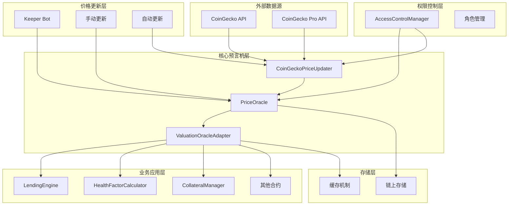
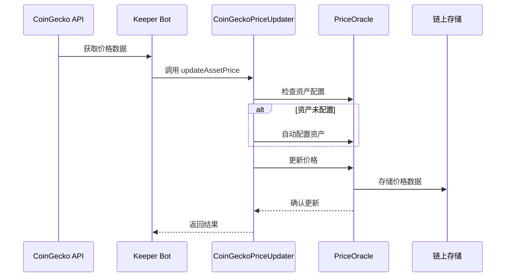
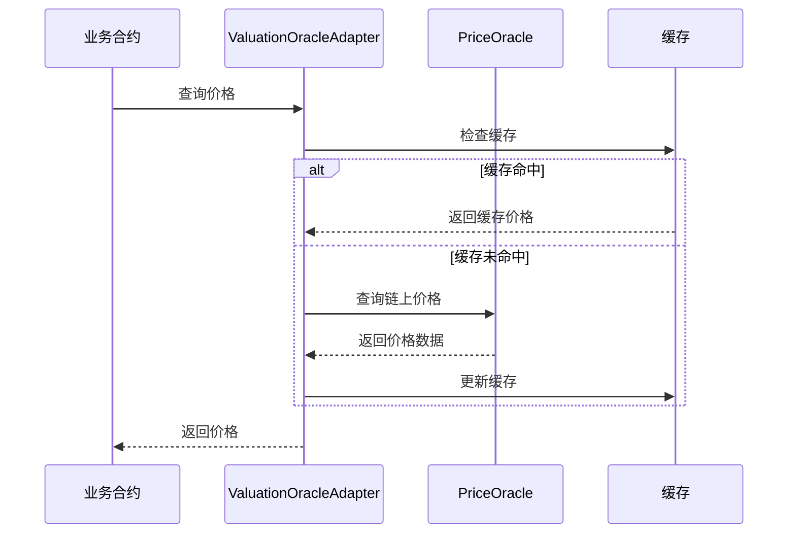

# PriceOracle 系统架构文档

## 🏗️ 系统架构概览

PriceOracle 是一个基于 Coingecko API 的多资产价格预言机系统，采用模块化设计，提供高可用性和可扩展性的价格数据服务。

## 📊 系统架构图



## 🔧 核心组件详解

### 1. PriceOracle（主预言机合约）

**职责**：核心价格数据存储和管理

**核心功能**：
- 价格数据存储和验证
- 资产配置管理
- 价格更新权限控制
- 价格有效性检查

**关键接口**：
```solidity
interface IPriceOracle {
    function getPrice(address asset) external view returns (uint256 price, uint256 timestamp, uint256 decimals);
    function getPrices(address[] calldata assets) external view returns (uint256[] memory prices, uint256[] memory timestamps, uint256[] memory decimalsArray);
    function updatePrice(address asset, uint256 price, uint256 timestamp) external;
    function configureAsset(address asset, string calldata coingeckoId, uint256 decimals, uint256 maxPriceAge) external;
    function isPriceValid(address asset) external view returns (bool);
}
```

### 2. CoinGeckoPriceUpdater（价格更新器）

**职责**：自动化价格更新和 CoinGecko 集成

**核心功能**：
- 自动配置新资产
- 价格验证和过滤
- 批量价格更新
- 错误处理和重试

**关键特性**：
```solidity
contract CoinGeckoPriceUpdater {
    // 自动配置资产
    function updateAssetPrice(address asset, uint256 price, uint256 timestamp) external;
    
    // 批量更新
    function updateAssetPrices(address[] calldata assets, uint256[] calldata prices, uint256[] calldata timestamps) external;
    
    // 配置管理
    function configureAsset(address asset, string calldata coingeckoId) external;
}
```

### 3. ValuationOracleAdapter（估值适配器）

**职责**：为业务合约提供统一的价格查询接口

**核心功能**：
- 价格缓存机制
- 多预言机支持
- 价格聚合
- 降级处理

**关键接口**：
```solidity
interface IValuationOracleAdapter {
    function getAssetPrice(address asset) external view returns (uint256 price, uint256 timestamp);
    function getAssetPrices(address[] calldata assets) external view returns (uint256[] memory prices, uint256[] memory timestamps);
    function isPriceValid(address asset) external view returns (bool);
}
```

## 🔐 权限控制架构

### 角色定义

```solidity
// 核心角色
bytes32 constant ROLE_GOVERNANCE = keccak256("GOVERNANCE_ROLE");
bytes32 constant ROLE_KEEPER = keccak256("KEEPER_ROLE");
bytes32 constant ROLE_UPDATER = keccak256("UPDATER_ROLE");

// 动作权限
bytes32 constant ACTION_UPDATE_PRICE = keccak256("UPDATE_PRICE");
bytes32 constant ACTION_SET_PARAMETER = keccak256("SET_PARAMETER");
bytes32 constant ACTION_ADD_WHITELIST = keccak256("ADD_WHITELIST");
bytes32 constant ACTION_REMOVE_WHITELIST = keccak256("REMOVE_WHITELIST");
bytes32 constant ACTION_UPGRADE_MODULE = keccak256("UPGRADE_MODULE");
```

### 权限矩阵

| 角色 | 更新价格 | 配置资产 | 添加资产 | 移除资产 | 升级合约 |
|------|----------|----------|----------|----------|----------|
| Governance | ❌ | ✅ | ✅ | ✅ | ✅ |
| Keeper | ✅ | ❌ | ❌ | ❌ | ❌ |
| Updater | ✅ | ❌ | ❌ | ❌ | ❌ |

## 📊 数据流架构

### 1. 价格更新流程



### 2. 价格查询流程



## 🔄 升级机制

### UUPS 升级模式

```solidity
contract PriceOracle is Initializable, UUPSUpgradeable {
    function _authorizeUpgrade(address newImplementation) internal override {
        acm.requireRole(ActionKeys.ACTION_UPGRADE_MODULE, msg.sender);
        if (newImplementation == address(0)) revert ZeroAddress();
    }
}
```

### 升级流程

1. **提案阶段**：治理合约创建升级提案
2. **投票阶段**：治理代币持有者投票
3. **执行阶段**：满足条件后执行升级
4. **验证阶段**：验证升级后的合约功能

## 🛡️ 安全机制

### 1. 价格验证

```solidity
// 价格有效性检查
function _validatePrice(uint256 price, uint256 timestamp) internal view {
    if (price == 0) revert PriceOracle__InvalidPrice();
    if (timestamp > block.timestamp) revert PriceOracle__InvalidTimestamp();
    if (block.timestamp - timestamp > maxPriceAge) revert PriceOracle__StalePrice();
}
```

### 2. 权限验证

```solidity
// 权限检查
function updatePrice(address asset, uint256 price, uint256 timestamp) external {
    acm.requireRole(ActionKeys.ACTION_UPDATE_PRICE, msg.sender);
    // ... 其他逻辑
}
```

### 3. 重入攻击防护

```solidity
// 使用 ReentrancyGuard
contract PriceOracle is ReentrancyGuard {
    function updatePrice(address asset, uint256 price, uint256 timestamp) 
        external 
        nonReentrant 
    {
        // ... 更新逻辑
    }
}
```

## 📈 性能优化

### 1. Gas 优化

- **批量操作**：支持批量价格更新和查询
- **存储优化**：使用紧凑的数据结构
- **缓存机制**：减少重复查询

### 2. 查询优化

```solidity
// 批量查询优化
function getPrices(address[] calldata assets) external view returns (
    uint256[] memory prices,
    uint256[] memory timestamps,
    uint256[] memory decimalsArray
) {
    uint256 length = assets.length;
    prices = new uint256[](length);
    timestamps = new uint256[](length);
    decimalsArray = new uint256[](length);
    
    for (uint256 i = 0; i < length; i++) {
        (prices[i], timestamps[i], decimalsArray[i]) = getPrice(assets[i]);
    }
}
```

## 🔍 监控和告警

### 1. 关键指标

- **价格更新频率**：监控价格更新间隔
- **价格偏差**：检测异常价格变化
- **错误率**：跟踪查询失败率
- **Gas 消耗**：监控操作成本

### 2. 告警机制

```typescript
// 价格偏差监控
function monitorPriceDeviation(asset: string, threshold: number) {
    const currentPrice = await getPrice(asset);
    const previousPrice = await getPreviousPrice(asset);
    const deviation = Math.abs(currentPrice - previousPrice) / previousPrice;
    
    if (deviation > threshold) {
        sendAlert(`价格偏差过大: ${asset}, 偏差: ${deviation}`);
    }
}
```

## 🌐 多链支持

### 支持的区块链

- **Ethereum Mainnet**
- **Arbitrum One**
- **Polygon**
- **Optimism**
- **Base**
- **其他 EVM 兼容链**

### 跨链价格同步

```solidity
// 跨链价格验证
function validateCrossChainPrice(
    address asset,
    uint256 price,
    uint256 sourceChainId
) external view returns (bool) {
    // 验证跨链价格一致性
    uint256 localPrice = getPrice(asset);
    uint256 deviation = calculateDeviation(price, localPrice);
    
    return deviation <= MAX_CROSS_CHAIN_DEVIATION;
}
```

## 📚 集成指南

### 1. 合约集成

```solidity
// 在您的合约中集成预言机
contract YourContract {
    IPriceOracle public priceOracle;
    
    constructor(address _priceOracle) {
        priceOracle = IPriceOracle(_priceOracle);
    }
    
    function getAssetValue(address asset, uint256 amount) external view returns (uint256) {
        (uint256 price, , uint256 decimals) = priceOracle.getPrice(asset);
        return (amount * price) / (10 ** decimals);
    }
}
```

### 2. 前端集成

```typescript
// React Hook 示例
export function usePriceOracle(assetAddress: string) {
    const [price, setPrice] = useState<string>('0');
    
    useEffect(() => {
        const interval = setInterval(async () => {
            try {
                const priceData = await getAssetPrice(assetAddress);
                setPrice(priceData.priceUSD);
            } catch (error) {
                console.error('获取价格失败:', error);
            }
        }, 30000);
        
        return () => clearInterval(interval);
    }, [assetAddress]);
    
    return price;
}
```

## 🔮 未来规划

### 1. 功能增强

- **多预言机聚合**：支持多个数据源的价格聚合
- **动态权重**：根据数据源可靠性动态调整权重
- **预测价格**：基于历史数据的价格预测

### 2. 性能提升

- **Layer2 优化**：针对 Layer2 网络的特殊优化
- **缓存层**：增加多层缓存机制
- **并行处理**：支持并行价格更新

### 3. 安全增强

- **零知识证明**：使用 ZK 证明验证价格真实性
- **去中心化验证**：多节点价格验证机制
- **时间锁定**：关键操作的时间锁定机制

---

**版本**: 1.0.0  
**最后更新**: 2024年12月  
**维护者**: RWA Lending Platform Team 