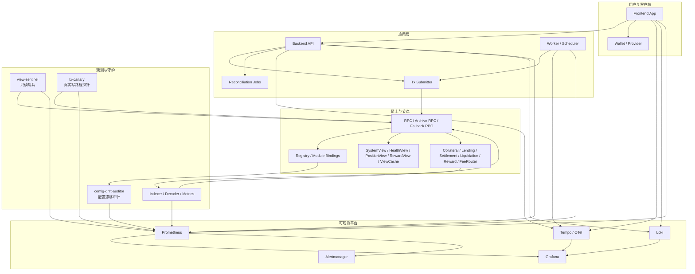

# 平台监控与可观测性实施指南（运维经理版）

> 目标：把“协议可观测”升级成“平台可运营”。
>
> 本文面向前端、后端、链上、Infra、值班与发布负责人。要求是：看到这份文件后，团队知道要监控什么、把代码改到哪里、谁值班、什么情况自动化处置、什么情况必须人工介入。

---

## 相关文档

- [scripts/e2e/README.md](../../scripts/e2e/README.md)
- [docs/Usage-Guide/Frontend-Modification-Guide.md](Frontend-Modification-Guide.md)
- [docs/Usage-Guide/SaaS-Backend-Implementation-Guide.md](SaaS-Backend-Implementation-Guide.md)
- [docs/Usage-Guide/Funds-Flow-Architecture-Guide.md](Funds-Flow-Architecture-Guide.md)
- [docs/Usage-Guide/Platform-Security-Architecture-Guide.md](Platform-Security-Architecture-Guide.md)
- [docs/Usage-Guide/Security-Guards-Registry-and-Entrypoints.md](Security-Guards-Registry-and-Entrypoints.md)
- [docs/Usage-Guide/WhitelistSystem.md](WhitelistSystem.md)
- [docs/Usage-Guide/Live-Observability-Gate-Checklist.md](Live-Observability-Gate-Checklist.md)
- [docs/Usage-Guide/runbook/README.md](runbook/README.md)

---

## 0. 这份文档解决什么问题

这不是一份“指标百科”，而是一份生产运维手册。它解决五个问题：

1. 平台什么叫“运行正常”，用什么 SLO 判断。
2. 哪些故障是 P0，谁在几分钟内响应，如何分流到前端、后端、Infra、链上团队。
3. 如何同时监控只读路径、真实写路径、链上事件、链下镜像、配置漂移与发布变更。
4. 如何把现有仓库里的前端配置、部署产物、live 测试脚本、indexer 与告警系统串成一套闭环。
5. 如何把工作拆成能直接进入代码仓库和任务系统的实施项。

---

## 1. 运营原则与权威边界

### 1.1 SSOT 原则

- 链上 SSOT：资金、仓位、奖励、清算、白名单、权限、关键配置，均以链上状态与链上事件为准。
- 链下镜像：indexer、缓存、前端展示、后端报表都属于派生层，只能暴露差异和延迟，不能覆盖链上真相。
- 发布真相：生产可用地址不只来自链上 Registry，还来自部署产物、前端配置、后端配置与 decoder 版本；它们必须保持一致。

### 1.2 生产可用的定义

平台“可用”必须同时满足：

1. 用户关键读路径可用。
2. 用户关键写路径可用。
3. 链上最终状态与链下镜像在目标时间内收敛。
4. 奖励、费用、AI Credits、清算与资金托管口径可对账。
5. 任何关键配置漂移都能在放量前或事故早期被发现。

### 1.3 事故分级

- P0：资金安全、清算、奖励消费、结算、白名单阻断、Registry 路由错位、RPC 大面积不可用、indexer 明显落后、配置漂移导致真实写路径不可用。
- P1：页面退化、轻度 lag、单模块镜像不一致、对账轻微偏差、非主路径失败率升高。
- P2：观测噪声、说明文案、非关键面板异常。

---

## 2. 目标操作图与责任面

### 2.1 黄金旅程

生产监控不按“模块”起盘，先按“用户旅程”起盘。至少维护以下六条黄金旅程：

1. 抵押存入与取回。
2. 撮合、放款与借款状态收敛。
3. 还款、结算、抵押释放。
4. 清算候选发现、执行与分配。
5. Reward/EasyToken 铸造、消费、拆分、回收。
6. 白名单、治理与配置变更后的真实可用性。

### 2.2 团队责任矩阵

| 责任域 | 主责团队 | 主要代码/配置入口 | 关键产出 |
| --- | --- | --- | --- |
| 前端读写埋点、RUM、错误聚合 | Frontend | `frontend-config/**`、前端页面与 wallet 交互层 | 前端指标、用户旅程事件、退化提示 |
| API、worker、tx submitter、对账 | Backend | 后端 API/作业/队列服务、对链服务层 | API/作业指标、提交链路指标、对账作业 |
| 链上 live 观测与 canary | Protocol/Ops | `scripts/tests/live-test/**`、`scripts/e2e/**` | 只读 canary、写 canary、live gate |
| RPC、Prometheus、Grafana、Loki、Tempo、Alertmanager | Infra/SRE | 集群、采集、告警路由、日志追踪 | 监控平台、通知链路、存储与保留策略 |
| 地址、部署产物、配置漂移 | Release/Ops | `deployments/**`、`scripts/deployments/**`、`frontend-config/**` | 部署真相、漂移审计、上线硬闸 |

---

## 3. 平台监控架构图



### 3.1 仓库映射

当前仓库里，最关键的实施入口已经存在，不需要从零设计：

- 前端配置真相：`frontend-config/contracts-*.ts`、`frontend-config/networks/*.ts`、`frontend-config/registry-service.ts`、`frontend-config/moduleKeys.ts`
- 部署真相：`deployments/*.json`、`scripts/deployments/*.json`
- live 验证与回归：`scripts/tests/live-test/**`、`scripts/e2e/**`
- 日志证据：`scripts/tests/logs/**`、`scripts/e2e/logs/**`
- 协议文档与 runbook：`docs/Usage-Guide/**`

运维体系应建立在这些入口之上，而不是另起一套孤立系统。

---

## 4. SLO、SLI 与错误预算

### 4.1 生产 SLO 总表

| 旅程 | SLI | SLO | 统计口径 | 失败判定 |
| --- | --- | --- | --- | --- |
| 前端关键读路径 | 成功读取关键 View 的比例 | 99.9%/30d | 页面级请求 | timeout、decode_error、invalid_meta、selector mismatch |
| 存入/取回 | 从提交到链上确认并页面收敛成功率 | 99.5%/30d | 交易级 | reverted、submitted 后超时、已上链但状态未收敛 |
| 撮合/放款 | `finalizeMatch` 成功并完成 View 收敛 | 99.5%/30d | 订单级 | 交易失败、写后读长时间不一致、indexer 未收敛 |
| 还款/结算 | `repay` 到 collateral release 完成率 | 99.5%/30d | 订单级 | repay 失败、总应还口径异常、释放状态不一致 |
| 清算 | 可清算仓位在目标时间内被处理比例 | 99.0%/30d | 仓位级 | backlog 增长、revert storm、估值不可用 |
| Reward 消费 | spend + split + mirror 对账成功率 | 99.9%/30d | 消费 tx 级 | split mismatch、回收资金滞留、push 缺失 |
| 配置一致性 | 链上/前端/后端/indexer 地址与模块键一致率 | 100%/发布窗口 | 发布批次级 | 任一关键地址、模块键、ABI 版本不一致 |

### 4.2 每条旅程必须有的四类时间

- `T_submit`：用户点击到交易提交广播成功。
- `T_mined`：广播到上链。
- `T_final`：上链到达到业务 finality。
- `T_converged`：达到 finality 到前端、后端、indexer、View 全部收敛。

所有看板与告警最终都要能回答：问题卡在这四段中的哪一段。

### 4.3 错误预算策略

- P0 旅程一旦连续消耗超过 20% 月度错误预算，立即冻结新发布。
- 若同一链路在 24 小时内重复触发两次 P0，必须进入变更冻结窗口，直到完成 RCA 与补充监控。
- 任何“用人工重跑解决”的问题，只能临时止血，不能算恢复完成，直到新增监控与自动处置落地。

---

## 5. Finality 与一致性策略

### 5.1 为什么必须单独定义

协议平台不能把“tx.wait() 成功”当成“业务完成”。在本仓库已有经验里，BNB testnet 存在写后立刻读取返回旧状态的情况；fork 与远端 RPC 还会产生 `missing trie node`、超时、读取分叉等现象。生产系统必须明确区分提交、打包、展示确认、账务确认、最终对账确认。

### 5.2 网络级 finality 建议

| 网络 | 展示确认 | 账务确认 | 对账确认 | reorg 回放窗口 | 备注 |
| --- | --- | --- | --- | --- | --- |
| arbitrum-sepolia | 1 block | 5 blocks | 20 blocks | 50 blocks | 测试网可较快展示，但账务和对账不能同口径 |
| bnb-testnet | 1 block | 8 blocks | 20 blocks | 60 blocks | 写后读可能短时间陈旧，必须做 convergence polling |
| localhost/fork | 1 block | 1 block | 1 block | 5 blocks | 用于验证逻辑，不代表真实网络 finality |

### 5.3 前后端统一口径

- 前端状态机必须区分：`prepared`、`signed`、`submitted`、`mined`、`display_confirmed`、`ledger_confirmed`、`failed`。
- 后端账务和对账只能以 `ledger_confirmed` 为准。
- indexer 需支持确认深度与回滚重放，不能把未 final 的事件永久落库成最终态。
- Grafana 面板必须同时展示：最新块、已索引块、业务确认块、最终对账块。

### 5.4 写后读收敛策略

- 对 BNB testnet 与高抖动 RPC，写后必须采用 polling convergence，而不是单次读取。
- `tx-canary` 和关键业务服务应统一实现：直到状态达到目标快照或超时，才标记成功。
- 对 View、Reward、FeeRouter、BlocksOnly 等 best-effort push 模块，收敛成功的依据必须是最终链上状态或权威 View，而不是单个 DataPushed 事件。

### 5.5 借贷主流程改成前端钱包直调后的监控变化

如果借贷主流程从“前端签名 + 后端命令执行”改成“前端钱包直接调用链上入口”，监控体系必须同时改口径。否则你会失去最关键的执行面可见性。

这次切换的本质变化是：

- 主流程交易提交、gas、nonce、replacement、用户取消签名、wallet provider 异常，都从后端 tx submitter 责任域转移到前端钱包责任域。
- 后端不再天然拥有每一笔主流程交易的提交证据，后端指标要从“执行成功率”转向“链上成功后的收敛成功率”。
- 前端必须从“签名页面”升级成“执行控制台”，负责 precheck、发送、确认、失败分类、收敛确认与证据上报。

因此必须新增四类监控：

1. 发送前 precheck：链、gas、allowance、whitelist、oracle、关键 View 是否可写前置通过。
2. 钱包执行链路：用户是否拒签、provider 是否报错、交易是否 submitted/mined/replaced。
3. 写后读收敛：交易 mined 后，View、indexer、后端读模型是否达到最终状态。
4. 双轨迁移对比：在灰度阶段，对比旧模式与钱包直调模式的成功率、耗时和失败归因。

建议新增指标：

- `frontend_direct_write_total{entrypoint,stage,outcome}`
- `frontend_direct_write_latency_seconds_bucket{entrypoint,stage}`
- `frontend_prewrite_check_total{entrypoint,check,outcome}`
- `frontend_wallet_user_reject_total{entrypoint,action}`
- `frontend_wallet_provider_error_total{entrypoint,reason}`
- `frontend_wallet_replacement_tx_total{entrypoint}`
- `frontend_tx_convergence_total{entrypoint,outcome}`
- `frontend_tx_convergence_latency_seconds_bucket{entrypoint}`
- `backend_postwrite_reconcile_total{entrypoint,outcome}`
- `backend_chain_success_but_model_stale_total{entrypoint}`
- `journey_execution_mode_total{entrypoint,mode,outcome}`
- `journey_execution_mode_latency_seconds_bucket{entrypoint,mode,stage}`

其中：

- `entrypoint` 建议统一为 `depositCollateral`、`reserveForLending`、`finalizeMatch`、`repay`、`withdrawCollateral`
- `stage` 建议统一为 `precheck`、`wallet_prompted`、`signed`、`submitted`、`mined`、`display_confirmed`、`ledger_confirmed`、`converged`
- `mode` 建议为 `backend_executor`、`wallet_direct`

切换期间的放量门槛：只有 `wallet_direct` 在目标 entrypoint 上达到或超过旧模式 SLO，才允许完全切流。

---

## 6. 配置漂移策略

### 6.1 为什么它是 P0

本仓库的生产真相分散在多处：

- 链上 Registry
- `deployments/*.json`
- `scripts/deployments/*.json`
- `frontend-config/contracts-*.ts`
- `frontend-config/moduleKeys.ts`
- 后端迁移或生成脚本读取的地址与模块键

如果这些来源不一致，结果通常不是“部分指标异常”，而是前端调用旧地址、后端读取旧模块、indexer 解码新事件失败、live 脚本跑的是另一套配置。这个问题必须在上线前和运行中同时监控。

### 6.2 必须做的漂移检查

每次发布前、每 10 分钟运行一次的 `config-drift-auditor` 需要做以下检查：

1. Registry 关键模块地址与部署产物是否一致。
2. 前端地址文件与部署产物是否一致。
3. 后端当前使用的地址与部署产物是否一致。
4. `moduleKeys.ts` 与链上/合约源码生成逻辑是否一致。
5. indexer decoder 版本与当前 ABI/事件 schema 是否一致。
6. 若网络是 mock-suite 或特定测试网，确认是否误用了另一套部署输出文件。

### 6.3 漂移告警

- `ConfigDriftRegistryMismatch`
- `ConfigDriftFrontendMismatch`
- `ConfigDriftBackendMismatch`
- `ConfigDriftIndexerAbiMismatch`
- `ConfigDriftModuleKeyMismatch`

### 6.4 漂移处置策略

- P0 配置漂移发生时，暂停前端新入口放量。
- 若漂移影响写路径，立即关闭对应旅程入口或切换为只读模式。
- 只有在链上、部署产物、前端、后端、indexer 五方重新一致后，才允许恢复流量。

---

## 7. 读 canary 与写 canary 策略

### 7.1 只读 canary：view-sentinel

`view-sentinel` 是第一层防线，频率建议 60 秒。

职责：

1. 读取 Registry 与关键 View。
2. 检查 `getVersionInfo`、`isValid`、`blockNumber`、selector 对齐。
3. 检查 Oracle `isPriceValid`、更新年龄、stale 比例。
4. 读取关键资金托管地址余额。
5. 输出 Prometheus 指标与结构化日志。

必须覆盖的模块：

- `SYSTEM_VIEW`
- `VIEW_CACHE`
- `HEALTH_VIEW`
- `POSITION_VIEW`
- `VAULT_STATISTICS`
- `LOAN_FLOW_VIEW`
- `LIQUIDATION_VIEW`
- `REWARD_VIEW`
- `FEE_ROUTER_VIEW`
- 白名单相关 Registry 绑定

### 7.2 真实写 canary：tx-canary

`tx-canary` 是第二层防线，频率建议 15 分钟到 1 小时，金额必须极小且可自动回收。

它必须覆盖：

1. 小额抵押存入与撤回。
2. reserve / cancel。
3. 最小借贷撮合与 repay。
4. Reward spend 一次。
5. allowlisted 资产成功路径与 non-allowlisted 资产失败路径。
6. 只在隔离环境或安全开关打开时运行清算写演练；生产默认做清算 preflight 与 backlog 检测。

### 7.3 canary 账户管理

- 专用地址池，严禁与真实业务钱包混用。
- 自动 gas 补给。
- 自动 sweep ERC20 与原生代币。
- 独立 nonce 管理。
- 按链独立状态文件，避免复用“看似 fresh，实际历史污染”的地址。

### 7.4 canary 成功口径

只有同时满足以下条件才算通过：

1. 交易达到 finality。
2. 关键链上状态达到目标值。
3. indexer 收敛。
4. 前端或模拟读路径能读取到最终状态。
5. 若涉及 Reward 或费用分配，对账指标无差异。

---

## 8. 值班、升级与事故处置

### 8.1 值班角色

| 角色 | 责任 | 触发条件 |
| --- | --- | --- |
| Platform On-call | 统一指挥、判级、切换只读/冻结发布 | 任一 P0 |
| Protocol On-call | 链上状态、Role、Registry、View、Reward、Liquidation | 清算、Reward、View、Registry、角色问题 |
| Backend On-call | API、worker、queue、tx submitter、对账 | 5xx、作业失败、提交链路阻塞 |
| Frontend On-call | 页面退化、钱包交互、错误边界、用户旅程埋点 | 主页面异常、用户大量失败 |
| Infra/SRE On-call | RPC、Prometheus、Grafana、日志、追踪、容器/主机 | RPC down、监控平台异常、采集失败 |

### 8.2 响应目标

- P0：5 分钟确认，15 分钟缓解，60 分钟给出临时 RCA。
- P1：30 分钟确认，4 小时内处理或加入当日变更计划。

### 8.3 升级路径

1. 值班系统先通知主责团队。
2. 10 分钟未确认，升级到 Platform On-call。
3. 15 分钟未缓解，升级到发布负责人和产品负责人。
4. 若涉及资金安全、清算或配置漂移，立即冻结发布并评估是否切只读模式。

### 8.4 自动化处置允许范围

可自动执行：

- 切换备用 RPC。
- 重启 sentinel、indexer、canary、worker。
- 暂停非关键后台批任务。
- 提高重试延迟与限流。
- 标记前端页面为 degraded/只读模式。

不得自动执行：

- 修改链上角色。
- 重绑 Registry。
- 升级合约。
- 自动回放可能产生资金影响的写交易。

---

## 9. 监控域设计

### 9.1 基础设施与 RPC

重点监控：

- RPC 可用性、method 级延迟、错误码、超时与 headers timeout。
- `missing trie node`、`ECONNREFUSED`、`UND_ERR_HEADERS_TIMEOUT` 等基础设施级故障。
- 备用 RPC 切换是否成功。

关键指标：

- `rpc_requests_total{rpc,method,outcome}`
- `rpc_errors_total{rpc,method,code}`
- `rpc_latency_ms_bucket{rpc,method}`
- `rpc_last_success_timestamp{rpc}`
- `rpc_active_provider{network,rpc}`

### 9.2 Oracle 与估值

重点监控：

- `isPriceValid`
- `age/maxAge`
- keeper 刷价成功率
- warming 与 persistent invalid 的区分
- 链下 publish 与链上 `PriceUpdated` 一致性

关键指标：

- `oracle_price_valid{asset}`
- `oracle_price_age_blocks{asset}`
- `oracle_max_price_age_blocks{asset}`
- `oracle_price_age_ratio{asset}`
- `oracle_is_warming{asset}`
- `keeper_price_refresh_attempts_total{asset,outcome,reason}`
- `keeper_last_success_timestamp{asset}`

### 9.3 View、缓存与读路径

重点监控：

- `isValid / blockNumber / version`
- selector mismatch
- cold cache warming
- read latency 与 revert 分类
- 前端是否把无效 View 正确展示为 degraded

关键指标：

- `view_is_valid{view}`
- `view_meta_block_number{view}`
- `view_block_lag{view}`
- `view_scan_fail_total{view,reason}`
- `view_selector_mismatch_total{view}`
- `view_is_warming{view}`
- `frontend_view_read_total{view,outcome}`
- `ui_degraded_total{reason,screen}`

### 9.4 清算链路

重点监控：

- backlog
- revert storm
- liquidation payout
- 估值/健康度读取依赖是否稳定

关键指标：

- `liquidations_executed_total{outcome}`
- `liquidation_tx_reverted_total{reason}`
- `liquidation_backlog_positions{asset}`
- `funds_flow_txs_total{flow="liquidation",op,outcome}`

### 9.5 Reward / EasyToken / DataPush

重点监控：

- mint
- spend
- recycle split 75/15/10
- `RewardViewPushFailed`
- recycle contract 余额滞留
- 镜像事件缺失与同 tx 多 push 取最后一条

关键指标：

- `easy_minted_events_total{to}`
- `easy_burned_events_total{from}`
- `easy_consume_tx_total{spend_type,outcome}`
- `easy_consume_split_mismatch_total{reason}`
- `easy_recycle_balance{}`
- `rewardview_push_failed_total{op}`
- `datapushed_events_total{emitter,data_type}`
- `datapushed_decode_error_total{data_type}`

### 9.6 前端与钱包

重点监控：

- 页面级读路径失败率
- Wallet connect/sign/send_tx
- 链错误
- 页面空白与错误边界
- 白名单失败是否被正确分类
- 直调链上写入口的 precheck、发送、确认与收敛

关键指标：

- `frontend_wallet_action_total{action,outcome,wallet}`
- `frontend_tx_lifecycle_total{entrypoint,stage,outcome}`
- `frontend_chain_mismatch_total{expected_chain,actual_chain}`
- `ui_error_boundary_total{screen,error_type}`
- `frontend_whitelist_gate_total{asset,outcome,screen}`
- `frontend_direct_write_total{entrypoint,stage,outcome}`
- `frontend_prewrite_check_total{entrypoint,check,outcome}`
- `frontend_tx_convergence_total{entrypoint,outcome}`

借贷主流程切到前端钱包直调后，新增告警建议：

- `FrontendDirectWriteFailureSpike`
- `FrontendPrewriteBlockedSpike`
- `FrontendUserRejectSpike`
- `FrontendConvergenceTimeout`
- `FrontendWalletProviderErrorSpike`

### 9.7 后端、队列与对账

重点监控：

- API 5xx
- worker backlog
- tx submitter 状态迁移
- idempotency 风暴
- ledger / reward / AI Credits 对账
- 链上成功后后端读模型与镜像是否按时收敛

关键指标：

- `api_requests_total{route,method,status_class,tenant}`
- `job_runs_total{job,outcome}`
- `job_backlog{job}`
- `tx_submit_total{entrypoint,outcome}`
- `tx_confirmation_latency_seconds_bucket{entrypoint}`
- `idempotency_conflicts_total{route}`
- `recon_diff_absolute{domain,dimension}`
- `reconciliation_issues_total{issue}`
- `backend_postwrite_reconcile_total{entrypoint,outcome}`
- `backend_chain_success_but_model_stale_total{entrypoint}`

借贷主流程切到前端钱包直调后，后端监控口径要调整：

- 保留 keeper、ops、repair、break-glass 任务的 `tx_submit_total`。
- 下调用户主路径上 `tx_submit_total` 的权重，因为它不再代表主流程执行成功率。
- 提高 `backend_postwrite_reconcile_total` 与 `backend_chain_success_but_model_stale_total` 的优先级，因为后端主责变成链上成功后的镜像和账务收敛。

### 9.8 配置与发布真相

重点监控：

- Registry 地址变化
- 前端地址文件与部署产物差异
- 后端地址文件与部署产物差异
- ABI/schema 版本与 decoder 差异

关键指标：

- `registry_module_address_info{key,address}`
- `registry_module_address_change_total{key}`
- `registry_key_missing_total{key}`
- `config_drift_total{source,target,key}`
- `config_last_verified_timestamp{domain}`

### 9.9 安全监控域

重点监控：

- pause / unpause / emergency action
- Registry 关键模块地址变化
- upgrade schedule / execute / implementation drift
- guardian / break-glass 使用
- 高权限角色授予与撤销
- 高风险资金托管余额异常变化
- reward mint / burn / recycle split 异常
- 前端钱包直调后用户主路径上的异常 provider 错误、拒签激增和收敛失败

关键指标：

- `security_pause_state{module}`
- `security_emergency_action_total{action,module,actor}`
- `security_upgrade_events_total{module,kind}`
- `security_registry_change_total{key}`
- `security_role_change_total{role,actor,target,action}`
- `security_guardian_action_total{action}`
- `security_break_glass_enabled{scope}`
- `security_custody_balance_anomaly_total{custodian,asset}`
- `security_reward_split_mismatch_total{reason}`
- `security_frontend_direct_write_anomaly_total{entrypoint,reason}`

安全告警建议：

- `SecurityUnexpectedPause`
- `SecurityUnexpectedUpgrade`
- `SecurityUnexpectedRegistryChange`
- `SecurityPrivilegedRoleChanged`
- `SecurityBreakGlassUsed`
- `SecurityCustodyBalanceAnomaly`
- `SecurityRewardSplitMismatch`
- `SecurityFrontendDirectWriteAnomaly`

---

## 10. 代码落地建议

### 10.1 前端团队

必须落地到代码的点：

1. 对关键 View 读取打埋点，并带 `traceId`、`chainId`、`screen`、`view`、`outcome`。
2. 钱包签名与发送链路实现统一状态机，不得把 `submitted` 当 `success`。
3. 对 `isValid=false`、oracle stale、selector mismatch、white list reject、后端 degraded 一律显式 UI 呈现，并同步埋点。
4. 启动时必须记录当前加载的是哪一套地址配置，并在 Registry 覆盖后再次记录最终地址真相。
5. 如果借贷主流程改成前端钱包直接发链上交易，发送前必须做 precheck，并把 precheck 与最终发送结果拆成两个埋点序列。
6. 每一笔直调链上交易都必须做写后读收敛确认，不能在 `tx.wait()` 成功后立即把 UI 标成成功。

建议关注代码入口：

- `frontend-config/contracts-*.ts`
- `frontend-config/networks/*.ts`
- `frontend-config/registry-service.ts`
- `frontend-config/moduleKeys.ts`

### 10.2 后端团队

必须落地到代码的点：

1. 所有请求与作业带 `traceId`、`requestId`、`idempotencyKey`、`tenant`、`chainId`。
2. 提交链上交易的服务必须输出状态迁移：`submitted`、`mined`、`ledger_confirmed`、`failed`。
3. 对账作业必须可重跑、可追溯、可输出差异与自动修复入口。
4. 对于 finality，不得在未达到账务确认深度时更新主账。
5. 如果借贷主流程改成前端钱包直调，后端要把主指标从“我是否发出交易”调整为“链上成功后我是否完成收敛与对账”。
6. 用户主路径与 keeper/ops/replay 任务不得继续共用同一套 tx submitter 成功率口径。

### 10.3 协议与 live 测试团队

必须落地到代码的点：

1. 将现有 `scripts/tests/live-test/**` 中最稳定、最小副作用的路径抽成 canary 任务。
2. 保留大的 release gate 作为发布前硬闸，不要把它直接当分钟级健康检查。
3. 任何发现的“写后读不一致”都要转成 polling convergence 工具，而不是在脚本里临时 sleep。
4. 对 Reward、FeeRouter、Liquidation、ViewCache 等 best-effort 路径，始终以最终链上状态或权威 View 断言，而不是只断言 DataPushed。

建议复用入口：

- `scripts/tests/live-test/**`
- `scripts/tests/live-test/networks/bnb-testnet/**`
- `scripts/e2e/**`

### 10.4 Infra/SRE 团队

必须落地到代码和平台的点：

1. 建 Prometheus、Grafana、Loki、Tempo、Alertmanager 基础栈。
2. 对每个服务统一 labels：`environment`、`service`、`component`、`chain_id`、`network`、`tenant`。
3. 为日志与 trace 建 retention 与采样策略，P0 事故必须保留完整证据。
4. 配置 Alertmanager 路由、升级链和维护窗口静默规则。

### 10.5 建议新增的仓库落点

为了让前后端和运维能直接开始落代码，建议在当前仓库按下面方式组织：

| 建议文件/目录 | 作用 | 主责团队 |
| --- | --- | --- |
| `scripts/observability/view-sentinel.ts` | 只读 canary，读 Registry/View/Oracle/custody balance | Protocol/Ops |
| `scripts/observability/tx-canary.ts` | 真实写路径 canary，总入口 | Protocol/Ops |
| `scripts/observability/canary-cases/*.ts` | 分旅程 canary case，例如 deposit、repay、reward spend | Protocol/Ops |
| `scripts/observability/config-drift-auditor.ts` | 校验 Registry、deployments、frontend-config、backend config 一致性 | Release/Ops |
| `scripts/observability/recon-runner.ts` | Reward、AI Credits、ledger、事件完整性对账 | Backend/Protocol |
| `scripts/observability/lib/finality.ts` | 展示确认、账务确认、polling convergence、reorg 窗口统一逻辑 | Backend/Protocol |
| `scripts/observability/lib/metrics.ts` | Prometheus registry、label 规范、公共指标初始化 | Infra/SRE |
| `scripts/observability/lib/evidence.ts` | 事故证据输出，写入 manifest、txHash、日志摘要 | Infra/SRE |
| `ops/monitoring/prometheus/*.yml` | scrape config、recording rules、alerts | Infra/SRE |
| `ops/monitoring/alertmanager/*.yml` | Alertmanager 路由、抑制、升级链 | Infra/SRE |
| `ops/monitoring/grafana/*.json` | dashboard 定义 | Infra/SRE |
| `ops/runbooks/*.md` | 分告警类别 runbook | Platform/Protocol/Infra |

如果暂时不想新增 `ops/` 目录，也至少要保证 Prometheus、Alertmanager、Grafana 配置在当前仓库有版本控制，不要只放在外部平台里手工维护。

---

## 11. Prometheus 指标拆解

### 11.1 服务级最小指标清单

| 服务 | 最小指标 |
| --- | --- |
| frontend | `frontend_view_read_total`、`frontend_tx_lifecycle_total`、`frontend_wallet_action_total`、`ui_degraded_total` |
| backend-api | `api_requests_total`、`api_latency_ms_bucket`、`idempotency_conflicts_total` |
| backend-worker | `job_runs_total`、`job_backlog`、`queue_dead_letter_total` |
| tx-submitter | `tx_submit_total`、`tx_confirmation_latency_seconds_bucket`、`tx_pending_total` |
| view-sentinel | `view_is_valid`、`view_block_lag`、`oracle_price_valid`、`registry_module_address_info` |
| tx-canary | `canary_runs_total`、`canary_duration_seconds_bucket`、`canary_step_fail_total` |
| indexer | `datapushed_events_total`、`datapushed_decode_error_total`、`chain_indexer_lag_blocks` |
| recon-jobs | `recon_diff_absolute`、`reconciliation_issues_total` |
| config-drift-auditor | `config_drift_total`、`config_last_verified_timestamp` |

### 11.2 建议新增的 canary 指标

- `canary_runs_total{journey,outcome,network}`
- `canary_duration_seconds_bucket{journey,network}`
- `canary_step_fail_total{journey,step,reason,network}`
- `canary_state_converged_total{journey,outcome,network}`
- `canary_last_success_timestamp{journey,network}`

`journey` 建议值：

- `deposit_withdraw`
- `reserve_cancel`
- `finalize_repay`
- `reward_spend`
- `whitelist_allow`
- `whitelist_reject`

---

## 12. Grafana 面板清单

### 12.1 Dashboard A：Executive Summary

给运维经理与发布负责人，单屏看健康度：

1. 黄金旅程 SLO 当前值。
2. P0 告警数。
3. 当前配置漂移状态。
4. 当前 active RPC 与失败率。
5. 最新 canary 成功时间。
6. 当前发布窗口状态。

### 12.2 Dashboard B：Views & Cache

1. `view_is_valid`
2. `view_meta_block_number`
3. `view_block_lag`
4. `view_is_warming`
5. `view_selector_mismatch_total`
6. `frontend_view_read_total` 与 `ui_degraded_total`

### 12.3 Dashboard C：Protocol Safety

1. `oracle_price_valid`
2. `oracle_price_age_ratio`
3. `liquidation_backlog_positions`
4. `liquidation_tx_reverted_total`
5. `funds_custody_balance`
6. `funds_flow_txs_total`

### 12.4 Dashboard D：Reward & DataPush

1. `easy_minted_events_total`
2. `easy_consume_tx_total`
3. `easy_consume_split_mismatch_total`
4. `easy_recycle_balance`
5. `rewardview_push_failed_total`
6. `datapushed_decode_error_total`

### 12.5 Dashboard E：Frontend Journey

1. 页面级成功率。
2. wallet connect/sign/send_tx 成功率。
3. `frontend_tx_lifecycle_total` 分阶段耗时。
4. `frontend_chain_mismatch_total`。
5. `frontend_whitelist_gate_total`。

### 12.6 Dashboard F：Backend / Jobs / Reconciliation

1. `api_requests_total` 与 5xx 比例。
2. `job_backlog`。
3. `tx_submit_total`。
4. `tx_confirmation_latency_seconds_bucket`。
5. `recon_diff_absolute`。
6. `queue_dead_letter_total`。

### 12.7 Dashboard G：Release Truth & Drift

1. `registry_module_address_info`。
2. `config_drift_total`。
3. `config_last_verified_timestamp`。
4. 当前部署版本、ABI schema、decoder 版本。
5. 前端地址文件与部署产物摘要。

### 12.8 Dashboard H：Security Operations

1. 当前 pause / break-glass 状态。
2. 最近 24 小时 upgrade、Registry change、role change。
3. 高权限地址清单与最近变更。
4. 关键 custody balance 异常。
5. reward split mismatch 与 recycle balance。
6. 前端钱包直调异常率与 provider 错误。

---

## 13. Alertmanager 路由策略

### 13.1 路由原则

- 告警要按旅程与责任团队路由，不按“技术栈名词”路由。
- 每条 P0 告警必须有主路由、备份路由、升级路由。
- 告警描述必须带：network、chain_id、journey、service、owner、runbook。

### 13.2 建议路由

| 告警类别 | 主路由 | 升级路由 | 静默条件 |
| --- | --- | --- | --- |
| RPC / Infra | Infra/SRE | Platform On-call | 已知维护窗口 |
| View / Registry / Oracle | Protocol On-call | Platform On-call | 已批准的升级窗口 |
| Frontend Journey | Frontend On-call | Platform On-call | 仅非生产环境 |
| Backend API / Worker | Backend On-call | Platform On-call | 批处理维护窗口 |
| Reward / Liquidation / Funds Safety | Protocol On-call | Platform On-call + Release Owner | 不允许静默，最多降噪 |
| Config Drift | Release/Ops | Platform On-call | 发布中仅允许抑制重复告警，不允许静默首告警 |
| Security / Upgrade / Privileged Actions | Security / Protocol On-call | Platform On-call + Release Owner | 默认不静默，只允许重复抑制 |

### 13.3 P0 告警模板

P0 告警建议至少包含：

- Summary：哪条旅程失败。
- Impact：影响范围与是否影响真实用户资金或结算。
- Evidence：关键指标、最后成功时间、相关 txHash 或模块地址。
- First Action：第一响应动作。
- Runbook：链接。

对于安全类 P0，必须额外包含：

- `actor`：触发动作的地址或服务主体
- `control_plane`：例如 `upgrade`、`registry`、`pause`、`guardian`、`custody`
- `approved_change_window`：是否处于批准变更窗口

---

## 14. canary 服务任务列表

### 14.1 建议新增服务

| 服务名 | 类型 | 频率 | 作用 |
| --- | --- | --- | --- |
| `view-sentinel` | 只读服务 | 60s | 读 Registry、View、Oracle、custody balance |
| `tx-canary` | 定时写探针 | 15m-1h | 执行小额真实写路径并验证收敛 |
| `config-drift-auditor` | 定时审计 | 10m | 比较链上、部署产物、前端、后端、indexer 真相 |
| `recon-runner` | 定时对账 | 1h / 1d | Reward、AI Credits、ledger、事件完整性 |
| `release-gate-runner` | 发布前硬闸 | 按发布 | 运行严格 live gate 与证据收集 |

### 14.2 tx-canary 拆分任务

1. `deposit_withdraw`：小额存入并撤回，验证余额、事件、View 收敛。
2. `reserve_cancel`：预留与取消，验证状态回滚和 event mirror。
3. `finalize_repay`：极小订单撮合与还款，验证账务、View、Reward 链路。
4. `reward_spend`：触发一次 spend，验证 split 与 recycle balance。
5. `whitelist_allow`：allowlisted 资产走通成功路径。
6. `whitelist_reject`：non-allowlisted 资产确认被拒绝，并验证前端/后端分类正确。

### 14.3 失败后的自动动作

- 单次失败：记录 evidence，不立即判 P0，等待重试与同类信号交叉验证。
- 连续两次失败：升级为 P1，并检查 finality、RPC 与配置漂移。
- 连续三次失败或影响真实用户指标：升级为 P0。

### 14.4 现有 live 脚本候选（供另一仓直接复用）

当前仓库已经有一批可复用的 live 脚本。第一版生产 canary 不建议直接接入体量过大的 release gate，也不建议从 liquidation、governance 这种高副作用路径起步。优先复用下面这些 case。

| Canary 目标 | 推荐入口 | 实际逻辑位置 | 适合原因 | 第一版建议 |
| --- | --- | --- | --- | --- |
| 只读健康检查 | [scripts/tests/live-test/networks/bnb-testnet/live-preflight.ts](../../scripts/tests/live-test/networks/bnb-testnet/live-preflight.ts) | [scripts/tests/live-test/networks/bnb-testnet/cases/live-preflight.ts](../../scripts/tests/live-test/networks/bnb-testnet/cases/live-preflight.ts) | 只读、覆盖 Registry / Oracle / RewardView / ViewCache / 白名单 / FeeRouter 基础健康度 | 必做，分钟级 |
| 平台主路径 runtime 基线 | [scripts/tests/live-test/networks/bnb-testnet/live-platform-runtime-baseline.ts](../../scripts/tests/live-test/networks/bnb-testnet/live-platform-runtime-baseline.ts) | [scripts/tests/live-test/networks/bnb-testnet/cases/live-platform-runtime-baseline.ts](../../scripts/tests/live-test/networks/bnb-testnet/cases/live-platform-runtime-baseline.ts) 和 [scripts/tests/live-test/networks/bnb-testnet/cases/live-platform-baseline.ts](../../scripts/tests/live-test/networks/bnb-testnet/cases/live-platform-baseline.ts) | 已明确支持 runtime 层，适合做小额存入、撮合、还款、收敛验证 | 必做，15 分钟到 1 小时 |
| Reward runtime 基线 | [scripts/tests/live-test/networks/bnb-testnet/live-reward-baseline.ts](../../scripts/tests/live-test/networks/bnb-testnet/live-reward-baseline.ts) | [scripts/tests/live-test/networks/bnb-testnet/cases/live-reward-baseline.ts](../../scripts/tests/live-test/networks/bnb-testnet/cases/live-reward-baseline.ts) | 自带 runtime / observability 分层，第一版只跑 runtime 即可，避免直接上 stress / penalty recovery | 必做，先只跑 runtime |
| withdraw 低副作用写路径 | [scripts/tests/live-test/networks/bnb-testnet/live-withdraw-collateral.ts](../../scripts/tests/live-test/networks/bnb-testnet/live-withdraw-collateral.ts) | [scripts/tests/live-test/networks/bnb-testnet/cases/live-withdraw-collateral.ts](../../scripts/tests/live-test/networks/bnb-testnet/cases/live-withdraw-collateral.ts) | 单一旅程、验证 deposit -> withdraw 与仓位收敛，副作用可控 | 推荐，第二优先级 |
| reserve / cancel 低副作用写路径 | [scripts/tests/live-test/networks/bnb-testnet/live-cancel-reserve.ts](../../scripts/tests/live-test/networks/bnb-testnet/live-cancel-reserve.ts) | [scripts/tests/live-test/networks/bnb-testnet/cases/live-cancel-reserve.ts](../../scripts/tests/live-test/networks/bnb-testnet/cases/live-cancel-reserve.ts) | 不进入完整借贷闭环，适合做 lender 侧资金托管和回滚验证 | 推荐，第二优先级 |
| Guarantee runtime 基线 | [scripts/tests/live-test/networks/bnb-testnet/live-guarantee-baseline.ts](../../scripts/tests/live-test/networks/bnb-testnet/live-guarantee-baseline.ts) | [scripts/tests/live-test/networks/bnb-testnet/cases/live-guarantee-baseline.ts](../../scripts/tests/live-test/networks/bnb-testnet/cases/live-guarantee-baseline.ts) 和 [scripts/tests/live-test/networks/bnb-testnet/cases/live-guarantee-flow.ts](../../scripts/tests/live-test/networks/bnb-testnet/cases/live-guarantee-flow.ts) | 覆盖 guarantee 锁定、提前还款、事件与视图，但副作用与资金动作比前几项更重 | 第二阶段再接 |

不建议第一版直接复用这些脚本做生产 canary：

- [scripts/tests/live-test/networks/bnb-testnet/live-release-gates.ts](../../scripts/tests/live-test/networks/bnb-testnet/live-release-gates.ts)：范围过大，适合发布前硬闸，不适合高频 canary。
- [scripts/tests/live-test/networks/bnb-testnet/live-liquidation.ts](../../scripts/tests/live-test/networks/bnb-testnet/live-liquidation.ts) 和 [scripts/tests/live-test/networks/bnb-testnet/live-blocks-only-liquidation.ts](../../scripts/tests/live-test/networks/bnb-testnet/live-blocks-only-liquidation.ts)：副作用高，且对角色、成熟区块、借款人状态要求高。
- [scripts/tests/live-test/networks/bnb-testnet/cases/live-reward-config-governance.ts](../../scripts/tests/live-test/networks/bnb-testnet/cases/live-reward-config-governance.ts)：虽然已有 idempotent write 保护，但属于治理写路径，不应做高频生产 canary。

说明：BNB wrapper 的共享入口会把 `../../foo` 重写到 `./cases/foo`。另一仓如果要直接引用，优先看 network wrapper，再顺着 wrapper 跳到对应 `cases/` 文件，不要只改顶层共享入口后误以为 BNB 路径会自动同步。

### 14.5 给另一仓的第一版任务

另一仓第一版只需要做三件事，不要一开始把所有 live case 都接进去。

1. 建一个 read-canary job。
内容：直接调用 [scripts/tests/live-test/networks/bnb-testnet/live-preflight.ts](../../scripts/tests/live-test/networks/bnb-testnet/live-preflight.ts) 对应的命令入口。
目标：把 Registry、Oracle、RewardView、ViewCache、白名单、FeeRouter 的最低健康度先纳入监控。

2. 建一个 runtime-canary job。
内容：先接 [scripts/tests/live-test/networks/bnb-testnet/live-platform-runtime-baseline.ts](../../scripts/tests/live-test/networks/bnb-testnet/live-platform-runtime-baseline.ts)，再接 [scripts/tests/live-test/networks/bnb-testnet/live-withdraw-collateral.ts](../../scripts/tests/live-test/networks/bnb-testnet/live-withdraw-collateral.ts) 或 [scripts/tests/live-test/networks/bnb-testnet/live-cancel-reserve.ts](../../scripts/tests/live-test/networks/bnb-testnet/live-cancel-reserve.ts) 之一。
目标：覆盖至少一条完整借贷主路径，再覆盖一条低副作用回滚路径。

3. 建一个 reward-canary job。
内容：调用 [scripts/tests/live-test/networks/bnb-testnet/live-reward-baseline.ts](../../scripts/tests/live-test/networks/bnb-testnet/live-reward-baseline.ts)，但只启用 runtime 层，不跑 observability 层的 stress 与 penalty recycle recovery。
目标：先验证 Reward 基础读写链路和 View 收敛，不把高波动 case 带进高频任务。

推荐给另一仓的执行入口优先级如下：

1. 已有 package.json 命令，优先直接复用：
    - `pnpm -s run test:live:preflight:bnb-testnet`
    - `pnpm -s run test:live:platform-runtime-baseline:bnb-testnet`
    - `pnpm -s run test:live:reward-baseline:bnb-testnet`

2. 若另一仓只想按文件直接调用，可使用 network wrapper：
    - `hardhat run scripts/tests/live-test/networks/bnb-testnet/live-preflight.ts --network bnbTestnet`
    - `hardhat run scripts/tests/live-test/networks/bnb-testnet/live-platform-runtime-baseline.ts --network bnbTestnet`
    - `hardhat run scripts/tests/live-test/networks/bnb-testnet/live-withdraw-collateral.ts --network bnbTestnet`
    - `hardhat run scripts/tests/live-test/networks/bnb-testnet/live-cancel-reserve.ts --network bnbTestnet`

3. 对 reward 与 guarantee baseline，第一版建议显式限制 layer：
    - `LIVE_REWARD_BASELINE_LAYER=runtime`
    - `LIVE_GUARANTEE_BASELINE_LAYER=runtime`

### 14.6 另一仓最小接入 contract

为了避免另一仓接入过重，建议只约定下面这个最小 contract：

| 字段 | 含义 |
| --- | --- |
| `canary_id` | 例如 `bnb-preflight`、`bnb-platform-runtime`、`bnb-reward-runtime` |
| `network` | 例如 `bnbTestnet` |
| `entrypoint` | package script 或 hardhat file path |
| `expected_duration_seconds` | 预期时长 |
| `finality_policy` | `display_confirmed` / `ledger_confirmed` |
| `success_condition` | 哪些链上状态或 View 收敛算成功 |
| `severity_on_fail` | 单次失败、连续失败的升级规则 |
| `evidence_paths` | 日志目录、manifest、关键 txHash 输出位置 |

另一仓不需要先理解全部协议细节，只要围绕上面 3 个 job 把调度、重试、指标、告警打通，就已经完成第一版 canary 接入。

---

## 15. 实施计划与落地清单

### 15.1 第一阶段：3 天内可落地的 MVP

1. 建立 `view-sentinel`。
2. 建立基础 Prometheus scrape。
3. 打通前端关键读路径与 wallet 埋点。
4. 打通后端 API、worker、tx submitter 指标。
5. 上线 Reward/AI Credits 最小对账。
6. 搭好 Executive Summary 与 Protocol Safety 两张 dashboard。
7. 如果开始灰度“前端钱包直接调链上”，必须同步上线 `frontend_direct_write_total`、`frontend_prewrite_check_total`、`frontend_tx_convergence_total`。

### 15.2 第二阶段：1 周内完成的生产闭环

1. 建立 `tx-canary`。
2. 建立 `config-drift-auditor`。
3. 补齐 Alertmanager 路由与值班升级链。
4. 建立 Release Gate 证据归档。
5. 将 finality、写后读收敛、reorg 回放落实到前端、后端、indexer。
6. 在完全切流前，为 `backend_executor` 与 `wallet_direct` 建双轨对比面板。

### 15.3 第三阶段：2 周内完成的成熟化

1. 用户旅程 SLO 进 dashboard 与发布门禁。
2. Canary 结果自动写入发布质量报告。
3. 配置漂移进入 CI 与发布流程。
4. 所有 P0 事故具备标准化 evidence 包与 RCA 模板。

---

## 16. 发布硬闸

上线前必须全部满足：

1. P0 告警规则已启用，通知链路已验证。
2. `view-sentinel` 连续运行 24 小时无 P0。
3. `tx-canary` 连续通过至少 3 轮。
4. `config-drift-auditor` 无关键差异。
5. indexer lag 在阈值内。
6. Reward/AI Credits/ledger 对账通过。
7. 本次部署对应的前端地址、后端地址、module keys、ABI schema 已归档。
7. 安全告警链路已验证：pause、upgrade、Registry change、role change 至少完成一次演练或 dry-run 验证。
8. 当前高权限地址、guardian、break-glass 主体与发布清单一致。

---

## 17. 附录 A：推荐 PromQL 与告警模板

### 17.1 RPC 不可用

```promql
(time() - max(rpc_last_success_timestamp)) > 300
```

### 17.2 Oracle 非 warming 无效

```promql
min_over_time(oracle_price_valid[2m]) == 0 and max_over_time(oracle_is_warming[2m]) == 0
```

### 17.3 View 非 warming 无效

```promql
min_over_time(view_is_valid[2m]) == 0 and max_over_time(view_is_warming[2m]) == 0
```

### 17.4 Config Drift

```promql
increase(config_drift_total[10m]) > 0
```

### 17.5 Canary 连续失败

```promql
increase(canary_runs_total{outcome="failed"}[1h]) >= 3
```

### 17.6 Reward split mismatch

```promql
increase(easy_consume_split_mismatch_total[10m]) > 0
```

---

## 18. 附录 B：建议归档的证据

- `scripts/e2e/logs/**`
- `scripts/tests/logs/**`
- canary 执行 manifest
- config drift 审计结果
- Grafana 事故快照
- 关键 txHash 与 log dump
- 对账报告与修复记录

---

## 19. 最后结论

平台监控的目标不是“面板很多”，而是让四类人都能行动：

- 前端知道何时展示 degraded、何时记录 journey failure。
- 后端知道何时停止把链上未 final 的结果写入主账。
- 协议团队知道何时用 live script 升级为 canary，而不是只靠大批量 gate。
- 运维和值班知道何时切只读、何时切 RPC、何时冻结发布、何时必须人工介入。

只有把读探针、写探针、对账、漂移、finality、值班和发布门禁做成一套系统，这个平台才算真正进入可运营状态。
