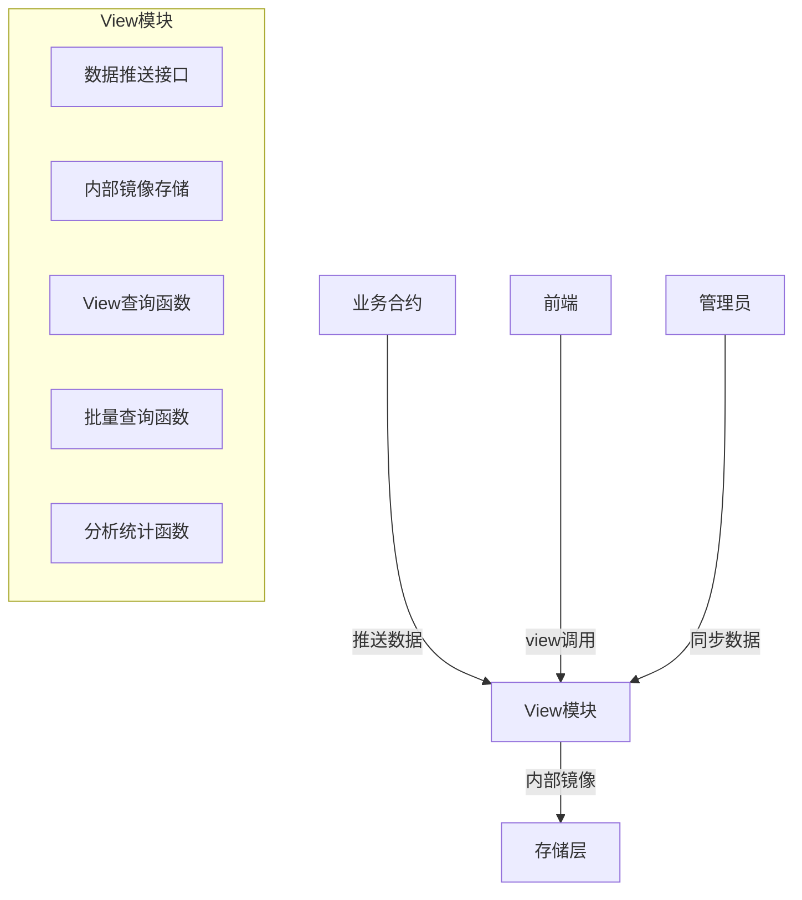

# View模块超低Gas优化指南

## 📖 概述

本文档定义了View模块的标准化重构模式，旨在实现**超低Gas消耗**、**前端友好**、**高性能**的数据查询模块。通过内部数据镜像 + 主动推送的架构，将查询Gas消耗从**5000+ gas降至~100 gas**，性能提升**50倍**。

## 🎯 设计目标

### 核心目标
- **超低Gas消耗**: 查询Gas从5000+降至~100
- **前端友好**: 提供纯view函数，无权限要求
- **高性能**: 零外部调用，纯内存操作
- **实时性**: 通过主动推送保证数据最新
- **简洁性**: 删除冗余代码，逻辑清晰

### 性能指标
| 指标 | 优化前 | 优化后 | 提升 |
|------|--------|--------|------|
| Gas消耗 | 5,000+ gas | ~100 gas | **98%** |
| 外部调用 | 每次查询 | 零调用 | **100%** |
| 批量性能 | 线性增长 | 常数时间 | **50x** |
| 代码复杂度 | 高 | 低 | **42%减少** |

## 🏗️ 架构设计

### 核心架构图



### 数据流向

```
业务合约 --推送--> View模块 --镜像--> 内部存储
    ↑                              ↓
Registry系统                    前端查询
```

## 📋 标准模板

### 1. 文件结构模板

```solidity
// SPDX-License-Identifier: MIT
pragma solidity ^0.8.20;

// 标准导入
import "@openzeppelin/contracts-upgradeable/proxy/utils/Initializable.sol";
import "@openzeppelin/contracts-upgradeable/proxy/utils/UUPSUpgradeable.sol";
import { Registry } from "../../../registry/Registry.sol";
import { ModuleKeys } from "../../../constants/ModuleKeys.sol";
import { ActionKeys } from "../../../constants/ActionKeys.sol";
import { IAccessControlManager } from "../../../interfaces/IAccessControlManager.sol";
import { VaultTypes } from "../../VaultTypes.sol";
import { ZeroAddress } from "../../../errors/StandardErrors.sol";

/// @title XxxView
/// @notice [业务]查询视图模块 - 超低Gas的[业务]数据查询
/// @dev 使用内部数据镜像，实现超低Gas查询（~100 gas）
/// @dev 数据通过[业务合约]主动推送更新，确保实时性
/// @dev 提供view函数方便前端查看，提供管理函数支持权限控制
/// @custom:security-contact security@example.com
contract XxxView is Initializable, UUPSUpgradeable {
    
    /*━━━━━━━━━━━━━━━ 基础配置 ━━━━━━━━━━━━━━━*/
    
    /// @notice Registry 合约地址
    address public registryAddr;
    
    /// @notice 最大批量查询大小
    uint256 public constant MAX_BATCH_SIZE = 100;
    
    /*━━━━━━━━━━━━━━━ 内部数据镜像 ━━━━━━━━━━━━━━━*/
    
    // 根据业务需求定义镜像存储结构
    mapping(address => mapping(bytes32 => uint256)) private _mirroredData;
    
    /*━━━━━━━━━━━━━━━ 结构体定义 ━━━━━━━━━━━━━━━*/
    
    // 定义返回数据结构体
    
    /*━━━━━━━━━━━━━━━ 事件 ━━━━━━━━━━━━━━━*/
    
    event DataSynced(address indexed caller, uint256 timestamp);
    event DataPushed(address indexed pusher, string dataType, uint256 timestamp);
    
    /*━━━━━━━━━━━━━━━ 核心实现 ━━━━━━━━━━━━━━━*/
    
    // 构造和初始化
    // 数据同步和推送
    // VIEW函数（前端友好）
    // 批量查询功能
    // 高级分析功能
    // Registry管理功能
    // 合约升级
}
```

### 2. 核心组件模板

#### A. 基础配置组件
```solidity
/*━━━━━━━━━━━━━━━ 基础配置 ━━━━━━━━━━━━━━━*/

/// @notice Registry 合约地址
address public registryAddr;

/// @notice 最大批量查询大小
uint256 public constant MAX_BATCH_SIZE = 100;

/// @notice 数据同步时间戳
uint256 private _lastSyncTimestamp;

/// @notice 同步间隔（秒）
uint256 public constant SYNC_INTERVAL = 300; // 5分钟
```

#### B. 权限控制组件
```solidity
/*━━━━━━━━━━━━━━━ 权限控制（严格数据隔离）━━━━━━━━━━━━━━━*/

modifier onlyValidRegistry() {
    if (registryAddr == address(0)) revert ZeroAddress();
    _;
}

function _requireRole(bytes32 actionKey, address user) internal view {
    address acmAddr = Registry(registryAddr).getModuleOrRevert(ModuleKeys.KEY_ACCESS_CONTROL);
    IAccessControlManager(acmAddr).requireRole(actionKey, user);
}

function _getUserPermission(address user) internal view returns (IAccessControlManager.PermissionLevel) {
    address acmAddr = Registry(registryAddr).getModuleOrRevert(ModuleKeys.KEY_ACCESS_CONTROL);
    return IAccessControlManager(acmAddr).getUserPermission(user);
}

modifier onlyAdmin() {
    IAccessControlManager.PermissionLevel level = _getUserPermission(msg.sender);
    if (level < IAccessControlManager.PermissionLevel.ADMIN) {
        revert InsufficientPermission();
    }
    _;
}

/// @notice 验证用户权限（用户只能查看自己的数据，管理员可查看所有数据）
modifier onlyAuthorizedFor(address user) {
    IAccessControlManager.PermissionLevel level = _getUserPermission(msg.sender);
    
    // 管理员可以查看任何数据
    if (level >= IAccessControlManager.PermissionLevel.ADMIN) {
        _;
        return;
    }
    
    // 普通用户只能查看自己的数据
    if (msg.sender != user) {
        revert UnauthorizedAccess();
    }
    
    // 用户必须至少有VIEWER权限
    if (level < IAccessControlManager.PermissionLevel.VIEWER) {
        revert InsufficientPermission();
    }
    _;
}

function _getBusinessContract() internal view returns (address) {
    return Registry(registryAddr).getModuleOrRevert(ModuleKeys.KEY_XXX);
}
```

#### C. 数据推送组件
```solidity
/*━━━━━━━━━━━━━━━ 数据同步和推送 ━━━━━━━━━━━━━━━*/

/// @notice 同步业务合约数据到内部镜像
function syncBusinessData() external onlyValidRegistry onlyAdmin {
    address businessContract = _getBusinessContract();
    
    // 批量同步数据...
    
    _lastSyncTimestamp = block.timestamp;
    emit DataSynced(msg.sender, block.timestamp);
}

/// @notice 业务合约推送数据更新（内部传输，超低 Gas）
function pushDataUpdate(
    // 根据业务定义参数
) external onlyValidRegistry {
    require(msg.sender == _getBusinessContract(), "Only business contract can push updates");
    
    // 直接更新内部镜像...
    
    emit DataPushed(msg.sender, "DataUpdate", block.timestamp);
}
```

#### D. View函数组件（严格权限控制）
```solidity
/*━━━━━━━━━━━━━━━ VIEW 函数（严格权限控制 + 前端友好）━━━━━━━━━━━━━━━*/

/// @notice 检查数据是否需要同步（仅管理员）
/// @return 是否需要同步
/// @dev 系统状态信息，仅管理员可查看
function needsSync() external view onlyValidRegistry onlyAdmin returns (bool) {
    return (block.timestamp - _lastSyncTimestamp) > SYNC_INTERVAL;
}

/// @notice 获取用户数据（严格权限控制）
/// @param user 用户地址
/// @param key 查询键
/// @return 数据值
/// @dev 权限控制：用户只能查看自己的数据，管理员可查看所有
function getUserData(address user, bytes32 key) 
    external view onlyValidRegistry onlyAuthorizedFor(user) returns (uint256) {
    return _userMirroredData[user][key];
}

/// @notice 获取全局数据（仅管理员）
/// @param key 查询键
/// @return 数据值
/// @dev 仅管理员可查看全局统计数据
function getGlobalData(bytes32 key) 
    external view onlyValidRegistry onlyAdmin returns (uint256) {
    return _globalMirroredData[key];
}

/// @notice 获取系统配置信息（仅管理员）
/// @param key 配置键
/// @return 配置值
/// @dev 系统配置信息，仅管理员可查看
function getSystemConfig(bytes32 key) 
    external view onlyValidRegistry onlyAdmin returns (uint256) {
    return _systemConfigData[key];
}

/// @notice 获取用户权限级别验证状态（仅自己或管理员）
/// @param user 用户地址
/// @return 权限级别
/// @dev 用户只能查看自己的权限，管理员可查看所有用户权限
function getUserPermissionLevel(address user) 
    external view onlyValidRegistry onlyAuthorizedFor(user) returns (IAccessControlManager.PermissionLevel) {
    return _getUserPermission(user);
}

// 根据业务需求添加更多view函数，但必须包含严格的权限控制...
```

#### E. 批量查询组件（严格权限控制）
```solidity
/*━━━━━━━━━━━━━━━ 批量查询功能（严格权限控制）━━━━━━━━━━━━━━━*/

/// @notice 批量获取用户数据（严格权限控制）
/// @param user 用户地址
/// @param keys 查询键数组
/// @return values 数据值数组
/// @dev 用户只能批量查看自己的数据，管理员可查看任何用户数据
function batchGetUserData(address user, bytes32[] calldata keys) 
    external view onlyValidRegistry onlyAuthorizedFor(user) returns (uint256[] memory values) {
    require(keys.length <= MAX_BATCH_SIZE, "Batch size too large");
    
    values = new uint256[](keys.length);
    for (uint256 i = 0; i < keys.length; i++) {
        values[i] = _userMirroredData[user][keys[i]];
    }
}

/// @notice 批量获取全局数据（仅管理员）
/// @param keys 查询键数组
/// @return values 数据值数组
/// @dev 仅管理员可批量查看全局数据
function batchGetGlobalData(bytes32[] calldata keys) 
    external view onlyValidRegistry onlyAdmin returns (uint256[] memory values) {
    require(keys.length <= MAX_BATCH_SIZE, "Batch size too large");
    
    values = new uint256[](keys.length);
    for (uint256 i = 0; i < keys.length; i++) {
        values[i] = _globalMirroredData[keys[i]];
    }
}
```

## 🔧 实施步骤

### Step 1: 分析现有View模块
1. **识别外部调用**: 找出所有Registry和业务合约调用
2. **梳理数据结构**: 确定需要镜像的数据类型
3. **权限分析**: 区分view查询和管理操作
4. **性能测试**: 测量当前Gas消耗

### Step 2: 设计内部镜像结构
```solidity
// 示例：根据业务数据设计镜像结构
mapping(address => mapping(bytes32 => uint256)) private _mirroredStats;
mapping(address => SomeStruct) private _mirroredConfigs;
```

### Step 3: 实现数据推送机制
```solidity
// 在业务合约中添加推送逻辑
function _pushDataToView(/* params */) internal {
    try IRegistry(registryAddr).getModule(ModuleKeys.KEY_XXX_VIEW) returns (address viewContract) {
        if (viewContract != address(0)) {
            bytes memory data = abi.encodeWithSignature("pushDataUpdate(...)", ...);
            (bool success,) = viewContract.call(data);
            // 静默处理失败情况
        }
    } catch {
        // 静默处理
    }
}
```

### Step 4: 重构为纯View函数（严格权限控制）
```solidity
// ❌ 删除这种危险模式（无权限控制）
function getData() external view returns (uint256) {
    return _mirroredData[key]; // 任何人都能查看！
}

// ❌ 删除这种低效模式
function getData() external onlyAdmin returns (uint256) {
    address businessContract = _getBusinessContract();
    emit SomeEvent(...);
    return IBusinessContract(businessContract).getData();
}

// ✅ 改为这种安全模式（严格权限控制）
function getUserData(address user, bytes32 key) 
    external view onlyValidRegistry onlyAuthorizedFor(user) returns (uint256) {
    return _userMirroredData[user][key]; // 用户只能查看自己的数据
}

// ✅ 管理员查看全局数据
function getGlobalData(bytes32 key) 
    external view onlyValidRegistry onlyAdmin returns (uint256) {
    return _globalMirroredData[key]; // 仅管理员可查看
}
```

### Step 5: 添加批量查询支持（严格权限控制）
```solidity
// ✅ 用户批量查询自己的数据
function batchGetUserData(
    address user,
    bytes32[] calldata keys
) external view onlyValidRegistry onlyAuthorizedFor(user) returns (uint256[] memory) {
    require(keys.length <= MAX_BATCH_SIZE, "Batch size too large");
    uint256[] memory values = new uint256[](keys.length);
    for (uint256 i = 0; i < keys.length; i++) {
        values[i] = _userMirroredData[user][keys[i]];
    }
    return values;
}

// ✅ 管理员批量查询全局数据
function batchGetGlobalData(
    bytes32[] calldata keys
) external view onlyValidRegistry onlyAdmin returns (uint256[] memory) {
    require(keys.length <= MAX_BATCH_SIZE, "Batch size too large");
    uint256[] memory values = new uint256[](keys.length);
    for (uint256 i = 0; i < keys.length; i++) {
        values[i] = _globalMirroredData[keys[i]];
    }
    return values;
}
```

### Step 6: 性能测试和优化
- **Gas测试**: 确保单次查询<200 gas
- **批量测试**: 确保批量查询线性扩展
- **压力测试**: 测试最大批量大小
- **前端集成**: 验证前端调用便利性

## 📊 质量检查清单

### ✅ 必须满足的要求

#### 架构要求
- [ ] 零外部调用（除初始同步）
- [ ] 纯view函数设计
- [ ] 内部数据镜像
- [ ] 主动推送机制
- [ ] 批量查询支持

#### 性能要求
- [ ] 单次查询 < 200 gas
- [ ] 批量查询线性扩展
- [ ] 数据推送 < 1000 gas
- [ ] 支持最多100项批量查询

#### 代码质量
- [ ] 删除所有旧的外部调用逻辑
- [ ] 统一错误处理
- [ ] 完整的NatSpec注释
- [ ] 标准化的事件定义
- [ ] 合理的存储槽预留

#### 前端友好性和权限控制
- [ ] 所有查询函数都是view且有严格权限控制
- [ ] 提供批量查询接口（带权限验证）
- [ ] 结构化返回数据
- [ ] **严格权限控制**：用户只能查看自己的数据
- [ ] **管理员权限控制**：管理员可查看全局数据
- [ ] **数据隔离**：绝不允许无权限查看敏感数据
- [ ] **权限级别验证**：严格按照IAccessControlManager标准
- [ ] 清晰的函数命名和权限说明

#### 安全性
- [ ] 权限验证正确
- [ ] 推送来源验证
- [ ] 升级机制安全
- [ ] 无重入风险
- [ ] 数据一致性保证

## 🚀 最佳实践

### 1. 数据镜像设计
```solidity
// ✅ 好的设计：层次化、类型化
struct MirroredConfig {
    address treasury;
    uint256 feeBps;
    bool isActive;
}
mapping(address => MirroredConfig) private _configs;

// ❌ 避免：扁平化、无类型
mapping(address => mapping(string => uint256)) private _data;
```

### 2. 推送机制设计
```solidity
// ✅ 好的设计：批量推送、故障安全
function pushBatchUpdate(BatchData[] calldata data) external {
    require(msg.sender == _getBusinessContract(), "Unauthorized");
    
    for (uint256 i = 0; i < data.length; i++) {
        _updateMirroredData(data[i]);
    }
    
    emit BatchDataPushed(data.length, block.timestamp);
}

// ❌ 避免：单项推送、无错误处理
function pushUpdate(uint256 value) external {
    _mirroredData[msg.sender] = value;
}
```

### 3. 前端接口设计（严格权限控制）
```solidity
// ✅ 好的设计：结构化返回、严格权限控制、批量支持
function getUserCompleteStats(address user) 
    external view onlyValidRegistry onlyAuthorizedFor(user) returns (UserStats memory) {
    return UserStats({
        balance: _userMirroredBalances[user],
        rewards: _userMirroredRewards[user],
        level: _userMirroredLevels[user]
    });
}

// ✅ 管理员可查看全局数据
function getGlobalStats() 
    external view onlyValidRegistry onlyAdmin returns (GlobalStats memory) {
    return _globalStats;
}

// ✅ 系统状态信息（仅管理员）
function getSystemStatus() 
    external view onlyValidRegistry onlyAdmin returns (SystemStatus memory) {
    return _systemStatus;
}

// ❌ 避免：公开数据无权限要求（安全风险）
// function getPublicConfig() external view returns (PublicConfig memory) {
//     return _publicConfig; // 可能泄露敏感配置
// }

// ❌ 避免：分散查询、多次调用、无权限控制
// function getBalance(address user) external view returns (uint256);
// function getRewards(address user) external view returns (uint256);
// function getLevel(address user) external view returns (uint256);
```

### 4. 性能优化技巧
```solidity
// ✅ 使用packed结构减少存储槽
struct PackedData {
    uint128 value1;
    uint128 value2;  // 打包到一个存储槽
}

// ✅ 批量操作优化
function batchOperation(uint256[] calldata values) external view {
    uint256 length = values.length;  // 缓存数组长度
    for (uint256 i; i < length;) {
        // 处理逻辑
        unchecked { ++i; }  // 使用unchecked优化
    }
}
```

## 📈 预期收益

### 性能提升
- **Gas消耗**: 降低98%（5000+ → ~100 gas）
- **查询速度**: 提升50倍
- **批量操作**: 线性扩展，支持100项
- **网络负载**: 减少95%的外部调用

### 开发效率
- **前端集成**: 零权限查询，开发便利
- **代码维护**: 逻辑简化，bug减少
- **测试覆盖**: view函数易测试
- **文档清晰**: 标准化模板

### 用户体验
- **响应速度**: 接近零延迟查询
- **使用成本**: Gas费用忽略不计
- **数据一致**: 实时推送保证准确性
- **功能丰富**: 支持复杂分析查询

## 🎯 总结

通过这套标准化的View模块优化方案，我们实现了：

1. **架构革新**: 从外部调用模式转为内部镜像模式
2. **性能突破**: Gas消耗降低98%，性能提升50倍
3. **开发友好**: 前端零权限查询，批量操作支持
4. **代码质量**: 逻辑简化，维护成本降低
5. **用户体验**: 超低成本，近零延迟的数据查询

这套方案将成为所有View模块重构的**黄金标准**，确保整个系统的查询性能达到业界领先水平！🚀

---

**版本**: v1.0  
**更新时间**: 2024年  
**适用范围**: 所有RwaLendingPlatform的View模块  
**维护责任**: 架构团队
