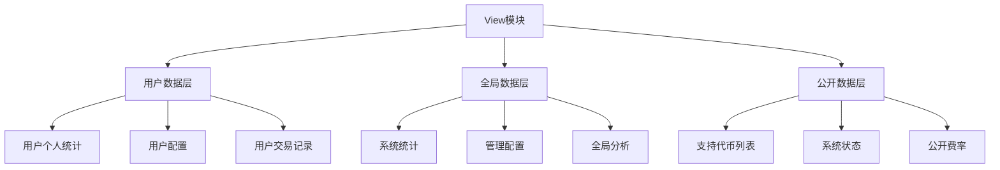
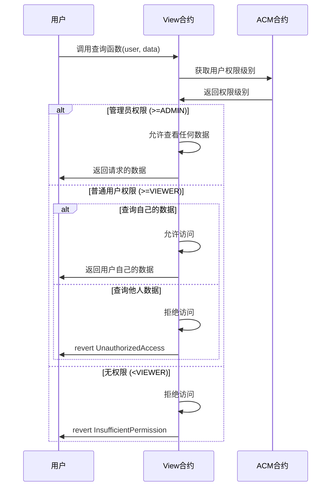

# View模块权限控制指南

## 🔐 核心原则

### 数据隔离原则
- **用户只能查看自己的数据**
- **管理员可查看全局数据**
- **公开信息无权限要求**

### 权限级别说明

| 权限级别 | 数值 | 权限范围 | 可访问数据 |
|---------|------|----------|------------|
| `NONE` | 0 | 无权限 | 无法访问任何数据 |
| `VIEWER` | 1 | 只读权限 | 自己的个人数据 |
| `OPERATOR` | 2 | 操作权限 | 自己的数据 + 部分操作 |
| `KEEPER` | 3 | Keeper权限 | 系统维护相关数据 |
| `ADMIN` | 4 | 管理员权限 | 全局数据 + 系统配置 |
| `OWNER` | 5 | 所有者权限 | 所有数据 + 系统管理 |

## 🏗️ 权限控制架构

### 数据分层设计



### 权限验证流程



## 📋 标准权限控制模板

### 基础权限控制
```solidity
contract XxxView is Initializable, UUPSUpgradeable {
    
    /*━━━━━━━━━━━━━━━ 权限控制核心 ━━━━━━━━━━━━━━━*/
    
    /// @notice Registry 合约地址
    address public registryAddr;
    
    /// @notice 权限验证内部函数
    function _requireRole(bytes32 actionKey, address user) internal view {
        address acmAddr = Registry(registryAddr).getModuleOrRevert(ModuleKeys.KEY_ACCESS_CONTROL);
        IAccessControlManager(acmAddr).requireRole(actionKey, user);
    }
    
    /// @notice 获取用户权限级别
    function _getUserPermission(address user) internal view returns (IAccessControlManager.PermissionLevel) {
        address acmAddr = Registry(registryAddr).getModuleOrRevert(ModuleKeys.KEY_ACCESS_CONTROL);
        return IAccessControlManager(acmAddr).getUserPermission(user);
    }
    
    /*━━━━━━━━━━━━━━━ 权限修饰符 ━━━━━━━━━━━━━━━*/
    
    /// @notice 管理员权限验证
    modifier onlyAdmin() {
        IAccessControlManager.PermissionLevel level = _getUserPermission(msg.sender);
        if (level < IAccessControlManager.PermissionLevel.ADMIN) {
            revert InsufficientPermission();
        }
        _;
    }
    
    /// @notice 用户数据访问权限验证
    /// @param user 要访问数据的用户地址
    modifier onlyAuthorizedFor(address user) {
        IAccessControlManager.PermissionLevel level = _getUserPermission(msg.sender);
        
        // 管理员可以查看任何数据
        if (level >= IAccessControlManager.PermissionLevel.ADMIN) {
            _;
            return;
        }
        
        // 普通用户只能查看自己的数据
        if (msg.sender != user) {
            revert UnauthorizedAccess();
        }
        
        // 用户必须至少有VIEWER权限
        if (level < IAccessControlManager.PermissionLevel.VIEWER) {
            revert InsufficientPermission();
        }
        _;
    }
    
    /// @notice Keeper权限验证
    modifier onlyKeeper() {
        IAccessControlManager.PermissionLevel level = _getUserPermission(msg.sender);
        if (level < IAccessControlManager.PermissionLevel.KEEPER) {
            revert InsufficientPermission();
        }
        _;
    }
    
    /*━━━━━━━━━━━━━━━ 错误定义 ━━━━━━━━━━━━━━━*/
    
    error UnauthorizedAccess();
    error InsufficientPermission();
    error InvalidUser();
    
    /*━━━━━━━━━━━━━━━ 动态模块键支持 ━━━━━━━━━━━━━━━*/
    
    /// @notice 使用RegistryDynamicModuleKey动态获取模块地址
    /// @param moduleName 模块名称
    /// @return moduleAddr 模块地址
    function _getDynamicModuleAddr(string memory moduleName) internal view returns (address moduleAddr) {
        address dynamicKeyManager = Registry(registryAddr).getModuleOrRevert(ModuleKeys.KEY_REGISTRY_DYNAMIC_MODULE_KEY);
        bytes32 moduleKey = IRegistryDynamicModuleKey(dynamicKeyManager).getModuleKeyByName(moduleName);
        return Registry(registryAddr).getModuleOrRevert(moduleKey);
    }
    
    /// @notice 获取业务合约地址（支持动态模块键）
    function _getBusinessContract() internal view returns (address) {
        // 可以使用静态模块键或动态模块键
        return Registry(registryAddr).getModuleOrRevert(ModuleKeys.KEY_XXX);
    }
}
```

### 数据访问模式

#### 1. 用户个人数据访问
```solidity
/// @notice 获取用户个人数据
/// @param user 用户地址
/// @param dataKey 数据键
/// @return 用户数据
function getUserData(address user, bytes32 dataKey) 
    external view onlyValidRegistry onlyAuthorizedFor(user) returns (uint256) {
    return _userMirroredData[user][dataKey];
}

/// @notice 批量获取用户数据
/// @param user 用户地址
/// @param dataKeys 数据键数组
/// @return 用户数据数组
function batchGetUserData(address user, bytes32[] calldata dataKeys) 
    external view onlyValidRegistry onlyAuthorizedFor(user) returns (uint256[] memory) {
    require(dataKeys.length <= MAX_BATCH_SIZE, "Batch size too large");
    
    uint256[] memory values = new uint256[](dataKeys.length);
    for (uint256 i = 0; i < dataKeys.length; i++) {
        values[i] = _userMirroredData[user][dataKeys[i]];
    }
    return values;
}
```

#### 2. 全局数据访问（仅管理员）
```solidity
/// @notice 获取全局统计数据（仅管理员）
/// @param dataKey 数据键
/// @return 全局数据
function getGlobalData(bytes32 dataKey) 
    external view onlyValidRegistry onlyAdmin returns (uint256) {
    return _globalMirroredData[dataKey];
}

/// @notice 获取系统配置（仅管理员）
/// @return 系统配置结构体
function getSystemConfig() 
    external view onlyValidRegistry onlyAdmin returns (SystemConfig memory) {
    return _systemConfig;
}
```

#### 3. 公开数据访问（无权限要求）
```solidity
/// @notice 获取公开数据
/// @param dataKey 数据键
/// @return 公开数据
function getPublicData(bytes32 dataKey) external view returns (uint256) {
    return _publicMirroredData[dataKey];
}

/// @notice 检查代币是否支持
/// @param token 代币地址
/// @return 是否支持
function isTokenSupported(address token) external view returns (bool) {
    return _supportedTokens[token];
}
```

## 🔧 实施指南

### Step 1: 数据分类
```solidity
// 按访问权限分类数据
mapping(address => mapping(bytes32 => uint256)) private _userData;     // 用户数据
mapping(bytes32 => uint256) private _globalData;                       // 全局数据（管理员）
mapping(bytes32 => uint256) private _publicData;                       // 公开数据
```

### Step 2: 函数权限设计
```solidity
// 用户数据查询 - 需要 onlyAuthorizedFor(user)
function getUserXxx(address user) external view onlyAuthorizedFor(user) returns (...) {}

// 全局数据查询 - 需要 onlyAdmin
function getGlobalXxx() external view onlyAdmin returns (...) {}

// 公开数据查询 - 无权限要求
function getPublicXxx() external view returns (...) {}
```

### Step 3: 错误处理
```solidity
// 统一的错误处理
function _checkUserAccess(address user) internal view {
    IAccessControlManager.PermissionLevel level = _getUserPermission(msg.sender);
    
    if (level >= IAccessControlManager.PermissionLevel.ADMIN) {
        return; // 管理员可以访问任何数据
    }
    
    if (msg.sender != user) {
        revert UnauthorizedAccess();
    }
    
    if (level < IAccessControlManager.PermissionLevel.VIEWER) {
        revert InsufficientPermission();
    }
}
```

## 📊 权限控制测试

### 测试用例模板
```typescript
describe("权限控制测试", function() {
    
    it("用户只能查看自己的数据", async function() {
        // 用户A查看自己的数据 - 应该成功
        await expect(feeRouterView.connect(userA).getUserData(userA.address, dataKey))
            .to.not.be.reverted;
        
        // 用户A查看用户B的数据 - 应该失败
        await expect(feeRouterView.connect(userA).getUserData(userB.address, dataKey))
            .to.be.revertedWith("UnauthorizedAccess");
    });
    
    it("管理员可以查看任何数据", async function() {
        // 管理员查看任何用户的数据 - 应该成功
        await expect(feeRouterView.connect(admin).getUserData(userA.address, dataKey))
            .to.not.be.reverted;
            
        // 管理员查看全局数据 - 应该成功
        await expect(feeRouterView.connect(admin).getGlobalData(dataKey))
            .to.not.be.reverted;
    });
    
    it("无权限用户无法访问", async function() {
        // 无权限用户查看数据 - 应该失败
        await expect(feeRouterView.connect(noPermissionUser).getUserData(userA.address, dataKey))
            .to.be.revertedWith("InsufficientPermission");
    });
    
    it("公开数据任何人都可查看", async function() {
        // 任何人查看公开数据 - 应该成功
        await expect(feeRouterView.connect(anyUser).getPublicData(dataKey))
            .to.not.be.reverted;
    });
});
```

## 🚨 安全考虑

### 1. 权限级别验证
```solidity
// ✅ 正确：严格权限验证
modifier onlyAuthorizedFor(address user) {
    IAccessControlManager.PermissionLevel level = _getUserPermission(msg.sender);
    
    if (level >= IAccessControlManager.PermissionLevel.ADMIN) {
        _;
        return;
    }
    
    require(msg.sender == user, "UnauthorizedAccess");
    require(level >= IAccessControlManager.PermissionLevel.VIEWER, "InsufficientPermission");
    _;
}

// ❌ 错误：权限验证不足
modifier onlyUser(address user) {
    require(msg.sender == user, "Unauthorized");
    _;
}
```

### 2. 数据泄露防护
```solidity
// ✅ 正确：严格的数据隔离
function getUserBalance(address user) external view onlyAuthorizedFor(user) returns (uint256) {
    return _userBalances[user];
}

// ❌ 错误：可能泄露他人数据
function getBalance(address user) external view returns (uint256) {
    return _userBalances[user]; // 任何人都能查看
}
```

### 3. 批量操作安全
```solidity
// ✅ 正确：验证每个用户的权限
function batchGetUserData(address[] calldata users, bytes32[] calldata dataKeys) 
    external view returns (uint256[] memory) {
    
    uint256[] memory results = new uint256[](users.length);
    for (uint256 i = 0; i < users.length; i++) {
        // 验证对每个用户的访问权限
        _checkUserAccess(users[i]);
        results[i] = _userMirroredData[users[i]][dataKeys[i]];
    }
    return results;
}

// ❌ 错误：批量操作绕过权限检查
function batchGetData(address[] calldata users) external view returns (uint256[] memory) {
    // 没有权限验证！
}
```

## 📈 最佳实践

### 1. 权限分级设计
- **最小权限原则**：用户只获得完成任务所需的最小权限
- **职责分离**：不同角色有不同的数据访问范围
- **权限继承**：高级别权限包含低级别权限的所有能力

### 2. 数据分类管理
- **个人数据**：用户个人统计、配置、交易记录
- **全局数据**：系统统计、管理配置、全局分析
- **公开数据**：系统状态、支持的代币列表、公开费率

### 3. 前端集成
```typescript
// 前端调用示例
class FeeRouterViewService {
    // 用户查看自己的数据
    async getUserStats(userAddress: string) {
        return await feeRouterView.getUserStats(userAddress);
    }
    
    // 管理员查看全局数据
    async getGlobalStats() {
        return await feeRouterView.getGlobalStats();
    }
    
    // 查看公开信息
    async getSupportedTokens() {
        return await feeRouterView.getSupportedTokens();
    }
}
```

## 🎯 总结

通过严格的权限控制设计，我们实现了：

1. **数据安全**：用户只能访问自己的数据，绝不泄露他人信息
2. **管理便利**：管理员可以访问全局数据进行系统管理
3. **权限隔离**：严格按照IAccessControlManager的权限级别控制
4. **性能优化**：在安全的前提下保持超低Gas消耗
5. **前端友好**：清晰的权限模型便于前端集成
6. **动态模块支持**：集成RegistryDynamicModuleKey实现灵活的模块管理

## 🚨 关键安全要求

### ❌ 绝对禁止的模式
```solidity
// 🚫 危险：无权限控制的公开查询
function getAnyData(address user) external view returns (uint256) {
    return _userData[user]; // 任何人都能查看他人数据！
}

// 🚫 危险：假的权限控制
function getData() external view returns (uint256) {
    // require(msg.sender != address(0)); // 无意义的检查
    return _sensitiveData; // 仍然泄露敏感数据
}
```

### ✅ 必须遵循的模式
```solidity
// ✅ 安全：严格的用户数据访问控制
function getUserData(address user) external view onlyAuthorizedFor(user) returns (uint256) {
    return _userData[user]; // 用户只能查看自己的数据
}

// ✅ 安全：管理员才能查看的全局数据
function getGlobalData() external view onlyAdmin returns (uint256) {
    return _globalData; // 仅管理员可查看
}
```

这套权限控制方案确保了数据的安全性和隐私性，同时保持了系统的高性能和易用性。

---

**版本**: v1.0  
**更新时间**: 2024年  
**适用范围**: 所有RwaLendingPlatform的View模块  
**维护责任**: 安全团队 + 架构团队
